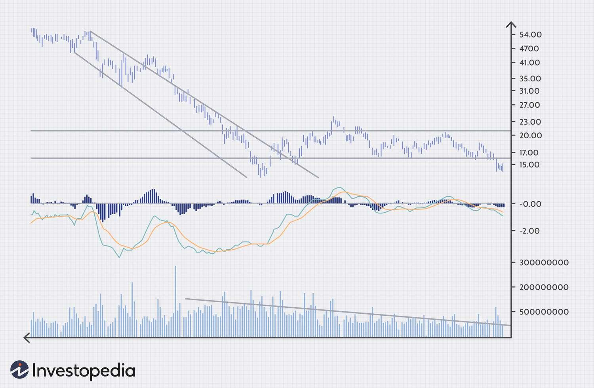

## Table of Contents

## What is the MACD Histogram and how is it calculated?

The MACD Histogram is a tool used in trading to show the difference between the MACD line and its signal line. The MACD, or Moving Average Convergence Divergence, is a trend-following momentum indicator that shows the relationship between two moving averages of a security’s price. The histogram helps traders see when the MACD line crosses above or below the signal line, which can indicate potential buy or sell signals.

To calculate the MACD Histogram, you first need to calculate the MACD line and the signal line. The MACD line is found by subtracting the 26-period Exponential Moving Average (EMA) from the 12-period EMA. The signal line is then calculated as the 9-period EMA of the MACD line. Once you have both the MACD line and the signal line, the histogram is simply the difference between these two lines. If the MACD line is above the signal line, the histogram will be positive, and if it's below, the histogram will be negative. This visual representation helps traders quickly see the momentum and potential changes in trend.

## How does the MACD Histogram differ from the traditional MACD indicator?

The MACD Histogram and the traditional MACD indicator both help traders understand market trends and momentum, but they show this information in different ways. The traditional MACD indicator consists of two lines: the MACD line and the signal line. The MACD line is calculated by subtracting the 26-period Exponential Moving Average (EMA) from the 12-period EMA. The signal line is a 9-period EMA of the MACD line. Traders watch for crossovers between these two lines to identify potential buy or sell signals. When the MACD line crosses above the signal line, it's often seen as a bullish signal, and when it crosses below, it's seen as bearish.

The MACD Histogram, on the other hand, takes the difference between the MACD line and the signal line and displays it as a bar chart. This makes it easier for traders to see the momentum behind the MACD line's movements. If the histogram bars are increasing in height, it shows that the MACD line is moving away from the signal line, indicating stronger momentum. Conversely, if the bars are decreasing, it suggests that the momentum is weakening. The histogram can help traders spot potential trend reversals earlier than they might with the traditional MACD indicator alone, as it visually represents the rate of change in the MACD line's position relative to the signal line.

## What are the basic signals that the MACD Histogram provides to traders?

The MACD Histogram provides traders with clear signals about the strength and direction of a trend. When the histogram bars start to grow taller, it means the trend is getting stronger. If the bars are positive and getting taller, it shows that the bullish momentum is increasing. On the other hand, if the bars are negative and getting taller, it shows that the bearish momentum is increasing. Traders can use these growing bars as a sign to stay in their current trades or to enter new ones in the direction of the trend.

When the histogram bars start to get shorter, it means the trend is losing strength. If the bars are getting shorter but still positive, it suggests that the bullish momentum is weakening. If the bars are getting shorter but still negative, it suggests that the bearish momentum is weakening. Traders often see this as a warning that the current trend might be ending soon. When the histogram crosses from positive to negative or from negative to positive, it's a strong signal that the trend might be reversing, and traders might consider closing their current positions or preparing for a trade in the opposite direction.

## How can beginners use the MACD Histogram to identify trend changes?

Beginners can use the MACD Histogram to spot when a trend might be changing by watching how the bars on the histogram grow or shrink. When the bars start getting taller, it means the trend is getting stronger. If the bars are above the zero line and growing, it shows that the price is going up with more power. If the bars are below the zero line and growing, it shows that the price is going down with more power. Beginners should look for these growing bars as a sign that the current trend is strong and might keep going.

When the bars on the MACD Histogram start to get smaller, it's a hint that the trend might be losing steam. If the bars are above the zero line but getting shorter, it means the upward trend is weakening. If the bars are below the zero line but getting shorter, it means the downward trend is weakening. A big sign of a trend change is when the histogram crosses the zero line. If it goes from above zero to below zero, it suggests that the trend might be switching from up to down. If it goes from below zero to above zero, it suggests the trend might be switching from down to up. Beginners should watch for these zero-line crossings as a signal to maybe get ready for a new trend.

## What are divergence patterns in the MACD Histogram and how do they indicate potential trend reversals?

Divergence patterns in the MACD Histogram happen when the histogram and the price of a stock or asset move in different directions. There are two main types of divergence: bullish and bearish. Bullish divergence happens when the price of the stock makes lower lows, but the MACD Histogram makes higher lows. This shows that the downward trend might be losing strength, and the price might start going up soon. Bearish divergence is the opposite. It happens when the price makes higher highs, but the MACD Histogram makes lower highs. This shows that the upward trend might be losing strength, and the price might start going down soon.

Divergence patterns are useful because they can help traders see a trend reversal coming before it happens. When you spot a bullish divergence, it might be a good time to think about buying the stock because the price could start to go up. When you spot a bearish divergence, it might be a good time to think about selling or shorting the stock because the price could start to go down. By watching the MACD Histogram and comparing it to the price, traders can get early warnings about when the trend might change, which can help them make better trading decisions.

## How can the MACD Histogram be used in conjunction with other technical indicators to confirm trend changes?

The MACD Histogram can be used with other technical indicators to make sure a trend change is really happening. One common way is to use it with the Relative Strength Index (RSI). The RSI measures how fast and how much a stock's price is changing. If the MACD Histogram shows a divergence and the RSI also shows a similar pattern, like moving from overbought to oversold or vice versa, it gives traders more confidence that a trend change is coming. For example, if the MACD Histogram shows a bullish divergence and the RSI moves from over 70 to below 30, it's a strong sign that the price might start going up soon.

Another way to use the MACD Histogram with other indicators is with moving averages. Moving averages smooth out price data to show the trend over time. If the MACD Histogram shows a trend change and the price crosses a key moving average, like the 50-day or 200-day moving average, it can confirm the trend change. For instance, if the MACD Histogram shows a bearish divergence and the price drops below the 200-day moving average, it's a good sign that the price might keep going down. By using the MACD Histogram with other indicators, traders can get a clearer picture of when a trend might change and make better trading decisions.

## What are the common pitfalls or false signals when using the MACD Histogram, and how can they be avoided?

One common pitfall when using the MACD Histogram is getting false signals from small changes in the bars. Sometimes, the histogram might show a little crossover or a small divergence, but it doesn't lead to a big trend change. These small signals can trick beginners into thinking a big move is coming when it's really just a small hiccup in the market. To avoid these false signals, traders should look for bigger, clearer changes in the histogram. If the bars are making big moves and the divergence is strong, it's more likely to be a real trend change.

Another issue is relying too much on the MACD Histogram without checking other indicators. The histogram can give good hints about trend changes, but it's not perfect on its own. If traders only look at the histogram and ignore other signs like the RSI or moving averages, they might miss important information. To avoid this, traders should always use the MACD Histogram along with other tools. By comparing the histogram's signals with other indicators, traders can get a fuller picture of what's happening in the market and make better decisions.

## How can traders adjust the settings of the MACD Histogram to better suit different trading styles or timeframes?

Traders can change the settings of the MACD Histogram to make it work better for their own trading style or the time they want to trade. The standard settings for the MACD are using the 12-period and 26-period EMAs for the MACD line, and a 9-period EMA for the signal line. But if someone likes to trade over shorter times, like a few minutes or hours, they might want to use shorter periods, like a 5-period and 10-period EMA for the MACD line, and a 3-period EMA for the signal line. This makes the histogram more sensitive to small changes in the market, which can be good for quick trades. On the other hand, if someone trades over longer times, like days or weeks, they might use longer periods, like a 24-period and 52-period EMA for the MACD line, and an 18-period EMA for the signal line. This makes the histogram less sensitive to small changes, which can be better for seeing big trends over time.

By changing these settings, traders can make the MACD Histogram fit their needs better. For example, a day trader might want to see quick changes in the market to make fast trades, so they would use shorter periods. A long-term investor, who is looking at trends over months or years, would use longer periods to see the bigger picture. It's important for traders to try different settings and see what works best for them. They can test these different settings on past data to see how well the histogram would have worked before using it in real trades.

## What advanced techniques can be applied to the MACD Histogram for more precise trend analysis?

One advanced technique for using the MACD Histogram more precisely is to look for zero-line crossovers and combine them with other signals. When the histogram crosses the zero line from negative to positive, it suggests the start of an uptrend, and from positive to negative, it suggests the start of a downtrend. But to make this signal more reliable, traders can wait for the histogram to not just cross the zero line but also to start making new highs or lows after the crossover. This shows that the new trend is gaining strength. For example, if the histogram crosses from negative to positive and then starts making higher highs, it's a strong sign that the uptrend is real and likely to continue. By waiting for these extra confirmations, traders can avoid acting on weak signals and get a clearer picture of the trend.

Another technique is to use the MACD Histogram to spot hidden divergences. Hidden divergences are a bit different from regular divergences. They happen when the price and the histogram move in the same direction but at different rates. A bullish hidden divergence happens when the price makes higher lows and the histogram also makes higher lows, but the histogram's lows are not as high as the price's lows. This suggests that the uptrend is still strong and likely to continue. A bearish hidden divergence is the opposite, where the price makes lower highs and the histogram makes lower highs, but the histogram's highs are not as low as the price's highs. This suggests that the downtrend is still strong. By looking for these hidden divergences, traders can get early signs of trend continuation and make more precise trading decisions.

## How does the MACD Histogram perform in different market conditions, such as trending vs. ranging markets?

The MACD Histogram works differently in trending markets compared to ranging markets. In a trending market, where the price is going up or down in a clear direction, the MACD Histogram is really helpful. It can show when the trend is getting stronger or weaker by how the bars get taller or shorter. When the bars keep getting taller in the same direction, it's a good sign that the trend is strong and might keep going. Traders can use this to stay in their trades or to find new ones in the direction of the trend. The histogram also helps spot trend reversals early, like when it crosses the zero line or shows a divergence, which can be key for making good trading decisions.

In a ranging market, where the price moves back and forth without a clear direction, the MACD Histogram can be trickier to use. The histogram might give a lot of false signals because the price keeps bouncing around. The bars might cross the zero line a lot, making it hard to tell if a real trend change is happening or if it's just the market moving sideways. Traders need to be careful and might want to use other indicators along with the MACD Histogram to make sure they're not fooled by these false signals. In these conditions, the histogram is less reliable for spotting trends, but it can still help show when the market might be getting ready to break out of the range if used carefully with other tools.

## Can the MACD Histogram be effectively used for different asset classes, such as stocks, forex, and commodities?

The MACD Histogram can be used for different types of assets like stocks, [forex](/wiki/forex-system), and commodities. It works by showing the difference between the MACD line and the signal line, which helps traders see when a trend might be getting stronger or weaker. This makes it useful for all kinds of markets because it's based on price movements, which happen in every asset class. For stocks, the MACD Histogram can help traders spot when a stock's price is likely to keep going up or down. In the forex market, it can show when a currency pair's trend might be changing, which is important for trading currencies. And for commodities like gold or oil, the histogram can help traders see when prices might be about to move in a new direction.

However, the effectiveness of the MACD Histogram can vary depending on the specific characteristics of each asset class. Stocks often have clearer trends because of company news and earnings, so the histogram might be more reliable for spotting these trends. Forex markets can be more volatile and influenced by economic news, so traders might see more false signals and need to be careful. Commodities can have trends influenced by supply and demand, and the histogram can help, but traders might need to adjust the settings to fit the slower-moving nature of some commodities. Overall, the MACD Histogram is a flexible tool that can be used across different asset classes, but traders should always consider the unique aspects of each market and use other indicators to confirm signals.

## What are some real-world examples where the MACD Histogram successfully predicted major trend changes?

One real-world example where the MACD Histogram successfully predicted a major trend change was during the stock market crash in early 2020 caused by the COVID-19 outbreak. In February 2020, the S&P 500 started to show bearish divergence on the MACD Histogram. The price of the index was making new highs, but the histogram was making lower highs, which suggested that the upward momentum was weakening. Shortly after this divergence appeared, the market began to fall sharply. Traders who noticed this signal could have sold their positions or even gone short, helping them to manage their risk during the downturn.

Another example was in the forex market with the EUR/USD pair in late 2016. After the U.S. election, the EUR/USD started to show a bullish divergence on the MACD Histogram. The price was making lower lows, but the histogram was making higher lows, indicating that the downward momentum was fading. This signal came before the pair began a significant upward trend in early 2017. Traders who spotted this divergence might have bought the EUR/USD at a lower price and benefited from the subsequent rise. These examples show how the MACD Histogram can be a useful tool for spotting major trend changes in different markets.

## What are the components of MACD and how do they work?

The Moving Average Convergence Divergence (MACD) indicator is a popular tool used by traders to gauge market momentum and trend direction. Understanding its components is fundamental to leveraging its potential in technical analysis.

The MACD consists of three main components: the MACD Line, the Signal Line, and the Histogram.

1. **The MACD Line**: This is the centerpiece of the MACD indicator and is calculated by subtracting the 26-period Exponential Moving Average (EMA) from the 12-period EMA. The computation involves:
$$
   \text{MACD Line} = \text{EMA}_{12} - \text{EMA}_{26}

$$

   The MACD Line reflects the convergence and divergence of the two EMAs, essentially indicating changes in market [momentum](/wiki/momentum). When the MACD Line is positive, it suggests that the 12-day EMA is above the 26-day EMA, indicating upward momentum. Conversely, a negative MACD Line suggests downward momentum.

2. **The Signal Line**: This is a 9-period EMA of the MACD Line and acts as a smoothing mechanism, helping to generate buy or sell signals. When the MACD Line crosses above the Signal Line, it can be interpreted as a bullish signal, suggesting that it may be time to buy. Conversely, when the MACD Line crosses below the Signal Line, it often indicates a bearish signal or a prompt to sell. The Signal Line is computed as:
$$
   \text{Signal Line} = \text{EMA}_9(\text{MACD Line})

$$

3. **The Histogram**: This represents the difference between the MACD Line and the Signal Line. It provides a visual representation of the momentum in the market and helps traders identify the strength of buy or sell signals. Mathematically, the Histogram is expressed as:
$$
   \text{Histogram} = \text{MACD Line} - \text{Signal Line}

$$

   When the Histogram is above the zero line, it suggests that the MACD Line is above the Signal Line, reinforcing the presence of positive market momentum. A Histogram below the zero line suggests negative market momentum. The expansion or contraction of the Histogram bars can indicate strengthening or weakening trends, respectively.

Understanding these components enables traders to interpret MACD signals effectively, aiding in more informed trading decisions.

## How do you calculate MACD: A Step-by-Step Guide?

The Moving Average Convergence Divergence (MACD) is a widely used technical analysis tool that enables traders to identify market trends and potential reversals. Calculating the MACD involves several steps focusing on its three main components: the MACD Line, the Signal Line, and the Histogram. This section provides a comprehensive guide to calculating each component, complete with practical examples, and discusses the use of software tools to facilitate the process.

### Step-by-Step Calculation of MACD Components

**1. Calculate the Exponential Moving Averages (EMAs):**

The MACD Line is calculated by subtracting the 26-period EMA from the 12-period EMA. The EMA is a type of moving average that places a greater weight and significance on the most recent data points. To calculate the EMA, you can use the formula:

$$
\text{EMA}_t = \alpha \times \text{Price}_t + (1-\alpha) \times \text{EMA}_{t-1}
$$

Where $\alpha$ is the smoothing [factor](/wiki/factor-investing), which is calculated as:

$$
\alpha = \frac{2}{n+1}
$$

For a 12-period EMA, $\alpha = \frac{2}{13}$, and for a 26-period EMA, $\alpha = \frac{2}{27}$.

**Example Calculation:**

Assuming a dataset of closing prices, the initial calculation of the EMA would use a simple moving average (SMA) as the previous EMA. Once a sufficient number of data points are available, use the EMA formula to calculate successive values.

**2. Derive the MACD Line:**

Once the 12-period and 26-period EMAs are computed, the MACD Line is obtained by:

$$
\text{MACD Line} = \text{EMA}_{12} - \text{EMA}_{26}
$$

**3. Calculate the Signal Line:**

The Signal Line is a 9-period EMA of the MACD Line, representing a smoothed version of the MACD and acting as a trigger for potential buy and sell signals. Using the same EMA formula:

$$
\text{Signal Line} = \text{EMA}_{9}(\text{MACD Line})
$$

**4. Determine the MACD Histogram:**

The Histogram illustrates the difference between the MACD Line and the Signal Line:

$$
\text{Histogram} = \text{MACD Line} - \text{Signal Line}
$$

Increasing values of the Histogram signify increasing momentum, while decreasing values suggest weakening momentum.

### Practical Examples

**Python Code Example:**

For traders using Python, the calculation can be implemented as follows:

```python
import pandas as pd

def calculate_macd(data, short_window=12, long_window=26, signal_window=9):
    data['EMA12'] = data['Close'].ewm(span=short_window, adjust=False).mean()
    data['EMA26'] = data['Close'].ewm(span=long_window, adjust=False).mean()
    data['MACD Line'] = data['EMA12'] - data['EMA26']
    data['Signal Line'] = data['MACD Line'].ewm(span=signal_window, adjust=False).mean()
    data['Histogram'] = data['MACD Line'] - data['Signal Line']
    return data

df = pd.read_csv('data.csv')  # Replace with your CSV file
macd_data = calculate_macd(df)
```

### Use of Charting Software and Automated Platforms

Automated platforms and charting software, such as TradingView or MetaTrader, have built-in functions to calculate MACD, making it accessible to traders without deep technical expertise. These platforms provide real-time calculations and allow traders to visualize MACD alongside other indicators, facilitating prompt trading decisions based on MACD signals.

Using these tools, traders can also back-test MACD strategies, optimizing the parameters for better forecast accuracy. By leveraging software solutions, traders enhance their ability to interpret MACD signals efficiently in fast-moving markets.

## References & Further Reading

[1]: ["Technical Analysis of the Financial Markets: A Comprehensive Guide to Trading Methods and Applications"](https://www.amazon.com/Technical-Analysis-Financial-Markets-Comprehensive/dp/0735200661) by John J. Murphy

[2]: ["Algorithmic Trading: Winning Strategies and Their Rationale"](https://www.wiley.com/en-us/Algorithmic+Trading%3A+Winning+Strategies+and+Their+Rationale-p-9781118746912) by Ernie Chan

[3]: Appel, G. (2005). ["Technical Analysis: Power Tools for Active Investors."](https://www.amazon.com/Technical-Analysis-Power-Active-Investors/dp/0132930048) Financial Times Press.

[4]: Elder, A. (2002). ["Come Into My Trading Room: A Complete Guide to Trading"](https://www.amazon.com/Come-Into-My-Trading-Room/dp/0471225347). John Wiley & Sons.

[5]: Achelis, S. B. (2000). ["Technical Analysis from A to Z"](https://www.mhebooklibrary.com/doi/book/10.1036/9780071380119). McGraw-Hill.