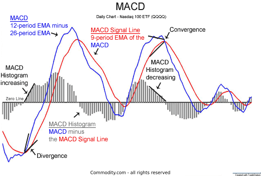

## Table of Contents

## What is the MACD Histogram and what does it measure?

The MACD Histogram is a part of the Moving Average Convergence Divergence (MACD) indicator used in trading. It is a visual representation that helps traders see the difference between the MACD line and its signal line. The MACD line is created by subtracting the 26-day exponential moving average (EMA) from the 12-day EMA. The signal line is a 9-day EMA of the MACD line. The histogram shows this difference as bars, making it easier to spot changes in momentum.

The MACD Histogram measures the strength and direction of a trend in the price of a security. When the histogram bars are above the zero line, it suggests that the trend is bullish, meaning prices are generally going up. When the bars are below the zero line, it indicates a bearish trend, meaning prices are generally going down. Traders watch for changes in the histogram's height to gauge whether the trend is gaining or losing strength. If the bars are getting taller, the trend is strengthening, and if they are getting shorter, the trend might be weakening.

## How is the MACD Histogram calculated?

The MACD Histogram is calculated by finding the difference between the MACD line and the signal line. The MACD line is made by taking the 12-day exponential moving average (EMA) of a security's price and subtracting the 26-day EMA. This gives you a line that shows how the short-term trend is moving compared to the longer-term trend. The signal line is then created by taking a 9-day EMA of the MACD line. This smooths out the MACD line and helps traders see clearer signals.

To get the MACD Histogram, you subtract the signal line from the MACD line. If the MACD line is above the signal line, the histogram will show positive values, which means the bars will be above the zero line. If the MACD line is below the signal line, the histogram will show negative values, and the bars will be below the zero line. The height of the bars tells traders if the trend is getting stronger or weaker. If the bars are getting taller, the trend is gaining strength, and if they are getting shorter, the trend might be losing strength.

## What does a positive or negative value on the MACD Histogram indicate?

A positive value on the MACD Histogram means the MACD line is above the signal line. This shows that the short-term trend is stronger than the long-term trend, which is a sign that the price is going up. Traders see this as a bullish signal, meaning they might want to buy the security because they think the price will keep rising.

A negative value on the MACD Histogram means the MACD line is below the signal line. This shows that the short-term trend is weaker than the long-term trend, which is a sign that the price is going down. Traders see this as a bearish signal, meaning they might want to sell the security because they think the price will keep falling.

## How can the MACD Histogram be used to identify trend changes?

The MACD Histogram helps traders see when a trend might be changing by showing the difference between the MACD line and the signal line. When the histogram bars start to get shorter, it means the trend might be losing strength. If the bars keep getting shorter and then cross the zero line, it's a sign that the trend could be changing. For example, if the bars were positive and getting shorter, then they cross below the zero line, it might mean the trend is changing from up to down.

Traders watch the MACD Histogram closely for these signs. When the bars start to get taller again after being short, it can mean a new trend is starting. If the bars cross above the zero line after being negative, it might mean the trend is changing from down to up. By watching these changes, traders can decide when to buy or sell a security to make the most of the new trend.

## What is the significance of divergence between the MACD Histogram and price?

Divergence between the MACD Histogram and the price of a security happens when the price is moving one way, but the MACD Histogram is moving the other way. This can be a very important sign for traders. If the price is going up but the MACD Histogram is going down, it's called bearish divergence. This might mean the price will start to go down soon. On the other hand, if the price is going down but the MACD Histogram is going up, it's called bullish divergence. This might mean the price will start to go up soon.

Traders use these divergences to make decisions about when to buy or sell. When they see a bearish divergence, they might decide to sell their security before the price drops. When they see a bullish divergence, they might decide to buy the security before the price goes up. By watching for these divergences, traders can try to predict when the price might change direction and act accordingly.

## Can the MACD Histogram be used for setting stop-loss levels?

Yes, the MACD Histogram can help traders set stop-loss levels. A stop-loss is an order to sell a security when it reaches a certain price, to limit how much money you could lose. Traders often look at the MACD Histogram to see when a trend might be changing. If the histogram bars start to get shorter and then cross the zero line, it might mean the trend is reversing. Traders could set their stop-loss just below the recent low price if they think the trend is turning bearish, or just above the recent high if they think it's turning bullish.

For example, if a trader is holding a security and the MACD Histogram shows a bearish divergence where the price is going up but the histogram is going down, they might set a stop-loss just below the last low point. This way, if the price does start to drop, the stop-loss will kick in and sell the security before the price falls too much. By using the MACD Histogram to help decide where to set stop-loss levels, traders can better manage their risk and protect their investments.

## How does the choice of MACD parameters affect the Histogram's sensitivity?

The MACD Histogram's sensitivity depends a lot on the MACD parameters you choose. The standard settings are a 12-day EMA for the fast line, a 26-day EMA for the slow line, and a 9-day EMA for the signal line. If you make the fast line's EMA shorter, like changing it from 12 days to 9 days, the histogram will react faster to price changes. This makes it more sensitive and can help you catch short-term trends quicker. But, it might also give you more false signals because it's reacting to small price movements.

On the other hand, if you make the slow line's EMA longer, like changing it from 26 days to 30 days, the histogram will be less sensitive. It will take longer to show changes in the trend, which can be good for focusing on longer-term trends. The signal line's EMA also affects sensitivity; a shorter EMA, like changing it from 9 days to 6 days, will make the histogram more sensitive, while a longer EMA, like changing it to 12 days, will make it less sensitive. By adjusting these parameters, you can tailor the MACD Histogram to fit your trading style and the time frame you're looking at.

## What are the common strategies involving the MACD Histogram?

One common strategy using the MACD Histogram is to watch for crossovers. When the MACD line crosses above the signal line, the histogram bars go from negative to positive. This is a sign to buy because it means the trend might be turning up. On the other hand, when the MACD line crosses below the signal line, the histogram bars go from positive to negative. This is a sign to sell because it means the trend might be turning down. Traders use these crossovers to decide when to enter or exit trades.

Another strategy is to look for divergence between the price and the MACD Histogram. If the price is going up but the histogram is going down, it's called bearish divergence. This might mean the price will soon start to go down, so traders might sell to avoid losing money. If the price is going down but the histogram is going up, it's called bullish divergence. This might mean the price will soon start to go up, so traders might buy to take advantage of the new trend. Watching for these divergences helps traders predict when the price might change direction.

A third strategy is to use the MACD Histogram to set stop-loss levels. If the histogram bars start getting shorter and then cross the zero line, it might mean the trend is changing. Traders can set their stop-loss just below the recent low if they think the trend is turning bearish, or just above the recent high if they think it's turning bullish. This helps them limit their losses if the price moves against them. By using the MACD Histogram to set stop-loss levels, traders can manage their risk better.

## How can the MACD Histogram be used in conjunction with other technical indicators?

The MACD Histogram can be used with other technical indicators to make better trading choices. One common way is to use it with the Relative Strength Index (RSI). The RSI shows if a security is overbought or oversold. If the MACD Histogram shows a bullish crossover and the RSI is below 30, it might be a good time to buy because the security is both starting a new uptrend and is oversold. On the other hand, if the MACD Histogram shows a bearish crossover and the RSI is above 70, it might be a good time to sell because the security is both starting a new downtrend and is overbought.

Another way to use the MACD Histogram with other indicators is with moving averages. Traders often look at the 50-day and 200-day moving averages. If the MACD Histogram shows a bullish divergence and the price is also above both the 50-day and 200-day moving averages, it can be a strong sign that the price will keep going up. If the MACD Histogram shows a bearish divergence and the price is below both moving averages, it can be a strong sign that the price will keep going down. By combining the MACD Histogram with these other indicators, traders can get a clearer picture of the market and make more informed decisions.

## What are the limitations and potential pitfalls of using the MACD Histogram?

Using the MACD Histogram can have some problems. One big issue is that it can give false signals. Sometimes the histogram might show that a trend is changing when it's not. This can make traders buy or sell too early and lose money. Also, the MACD Histogram works best in markets that have clear trends. If the market is moving sideways and not going up or down much, the histogram can be hard to read and might not be very helpful.

Another limitation is that the MACD Histogram is just one tool. It doesn't tell the whole story by itself. Traders need to use it with other indicators and look at the bigger picture to make good decisions. If they only use the histogram, they might miss important information and make bad trades. So, it's important to understand its limits and use it as part of a bigger trading plan.

## How can one optimize the use of the MACD Histogram for different market conditions?

To make the MACD Histogram work well in different markets, you need to change the settings based on whether the market is moving a lot or just staying the same. If the market is going up and down a lot, you can make the fast line shorter and the slow line longer. This makes the histogram more sensitive and helps you catch quick changes in the market. But if the market is not moving much, you might want to make the fast line longer and the slow line shorter. This makes the histogram less sensitive and helps you see the bigger trends that last longer.

It's also important to use the MACD Histogram with other tools to understand the market better. For example, in a market that's going up and down a lot, you can use the histogram with the RSI to see if a security is overbought or oversold. This can help you decide when to buy or sell. In a market that's not moving much, you can use the histogram with moving averages to see the bigger trends. By changing the settings and using other tools, you can use the MACD Histogram better in different market conditions.

## What advanced techniques can be applied to enhance the effectiveness of the MACD Histogram?

One advanced technique to make the MACD Histogram more effective is to use it with other indicators like the RSI or Bollinger Bands. The RSI can help you see if a security is overbought or oversold, which can make the signals from the MACD Histogram more reliable. If the histogram shows a bullish crossover and the RSI is below 30, it's a strong sign to buy because the security is starting a new uptrend and is oversold. Bollinger Bands can show you how much the price is moving. If the price is moving a lot and the histogram shows a crossover, it can be a good time to trade because the trend is strong.

Another technique is to change the settings of the MACD Histogram based on the market you're looking at. If you're trading in a market that moves quickly, you can make the fast line shorter and the slow line longer. This makes the histogram more sensitive and helps you catch short-term trends. If you're trading in a market that doesn't move much, you can make the fast line longer and the slow line shorter. This makes the histogram less sensitive and helps you see longer-term trends. By adjusting these settings, you can make the MACD Histogram work better for different types of markets.

## What is the MACD Histogram and how does it work?

The Moving Average Convergence Divergence (MACD) histogram is a crucial component of the MACD indicator, commonly used in analyzing stock market trends. The MACD indicator consists of three main elements: the MACD line, the signal line, and the MACD histogram. Understanding the operation and utility of these components allows traders to make well-informed decisions.

The MACD line is derived by subtracting the 26-period Exponential Moving Average (EMA) from the 12-period EMA. Mathematically, this is expressed as:

$$

\text{MACD line} = \text{EMA}_{12} - \text{EMA}_{26} 
$$

The signal line, in contrast, is the 9-period EMA of the MACD line:

$$

\text{Signal line} = \text{EMA}_{9}(\text{MACD line}) 
$$

The MACD histogram represents the difference between the MACD line and the signal line. It is visually illustrated as a series of bars above or below a zero line. Mathematically, it is defined as:

$$

\text{MACD Histogram} = \text{MACD line} - \text{Signal line} 
$$

The histogram provides a graphical representation of the divergence or convergence of the MACD line and the signal line. When the histogram is above the zero line, it indicates that the MACD line is above the signal line, suggesting bullish [momentum](/wiki/momentum). Conversely, when the histogram is below zero, it signifies that the MACD line is below the signal line, indicating bearish momentum.

Traders interpret the MACD histogram to assess shifts in momentum and potential trend reversals. One common approach is to look for crossovers. For instance, a crossover above the zero line may signal a potential buying opportunity, whereas a crossover below could denoted a selling opportunity. The histogram's movements suggest increasing (or decreasing) momentum, highlighting potential points for entering or exiting a trade.

The key aspect of the histogram is the visualization it provides on the relationship between the MACD line and the signal line. The spacing between these lines, as depicted by the histogram's size, conveys the strength of the price movement. A widening histogram suggests accelerating momentum, while a narrowing one indicates weakening momentum, allowing traders to gauge the market's current and forthcoming dynamics effectively.

## References & Further Reading

[1]: Bergstra, J., Bardenet, R., Bengio, Y., & Kégl, B. (2011). ["Algorithms for Hyper-Parameter Optimization."](https://papers.nips.cc/paper/4443-algorithms-for-hyper-parameter-optimization) Advances in Neural Information Processing Systems 24.

[2]: ["Advances in Financial Machine Learning"](https://www.amazon.com/Advances-Financial-Machine-Learning-Marcos/dp/1119482089) by Marcos Lopez de Prado

[3]: ["Evidence-Based Technical Analysis: Applying the Scientific Method and Statistical Inference to Trading Signals"](https://www.amazon.com/Evidence-Based-Technical-Analysis-Scientific-Statistical/dp/0470008741) by David Aronson

[4]: ["Machine Learning for Algorithmic Trading"](https://github.com/stefan-jansen/machine-learning-for-trading) by Stefan Jansen

[5]: ["Quantitative Trading: How to Build Your Own Algorithmic Trading Business"](https://books.google.com/books/about/Quantitative_Trading.html?id=j70yEAAAQBAJ) by Ernest P. Chan