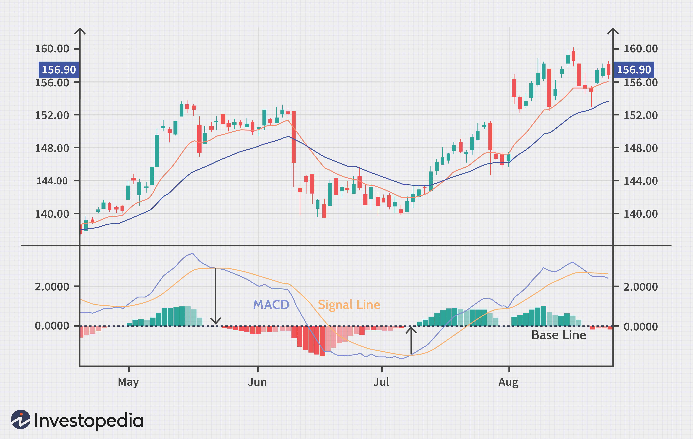

## Table of Contents

## What is MACD and what does it stand for?

MACD stands for Moving Average Convergence Divergence. It is a tool used in trading to help people understand if they should buy or sell something, like stocks or cryptocurrencies. The MACD is made up of two lines: the MACD line and the signal line. When these lines cross each other, it can tell traders that it might be a good time to buy or sell.

The MACD line is found by taking the difference between a short-term moving average (usually 12 periods) and a long-term moving average (usually 26 periods). The signal line is a moving average of the MACD line, often set at 9 periods. When the MACD line goes above the signal line, it's called a bullish signal, which means it might be a good time to buy. When the MACD line goes below the signal line, it's called a bearish signal, which means it might be a good time to sell. Traders use these signals to help make decisions, but it's not perfect and should be used with other tools.

## How is the MACD calculated?

The MACD is calculated by first finding the difference between two moving averages. One is a short-term moving average, usually set at 12 periods, and the other is a long-term moving average, usually set at 26 periods. A period can be a day, a week, or any other time frame depending on what you are looking at. You take the 12-period moving average and subtract the 26-period moving average from it. This difference is what we call the MACD line.

Next, we create the signal line, which is a moving average of the MACD line itself. Typically, this is set at 9 periods. So, you take the MACD line and calculate its 9-period moving average. This signal line helps traders spot trends and possible buy or sell signals. When the MACD line crosses above the signal line, it's a sign that might be a good time to buy. When it crosses below, it might be a good time to sell.

## What are the components of the MACD indicator?

The MACD indicator has three main parts: the MACD line, the signal line, and the histogram. The MACD line is the heart of the indicator. It's found by taking the difference between a short-term moving average, usually set at 12 periods, and a long-term moving average, usually set at 26 periods. This line helps show the difference between the two averages over time.

The signal line is the second part of the MACD indicator. It's a moving average of the MACD line, often set at 9 periods. Traders watch this line because when the MACD line crosses above or below the signal line, it can signal a good time to buy or sell. The third part is the histogram, which shows the difference between the MACD line and the signal line. The histogram bars can help traders see the strength of the trend and potential changes in momentum.

## How do you read the MACD on a chart?

When you look at a chart with the MACD on it, you'll see three main parts: the MACD line, the signal line, and the histogram. The MACD line shows the difference between two moving averages, one short-term and one long-term. If the MACD line is above the signal line, it might be a good time to buy because it's a bullish signal. If the MACD line is below the signal line, it might be a good time to sell because it's a bearish signal. The histogram is made up of bars that show the difference between the MACD line and the signal line. If the bars are getting taller, it means the difference is growing, which can show strong trends.

The histogram can also help you see when the momentum might be changing. If the bars start getting smaller, it could mean the trend is losing strength. Sometimes, the MACD line and the signal line can cross over each other many times in a short period, which is called divergence. This can make it hard to know if it's a good time to buy or sell. That's why it's a good idea to use the MACD with other tools to help make better decisions.

## What does a MACD crossover indicate?

A MACD crossover happens when the MACD line crosses over the signal line. This is an important thing for traders to watch because it can tell them when it might be a good time to buy or sell something. If the MACD line goes above the signal line, it's called a bullish crossover. This means that the short-term moving average is starting to move away from the long-term moving average, which could be a sign that prices might go up soon. So, traders might think about buying at this point.

On the other hand, if the MACD line goes below the signal line, it's called a bearish crossover. This means that the short-term moving average is getting closer to the long-term moving average, which could be a sign that prices might go down soon. So, traders might think about selling at this point. It's important to remember that while crossovers can be helpful, they're not always right, so it's a good idea to use them with other tools to make better trading decisions.

## How can the MACD be used to identify market trends?

The MACD helps traders see which way the market might be going by showing the difference between a short-term and a long-term moving average. When the MACD line is above the signal line, it's a sign that the market might be going up, which is called a bullish trend. Traders look for this because it might be a good time to buy. On the other hand, when the MACD line is below the signal line, it's a sign that the market might be going down, which is called a bearish trend. Traders look for this because it might be a good time to sell.

The histogram part of the MACD also helps show how strong the trend is. If the histogram bars are getting taller, it means the trend is getting stronger. If the bars are getting smaller, it means the trend might be losing strength. By watching these changes, traders can get a better idea of when the market might change direction. It's important to use the MACD with other tools to make sure the signals are right, but it's a helpful way to see market trends.

## What is the significance of the MACD histogram?

The MACD histogram is an important part of the MACD indicator because it shows the difference between the MACD line and the signal line. This difference helps traders see how strong the trend is. If the histogram bars are getting taller, it means the trend is getting stronger. If the bars are getting smaller, it means the trend might be losing strength. This can help traders know when it might be a good time to buy or sell.

The histogram also helps traders see changes in market momentum. When the histogram bars start to get smaller after being tall, it can be a sign that the trend is slowing down and might change direction soon. This is useful because it can give traders a heads-up to get ready for a possible change in the market. By watching the histogram, traders can make better decisions about when to enter or exit trades.

## Can the MACD be used for divergence analysis? If so, how?

Yes, the MACD can be used for divergence analysis. Divergence happens when the price of something, like a stock or cryptocurrency, moves in a different direction than the MACD indicator. If the price is going up but the MACD is going down, it's called bearish divergence. This can be a sign that the price might start to go down soon. On the other hand, if the price is going down but the MACD is going up, it's called bullish divergence. This can be a sign that the price might start to go up soon.

To use the MACD for divergence analysis, traders look at the chart and compare the price movements with the MACD line. If they see that the price is making higher highs but the MACD is making lower highs, it's a bearish divergence. If the price is making lower lows but the MACD is making higher lows, it's a bullish divergence. By spotting these divergences, traders can get a hint about possible changes in the market trend and make better decisions about when to buy or sell.

## How do traders use MACD to set entry and exit points?

Traders use the MACD to set entry and exit points by watching for crossovers between the MACD line and the signal line. When the MACD line crosses above the signal line, it's a bullish crossover, and traders might see this as a good time to buy. This means they think the price might go up soon. On the other hand, when the MACD line crosses below the signal line, it's a bearish crossover, and traders might see this as a good time to sell. This means they think the price might go down soon. By looking at these crossovers, traders can decide when to get into or out of a trade.

Another way traders use the MACD is by looking at the histogram. The histogram shows how strong the trend is. If the histogram bars are getting taller, it means the trend is getting stronger, and traders might want to stay in their trade longer. If the bars start getting smaller, it means the trend might be losing strength, and traders might think about getting out of their trade. By watching the histogram, traders can fine-tune their entry and exit points to try to make the best decisions possible.

## What are common mistakes beginners make when using the MACD?

One common mistake beginners make when using the MACD is relying too much on it without looking at other tools. The MACD is helpful, but it's not perfect. It's a good idea to use it with other things like price charts and other indicators to make better decisions. If someone only uses the MACD, they might miss important signs that the market is about to change.

Another mistake is not understanding what the MACD signals really mean. For example, a crossover might look like a good time to buy or sell, but it's not always right. Sometimes, the MACD can give false signals, especially in markets that move a lot. Beginners need to learn how to tell the difference between good signals and bad ones, and this takes time and practice.

Lastly, beginners often get confused by the MACD histogram. They might see the bars getting taller or smaller and think it's time to buy or sell right away. But the histogram is just one part of the picture. It's important to look at the whole MACD indicator, including the MACD line and the signal line, to understand what's really happening in the market.

## How can the MACD be combined with other indicators for better trading decisions?

Traders often use the MACD with other indicators to make better trading decisions. One popular way is to use the MACD with the Relative Strength Index (RSI). The RSI helps show if something is overbought or oversold. When the MACD gives a bullish signal and the RSI is not overbought, it might be a good time to buy. If the MACD gives a bearish signal and the RSI is not oversold, it might be a good time to sell. By using both indicators together, traders can get a better idea of when to enter or exit a trade.

Another way to use the MACD is with moving averages. Traders might look at the MACD signals along with the price crossing above or below a moving average. For example, if the MACD gives a bullish crossover and the price also moves above a key moving average, it can be a stronger sign to buy. If the MACD gives a bearish crossover and the price moves below a moving average, it can be a stronger sign to sell. Combining the MACD with moving averages can help traders confirm trends and make more confident decisions.

## What are the limitations of using the MACD in trading?

One big problem with using the MACD in trading is that it can give wrong signals sometimes. This happens a lot when the market is moving up and down a lot. The MACD might say it's a good time to buy or sell, but then the price does the opposite. This can be confusing and lead to bad trades. It's important for traders to know that the MACD is not perfect and they should use it with other tools to check its signals.

Another issue is that the MACD might be slow to show changes in the market. It uses moving averages, which look at past prices. This means the MACD might not tell you about new trends right away. By the time the MACD shows a signal, the best time to trade might have already passed. Traders need to be patient and use the MACD with other indicators that can show changes in the market more quickly.

## What is MACD and how can it be understood?

The Moving Average Convergence Divergence (MACD) is a technical analysis tool used to identify changes in the strength, direction, momentum, and duration of a trend in a stock's price. Its main components include the MACD line, the signal line, and the histogram.

The MACD line is calculated by subtracting the 26-period exponential moving average (EMA) from the 12-period EMA of the asset's price. The formula for the MACD line is:

$$

\text{MACD Line} = \text{EMA}_{12} - \text{EMA}_{26} 
$$

The signal line is a 9-period EMA of the MACD line itself. It functions as a trigger for buy or sell signals. The significance of these lines lies in their crossovers: when the MACD line crosses above the signal line, it typically signals a bullish movement, indicating a potential buying opportunity. Conversely, when the MACD line crosses below the signal line, it suggests a bearish movement, indicating a potential sell signal.

The histogram represents the difference between the MACD line and the signal line. It provides a visual depiction of the strength of the market trend. A growing histogram indicates increasing [momentum](/wiki/momentum) in the direction of the current trend, while a shrinking histogram might indicate a potential trend reversal or weakening momentum.

To understand how the MACD is applied, consider a scenario where the MACD line begins to rise above the signal line, and the histogram shows increasing positive bars. This setup is a signal of increasing bullish momentum and could be used to anticipate upward movement in the price of the asset.

In real-world application, the MACD helps traders visually assess market momentum and anticipate potential trend reversals. Its simplicity and clarity make it a preferred choice among many traders for integrating into their technical analysis and decision-making processes.

## References & Further Reading

[1]: Appel, G. (2005). ["Technical Analysis: Power Tools for Active Investors."](https://www.amazon.com/Technical-Analysis-Power-Active-Investors/dp/0132930048) FT Press.

[2]: Murphy, J. J. (1999). ["Technical Analysis of the Financial Markets: A Comprehensive Guide to Trading Methods and Applications."](https://archive.org/details/technicalanalysi0000murp) New York Institute of Finance.

[3]: Pring, M. J. (2002). ["Technical Analysis Explained: The Successful Investor's Guide to Spotting Investment Trends and Turning Points."](https://www.amazon.com/Technical-Analysis-Explained-Fifth-Successful/dp/0071825177) McGraw-Hill.

[4]: Achelis, S. B. (2000). ["Technical Analysis from A to Z."](https://www.mhebooklibrary.com/doi/book/10.1036/9780071380119) McGraw-Hill.

[5]: Wilder, J. W. (1978). ["New Concepts in Technical Trading Systems."](https://archive.org/details/newconceptsintec00wild) Trend Research.