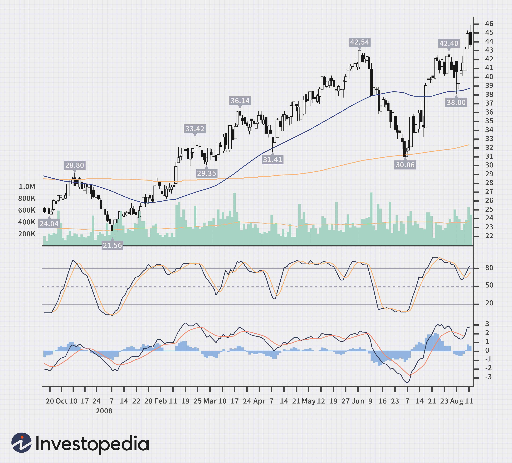

## Table of Contents

## What is the MACD indicator and how is it calculated?

The MACD, or Moving Average Convergence Divergence, is a popular tool used in trading to understand the momentum of a stock or other financial asset. It helps traders see when a trend might be changing or getting stronger. The MACD is made up of two lines: the MACD line and the signal line. When the MACD line crosses above the signal line, it can be a sign to buy, and when it crosses below, it might be a sign to sell.

To calculate the MACD, you start by finding the difference between two moving averages of an asset's price. Usually, these are the 12-day and 26-day exponential moving averages (EMAs). The MACD line is this difference. Next, you calculate the signal line, which is typically a 9-day EMA of the MACD line. Traders then look at the MACD line and the signal line to make decisions. If the MACD line goes above the signal line, it might be time to buy. If it goes below, it might be time to sell.

## What is the Stochastic Oscillator and how does it work?

The Stochastic Oscillator is a tool used in trading to figure out if a stock or other financial asset is overbought or oversold. It does this by comparing the closing price of an asset to its price range over a certain period of time, usually 14 days. The idea is that in a strong uptrend, prices will close near the high of the range, and in a strong downtrend, prices will close near the low of the range. The Stochastic Oscillator gives you two lines, called %K and %D, which move between 0 and 100. If the lines are above 80, it might mean the asset is overbought and could go down soon. If the lines are below 20, it might mean the asset is oversold and could go up soon.

To calculate the Stochastic Oscillator, you first find the highest high and the lowest low of the asset's price over the chosen period, say 14 days. Then, you calculate %K, which is the current closing price minus the lowest low, divided by the highest high minus the lowest low, all multiplied by 100. After that, you calculate %D, which is a 3-day simple moving average of %K. Traders look at these lines to see if they are crossing above 80 or below 20, and they also watch for when %K crosses above or below %D as a signal to buy or sell. By using the Stochastic Oscillator, traders can try to find the best times to buy or sell an asset based on its momentum and potential reversals.

## How do the MACD and Stochastic indicators complement each other in trading?

The MACD and Stochastic indicators can work well together to help traders make better decisions. The MACD is great at showing the overall trend and momentum of a stock or asset. It tells you if the trend is getting stronger or if it might be changing direction. On the other hand, the Stochastic Oscillator is good at telling you if a stock is overbought or oversold, which can help you know when a price might go up or down soon. By using both, you get a fuller picture of what's happening with the asset.

When you use the MACD and Stochastic together, you can look for times when both indicators give you the same signal. For example, if the MACD line crosses above the signal line, suggesting a buy, and at the same time, the Stochastic lines move up from below 20, it's a strong sign that the price might go up. Similarly, if the MACD line crosses below the signal line and the Stochastic lines fall from above 80, it's a strong sign that the price might go down. This way, using both indicators together can help you make more confident trading decisions.

## What is a 'double-cross' in the context of MACD and Stochastic?

A 'double-cross' in trading happens when both the MACD and Stochastic indicators show the same signal at the same time. This means that the MACD line crosses the signal line and, at the same time, the Stochastic lines cross each other. When both indicators agree, it can make traders feel more sure about their decision to buy or sell.

For example, if the MACD line goes above the signal line and the Stochastic %K line goes above the %D line from below 20, it's a strong sign that the price might go up. This is called a 'bullish double-cross'. On the other hand, if the MACD line goes below the signal line and the Stochastic %K line goes below the %D line from above 80, it's a strong sign that the price might go down. This is called a 'bearish double-cross'. By waiting for a double-cross, traders can try to make more confident trades.

## How can a beginner identify a MACD and Stochastic double-cross on a chart?

To spot a MACD and Stochastic double-cross on a chart, a beginner should first look at the MACD indicator. The MACD has two lines: the MACD line and the signal line. A double-cross happens when the MACD line crosses over the signal line. If the MACD line goes above the signal line, it might be a good time to buy. If it goes below the signal line, it might be a good time to sell. Keep an eye on where these lines cross each other.

Next, look at the Stochastic indicator, which has two lines called %K and %D. These lines move between 0 and 100. A double-cross with the Stochastic happens when the %K line crosses over the %D line. If the %K line goes above the %D line from below 20, it could mean the price might go up. If the %K line goes below the %D line from above 80, it could mean the price might go down. A double-cross happens when both the MACD and Stochastic show the same signal at the same time. So, if you see the MACD line crossing above the signal line and the %K line crossing above the %D line from below 20, it's a strong sign to buy. If both lines cross down at the same time, it's a strong sign to sell.

## What are the basic entry and exit rules for the MACD and Stochastic double-cross strategy?

The basic entry rule for the MACD and Stochastic double-cross strategy is to buy when you see both the MACD line crossing above the signal line and the Stochastic %K line crossing above the %D line from below 20. This is called a bullish double-cross. It means that both indicators are telling you that the price might go up. So, when you see these two things happening at the same time, it's a good time to enter a trade and buy the stock or asset.

The basic exit rule for this strategy is to sell when you see both the MACD line crossing below the signal line and the Stochastic %K line crossing below the %D line from above 80. This is called a bearish double-cross. It means that both indicators are telling you that the price might go down. So, when you see these two things happening at the same time, it's a good time to exit the trade and sell the stock or asset. By following these entry and exit rules, you can use the double-cross strategy to make trading decisions based on both the MACD and Stochastic indicators.

## What time frames are most effective for using the MACD and Stochastic double-cross strategy?

The MACD and Stochastic double-cross strategy can work well on different time frames, but it is often most effective on shorter time frames like 15-minute or 1-hour charts. These shorter time frames can help you catch quick changes in the market and make trades that last for a few hours or a day. When you use this strategy on shorter time frames, you might see more double-cross signals, which can help you find good times to buy or sell.

On longer time frames, like daily or weekly charts, the double-cross strategy can still be useful but might give fewer signals. These signals can be stronger and more reliable because they are based on longer-term trends. Using the strategy on longer time frames can help you make trades that last for several days or weeks. So, depending on whether you want to make quick trades or hold onto an asset for longer, you can choose the time frame that works best for you.

## How can traders adjust the settings of MACD and Stochastic to optimize the double-cross strategy?

Traders can change the settings of the MACD and Stochastic indicators to make the double-cross strategy work better for them. For the MACD, you can change the number of days used to calculate the moving averages. The usual settings are 12 days for the fast moving average, 26 days for the slow moving average, and 9 days for the signal line. If you want to see more signals, you can use shorter time periods, like 5 days for the fast moving average, 10 days for the slow moving average, and 3 days for the signal line. But if you want fewer, but stronger signals, you can use longer time periods, like 20 days for the fast moving average, 40 days for the slow moving average, and 15 days for the signal line.

For the Stochastic, you can also change the settings to fit your trading style. The usual settings are 14 days for the look-back period, and 3 days for the %D line. If you want to catch quick changes in the market, you can use a shorter look-back period, like 5 days, and a shorter %D line, like 1 day. This will make the Stochastic react faster to price changes. But if you want to see more reliable signals, you can use a longer look-back period, like 20 days, and a longer %D line, like 5 days. By changing these settings, you can make the double-cross strategy work better for the way you like to trade.

## What are common pitfalls or false signals to watch out for with this strategy?

One common pitfall with the MACD and Stochastic double-cross strategy is getting false signals. Sometimes, the MACD line and the Stochastic lines might cross each other, but the price doesn't move the way you expect. This can happen a lot in markets that move up and down a lot without a clear trend. When this happens, you might buy or sell too early or too late, which can lead to losses.

Another thing to watch out for is overtrading. Because the double-cross strategy can give a lot of signals, especially on shorter time frames, you might be tempted to trade too often. This can lead to higher costs from fees and can make it hard to stick to a good trading plan. It's important to wait for clear signals and not jump into every trade you see. By being patient and only trading when both the MACD and Stochastic agree, you can avoid some of these common problems.

## How does market volatility affect the performance of the MACD and Stochastic double-cross strategy?

Market [volatility](/wiki/volatility-trading-strategies) can really change how well the MACD and Stochastic double-cross strategy works. When the market moves up and down a lot, you might see more signals from the strategy. This can be good because it gives you more chances to trade, but it can also be bad because some of these signals might not be right. In a volatile market, the price can change quickly, and the MACD and Stochastic might give you signals that look good but don't lead to the price moving the way you expect. This can make it hard to know when to buy or sell, and you might end up losing money if you follow these false signals.

To deal with this, you need to be careful and patient when using the double-cross strategy in a volatile market. It's a good idea to wait for strong signals where both the MACD and Stochastic agree, and not to trade every time you see a signal. You might also want to use other tools or indicators to help you decide when to trade. By being more careful and using other information, you can try to avoid some of the problems that come with trading in a volatile market.

## Can the MACD and Stochastic double-cross strategy be combined with other technical indicators for better results?

Yes, you can use the MACD and Stochastic double-cross strategy with other technical indicators to get better results. One good indicator to use with them is the Relative Strength Index (RSI). The RSI helps you see if a stock is overbought or oversold, just like the Stochastic. If the RSI is above 70, it might mean the stock is overbought, and if it's below 30, it might mean it's oversold. By waiting for the RSI to agree with the MACD and Stochastic double-cross, you can feel more sure about your trading decisions.

Another useful indicator to combine with the double-cross strategy is the Bollinger Bands. Bollinger Bands show you how much the price of a stock moves around. When the price touches the upper band, it might mean the stock is overbought, and when it touches the lower band, it might mean it's oversold. If you see a double-cross signal from the MACD and Stochastic at the same time the price is near the Bollinger Bands, it can give you a stronger signal to buy or sell. By using these extra indicators, you can make your trading strategy work better and avoid some of the false signals that can happen when you use just the MACD and Stochastic alone.

## What are some advanced techniques for managing risk and maximizing returns using the MACD and Stochastic double-cross strategy?

To manage risk and maximize returns with the MACD and Stochastic double-cross strategy, one advanced technique is to use stop-loss orders. A stop-loss order helps you limit how much money you can lose on a trade. When you enter a trade based on a double-cross signal, you can set a stop-loss order at a price level where you think the trade might not work out. This way, if the price moves against you, the stop-loss order will automatically close your trade, helping you avoid bigger losses. Another way to manage risk is to use position sizing. This means deciding how much money to put into each trade based on how much risk you're willing to take. By only risking a small part of your total trading money on each trade, you can protect your overall account from big losses.

To maximize returns, you can use a technique called trailing stops. A trailing stop moves up with the price as it goes in your favor, helping you lock in profits while still giving the trade room to grow. For example, if you buy a stock based on a bullish double-cross and the price starts to rise, you can set a trailing stop that follows the price up. This way, if the price suddenly drops, the trailing stop will close your trade at a higher price than where you started, letting you keep some of the gains. Another advanced technique is to combine the double-cross strategy with trend analysis. By looking at longer-term trends using tools like moving averages, you can make sure your trades are in the direction of the overall market trend. This can help you catch bigger moves and make more money over time.

## What is the Stochastic Oscillator and how does it work?

The stochastic oscillator is a widely-utilized technical analysis indicator that assists traders in assessing the momentum of a stock relative to its price range over a defined timeframe. This tool was introduced by George C. Lane in the late 1950s and quickly became a crucial element in trading strategies due to its focus on momentum rather than merely price or [volume](/wiki/volume-trading-strategy) data.

The foundational concept of the stochastic oscillator lies in the observation that as an asset's price rises, its closing price tends to lie near its highest trading range. Conversely, when the price decreases, the closing price typically gravitates towards the lower end of its trading band. This behavior allows the stochastic oscillator to function as a leading indicator, capable of signaling potential reversals and entry or [exit](/wiki/exit-strategy) points before they occur.

Mathematically, the stochastic oscillator comprises two essential components: %K and %D. The %K line, often referred to as the fast stochastic indicator, is the main line calculated using the formula:

$$
\%K = \frac{{\text{{(Current Close}} - \text{{Lowest Low)}}}}{{\text{{(Highest High}} - \text{{Lowest Low)}}}} \times 100
$$

Here, the "Current Close" is the most recent closing price of the stock, "Lowest Low" is the lowest price over a predetermined number of periods, and "Highest High" is the highest price over the same set of periods. The standard timeframe often used is 14 periods, but this can be adjusted to suit different trading styles.

The %D line acts as a smoothing filter and is typically a simple moving average (SMA) of the %K line over three periods:

$$
\%D = \text{{SMA}}(\%K, 3)
$$

This smoothing process makes %D a slow stochastic indicator, offering a clearer trend perspective. The crossover of %K and %D lines provides crucial buy and sell signals; a %K line crossing above the %D line indicates a buying opportunity, while a cross below suggests a potential sell.

The stochastic oscillator, with its focus on [momentum](/wiki/momentum) and ability to preempt turning points in market trends, remains a reliable tool for traders aiming to enhance their decision-making processes by providing clear signals of market movements.

## How do you work with MACD?

The Moving Average Convergence Divergence (MACD) is a popular trend-following momentum indicator in technical analysis, widely used by traders to understand market momentum and price movements. The MACD helps identify potential buy and sell signals by monitoring the relationship between two exponential moving averages (EMAs) of a security's price.

The fundamental principle of the MACD is calculating oscillator values derived from the difference between a short-term and a long-term EMA, specifically, the 12-day EMA and the 26-day EMA. By subtracting the 26-day EMA from the 12-day EMA, the MACD line is formed:

$$
\text{MACD} = \text{EMA}_{12} - \text{EMA}_{26}
$$

Traders often use the MACD line in conjunction with a signal line, which is typically a 9-day EMA of the MACD line itself. This signal line acts as a trigger for buy or sell decisions. When the MACD line crosses above the signal line, it generates a bullish signal, suggesting it may be time to buy. Conversely, when the MACD line crosses below the signal line, it signals a bearish trend, indicating a potential selling opportunity.

Moreover, the MACD is visually represented in charts with a histogram, which depicts the difference between the MACD and the signal line over a period of time. Bars on the histogram change size as these two lines diverge and converge. The histogram provides insights into the strength and momentum of a trend:

$$
\text{Histogram} = \text{MACD} - \text{Signal Line}
$$

The magnitude of the histogram peaks, and the frequency of crossovers can help traders understand trend strength and direction. Overlaying the MACD lines onto the histogram assists in visualizing these momentum shifts, offering a clearer picture of potential market reversals and continuations. This technique is particularly valuable for confirming trend signals in various market conditions. 

By employing the MACD, traders can more effectively time their trades and optimize their strategies to capitalize on emerging trends, thereby leveraging historical price data to forecast future movements with greater confidence.

## How do you calculate MACD and Stochastic Indicators?

The calculation of the MACD (Moving Average Convergence Divergence) and stochastic indicators is integral to utilizing the MACD Double-Cross Strategy effectively. 

**MACD Calculation:**

The MACD is formulated by employing exponential moving averages (EMAs). The two primary EMAs involved are:

- **12-day EMA**: This represents the short-term moving average.
- **26-day EMA**: This denotes the long-term moving average.

The MACD is determined using the formula:

$$
\text{MACD} = \text{EMA}_{12} - \text{EMA}_{26}
$$

In practice, the MACD line is visualized alongside a nine-day EMA of the MACD itself, which serves as the trigger line or signal line. This signal line is crucial for identifying uptrend and downtrend crossovers, acting as a cue for potential buy or sell signals.

**Stochastic Oscillator Calculation:**

The stochastic oscillator gauges the position of a security's closing price relative to its price range over a certain period, typically 14 days. It comprises two lines, %K and %D:

- **%K Line**: The formula to calculate the %K line is:

$$
\%K = \frac{\text{Current Close} - \text{Lowest Low}}{\text{Highest High} - \text{Lowest Low}} \times 100
$$

where:
  - Current Close is the latest closing price.
  - Lowest Low is the lowest price over the chosen period.
  - Highest High is the highest price over the chosen period.

- **%D Line**: This is the simple moving average (SMA) of the %K line, typically over three periods. It is calculated as:

$$
\%D = \text{SMA}(\%K, n)
$$

This approach emphasizes changes in momentum rather than price amplitude, offering a leading indication of potential price reversals.

By understanding and calculating these indicators accurately, traders can enhance their ability to identify pivotal market movements and strategically time their trades. The symbiotic use of MACD and stochastic indicators allows traders to corroborate signals and refine their trading strategies for superior accuracy.

## How can the strategy be applied in real-world trade?

Traders implement the MACD Double-Cross Strategy with stochastic indicators by integrating them into their chosen trading platforms, setting both the MACD and stochastic oscillator as overlays on their price charts. This involves aligning these indicators to provide clear visual signals on potential buy or sell opportunities. In practical application, traders pay close attention to graphical indicators to detect simultaneous crossovers of MACD and stochastic lines, indicating a strong trading signal.

The integration starts by configuring the MACD, which involves plotting the MACD line by subtracting the 26-day Exponential Moving Average (EMA) from the 12-day EMA, and then identifying the nine-day EMA as the signal line. Concurrently, the stochastic oscillator is set up, calculated as follows: 

$$
\%K = \frac{\text{Current Close} - \text{Lowest Low}}{\text{Highest High} - \text{Lowest Low}} \times 100
$$

The average of \%K over a specified period is then used to derive the \%D line, which acts as a smoothed signal. Once both indicators are active, traders monitor for instances of bullish or bearish crossovers. A bullish crossover occurs when the MACD line crosses above the signal line in conjunction with the \%K line moving above the \%D line in the stochastic oscillator. This alignment signals a potential upward momentum, suggesting a buy opportunity. Conversely, a bearish crossover suggests a potential selling point, with the MACD line crossing below the signal line and the \%K line moving below the \%D line.

Historically, companies such as Genesee & Wyoming Inc. have demonstrated the application of this strategy successfully. By closely monitoring and interpreting these crossover events within the context of broader market trends and individual stock behaviors, traders can effectively make informed decisions that potentially enhance the profitability of their trades. This approach requires a disciplined recognition of the indicators and contextual analysis to take advantage of optimal market conditions.

## References & Further Reading

[1]: Lane, G. C. (1984). "Lane's Stochastics: Saint or Sinner?" Commodities Magazine. An article by George C. Lane discussing the stochastic oscillator, a crucial component in this strategy.

[2]: Appel, G. (2005). ["Technical Analysis: Power Tools for Active Investors"](https://www.amazon.com/Technical-Analysis-Power-Active-Investors/dp/0132930048) by Gerald Appel. This book offers detailed insights into the MACD indicator.

[3]: Murphy, J. J. (1999). ["Technical Analysis of the Financial Markets: A Comprehensive Guide to Trading Methods and Applications"](https://archive.org/details/technicalanalysi0000murp) by John J. Murphy. A foundational book for understanding various technical analysis tools, including MACD and stochastic indicators.

[4]: Pring, M. J. (2002). ["Technical Analysis Explained: The Successful Investor's Guide to Spotting Investment Trends and Turning Points"](https://www.amazon.com/Technical-Analysis-Explained-Fifth-Successful/dp/0071825177) by Martin J. Pring. This book provides insights into technical indicators and their applications in trading.

[5]: Achelis, S. B. (2000). ["Technical Analysis from A to Z"](https://www.mhebooklibrary.com/doi/book/10.1036/9780071380119) by Steven B. Achelis. Offers a detailed encyclopedia of technical indicators including stochastic and MACD.