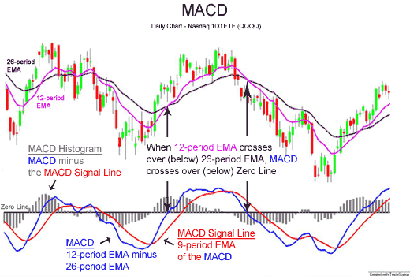

## Table of Contents

## What is the MACD indicator and how does it work?

The MACD, or Moving Average Convergence Divergence, is a popular tool used in trading to understand the strength, direction, and momentum of a trend in the price of a security. It is calculated by subtracting the 26-day exponential moving average (EMA) from the 12-day EMA. A 9-day EMA of the MACD, called the "signal line," is then plotted on top of the MACD line, which helps traders spot potential buy or sell signals.

The MACD works by showing the relationship between two moving averages of a security's price. When the MACD line crosses above the signal line, it's seen as a bullish signal, suggesting that it might be a good time to buy. On the other hand, when the MACD line crosses below the signal line, it's seen as a bearish signal, indicating that it might be a good time to sell. Traders also watch for when the MACD line crosses above or below the zero line, as this can indicate a change in the overall trend of the security's price.

## How do you calculate the MACD line and the signal line?

To calculate the MACD line, you start by finding the 12-day exponential moving average (EMA) of a security's price. Then, you find the 26-day EMA of the same price. The MACD line is simply the 12-day EMA minus the 26-day EMA. This line shows the difference between the two EMAs and helps traders see how the short-term trend is moving compared to the longer-term trend.

The signal line is calculated using the MACD line. You take the MACD line and find its 9-day EMA. This 9-day EMA of the MACD line becomes the signal line. Traders watch the signal line because when the MACD line crosses over the signal line, it can suggest a good time to buy or sell. The signal line smooths out the MACD line, making it easier to spot these important crossover points.

## What does the MACD histogram represent and how is it used?

The MACD histogram shows the difference between the MACD line and the signal line. It looks like a series of bars that can be above or below a zero line. When the bars are above the zero line, it means the MACD line is above the signal line, which can be a sign that the price of the security might go up. When the bars are below the zero line, it means the MACD line is below the signal line, which can be a sign that the price might go down.

Traders use the MACD histogram to spot when the trend might be changing. If the bars start getting smaller, it can mean the trend is losing strength. If the bars start getting bigger, it can mean the trend is getting stronger. Traders often look for when the histogram crosses the zero line because this can signal a good time to buy or sell. By watching these changes, traders can make better decisions about when to enter or [exit](/wiki/exit-strategy) trades.

## Can you explain the basic MACD trading strategy for beginners?

The basic MACD trading strategy for beginners involves watching for two main signals: the MACD line crossing the signal line, and the MACD histogram crossing the zero line. When the MACD line crosses above the signal line, it's a sign that the price of the security might go up. This is a good time to think about buying. On the other hand, when the MACD line crosses below the signal line, it's a sign that the price might go down. This could be a good time to sell or avoid buying.

Another thing to watch is the MACD histogram. When the histogram bars cross above the zero line, it means the MACD line is above the signal line, suggesting a bullish trend. This is another sign that you might want to buy. When the histogram bars cross below the zero line, it means the MACD line is below the signal line, suggesting a bearish trend. This is a signal that you might want to sell. By paying attention to these simple signals, beginners can start using the MACD to make trading decisions.

## What are the common MACD signals used to enter and exit trades?

The main MACD signal for entering a trade is when the MACD line crosses above the signal line. This is called a bullish crossover and it suggests that the price of the security might start to go up. When you see this, it can be a good time to buy. Another signal to watch for is when the MACD histogram crosses above the zero line. This also shows that the MACD line is above the signal line and can be a sign to enter a long position.

For exiting a trade, you want to watch for the opposite signals. A bearish crossover happens when the MACD line crosses below the signal line. This suggests that the price might start to go down, so it can be a good time to sell or get out of your position. Also, if the MACD histogram crosses below the zero line, it means the MACD line is below the signal line, and this can be another sign to exit your trade. By paying attention to these signals, you can make better decisions about when to enter and exit trades.

## How can divergence between price and MACD be used in trading?

Divergence between price and MACD is when the price of a security moves in one direction, but the MACD moves in the opposite direction. This can be a powerful sign that the current trend might be about to change. For example, if the price of a security keeps going up, but the MACD starts to go down, this is called bearish divergence. It means the upward price movement might not last much longer and could start to go down soon.

On the other hand, if the price of a security keeps going down, but the MACD starts to go up, this is called bullish divergence. It suggests that the downward price movement might be losing strength and the price could start to go up soon. Traders use these divergences to get ready for a possible change in the trend. By watching for these signs, traders can make better decisions about when to buy or sell.

## What are the limitations and potential pitfalls of using the MACD?

Using the MACD can be helpful, but it has some limits you should know about. One big issue is that the MACD can give you signals that are too late. By the time the MACD line crosses the signal line, the price might have already moved a lot. This can mean you miss out on the best times to buy or sell. Another problem is that the MACD can give you false signals, especially in markets that don't have a clear trend. You might think it's time to buy or sell, but the price doesn't move the way you expect.

Another thing to watch out for is that the MACD works best in trending markets. If the market is moving sideways without a clear up or down trend, the MACD can be confusing and lead to bad trades. Also, relying only on the MACD without looking at other tools can be risky. You might miss important information about the market that other indicators could show you. So, it's smart to use the MACD along with other tools to make better trading decisions.

## How can the MACD be combined with other technical indicators to improve trading decisions?

Combining the MACD with other technical indicators can help you make better trading choices. For example, you can use the Relative Strength Index (RSI) along with the MACD. The RSI measures how fast and how much a security's price is changing. When the RSI is above 70, it might mean the security is overbought and could go down soon. When it's below 30, it might mean the security is oversold and could go up soon. If the MACD shows a bullish crossover and the RSI is below 30, it could be a strong sign to buy. If the MACD shows a bearish crossover and the RSI is above 70, it could be a strong sign to sell.

Another useful tool to use with the MACD is the moving average. A common choice is the 50-day simple moving average (SMA). If the price of a security is above the 50-day SMA, it suggests a long-term uptrend. If it's below, it suggests a long-term downtrend. You can use this to confirm the signals from the MACD. For example, if the MACD shows a bullish crossover and the price is above the 50-day SMA, it's a good sign that the upward trend might continue. If the MACD shows a bearish crossover and the price is below the 50-day SMA, it's a good sign that the downward trend might continue. By using these tools together, you can make more informed decisions and reduce the chance of false signals.

## What are some advanced MACD trading strategies for experienced traders?

Experienced traders can use a strategy called MACD histogram divergence to spot big changes in trends. They watch for times when the price of a security keeps going up, but the MACD histogram bars start to get smaller. This is called bearish divergence and it can mean the price might start to go down soon. On the other hand, if the price keeps going down but the histogram bars start to get smaller, it's called bullish divergence and it can mean the price might start to go up soon. By watching these signs, experienced traders can get ready for big changes in the market and make smart moves to buy or sell at the right time.

Another advanced strategy is to use the MACD with other tools like the Bollinger Bands. Bollinger Bands are lines drawn above and below the price that show how much the price is moving. When the price touches the upper band, it might be overbought and ready to go down. When it touches the lower band, it might be oversold and ready to go up. If the MACD shows a bearish crossover and the price is at the upper Bollinger Band, it's a strong sign to sell. If the MACD shows a bullish crossover and the price is at the lower Bollinger Band, it's a strong sign to buy. By using the MACD and Bollinger Bands together, experienced traders can find better times to enter and exit trades.

## How does the choice of MACD settings affect trading outcomes?

The settings you pick for the MACD can change how it works and the signals it gives you. The usual settings are 12 for the fast EMA, 26 for the slow EMA, and 9 for the signal line. If you change these numbers, you can make the MACD more sensitive or less sensitive to price changes. For example, if you use smaller numbers like 5, 10, and 3, the MACD will be more sensitive and give you signals faster. This can be good for short-term trading but might give you more false signals. On the other hand, if you use bigger numbers like 20, 40, and 15, the MACD will be less sensitive and give you signals slower. This can be better for long-term trading but might make you miss out on quick price changes.

Choosing the right MACD settings depends on what you're trying to do and how long you plan to hold your trades. If you're trading for a short time, you might want to use settings that make the MACD more sensitive so you can catch quick moves in the price. But, you have to be careful because these quick signals can be wrong sometimes. If you're trading for a longer time, you might want to use settings that make the MACD less sensitive so you don't get thrown off by small price changes. No matter what settings you pick, it's always a good idea to try them out first and see how they work for you before using them for real trades.

## Can you discuss the effectiveness of MACD in different market conditions?

The MACD works well in markets that have a clear trend, either going up or going down. When the market is trending, the MACD can help you see when the trend might keep going or when it might change. For example, if the price is going up and the MACD line crosses above the signal line, it's a good sign to buy because the trend might keep going up. If the price is going down and the MACD line crosses below the signal line, it's a good sign to sell because the trend might keep going down. In these situations, the MACD can help you make good trading decisions and catch big moves in the market.

However, the MACD can be less helpful in markets that are moving sideways, without a clear trend. In these markets, the MACD might give you a lot of false signals, making you think it's time to buy or sell when it's not. For example, the MACD line might cross above and below the signal line many times, but the price doesn't move much. This can make it hard to know when to enter or exit trades. So, in markets that are moving sideways, it's a good idea to use the MACD along with other tools to check its signals and make better trading choices.

## What are some real-world examples of successful MACD trading strategies?

One real-world example of a successful MACD trading strategy is used by a trader named Sarah. Sarah trades stocks and uses the MACD to spot good times to buy and sell. She looks for when the MACD line crosses above the signal line, which she sees as a sign to buy. For example, she noticed this crossover happening with a tech company's stock when the price was going up. She bought the stock and held it until the MACD line crossed below the signal line, which told her it was time to sell. This strategy helped her make a good profit because she bought at the start of an upward trend and sold before the price started to go down.

Another example is from a trader named John, who uses the MACD to trade [forex](/wiki/forex-system). John likes to use the MACD histogram to see when the trend might change. He was watching the EUR/USD pair and saw that the price was going down, but the MACD histogram bars were getting smaller. This told him there might be a bullish divergence, meaning the price could start to go up soon. He bought the EUR/USD pair when the histogram crossed above the zero line, and it worked out well because the price did start to go up. John sold his position when the MACD line crossed below the signal line again, making a nice profit from the trade.

## References & Further Reading

[1]: ["Advances in Financial Machine Learning"](https://www.amazon.com/Advances-Financial-Machine-Learning-Marcos/dp/1119482089) by Marcos Lopez de Prado

[2]: ["Evidence-Based Technical Analysis: Applying the Scientific Method and Statistical Inference to Trading Signals"](https://www.amazon.com/Evidence-Based-Technical-Analysis-Scientific-Statistical/dp/0470008741) by David Aronson

[3]: ["Machine Learning for Algorithmic Trading"](https://github.com/stefan-jansen/machine-learning-for-trading) by Stefan Jansen

[4]: ["Quantitative Trading: How to Build Your Own Algorithmic Trading Business"](https://books.google.com/books/about/Quantitative_Trading.html?id=j70yEAAAQBAJ) by Ernest P. Chan

[5]: Bergstra, J., Bardenet, R., Bengio, Y., & Kégl, B. (2011). ["Algorithms for Hyper-Parameter Optimization."](https://proceedings.neurips.cc/paper/2011/file/86e8f7ab32cfd12577bc2619bc635690-Paper.pdf) Advances in Neural Information Processing Systems 24.