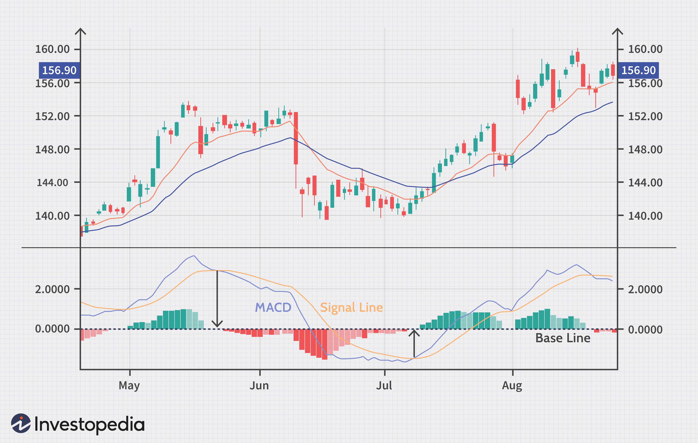

In algorithmic trading, the MACD crossover strategy is a well-known method used by traders to pinpoint potential buy and sell opportunities. The Moving Average Convergence Divergence (MACD) indicator is a composite of momentum and trend-following elements, designed to provide insights into market sentiment and direction. The hallmark of this strategy lies in identifying the crossing points of the MACD line and the signal line, which signal potential shifts in price momentum.

The MACD is calculated using two exponential moving averages (EMAs), typically configured with default settings: a 12-period EMA (fast) and a 26-period EMA (slow). The MACD line is the difference between these two EMAs. A signal line, usually a 9-period EMA of the MACD line, is plotted on the graph to help visualize crossover points. These crossovers are crucial as they represent potential market entry and exit points, with the MACD line crossing above the signal line often interpreted as a bullish signal, and crossing below as bearish.



This article examines the success rate of the MACD crossover strategy when applied in algorithmic trading, a domain where strategies are executed by computer algorithms based on predefined rules. We will explore its reliability and potential benefits, while also addressing the considerations traders should bear in mind when implementing this strategy in automated systems. By investigating its performance across different market conditions, we aim to provide a comprehensive analysis of its effectiveness and practical utility.

Recent advances in algorithmic trading, including the integration of machine learning techniques and enhanced backtesting capabilities, have encouraged a deeper exploration of strategies like the MACD crossover. These developments have contributed to refining its application, increasing its adaptability across various financial markets. Despite its historical success, understanding the nuances of this strategy remains vital for traders who seek to harness its potential while mitigating inherent risks.

## Table of Contents

## Understanding the MACD Crossover Strategy

The Moving Average Convergence Divergence (MACD) crossover strategy is a popular technical analysis tool used in algorithmic trading. At its core, the MACD indicator utilizes two exponential moving averages (EMAs) to gauge momentum and trend strength. Typically, these EMAs are the 12-period and 26-period, where the 12-period EMA reacts faster to price changes than the 26-period EMA. The difference between these two EMAs forms the MACD line.

To further refine trading signals, a third line, known as the signal line, is introduced. This line is commonly a 9-period EMA of the MACD line itself. The MACD crossover occurs when the MACD line intersects the signal line. A crossover where the MACD line moves above the signal line suggests a bullish signal, indicating potential buy points. Conversely, when the MACD line crosses below the signal line, it signals a bearish trend, marking potential sell points.

These crossover points are critical in [algorithmic trading](/wiki/algorithmic-trading) systems as they serve as triggers for entering or exiting trades based on perceived shifts in market [momentum](/wiki/momentum). The simplicity of these crossovers allows traders to create straightforward trading strategies, yet the underlying principles can be incorporated into more complex systems. For example, an algorithmic trading system might use the following basic Python code snippet to identify MACD crossovers:

```python
import pandas as pd

def calculate_macd(prices, short_window=12, long_window=26, signal_window=9):
    # Calculate the short and long EMAs
    short_ema = prices.ewm(span=short_window, adjust=False).mean()
    long_ema = prices.ewm(span=long_window, adjust=False).mean()

    # Calculate the MACD line
    macd_line = short_ema - long_ema

    # Calculate the Signal line
    signal_line = macd_line.ewm(span=signal_window, adjust=False).mean()

    return macd_line, signal_line

# Example of identifying crossover points
def identify_crossovers(macd_line, signal_line):
    crossover_signals = []
    for i in range(1, len(macd_line)):
        if macd_line[i] > signal_line[i] and macd_line[i - 1] <= signal_line[i - 1]:
            crossover_signals.append((i, 'buy'))
        elif macd_line[i] < signal_line[i] and macd_line[i - 1] >= signal_line[i - 1]:
            crossover_signals.append((i, 'sell'))
    return crossover_signals
```

In practice, traders implement these crossover signals mindful of trading conditions and asset [volatility](/wiki/volatility-trading-strategies). While the MACD crossover strategy is straightforward, the effectiveness and reliability hinge on proper parameter selection and contextual awareness. Adjustments and enhancements, such as incorporating additional technical indicators or modifying EMA periods, are commonly employed to adapt the strategy to specific market environments or asset classes. Understanding how these crossovers are interpreted and utilized in algorithmic systems forms the basis for making informed trading decisions.

## Historical Performance and Success Rates

Historical data and [backtesting](/wiki/backtesting) play a pivotal role in determining the effectiveness of the Moving Average Convergence Divergence (MACD) crossover strategy in algorithmic trading. This strategy is highly regarded for its potential to generate buy and sell signals based on the convergence and divergence of moving averages, but its success is not uniform across all financial instruments and market conditions.

Empirical studies and backtesting have shown that applying the MACD crossover strategy to indices such as the S&P 500 can yield profitable trades over time. However, these results are not universally applicable to every asset class. The success rates of this strategy are closely tied to specific parameter settings and prevailing market conditions. For instance, traders often optimize the periods of the exponential moving averages (EMAs) used in the MACD calculation to suit different financial instruments. A common setting involves a 12-period and a 26-period EMA with a 9-period signal line, yet variations in these parameters might be necessary to adapt to the unique characteristics of particular assets.

Market conditions, such as volatility and trends, significantly influence the strategy's efficacy. In consistently trending markets, the MACD crossover can successfully signal momentum shifts, presenting opportunities for profitable trades. Conversely, in periods of low volatility or sideways market movements, the likelihood of false signals increases, reducing the strategy's reliability.

The analysis of past performance metrics is essential to gauge the MACD crossover strategy's potential across various market scenarios. Traders rely on these insights to refine their approaches and enhance strategy performance. For instance, incorporating additional indicators and implementing risk management practices can mitigate the impact of adverse market conditions on trading outcomes.

A critical aspect of successful trading involves continuously examining and adapting strategy parameters based on historical data analysis. This includes optimizing MACD parameters, adjusting them as needed for different asset classes, and considering the integration of complementary analytical tools to improve accuracy and reduce the frequency of false signals. By doing so, traders can better navigate the complexities of financial markets, aligning their strategies with evolving market trends and conditions.

## Factors Affecting MACD Strategy Success

The success of the MACD crossover strategy in algorithmic trading is contingent upon several critical factors. Among these, the setting of parameters, such as the lengths of the exponential moving averages (EMAs) and the signal line, can greatly influence the outcomes. Balancing these parameters to suit the trading environment is essential for optimizing the performance of this strategy.

Markets exhibiting high volatility or robust trends are generally more conducive to effective MACD crossover signals than those displaying sideways or choppy movements. In high-volatility conditions, price movements are significant enough to create decisive crossovers, making it easier to capture potential profit from trends. Conversely, in a sideways market, frequent but less meaningful crossovers may occur, leading to false signals and erratic trading results. Therefore, identifying and operating in markets with clear directional trends is favorable for the MACD strategy.

The choice of time frame is another pivotal consideration. Intraday traders might rely on shorter EMAs and rapid crossovers to exploit smaller price movements, while those focused on daily or weekly frames may use standard or extended periods to capture broader market trends. Each time frame can have implications for how signals are interpreted and acted upon. For instance, a strategy that works on a five-minute chart might not perform as well on a daily chart without adjusting the parameters.

Risk management is integral to any trading strategy, and the MACD crossover approach is no exception. Implementing appropriate stop-loss orders helps mitigate potential losses from false signals or unexpected market movements. Additionally, using other technical indicators (such as the Relative Strength Index (RSI) or Bollinger Bands) alongside MACD can provide confirmation signals, thereby enhancing decision-making accuracy.

Incorporating additional filters, like trend confirmation, can further increase the reliability of crossover signals. By establishing a set of criteria or conditions for initiating a trade, traders can avoid executing positions based on weak or ambiguous signals. For example, confirming that the market is in a recognized uptrend before considering buy signals from MACD can reduce the probability of entering positions prematurely or against the prevailing trend.

In summary, the effectiveness of the MACD crossover strategy is significantly influenced by the careful selection and adjustment of its technical parameters, an understanding of market conditions, strategic time frame usage, and robust risk management practices. Through these considerations, traders can improve the potential success and reliability of their algorithmic trading systems leveraging the MACD.

## Advanced Techniques to Improve Performance

Traders aiming to refine the MACD crossover strategy often incorporate a blend of additional technical indicators to authenticate signals. Among these, the Relative Strength Index (RSI) and moving averages are popular choices. The integration of the RSI, a momentum oscillator, helps in gauging the magnitude and velocity of price movements. When corroborated with MACD signals, RSI can enhance decision accuracy by confirming overbought or oversold conditions.

Trend filters play a significant role in optimizing trade entries and exits. By identifying the prevailing market trend, traders can reduce exposure to unsuccessful trades that occur when trading counter to the trend. An effective approach is utilizing a higher time frame moving average to filter trades, executing only those alignments with the overarching trend direction. For instance, if the primary trend in a higher time frame is upward, a trader might decide only to pursue long positions on lower time frames, thereby minimizing risk.

Multi-time frame analysis aids in strengthening the validity of trading decisions. This technique involves examining the MACD signals across various time frames simultaneously. By doing so, traders gain a more comprehensive view of market dynamics. For example, if a MACD crossover on a daily chart aligns with bullish signals on an hourly chart, the confluence can serve as a robust confirmation of a potential upward movement.

Parameter optimization is essential for tailoring MACD settings to specific market conditions or instruments. By conducting historical data analysis, traders can fine-tune the EMAs and signal line values to maximize strategy performance. This can be achieved using backtesting frameworks in Python, such as the example below:

```python
import pandas as pd
import numpy as np
import backtrader as bt

class MACDStrategy(bt.Strategy):
    params = (
        ('fast_length', 12),
        ('slow_length', 26),
        ('signal_length', 9),
    )

    def __init__(self):
        self.macd = bt.indicators.MACD(self.data, 
                                       period_me1=self.params.fast_length, 
                                       period_me2=self.params.slow_length, 
                                       period_signal=self.params.signal_length)

    def next(self):
        if self.macd.macd > self.macd.signal:
            self.buy()
        elif self.macd.macd < self.macd.signal:
            self.sell()
```

Beyond traditional methods, advanced techniques such as divergence analysis and [machine learning](/wiki/machine-learning) can substantially enhance MACD-based strategies. Divergence happens when the MACD line and asset prices move in opposite directions, signaling potential reversals. Utilization of machine learning algorithms, on the other hand, offers an innovative edge. By training models to recognize complex patterns in MACD-related data and making predictions, traders can achieve higher precision and adaptability in trade execution.

In conclusion, the fusion of complementary tools and techniques with the MACD crossover strategy allows traders to improve its effectiveness substantially. As technology and analytics continue to evolve, the range of opportunities for enhancing this classic strategy broadens, offering robust means for managing the ever-changing landscape of financial markets.

## Conclusion

The MACD crossover strategy remains essential for algorithmic traders aiming to capture momentum shifts in market dynamics. Historical success of this strategy, particularly within well-trending markets, underscores its efficacy, but traders must be mindful of its inherent limitations. The MACD's performance can be compromised in volatile or range-bound environments, necessitating robust risk management practices to safeguard against potential losses. Its adaptability across various markets is a key advantage, achieved through parameter modifications and integrating additional analysis tools like trend filters and relative strength indicators.

Continuous evaluation and refinement of the MACD strategy are critical in algorithmic trading. Both backtesting and real-time analysis play significant roles in ensuring the strategy's effectiveness in different market conditions. Moreover, optimizing parameter settings based on historical data for specific assets is vital to enhance performance outcomes. While the MACD crossover strategy does not offer guaranteed success, it provides valuable insights and opportunities. When combined with ongoing innovation and prudent risk management, it serves as a powerful component in the trader's strategic arsenal, allowing for informed decision-making in diverse trading scenarios.

## References & Further Reading

[1]: ["Advances in Financial Machine Learning"](https://www.amazon.com/Advances-Financial-Machine-Learning-Marcos/dp/1119482089) by Marcos Lopez de Prado

[2]: ["Evidence-Based Technical Analysis: Applying the Scientific Method and Statistical Inference to Trading Signals"](https://www.amazon.com/Evidence-Based-Technical-Analysis-Scientific-Statistical/dp/0470008741) by David Aronson

[3]: ["Machine Learning for Algorithmic Trading"](https://github.com/stefan-jansen/machine-learning-for-trading) by Stefan Jansen

[4]: ["Quantitative Trading: How to Build Your Own Algorithmic Trading Business"](https://books.google.com/books/about/Quantitative_Trading.html?id=j70yEAAAQBAJ) by Ernest P. Chan

[5]: Bergstra, J., Bardenet, R., Bengio, Y., & Kégl, B. (2011). ["Algorithms for Hyper-Parameter Optimization."](https://proceedings.neurips.cc/paper/2011/file/86e8f7ab32cfd12577bc2619bc635690-Paper.pdf) Advances in Neural Information Processing Systems 24.