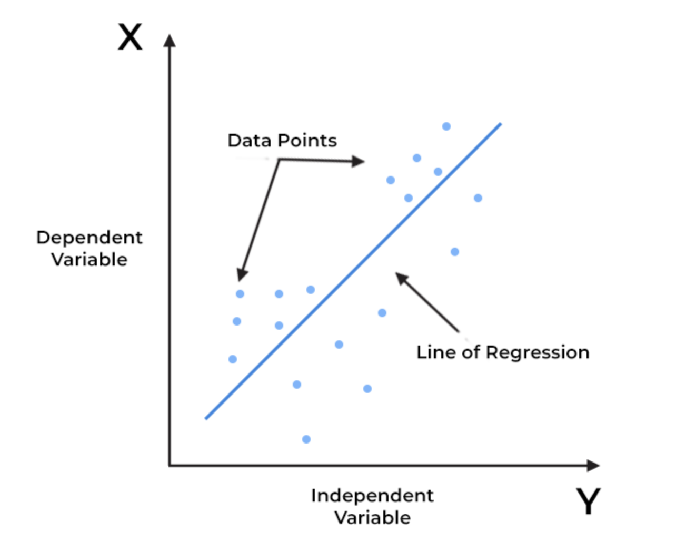
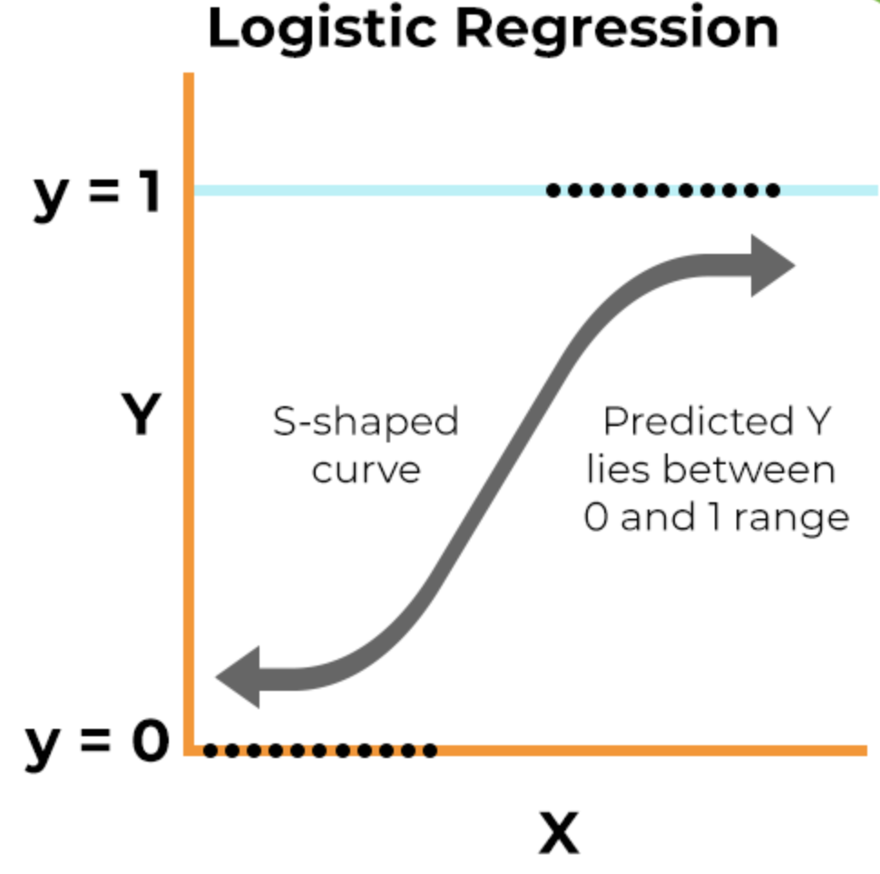
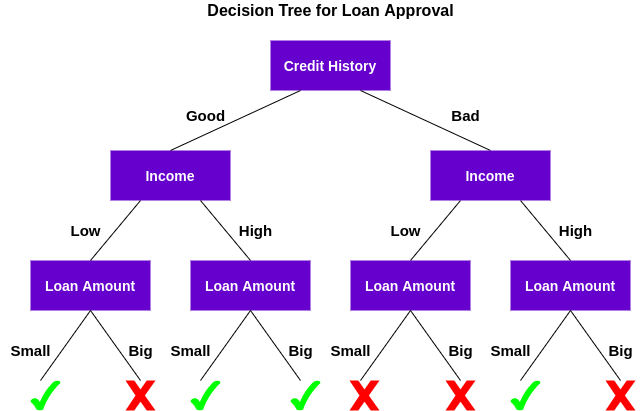

Machine Learning, a pivotal component of artificial intelligence, refers to the ability of computer systems to learn and improve from experience without being explicitly programmed. It involves algorithms that enable machines to analyze data, identify patterns, and make decisions with minimal human intervention. This innovative technology has become integral to our daily lives, driving advancements in various sectors, including healthcare, finance, automation, and personalized technology solutions.

For beginners stepping into the field of machine learning, grasping the fundamental algorithms is not just an academic exercise; it's a doorway to understanding how machines mimic human learning processes. These algorithms are the building blocks that enable machines to process data, make predictions, or perform tasks that traditionally require human intelligence. Understanding these algorithms lays the groundwork for delving deeper into the vast and rapidly evolving landscape of machine learning.

In today’s technology-driven world, machine learning stands at the forefront of innovation and problem-solving. From simple recommendations on e-commerce websites to complex predictive models in weather forecasting or financial market analysis, machine learning algorithms are increasingly becoming indispensable tools. For those beginning their journey in this field, a strong foundational knowledge of these algorithms is essential. It not only empowers them to contribute to cutting-edge technologies but also helps in developing a mindset geared towards data-driven problem solving and automation, which are key in modern technological advancements.

## Table of Contents

## Understanding the Types of Machine Learning Algorithms

Machine Learning algorithms are broadly categorized into four main types: Supervised Learning, Unsupervised Learning, Semi-Supervised Learning, and Reinforcement Learning. Each category has distinct characteristics and applications, making them suitable for different kinds of tasks and challenges in the field of artificial intelligence.

**Supervised Learning:** This is the most prevalent form of machine learning. In supervised learning, algorithms are trained on labeled data, which means the algorithm learns from data that already contains the answers. It's akin to a student learning under the guidance of a teacher. The algorithm makes predictions based on input data and is corrected if its predictions are wrong. Supervised learning is widely used for applications like fraud detection, spam filtering, and most commonly, in regression and classification problems.

**Unsupervised Learning:** Unlike supervised learning, unsupervised learning algorithms deal with unlabeled data. The algorithm tries to make sense of the data by extracting features and patterns on its own. It's like a student learning without a teacher, trying to find a structure in the course material independently. Unsupervised learning is commonly used for clustering and association tasks, such as customer segmentation in marketing and anomaly detection in network security.

**Semi-Supervised Learning:** This type of learning falls between supervised and unsupervised learning. Here, algorithms are trained on a combination of labeled and unlabeled data. This approach is useful when acquiring a fully labeled dataset is costly or time-consuming. Semi-supervised learning is often applied in scenarios where the unlabeled data can augment the learning process, like in image and speech recognition tasks.

**Reinforcement Learning:** In reinforcement learning, the algorithm learns by interacting with an environment. It makes decisions, observes the outcomes (rewards or penalties), and adjusts its strategies accordingly. It's similar to teaching a pet new tricks: the pet is rewarded for good behavior and learns from the experience. Reinforcement learning is widely used in areas such as robotics, gaming, and navigation systems.

Each of these types of machine l[earning](/wiki/earning-announcement) algorithms is suited to specific types of problems and data environments. Understanding when and where to apply these algorithms is fundamental to solving complex computational problems effectively and is an essential skill for practitioners in the field of [machine learning](/wiki/machine-learning).

## Top Machine Learning Algorithms for Beginners

### Linear Regression

Linear Regression is one of the most fundamental machine learning algorithms, especially for those just starting in the field. At its core, Linear Regression is a predictive modeling technique used for understanding the relationship between a dependent (target) variable and one or more independent (predictor) variables. The goal is to find a linear relationship - a straight line, essentially - that can predict the output value based on input values.

The concept hinges on the equation of a straight line, $y = mx + c$, where $y$ is the dependent variable, $x$ is the independent variable, $m$ is the slope of the line, and $c$ is the y-intercept. In machine learning terms, $m$ and $c$ are coefficients that the algorithm learns to predict the most accurate line that can fit the data.

**Use Cases:**

1. **Real Estate Pricing:** Predicting house prices based on features like size, location, and age.
2. **Sales Forecasting:** Estimating future sales based on historical sales data.
3. **Risk Assessment:** In finance, determining credit risk scores for loan applicants.

**Importance for Beginners:**

1. **Foundation for Machine Learning:** It introduces beginners to key concepts in machine learning like supervised learning, regression analysis, and the idea of fitting a model to data.
2. **Easy to Understand and Implement:** Linear Regression models are relatively straightforward to understand and can be implemented easily using popular programming languages and libraries.
3. **Interpretable Results:** The results of a Linear Regression model are easy to interpret, making it easier for beginners to grasp how changes in input variables affect the target variable.
4. **Building Block for More Complex Algorithms:** Understanding Linear Regression lays the groundwork for learning more complex machine learning algorithms, as many are extensions or adaptations of basic regression principles.

In summary, Linear Regression is a critical starting point for anyone new to machine learning. Its simplicity, wide applicability, and the intuitive understanding it provides of machine learning fundamentals make it an essential algorithm for beginners to master.

### Logistic Regression

Logistic Regression is a pivotal algorithm in the realm of machine learning, especially known for its efficacy in handling classification problems. Unlike Linear Regression, which predicts continuous outputs, Logistic Regression is used when the output is categorical or binary—such as 'Yes' or 'No', 'True' or 'False', 'Spam' or 'Not Spam'.

At its core, Logistic Regression estimates the probability that a given input point belongs to a certain class. This is achieved through the logistic function, often called the sigmoid function. This function outputs a value between 0 and 1, which is interpreted as the probability. For instance, a Logistic Regression model might estimate the probability of a customer buying a product based on past purchasing history and demographic data.

**Key Applications in Classification Problems:**

1. **Email Filtering:** Determining whether an email is spam or not based on content, sender, and other attributes.
2. **Credit Scoring:** Assessing if a loan applicant is likely to default or not.
3. **Medical Diagnosis:** Predicting whether a patient has a particular disease based on symptoms and test results.

**Importance for Beginners:**

1. **Foundation in Classification:** Logistic Regression provides beginners with an understanding of how to approach binary classification problems, which are prevalent in various real-world applications.
2. **Interpretability:** It offers a clear interpretation of model outputs as probabilities, making the results understandable and actionable.
3. **Extension to Other Forms:** Learning Logistic Regression lays the groundwork for understanding more complex models in classification, such as Neural Networks, where the logistic function is often used as an activation function.

Logistic Regression stands out for its simplicity, interpretability, and effectiveness in classification tasks, making it a crucial tool for beginners in machine learning to learn and master.

### Decision Trees and Random Forest

Decision Trees and Random Forests are two influential machine learning algorithms widely used for both classification and regression tasks. Understanding their fundamentals, differences, and applications is crucial for beginners in machine learning.

**Decision Trees:**
A Decision Tree is a flowchart-like tree structure where each internal node represents a test on an attribute, each branch represents the outcome of the test, and each leaf node represents a class label (decision). The paths from the root to the leaf represent classification rules. This intuitive approach makes Decision Trees one of the most understandable algorithms for decision-making.

- **Applications:**
    - **Business Management:** For example, decision trees can be used to evaluate the potential success of new products.
    - **Healthcare:** Used for diagnosing diseases based on symptoms and medical history.
    - **Finance:** For credit scoring based on customer profiles.

**Random Forest:**
Random Forest is an ensemble learning technique that creates a 'forest' of decision trees and merges them together to get more accurate and stable predictions. In essence, Random Forest builds multiple decision trees and merges them to get a more accurate and robust prediction. A key advantage of Random Forest over a single decision tree is that it reduces the risk of overfitting.

- **Applications:**
    - **E-commerce:** For product recommendation systems based on customer behavior.
    - **Banking:** Used for fraud detection in transactional systems.
    - **Stock Market:** Analyzing stock market trends for predictive investment strategies.

**Differences between Decision Trees and Random Forest:**

1. **Complexity:** A single decision tree is generally simpler and more interpretable than a Random Forest, which is a collection of many trees.
2. **Accuracy:** Random Forest typically provides a higher level of accuracy than a single decision tree, especially on large datasets.
3. **Overfitting:** Decision Trees are more prone to overfitting, especially with noisy data. Random Forest, by averaging multiple trees, mitigates the overfitting issue.
4. **Computational Intensity:** Random Forest is more computationally intensive than Decision Trees as it involves building and combining multiple trees.

For beginners, starting with Decision Trees is a great way to understand the basics of hierarchical decision-making and then moving to Random Forests for grasping the concept of ensemble learning. Both algorithms provide robust techniques for a wide range of practical applications in various domains.

### K-Nearest Neighbors (KNN)

K-Nearest Neighbors (KNN) is a simple, yet powerful machine learning algorithm used for both classification and regression, but more commonly for classification problems. As a non-parametric and lazy learning algorithm, KNN works by finding the distances between a query and all the examples in the data, selecting the specified number of examples (K) closest to the query, then votes for the most frequent label (in the case of classification).

**How KNN Works:**

1. **Choose the Number K of Neighbors:** K is a user-defined constant, and the choice of K will affect the accuracy of the prediction.
2. **Calculate the Distance:** Measure the distance between the new point and every other point using distance metrics such as Euclidean, Manhattan, or Hamming distance.
3. **Find the Nearest Neighbors:** Locate the K nearest neighbors to the new data point.
4. **Vote for Labels:** In classification, identify the most common class among those neighbors. In regression, calculate the mean of these neighbors.

**Practical Applications:**

- **Recommendation Systems:** KNN can power recommendation engines that suggest products to customers based on similarity measures.
- **Finance:** For credit ratings by comparing a client's profile with the profiles of existing customers.
- **Healthcare:** For classifying the severity of a patient's condition by comparing their symptoms with historical records.
- **Image Recognition:** In pattern recognition, such as facial recognition in photos.

KNN is widely praised for its simplicity and effectiveness, especially in scenarios where the decision boundary is irregular. Beginners can easily understand and implement KNN, making it an ideal algorithm to start with in the machine learning journey. However, it's important to note that KNN can be computationally intensive on large datasets and is sensitive to the scale of the data and irrelevant features. Therefore, data preprocessing steps like normalization and feature selection can play a crucial role in the performance of a KNN model.

### Support Vector Machines (SVM)

Support Vector Machines (SVM) are a set of supervised learning methods used primarily for classification, and to a lesser extent, for regression. The power of SVM lies in its ability to create a hyperplane or a set of hyperplanes in a high-dimensional space, which can be used for classification, regression, or other tasks. The effectiveness of SVM in complex classification problems makes it a highly valuable algorithm for beginners in machine learning to understand and apply.

**How SVM Works:**

1. **Creating a Hyperplane:** In simple terms, SVM finds a hyperplane that best separates the classes in the feature space. The algorithm looks for the hyperplane with the largest margin, meaning the greatest distance between data points of both classes.
2. **Handling Non-Linear Data:** For non-linearly separable data, SVM uses what are called 'kernels' to transform the data into a higher dimension where it is linearly separable. This makes SVM highly versatile in handling various types of data.
3. **Support Vectors:** These are the data points closest to the hyperplane. The algorithm depends on these points, hence the name 'Support Vector Machines.'

**Relevance in Classification Tasks:**

- **Text and Hypertext Categorization:** SVMs can classify news articles, blog posts, or web pages into different categories.
- **Image Classification:** They can be used for recognizing faces, objects, and other aspects in images.
- **Bioinformatics:** SVMs are useful in protein classification, cancer classification based on gene expression, and other biological problem domains.

**Why It's Important for Beginners:**

- **Robustness:** SVMs are known for their robustness, especially in high-dimensional spaces.
- **Versatility:** The use of kernels makes SVM adaptable to different types of data, enhancing its versatility.
- **Performance:** SVMs often perform well on a variety of datasets and are considered as one of the best 'out-of-the-box' classifiers.

For beginners, learning about SVMs offers insights into dealing with complex classification problems, especially when the data is not linearly separable. The algorithm's ability to use kernels to handle different types of data and its effectiveness in high-dimensional spaces makes it an essential part of any machine learning toolkit.

### Naive Bayes

Naive Bayes classifiers are a family of probabilistic algorithms that apply Bayes’ Theorem with a strong (naïve) assumption of independence between the features. They are particularly known for their simplicity, efficiency, and effectiveness in a wide range of classification tasks.

**Principle Behind Naive Bayes:**

1. **Bayes’ Theorem:** At its core, Naive Bayes uses Bayes' Theorem, a principle from statistics that describes the probability of an event based on prior knowledge of conditions related to the event. Mathematically, it calculates the probability of a label given some observed features, known as the posterior probability.
2. **Feature Independence:** The ‘naïve’ aspect of Naive Bayes comes from the assumption that the features in the dataset are mutually independent. While this assumption is rarely true in real-world data, Naive Bayes classifiers often perform surprisingly well even when this independence assumption is violated.
3. **Training and Prediction:** During training, the algorithm calculates the probability of each class and the conditional probability of each class given each feature. For prediction, it applies these probabilities to calculate the likelihood of new data belonging to each class.

**Applications of Naive Bayes Classifier:**

- **Spam Filtering:** Identifying whether an email is spam or not based on word frequencies within the email.
- **Sentiment Analysis:** Classifying sentiment in text data, like determining if a movie review is positive or negative.
- **Document Classification:** Assigning categories to text documents, such as news articles, academic papers, etc.

**Importance for Beginners:**

- **Simplicity:** Naive Bayes is straightforward to understand and implement, making it ideal for beginners.
- **Speed:** It is highly scalable with large datasets, making it a practical option for real-world applications.
- **Baseline Model:** Due to its simplicity and decent performance, it often serves as a good baseline model for text classification problems.

Despite its simplicity, Naive Bayes can be incredibly effective in certain conditions. It is particularly well-suited for instances where the dimensionality of the input is high (like text data), even though the features are not strictly independent. For beginners, understanding and implementing Naive Bayes is an excellent starting point for delving into the world of probabilistic machine learning models.

### Neural Networks

Neural Networks represent a fundamental shift in machine learning, drawing inspiration from the structure and function of the human brain. They consist of layers of interconnected nodes, akin to neurons, and are capable of learning complex patterns through training. The significance of [neural network](/wiki/neural-network)s in today's technology landscape cannot be overstated, especially with the rise of [deep learning](/wiki/deep-learning), a subset of neural networks with many layers, which has revolutionized fields like image and speech recognition.

**Core Concepts of Neural Networks:**

1. **Structure:** A typical neural network has three types of layers: an input layer, hidden layers, and an output layer. Each layer consists of units or neurons, which are connected to neurons in the next layer.
2. **Weights and Biases:** These are the parameters of the network. Weights control the strength of the connection between neurons, while biases allow the model to fit better with the data.
3. **Activation Functions:** These functions determine whether a neuron should be activated or not, adding non-linearity to the model, which enables it to learn complex patterns.

**Training Process:**

- **Forward Propagation:** Data is fed into the network, and interactions between weights and biases compute the output.
- **Backpropagation:** The network learns by adjusting its weights and biases to minimize the difference between its prediction and the actual outcome.

**Significance and Applications:**

- **Versatility:** Neural networks can be used for a wide range of applications, from simple tasks like regression to complex ones like natural language processing.
- **Deep Learning:** With deep neural networks, we have seen significant advancements in computer vision, speech recognition, and many other areas where traditional algorithms struggled.
- **Handling High-Dimensional Data:** Neural networks excel in situations with high-dimensional data, such as images and text.

**Why It’s Important for Beginners:**

- **Foundation for Advanced AI:** Understanding neural networks lays the groundwork for delving into more complex deep learning and AI applications.
- **Career Relevance:** Proficiency in neural networks is increasingly sought after in the tech industry, with applications in many cutting-edge technologies.
- **Cognitive Understanding:** Learning about neural networks also provides insight into how learning and decision-making might work in the human brain.

For beginners, grasping the basics of neural networks is both a challenging and rewarding journey. It opens the door to a world where computers can learn and make decisions, pushing the boundaries of what's possible in machine learning and [artificial intelligence](/wiki/ai-artificial-intelligence).

### Ensemble Learning Techniques

Ensemble learning techniques are a cornerstone in machine learning, known for improving prediction accuracy by combining multiple models. Unlike single model approaches, these techniques leverage the collective power of multiple algorithms to achieve better performance. Three primary ensemble methods are Boosting, Bagging, and Stacking, each with unique characteristics.

1. **Boosting:**
    - **Concept:** Boosting works by sequentially building models, where each model attempts to correct the errors made by the previous one. It focuses on converting weak learners (models that are only slightly better than random guessing) into a strong learner as a collective.
    - **Use Cases:** Boosting is widely used in classification problems and is known for its effectiveness in reducing bias and variance.
    - **Popular Algorithms:** Algorithms like AdaBoost, Gradient Boosting, and XGBoost fall under this category.
2. **Bagging (Bootstrap Aggregating):**
    - **Concept:** Bagging involves creating multiple subsets of the original dataset with replacement (bootstrap samples), training a model on each subset, and then aggregating their predictions. This approach is effective in reducing variance and overfitting.
    - **Use Cases:** A classic example is the Random Forest algorithm, which uses bagging with decision trees to achieve more stable and accurate predictions.
    - **Characteristics:** Bagging is particularly useful with high-variance models and large datasets.
3. **Stacking (Stacked Generalization):**
    - **Concept:** Stacking involves combining various models (typically of differing types) and using a meta-model to output a final prediction. The base models are trained on the complete dataset, and then the meta-model is trained on the outputs of these base models.
    - **Use Cases:** It’s commonly used in competitions like Kaggle, where blending diverse models can lead to more accurate predictions.
    - **Flexibility:** Stacking allows the integration of various algorithms, harnessing the strengths of each.

For beginners, understanding ensemble techniques is critical because they demonstrate how combining multiple learning algorithms can lead to more robust, accurate, and reliable predictions. These methods are a testament to the idea that in machine learning, sometimes the whole can indeed be greater than the sum of its parts. Exploring these techniques offers a window into advanced machine learning practices and provides beginners with powerful tools to improve model performance.

## Advanced Machine Learning Algorithms

### Gradient Boosting and Variants (XGBoost, LightGBM)

Gradient Boosting is a highly effective and widely used machine learning algorithm, primarily known for its robustness in dealing with various types of data and its efficiency in predictive accuracy. It operates by sequentially adding predictors (weak learners), adjusting them to correct the mistakes made by the previous ones, which is a process known as boosting.

1. **XGBoost (eXtreme Gradient Boosting):**
    - **Description:** XGBoost is an optimized distributed gradient boosting library designed to be highly efficient, flexible, and portable. It implements machine learning algorithms under the Gradient Boosting framework.
    - **Key Features:** XGBoost provides a parallel tree boosting that solves many data science problems in a fast and accurate way. It's known for handling sparse data and offers features like built-in cross-validation, regularization, and scalability.
    - **Applications:** XGBoost has been the algorithm behind many winning solutions in machine learning competitions due to its speed and performance. It is effective for a range of applications, from regression to classification problems.
2. **LightGBM (Light Gradient Boosting Machine):**
    - **Description:** LightGBM is part of Microsoft's Distributed Machine Learning Toolkit and is designed to be distributed and efficient with faster training speed and lower memory usage.
    - **Unique Approach:** One key feature of LightGBM is its use of histogram-based algorithms, which bucket continuous feature (attribute) values into discrete bins, significantly speeding up training and reducing memory usage.
    - **Use Cases:** It works exceptionally well on large datasets and excels in scenarios where the dataset is larger than the available memory. LightGBM is commonly used in industries for real-time predictions due to its high efficiency.

Both XGBoost and LightGBM have become popular in the machine learning community for their performance and speed. They are particularly favored in situations where dataset sizes are large, and computational efficiency is a priority. Understanding these algorithms can provide beginners with powerful tools in their machine learning arsenal, allowing them to tackle a wide range of predictive modeling problems with confidence.

### Deep Learning Concepts

Deep learning, a subset of machine learning, has revolutionized the field of artificial intelligence. It involves the use of neural networks with many layers (hence 'deep') to model complex patterns in data. Here are the basics of two fundamental deep learning structures:

1. **Convolutional Neural Networks (CNNs):**
    - **Core Concept:** CNNs are designed to process data with a grid-like topology, making them particularly effective for visual imagery analysis.
        
        
        
    - **Structure:** They consist of an input layer, multiple hidden layers, and an output layer. The hidden layers include convolutional layers, pooling layers, fully connected layers, and normalization layers.
    - **Functionality:** In CNNs, each neuron in a layer is connected to only a small region of the layer before it, known as a receptive field. These neurons process portions of the input image, and the results are then tiled so that they overlap, to obtain a better representation of the original image.
    - **Applications:** CNNs have been used with great success in image recognition, object detection, image classification, and more.

2. **Recurrent Neural Networks (RNNs):**

- **Fundamentals:** Unlike traditional neural networks, RNNs have loops within them, allowing information to be carried across neurons while processing sequences of inputs. This makes them ideal for time-series analysis.

- **Mechanism:** They work on the principle of saving the output of a layer and feeding this back to the input to help in predicting the outcome of the layer.
- **Challenges:** One common issue with RNNs is the problem of long-term dependencies, where RNNs become unable to learn to connect information from earlier time steps to later ones. This is often addressed with variations like Long Short-Term Memory (LSTM) networks.
- **Use Cases:** RNNs are widely used in language modeling, speech recognition, translation, and sequence generation.

Deep learning's ability to process and learn from enormous amounts of data has made it a critical tool in pushing the boundaries of AI. Its applications range from improving computer vision systems to advancing natural language processing. For beginners in machine learning, understanding these concepts opens a path to more complex and exciting challenges in the field.

## Choosing the Right Algorithm

### Factors to Consider

When diving into the vast domain of machine learning, choosing the right algorithm is pivotal for success. Several critical [factor](/wiki/factor-investing)s influence this decision, each playing a unique role in shaping the outcome of your machine learning project:

1. **Data Size:**
    - **Impact:** The volume of data you have at your disposal can significantly determine the choice of algorithm. Some algorithms work better with large datasets, learning more intricately from the vast information, while others are more suited for smaller datasets.
    - **Example:** Deep learning algorithms, like neural networks, generally require substantial amounts of data to perform optimally. In contrast, simpler models like linear regression can be more suitable for smaller datasets.
2. **Data Quality:**
    - **Consideration:** The quality of your data, in terms of cleanliness and the amount of noise, is crucial. Algorithms differ in their sensitivity to data quality.
    - **Action:** If your data is riddled with errors, inconsistencies, or missing values, algorithms robust against such issues (like decision trees) might be more appropriate.
3. **Nature of the Problem:**
    - **Types:** Understand whether your problem is a classification, regression, clustering, or another type of machine learning task.
    - **Selection:** Each type of machine learning problem has a set of algorithms known to perform well. For instance, for a classification problem, algorithms like logistic regression or support vector machines might be more suitable.
4. **Computational Efficiency:**
    - **Hardware Constraints:** The computational complexity of algorithms varies, and so does the hardware required to run them effectively.
    - **Trade-offs:** More complex models like deep learning require more computational power and might not be the right choice if resources are limited.
5. **Interpretability:**
    - **User Understanding:** Some machine learning models are like 'black boxes' offering high accuracy but little insight into how decisions are made. In contrast, others are more transparent.
    - **Requirement:** If the project demands understanding how decisions are made, simpler, more interpretable models like decision trees might be preferable.
6. **Scalability:**
    - **Growth:** Consider how well the algorithm can scale with increasing data and complexity.
    - **Future-proofing:** Algorithms that are more scalable might be a better long-term choice if you expect your data to grow or your task to become more complex over time.

Selecting the right algorithm is not just about achieving the highest accuracy. It's also about finding the right balance between these factors, based on the specific needs and constraints of your project. This thoughtful approach ensures a more efficient, effective, and appropriate use of machine learning.

### Algorithm Selection Guide

Selecting the appropriate machine learning algorithm for a specific problem can be a daunting task, especially for beginners. To simplify this process, here’s a structured, step-by-step guide to help you choose the right algorithm:

1. **Define the Problem:**
    - Clearly articulate the problem you are trying to solve. Is it a prediction task, a classification problem, or something else? The nature of the problem greatly influences the choice of algorithm.
2. **Understand Your Data:**
    - Analyze your dataset to understand its characteristics. Consider the size of the dataset, the type of variables (categorical or continuous), and the presence of missing or noisy data.
3. **Identify Algorithm Suitability:**
    - Match the nature of your problem with potential algorithms. For example:
        - **Classification tasks:** Consider Logistic Regression, SVM, Decision Trees, or Naive Bayes.
        - **Regression tasks:** Look at Linear Regression, Ensemble Methods, or Neural Networks.
        - **Clustering:** Explore K-Means or Hierarchical Clustering.
4. **Consider Data Size and Quality:**
    - For large datasets with high quality, complex algorithms like Deep Learning models can be effective.
    - For smaller or noisier datasets, simpler models like Decision Trees or K-Nearest Neighbors might be more appropriate.
5. **Evaluate Model Performance Needs:**
    - Determine the performance metric that matters most for your problem, such as accuracy, precision, recall, or a custom metric. This decision will guide the algorithm selection and tuning.
6. **Assess Computational Resources:**
    - Take stock of the computational resources at your disposal. Algorithms like Deep Learning require significant computational power and might not be feasible for every scenario.
7. **Check for Interpretability Requirements:**
    - If your project requires explaining the model's decisions (like in healthcare or finance), opt for more interpretable models like Decision Trees or Linear Regression.
8. **Experiment and Iterate:**
    - Begin with simpler models and gradually move to more complex ones if necessary. Use cross-validation to test the performance of different algorithms.
9. **Fine-Tune the Model:**
    - Once you've selected an algorithm, fine-tune its parameters for optimal performance. This process, known as hyperparameter optimization, can significantly impact the results.
10. **Validate and Reassess:**
    - Validate the model on a separate testing set to ensure it generalizes well. Be prepared to reassess your algorithm choice if the model does not perform as expected.

By following these steps, you can systematically approach the task of selecting a machine learning algorithm, reducing the compl[exit](/wiki/exit-strategy)y and increasing the likelihood of success in your machine learning endeavors. Remember, there is no one-size-fits-all algorithm; the best choice always depends on the specific nuances of your data and problem.

## Practical Implementation of Algorithms

### Tools and Platforms

In the realm of machine learning, the choice of tools and platforms plays a pivotal role in effective algorithm implementation. Here's an introduction to some of the most popular tools and platforms:

1. **Python:**
    - Python is a versatile programming language favored in the machine learning community due to its simplicity and powerful libraries.
    - Key Libraries:
        - **Scikit-Learn:** Offers a range of algorithms for classification, regression, clustering, and more.
        - **TensorFlow:** An open-source library developed by Google, ideal for deep learning applications.
        - **Keras:** A high-level neural networks API, capable of running on top of TensorFlow, CNTK, or Theano.
        - **Pandas:** A library providing high-performance, easy-to-use data structures and data analysis tools.
        - **NumPy:** Essential for scientific computing with Python, offering support for a wide range of mathematical operations.
2. **R:**
    - R is a language and environment for statistical computing and graphics, highly used in academia and research.
    - It offers various packages like `caret`, `nnet`, and `randomForest` for machine learning tasks.
3. **Jupyter Notebooks:**
    - Jupyter Notebooks are an open-source web application that allows you to create and share documents that contain live code, equations, visualizations, and narrative text.
    - They are ideal for experimenting with algorithms and data analysis.
4. **Google Colab:**
    - Google Colab is a free cloud service based on Jupyter Notebooks that supports free GPU and easy sharing.
    - It's particularly beneficial for deep learning projects due to its GPU support.
5. **MATLAB:**
    - MATLAB is a high-performance language for technical computing. It integrates computation, visualization, and programming in an easy-to-use environment.
6. **Microsoft Azure Machine Learning Studio:**
    - A cloud-based platform for building, testing, and deploying machine learning models. It provides a drag-and-drop interface, which is beginner-friendly.
7. **Amazon SageMaker:**
    - A fully managed service that provides every developer and data scientist with the ability to build, train, and deploy machine learning models quickly.
8. **IBM Watson:**
    - Offers a variety of tools for data scientists, application developers, and subject matter experts to collaboratively and easily work with data to build and train models.

These tools and platforms provide a wide array of functionalities, from data preprocessing and model building to deployment and monitoring. The choice of tool often depends on the specific needs of the project, the familiarity of the user with the tool, and the complexity of the tasks at hand. For beginners, starting with user-friendly environments like Python with Scikit-Learn or R can be a great first step into the world of machine learning.

### Hands-On Examples

To provide a practical perspective on how machine learning algorithms are implemented, let's explore a few basic examples and case studies.

1. **Linear Regression Example:**
    - **Scenario:** Predicting housing prices based on various features like size, location, and number of rooms.
    - **Implementation:** Use a dataset of housing prices, apply a linear regression model to learn the relationship between features (size, location) and the target variable (price).
    - **Tools:** Python with libraries like Pandas for data handling and Scikit-Learn for building the regression model.
2. **Logistic Regression for Classification:**
    - **Scenario:** Email spam detection - classifying emails as spam or not spam.
    - **Implementation:** Train a logistic regression model on a dataset containing emails labeled as spam or not. The model learns from the frequency of certain words and phrases.
    - **Tools:** Python, using Scikit-Learn for the logistic regression model and NLTK for text processing.
3. **Decision Tree Case Study:**
    - **Scenario:** Decision-making in a financial context, like evaluating the risk of loan default.
    - **Implementation:** Use a decision tree to analyze various factors (income level, credit history, etc.) that influence the likelihood of default.
    - **Tools:** Python with Scikit-Learn’s DecisionTreeClassifier, visualizing the tree using Graphviz.
4. **K-Nearest Neighbors (KNN) in Action:**
    - **Scenario:** Recommending products to customers based on similarity to their previous purchases.
    - **Implementation:** Use KNN to find the closest match to a customer's purchase history in a dataset containing various customer profiles and their purchases.
    - **Tools:** Python with Scikit-Learn for the KNN algorithm, Pandas for data manipulation.
5. **Support Vector Machine (SVM) Application:**
    - **Scenario:** Image classification for a simple object recognition task.
    - **Implementation:** Train an SVM to classify images into categories based on features extracted from the images.
    - **Tools:** Python with Scikit-Learn for SVM, OpenCV or PIL for image processing.
6. **Naive Bayes in Real-Life:**
    - **Scenario:** Sentiment analysis of social media posts to gauge public opinion on a topic.
    - **Implementation:** Apply Naive Bayes to classify posts as positive, negative, or neutral based on textual data.
    - **Tools:** Python, using NLTK for text processing and Scikit-Learn for the Naive Bayes classifier.
7. **Neural Network Demonstration:**
    - **Scenario:** Handwritten digit recognition using the MNIST dataset.
    - **Implementation:** Train a simple neural network to recognize and classify handwritten digits.
    - **Tools:** Python with TensorFlow or Keras, utilizing their neural network capabilities.
8. **Ensemble Learning Techniques:**
    - **Scenario:** Improving a model’s accuracy in predicting customer churn.
    - **Implementation:** Combine several models like decision trees, SVM, and logistic regression using techniques like boosting or bagging to create a more robust predictive model.
    - **Tools:** Python, Scikit-Learn for model building, and ensemble methods.

These examples are just the tip of the iceberg but provide a starting point for beginners to understand the practical application of machine learning algorithms. Each of these scenarios can be further explored with varying complexities and datasets to deepen one’s understanding and skills in machine learning.

## Challenges and Best Practices

#### Common Challenges:

1. **Overwhelming Complexity:** Beginners often find the vast array of algorithms and their mathematical intricacies daunting.
2. **Choosing the Right Model:** With so many algorithms available, it can be challenging to select the most suitable one for a specific problem.
3. **Data Quality Issues:** Poor quality data can lead to inaccurate models, but beginners might not know how to clean and preprocess data effectively.
4. **Underfitting and Overfitting:** Beginners may struggle to balance between a model that is too simple (underfitting) or too complex (overfitting).
5. **Computational Resources:** Some machine learning algorithms require significant computational power, which might not be readily accessible to all beginners.
6. **Staying Updated:** The field of machine learning evolves rapidly, and staying updated with the latest developments can be challenging.

#### Best Practices:

1. **Start with Simple Models:** Begin with simpler models like Linear Regression or Decision Trees before moving to more complex ones. This approach helps in grasping the basic concepts without getting overwhelmed.
2. **Understand the Problem:** Clearly define the problem you're trying to solve. This understanding is crucial in selecting the most appropriate algorithm.
3. **Focus on Data Quality:** Spend time on preprocessing data. Clean, well-prepared data is more important than complex algorithms.
4. **Practice Regularly:** Implement various algorithms on different datasets to understand their strengths and weaknesses.
5. **Learn from Mistakes:** Experimentation is key in machine learning. Don't be afraid to make mistakes; they are valuable learning opportunities.
6. **Join Communities:** Engage with online forums and communities. They are excellent resources for learning from others’ experiences and getting your queries answered.
7. **Keep Learning:** Continuously update your knowledge by reading books, taking online courses, and attending workshops or webinars.
8. **Balance Theory and Practice:** While understanding the theory behind algorithms is important, practical implementation is equally crucial. Balance both to gain a comprehensive understanding.
9. **Utilize Online Resources:** Make use of open-source tools and platforms for practice, such as Kaggle, Colab, and GitHub.
10. **Start with Real-world Problems:** Apply your learning to real-world problems. It helps in understanding the practical implications of algorithms and their results.

By addressing these challenges and adhering to these best practices, beginners can navigate the complexities of learning machine learning algorithms more effectively and efficiently.

## Conclusion

In summary, this guide has journeyed through the essential landscape of machine learning algorithms, highlighting their pivotal role in today’s digital age. Beginning with a clear definition and understanding of what machine learning entails, the article has underscored its growing importance, especially for those just starting in the field.

We navigated the diverse types of machine learning algorithms - supervised, unsupervised, semi-supervised, and [reinforcement learning](/wiki/reinforcement-learning) - illuminating their distinct functions and applicability in various scenarios. For beginners, mastering foundational algorithms like Linear Regression, Logistic Regression, Decision Trees, Random Forests, K-Nearest Neighbors, Support Vector Machines, Naive Bayes, and basic Neural Networks is crucial. These algorithms form the bedrock of machine learning and offer a broad spectrum of practical applications.

The article also delved into advanced algorithms, including Gradient Boosting and its variants like XGBoost and LightGBM, as well as fundamental concepts in deep learning like CNNs and RNNs. Understanding these advanced techniques opens doors to tackling more complex data science challenges.

Selecting the right algorithm is a nuanced process that hinges on various factors like data size, quality, and the specific nature of the problem at hand. Practical implementation of these algorithms has been made accessible through tools and platforms like Python and R, supplemented with hands-on examples to cement the learning process.

However, the journey doesn’t end here. Learning machine learning algorithms comes with its challenges, and thus, we’ve shared best practices and tips to navigate these hurdles effectively. Moreover, we've provided a treasure trove of resources for further learning, including [books](/wiki/algo-trading-books), online [course](/wiki/best-algorithmic-trading-courses)s, and vibrant communities and forums for ongoing support and knowledge sharing.

As you embark on this exciting journey into the realm of machine learning, remember that exploration and experimentation are key. Dive into different algorithms, play with data, engage in practical projects, and immerse yourself in the continuous learning process. The field of machine learning is vast and ever-evolving, and there’s always something new to discover and master. Happy learning!

## References & Further Reading

Books and Online Courses:

1. ["Pattern Recognition and Machine Learning" by Christopher Bishop:](https://www.microsoft.com/en-us/research/uploads/prod/2006/01/Bishop-Pattern-Recognition-and-Machine-Learning-2006.pdf) A comprehensive guide for understanding the fundamentals of machine learning.
2. ["Machine Learning: A Probabilistic Perspective" by Kevin Murphy:](https://www.amazon.com/Machine-Learning-Probabilistic-Perspective-Computation/dp/0262018020) Offers an in-depth exploration of various machine learning approaches with a focus on probabilistic models.
3. [Coursera's "Machine Learning" by Andrew Ng:](https://www.coursera.org/collections/machine-learning) A highly recommended online course that provides a broad introduction to machine learning, data mining, and statistical pattern recognition.
4. [Udemy's "Machine Learning A-Z™: Hands-On Python & R In Data Science":](https://www.udemy.com/course/data-science-and-machine-learning-bootcamp-with-python-and-r/) A course designed for beginners, offering practical experience in both Python and R.
5. [DataCamp:](https://www.datacamp.com/) Offers a range of interactive courses on machine learning, tailored for both Python and R users.

Communities and Forums:

1. **Stack Overflow:** A vital resource for programmers, including those working in machine learning. It’s a great place to ask specific coding questions.
2. **Reddit (r/MachineLearning):** A community where individuals share the latest developments, research papers, and discuss various machine learning topics.
3. **Kaggle:** Not just a platform for data science competitions, Kaggle also has a vibrant community where you can find datasets, notebooks, and discussions on a wide range of machine learning topics.
4. **GitHub:** Hosting a plethora of machine learning projects, GitHub allows beginners to explore real-world applications and collaborate with others.
5. **LinkedIn Groups:** There are several LinkedIn groups dedicated to machine learning and artificial intelligence where professionals discuss trends, share articles, and network.
6. **Meetup:** Local Meetup groups can be found in many cities, where machine learning enthusiasts gather to share knowledge, network, and collaborate on projects.