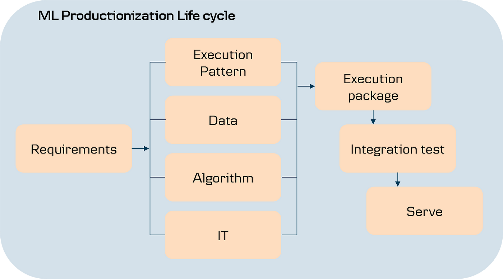

## Table of Contents

## What is machine learning and how does it relate to execution?

Machine learning is a type of artificial intelligence where computers learn from data to make decisions or predictions. It's like teaching a computer to recognize patterns or make choices without someone telling it exactly what to do every time. For example, when you use a smartphone to unlock it with your face, the phone uses machine learning to recognize your face and decide if it's really you.

In terms of execution, machine learning helps computers perform tasks more efficiently and accurately over time. When a computer uses machine learning, it can get better at its job by learning from new information. For instance, if you use a music app that suggests songs, the app learns from your choices and improves its recommendations. This means the computer can execute tasks like sorting through huge amounts of data or making predictions more effectively as it learns.

## Can you explain the basic concepts of machine learning used in execution?

Machine learning in execution involves using algorithms to make decisions or take actions based on data. Think of it like a computer program that can learn from examples. For example, if you're playing a video game where the computer controls the enemy, machine learning helps the enemy get smarter and make better moves as it learns from your gameplay. This happens because the computer uses data from your actions to adjust its strategies and improve over time.

The key idea here is that the computer doesn't need to be told exactly what to do in every situation. Instead, it figures out patterns and rules from the data it sees. This can be really helpful in many areas, like predicting what products customers might want to buy next based on their past purchases, or deciding the best route for a delivery truck to take. By using [machine learning](/wiki/machine-learning), computers can execute tasks more effectively and adapt to new situations without needing constant updates from programmers.

## What are some common algorithms used in machine learning for execution?

Some common algorithms used in machine learning for execution include decision trees, k-nearest neighbors, and neural networks. Decision trees work by making a series of choices, like a flowchart, to reach a decision. For example, if you're trying to decide whether to go outside based on the weather, a decision tree might check if it's raining, then if it's cold, and so on, until it decides if you should go out. K-nearest neighbors, on the other hand, make decisions based on the examples that are most similar to the current situation. Imagine you're trying to guess someone's favorite food; you might look at the favorite foods of people who are similar to them in age, interests, and other ways.

Neural networks are another common algorithm, inspired by how the human brain works. They're made up of layers of connected nodes that process information and make decisions. Think of it like a team of people working together to solve a puzzle: each person (or node) looks at a piece of the puzzle and passes their findings to others, until the whole team figures out the solution. Neural networks are great at tasks like recognizing images or understanding speech because they can learn complex patterns from lots of examples. All these algorithms help computers execute tasks more smartly by learning from data, without needing someone to tell them exactly what to do every time.

## How does data collection and preprocessing impact machine learning models for execution?

Data collection and preprocessing are super important for making machine learning models work well when they execute tasks. Imagine you're trying to teach a computer to recognize different types of fruits. If you don't collect enough pictures of apples, oranges, and bananas, the computer won't have enough examples to learn from. It's like trying to learn a new language without enough practice; you won't get very good at it. So, collecting a lot of good data is key to making sure the machine learning model can do its job right.

Once you have the data, preprocessing is like cleaning and organizing it so the computer can use it better. If your pictures of fruits are all mixed up or some are blurry, the computer might get confused. Preprocessing helps by making sure all the pictures are clear and labeled correctly, kind of like sorting your toys into different boxes so you can find them easily. When the data is clean and well-organized, the machine learning model can learn faster and make better decisions when it's time to execute tasks, like telling an apple from an orange.

## What are the steps to implement a machine learning model for execution?

To implement a machine learning model for execution, you start by collecting a lot of data. This data is like the building blocks that the computer will use to learn. You need to make sure you have enough examples of whatever you want the computer to learn about, like pictures of different animals if you want it to recognize them. Once you have your data, you need to clean it up and organize it. This is called preprocessing. It's like sorting your toys so you can find them easily. You might need to fix mistakes, remove any bad data, and make sure everything is labeled correctly.

After your data is ready, you choose a machine learning algorithm that fits your task. There are many types, like decision trees, which are like flowcharts that help the computer make choices, or neural networks, which are inspired by the human brain and great for recognizing patterns. You then use this algorithm to train your model with the data you've collected. Training is like teaching the computer by showing it lots of examples until it gets good at making predictions or decisions. Once the model is trained, you test it to see how well it works. If it makes a lot of mistakes, you might need to go back and collect more data or try a different algorithm.

When you're happy with how your model performs, you can use it for execution. This means letting the model do its job, like recognizing animals in new pictures or suggesting songs you might like. You might need to keep an eye on how well it's doing and update it with new data from time to time to keep it accurate. By following these steps, you can create a machine learning model that gets smarter and better at executing tasks as it learns from more and more data.

## How can machine learning improve the efficiency of execution processes?

Machine learning can make execution processes much more efficient by learning from data and getting better over time. Imagine you're trying to sort a big pile of toys. At first, it might take you a long time to figure out where each toy goes. But if you use machine learning, it's like having a helper that watches you sort the toys and learns the best way to do it. After a while, this helper can sort the toys faster and better than you can, because it's learned from all the examples. In the same way, machine learning can help computers do tasks like sorting through huge amounts of information or making decisions quickly and accurately.

Another way machine learning improves efficiency is by adapting to new situations without needing someone to tell it what to do. For example, if you're using a navigation app to find the quickest route to school, the app can learn from traffic patterns and suggest better routes over time. It doesn't need someone to update it every time there's a change in traffic; it figures it out on its own. This means that processes like delivering packages or managing inventory can become more efficient because the computer can adjust its actions based on what it learns, making everything run smoother and faster.

## What are the challenges faced when applying machine learning to execution?

One big challenge when using machine learning for execution is making sure the data is good. If the data you use to teach the computer is messy or not right, the computer might learn the wrong things. It's like trying to learn math from a book that has a lot of mistakes. You might end up with the wrong answers. So, collecting enough good data and cleaning it up can be hard work, but it's really important for the computer to do its job well.

Another challenge is choosing the right machine learning algorithm. There are lots of different algorithms, and each one is good for different things. It's like trying to pick the best tool for a job. If you use the wrong tool, it might not work as well as it should. Plus, once you pick an algorithm, you have to make sure it's working right by testing it a lot. If it makes too many mistakes, you might need to try a different one or go back and fix the data. It can take a lot of time and effort to get everything just right.

## Can you discuss case studies where machine learning has successfully been applied to execution?

One great example of machine learning improving execution is in the world of online shopping. Amazon uses machine learning to suggest products that you might like based on what you've bought before or what other people with similar tastes have bought. This helps Amazon show you things you're more likely to buy, making their website more efficient and your shopping experience better. By using machine learning, Amazon can quickly sort through tons of data about what people are buying and make smart suggestions, which helps them sell more stuff and makes customers happier.

Another example is in healthcare, where machine learning helps doctors make better decisions. At IBM, they use a machine learning system called Watson to help doctors diagnose diseases. Watson can look at a patient's symptoms and medical history, and then suggest possible diagnoses or treatments. This makes the process of figuring out what's wrong with a patient faster and more accurate. Doctors can then focus on treating the patient instead of spending a lot of time trying to figure out what's wrong, which makes healthcare more efficient and can even save lives.

## How do you evaluate the performance of machine learning models in execution scenarios?

To evaluate how well a machine learning model is doing in real-life situations, you need to check how accurately it can make predictions or decisions. Imagine you're using a machine learning model to guess if it will rain tomorrow. You would look at how often it gets the weather right. If it says it will rain and it does, that's a good guess. But if it's wrong a lot, then the model needs more work. You can do this by using a test set of data that the model hasn't seen before. This is like a final exam to see if the model learned well from the training data.

Another way to evaluate the model is by looking at how fast it can make decisions and how well it works in different situations. If a model can quickly sort through a lot of data and still make good choices, that's a sign it's efficient. For example, if you're using a machine learning model to recommend songs on a music app, you want it to suggest good songs quickly, even when lots of people are using the app at the same time. You also need to see if the model can adapt to new situations without messing up. If it can keep making good decisions even when things change, like new songs being added to the app, then it's doing a great job.

## What advanced techniques can be used to enhance machine learning models for execution?

One advanced technique to make machine learning models better at execution is using something called ensemble methods. Imagine you're trying to guess how many jelly beans are in a jar. If you ask a bunch of people and then take the average of their guesses, you might get a better answer than if you just asked one person. Ensemble methods work the same way. They combine the predictions of many different machine learning models to make one final prediction that's usually more accurate. This can help the computer make better decisions when it's doing its job, like sorting through data or recommending products.

Another technique is called transfer learning. Think of it like learning a new language. If you already know one language, it's easier to learn another one because you can use what you already know. In transfer learning, a machine learning model that was trained on one task can be used to help with a different but related task. For example, if a model was trained to recognize cars in pictures, it might be easier to teach it to recognize trucks because it already knows a lot about vehicles. This can save time and make the model better at executing new tasks without starting from scratch.

## How does machine learning integrate with other technologies in the execution process?

Machine learning works together with other technologies to make things run smoothly and efficiently. For example, in smart homes, machine learning can learn your routines and preferences, and then work with devices like smart thermostats and lights to adjust the temperature or turn on lights at the right times. It's like having a helper that knows what you like and can control other gadgets to make your life easier. Machine learning also teams up with robotics, where robots can use what they learn to do tasks better, like [picking](/wiki/asset-class-picking) up objects in a factory or helping in a hospital.

In another way, machine learning can join forces with big data technologies to handle and analyze huge amounts of information quickly. Imagine a company trying to understand what customers want by looking at all their online activities. Machine learning can sift through this big data to find patterns and make smart decisions, while big data technologies help store and manage all that information. This teamwork helps businesses make better choices faster, improving how they execute tasks like marketing or inventory management.

## What are the future trends and potential developments in machine learning applied to execution?

In the future, machine learning will become even smarter and more helpful in getting things done. One big trend will be the use of something called "explainable AI." This means that machine learning models will be able to explain why they make certain decisions, which will make them more trustworthy and easier to use in important jobs like medicine or finance. For example, if a machine learning model suggests a treatment for a patient, it will be able to explain why it thinks that treatment is best, helping doctors make better decisions. Another trend is the growth of edge computing, where machine learning happens right on devices like smartphones or cars instead of in faraway data centers. This will make things faster and more private, as the devices can make quick decisions without sending data over the internet.

Another exciting development will be the deeper integration of machine learning with other technologies like the Internet of Things (IoT) and augmented reality (AR). Imagine a world where your home appliances, like your fridge or washing machine, use machine learning to predict when they need maintenance or to suggest the best settings for your needs. Or think about using AR glasses that use machine learning to give you real-time information about the world around you, helping you make better decisions on the go. These advancements will make machine learning an even bigger part of our daily lives, making everything from simple tasks to complex processes more efficient and personalized.

## References & Further Reading

[1]: ["Advances in Financial Machine Learning"](https://www.amazon.com/Advances-Financial-Machine-Learning-Marcos/dp/1119482089) by Marcos Lopez de Prado

[2]: ["Machine Learning for Algorithmic Trading - Second Edition"](https://github.com/PacktPublishing/Machine-Learning-for-Algorithmic-Trading-Second-Edition) by Stefan Jansen

[3]: ["Quantitative Trading: How to Build Your Own Algorithmic Trading Business"](https://www.amazon.com/Quantitative-Trading-Build-Algorithmic-Business/dp/1119800064) by Ernest P. Chan

[4]: ["Artificial Intelligence in Finance: A Review"](https://link.springer.com/article/10.1007/s43546-023-00618-x) by D. T. J. L. Boyd, J. M. Farrell, R. Akoorie, R. A. Berry

[5]: ["High-Frequency Trading: A Practical Guide to Algorithmic Strategies and Trading Systems"](https://www.ahmetbeyefendi.com/wp-content/uploads/2020/07/High-Frequency-Trading-Irene-Aldridge.pdf) by Irene Aldridge 

[6]: Mnih, V., Kavukcuoglu, K., Silver, D., et al. (2015). ["Human-level control through deep reinforcement learning."](https://www.nature.com/articles/nature14236) Nature, 518(7540), 529-533.

[7]: ["Algorithmic Trading and DMA: An introduction to direct access trading strategies"](https://www.amazon.com/Algorithmic-Trading-DMA-introduction-strategies/dp/0956399207) by Barry Johnson