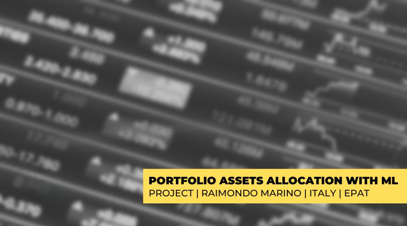

Machine learning (ML) is significantly impacting various sectors, with asset allocation in algorithmic trading being a notable example. The incorporation of ML in asset allocation involves the development of models capable of predicting financial market trends and modifying portfolios in response to these predictions. As financial markets become increasingly complex and data-driven, the traditional methods of asset allocation, which often rely heavily on historical data and financial theories, are being augmented and, in some cases, replaced by ML algorithms. 

This article examines how machine learning algorithms are employed to enhance asset allocation strategies in algorithmic trading. The utilization of ML offers a systematic approach for optimizing decision-making processes by leveraging large datasets to uncover patterns and insights that were previously inaccessible. Within the scope of this discussion, we will address the fundamental principles of asset allocation, highlight the specific role played by ML in algorithmic trading, and explore the benefits and limitations inherent to these technologies. 



To facilitate a comprehensive understanding, we will provide an overview that sets the stage for further examining the ML models commonly employed in asset allocation. These models span a range of techniques from linear models and decision trees to more advanced structures like neural networks and ensemble methods. This context is crucial as it underscores the growing importance of ML in enhancing the efficiency and adaptability of trading strategies in today's fast-paced financial markets. Through the integration of machine learning techniques, investors and traders aim to improve risk management, maximize returns, and maintain a competitive edge in a dynamic environment.

## Table of Contents

## Understanding Asset Allocation in Algo Trading

Asset allocation is a critical component of investment strategy, focusing on distributing investments across various asset classes, such as stocks, bonds, and real estate, to align with investor goals, risk tolerance, and investment horizon. The fundamental objective is to balance risk and reward by adjusting the proportion of each asset within a portfolio. Traditional asset allocation models are grounded in financial theories like Modern Portfolio Theory (MPT), which suggests that an investor can construct an 'efficient frontier' of optimal portfolios that provide the maximum expected return for a given level of risk. 

MPT emphasizes diversification, positing that a diversified portfolio can reduce unsystematic risk. The optimal portfolio is identified where the expected return for a given portfolio variance (or risk) is maximized. The risk-return profile of a portfolio is mathematically defined by the equation:
$$

E(R_p) = \sum_{i=1}^n w_i E(R_i) 
$$
$$

\sigma^2_p = \sum_{i=1}^n \sum_{j=1}^n w_i w_j \sigma_{ij} 
$$
where $E(R_p)$ is the expected return on the portfolio, $w_i$ represents the weights of each asset in the portfolio, $E(R_i)$ is the expected return of asset $i$, and $\sigma^2_p$ is the portfolio's variance determined by the covariances $\sigma_{ij}$ between asset $i$ and asset $j$.

Algorithmic trading has revolutionized asset allocation by utilizing automated systems that can execute investment decisions with speed and precision beyond human capabilities. These systems rely on algorithms to analyze market data and make real-time decisions about buying and selling assets. The integration of technology allows for high-frequency trading and complex calculations to determine optimal asset allocations based on updated market information.

Machine learning (ML) adds another layer of sophistication to this process by enabling adaptive strategies that can sift through extensive datasets to identify patterns and make adjustments faster than traditional methods. ML models in asset allocation can process diverse and dynamic data sources, from historical price patterns to real-time news, sentiment analysis, and even macroeconomic indicators. Unlike static models, ML enables a continuous learning process by iterating on new data inputs, thus enhancing decision-making under uncertainty and providing the capability to adapt to evolving market dynamics.

Incorporating ML techniques into asset allocation in [algorithmic trading](/wiki/algorithmic-trading) addresses several challenges associated with traditional models. It moves beyond the reliance on historical data by accommodating real-time forecasting and adapting strategies that are responsive to current market conditions. This dynamic adaptability offers a significant edge in managing [volatility](/wiki/volatility-trading-strategies) and seizing opportunities in rapid market shifts, thereby optimizing portfolio performance in alignment with investor objectives.

Overall, the integration of sophisticated ML algorithms into algorithmic trading frameworks provides a robust mechanism for refined asset allocation and improved management of investment risk and reward.

## Machine Learning Techniques for Asset Allocation

Machine learning (ML) techniques have become integral tools for asset allocation, offering diverse approaches to optimize trading strategies and manage portfolios. A range of ML models, from linear to complex algorithms, support the analysis and decision-making processes crucial for asset management.

Linear models are foundational in ML, useful for predicting asset prices and returns based on historical data. These models, such as ordinary least squares regression, compute relationships between independent variables and outcomes, offering straightforward predictions [1].

Decision trees, another ML tool, partition data into subsets based on feature value conditions. These trees provide a visual and interpretable structure, ideal for understanding [factor](/wiki/factor-investing) importance and predicting financial outcomes. Decision trees can be expanded into ensemble methods, which improve robustness and prediction accuracy by combining multiple models. Random Forests and Gradient Boosting are two popular ensemble methods. Random Forests aggregate the results of numerous decision trees to mitigate overfitting and increase stability [2]. Gradient Boosting, on the other hand, sequentially boosts weak models, enhancing predictive accuracy by minimizing loss functions [3].

Neural networks, particularly beneficial in capturing nonlinear relationships, are increasingly applied in asset allocation. These models mimic the neural architecture of the brain, allowing complex features to be learned from data, thus identifying intricate patterns that other models might overlook.

Unsupervised learning techniques, such as clustering, facilitate risk management and diversification by grouping assets based on hidden patterns or structural similarities within datasets. This can aid in constructing portfolios that balance different risk factors.

Reinforcement learning (RL) has emerged as a dynamic approach for asset allocation. RL algorithms learn optimal allocation strategies by interacting with the market environment and receiving feedback in the form of rewards or penalties. This iterative learning process allows algorithms to adapt and optimize their strategies over time [4]. Python code illustrating a basic RL setup might include:

```python
import gym
import numpy as np

# Initialize environment and parameters
env = gym.make('TradingEnv-v0')
state = env.reset()
alpha = 0.1  # learning rate
gamma = 0.95  # discount factor

# Q-learning algorithm
for episode in range(num_episodes):
    done = False
    while not done:
        action = select_action(state)
        next_state, reward, done, _ = env.step(action)
        # Update Q-value
        q_value[state, action] = q_value[state, action] + alpha * (reward + gamma * np.max(q_value[next_state]) - q_value[state, action])
        state = next_state
```

Prominent examples of ML algorithms applied in asset allocation encompass Support Vector Machines (SVM), Long Short-Term Memory (LSTM) networks, and Bayesian Networks. SVMs excel in classification tasks by finding the optimal hyperplane that separates different asset classes. LSTM networks, a class of recurrent neural networks, are adept at sequence prediction, making them suitable for analyzing time-series data in financial markets. Bayesian Networks incorporate probabilistic relationships and dependencies among variables, facilitating decision-making under uncertainty.

These [machine learning](/wiki/machine-learning) techniques, each with distinct strengths, contribute significantly to developing innovative and adaptive asset allocation strategies. As ML technology progresses, the integration of these models will likely continue to refine financial decision-making processes.

References:
1. James, G., Witten, D., Hastie, T., & Tibshirani, R. (2013). *An Introduction to Statistical Learning*. Springer.
2. Breiman, L. (2001). Random Forests. *Machine Learning*, 45(1), 5-32.
3. Friedman, J. H. (2001). Greedy function approximation: A gradient boosting machine. *Annals of Statistics*, 1189-1232.
4. Sutton, R. S., & Barto, A. G. (2018). *Reinforcement Learning: An Introduction.* MIT Press.

## Benefits of Using Machine Learning in Asset Allocation

Machine learning (ML) models have introduced substantial improvements in the precision and efficacy of asset allocation strategies in algorithmic trading. One primary advantage lies in the ability of ML algorithms to process massive, complex datasets more efficiently than traditional models, enhancing the accuracy of market behavior predictions. These algorithms, leveraging advanced computation, can sift through high-dimensional data to identify subtle patterns that may not be visible to the naked eye. This capability is crucial for uncovering hidden correlations and structures within financial data, which can inform better risk management and return optimization.

A significant benefit of ML in asset allocation is its adaptability to dynamic market conditions. ML models, through techniques such as online learning and real-time data processing, can adjust portfolios more quickly in response to market fluctuations, which is vital in fast-paced trading environments. For instance, [reinforcement learning](/wiki/reinforcement-learning) models can continuously learn from market interactions, refining their strategies over time to stay aligned with changing market trends.

Furthermore, the incorporation of [alternative data](/wiki/best-alternative-data) sources has become an essential factor in enhancing the predictive power of ML models. Sentiment analysis gleaned from news media, social platforms, and other unconventional data trails offers additional layers of insights that complement traditional financial metrics. This broader perspective can lead to more informed decision-making, offering a competitive edge to those who successfully integrate these diverse data streams into their asset allocation models.

Ultimately, the advanced capabilities of machine learning in managing and analyzing vast datasets facilitate a more nuanced understanding of market dynamics. This factor positions ML-based strategies as potent tools for optimizing asset allocations and improving overall financial performance in algorithmic trading.

## Challenges and Limitations

Machine learning (ML) models, while powerful, present several challenges and limitations when applied to asset allocation in algorithmic trading. One primary concern is the complexity and opaqueness of these models, which often leads to a lack of transparency and explainability in investment decisions. This opacity can create difficulties in understanding how specific inputs influence outputs, making it challenging for traders and investors to trust and validate the results. The consequences are particularly severe in a highly regulated industry like finance, where clear justifications for trading decisions are necessary.

An additional challenge is the substantial data requirements that ML models impose. The performance of these models is heavily dependent on the quality and [volume](/wiki/volume-trading-strategy) of data they are trained on. High-quality financial data is essential for accurate predictions, yet real-world data often comes with imperfections, such as noise and biases. Such deficiencies can lead to inaccurate model predictions and suboptimal asset allocation strategies. Moreover, as new data is continuously generated, models require ongoing updates and training to remain relevant, which poses significant operational challenges.

Operational risks are a significant concern, including the necessity for continuous monitoring and the regular updating of models. The financial markets are dynamic, with conditions fluctuating rapidly, and ML models must adapt to these changes to remain effective. Without constant monitoring and adaptation, models risk being outdated and potentially leading to financial losses. Ensuring these updates are timely and effective is a resource-intensive process, requiring sophisticated infrastructure and expert oversight.

Finally, there is a risk associated with over-reliance on automated systems. While automation can streamline asset allocation and trading, it can also introduce systemic risks if the underlying algorithms are flawed or misaligned with market realities. Such risks might not only impact individual portfolios but could also contribute to broader market instability if widely adopted. Implementing ML in trading strategies thus requires a balanced approach that incorporates human oversight to mitigate potential systemic threats.

In summary, while ML holds significant promise for enhancing asset allocation strategies, recognizing and addressing these challenges is critical for leveraging its full potential in trading activities.

## Case Studies and Examples

Machine learning (ML) has been successfully integrated into asset allocation strategies, showcasing significant improvements in portfolio management across various financial institutions. This section reviews several case studies that demonstrate the effectiveness of ML in optimizing investment decisions and highlights the key learnings from these implementations.

One notable case study involves BlackRock, the world's largest asset manager, which has incorporated ML techniques into its Aladdin platform to better manage portfolios. Aladdin uses advanced data analytics and predictive algorithms to evaluate risks and identify opportunities across BlackRock's extensive asset portfolios. By leveraging machine learning, Aladdin enhances decision-making capabilities, allowing for more adaptive and informed investment strategies. This integration has led to improved risk-adjusted returns and streamlined investment processes.

Another compelling example is the use of ML by J.P. Morgan Asset Management. The firm developed the "LOXM" trading algorithm, which utilizes machine learning to execute transactions with greater efficiency and minimal market disruption. LOXM's ability to analyze historical transaction data and recognize patterns allows for precise trade execution strategies that optimize asset flows and reduce costs.

In addition to large financial institutions, smaller firms have also successfully implemented machine learning for asset allocation. AQR Capital Management, a quantitative investment firm, has applied ML to develop proprietary models that assess complex datasets for better asset allocation. These models identify hidden patterns and correlations within the financial data, enabling AQR to adjust its investment strategies dynamically in response to market changes, leading to enhanced portfolio performance.

The learnings from these implementations are clear: machine learning can significantly improve the efficiency and precision of asset allocation strategies. Financial institutions have recognized the importance of integrating advanced data analytics and [artificial intelligence](/wiki/ai-artificial-intelligence) to stay competitive. These technologies offer the capacity to process and interpret vast amounts of data, uncover hidden insights, and adapt quickly to market fluctuations, thereby optimizing investment portfolios.

In summary, the case studies reviewed underscore the transformative impact of machine learning on asset allocation strategies. Institutions that have embraced ML have reported benefits such as improved risk management, enhanced investment performance, and more agile responses to evolving market conditions. As machine learning continues to evolve, its role in asset allocation is expected to become even more pronounced, paving the way for increasingly sophisticated and data-driven investment strategies.

## Future Trends in ML-Based Asset Allocation

The future of machine learning (ML) in asset allocation is set to witness significant advancements driven by the integration of more complex and sophisticated models. Deep learning, in particular, promises to enhance the capabilities of asset allocation by enabling models to handle unstructured data, such as text and images, with greater efficacy. The application of deep neural networks can improve the prediction of market trends and the identification of intricate patterns that are not easily discernible by traditional models.

The emphasis on ethical AI is becoming increasingly critical as ML systems permeate financial decision-making processes. Ensuring transparency and explainability in ML models is paramount for gaining trust within the finance sector and for meeting regulatory requirements. Techniques such as model distillation, which simplifies complex models while retaining their predictive power, and SHAP (SHapley Additive exPlanations), which assigns each feature an importance value for a particular prediction, are being developed to enhance the interpretability of ML models.

Advancements in computational capacities and real-time data processing are anticipated to further enable more sophisticated and nuanced trading strategies. The transition to quantum computing, although still in its nascent stages, holds the promise of exponentially increasing processing power, which could significantly reduce the time required for data analysis and model training. Real-time streaming analytics and the use of distributed computing frameworks like Apache Spark are improving the speed and scalability of data handling, allowing trading strategies to be refined and executed with unprecedented rapidity and precision.

The integration of alternative data sources, such as real-time social media sentiment analysis or geospatial data, is becoming more feasible with these technological advancements. Such data can provide unique insights into market dynamics and investor behavior, complementing traditional financial data and enhancing the robustness of asset allocation models. As ML technology evolves, its application in asset allocation is expected to become more pervasive, with an ever-increasing focus on achieving balance between intelligent automation and human oversight to mitigate risks associated with autonomous decision-making systems.

## Conclusion

Machine learning is fundamentally reshaping asset allocation in algorithmic trading by offering more refined, data-centric strategies. These advancements enable the real-time analysis and interpretation of complex financial datasets, allowing for more informed investment decisions. Algorithms can dynamically adjust to market conditions, optimizing portfolios to balance returns against risk, which traditional models struggle to achieve with similar speed and efficiency.

The integration of ML in asset allocation, however, is not without its hurdles. Data quality and model transparency are two major concerns. High-quality, relevant data is essential for ML models to function correctly, and any noise or bias can lead to inaccurate predictions. Moreover, the complexity of these models can lead to a lack of explainability, making it challenging for investors to fully understand and trust the decision-making processes.

Despite these challenges, the potential for improved returns and enhanced risk management is significant. Machine learning can uncover hidden patterns and insights from vast datasets, offering a competitive advantage in a rapidly evolving market. The shift towards incorporating alternative data sources, such as social media sentiment, further enriches these insights, creating more comprehensive strategies.

As advancements in ML technologies and computational capacities continue, the future of finance will witness more sophisticated and precise asset allocation strategies. The evolution of [deep learning](/wiki/deep-learning) models and real-time data processing capabilities will allow for increasingly nuanced approaches, driving the industry forward.

To fully leverage these innovations, collaboration between investors and technologists is crucial. Bridging the gap between technical prowess and investment expertise will ensure that ML applications are not only innovative but applicable and beneficial in real-world trading scenarios. This partnership will be pivotal in navigating the ethical and practical complexities of deploying machine learning in financial markets, paving the way for a more efficient and transparent future in asset management.

## References & Further Reading

[1]: Bergstra, J., Bardenet, R., Bengio, Y., & Kégl, B. (2011). ["Algorithms for Hyper-Parameter Optimization."](https://papers.nips.cc/paper/4443-algorithms-for-hyper-parameter-optimization) Advances in Neural Information Processing Systems 24.

[2]: ["Advances in Financial Machine Learning"](https://www.amazon.com/Advances-Financial-Machine-Learning-Marcos/dp/1119482089) by Marcos Lopez de Prado

[3]: ["Evidence-Based Technical Analysis: Applying the Scientific Method and Statistical Inference to Trading Signals"](https://www.amazon.com/Evidence-Based-Technical-Analysis-Scientific-Statistical/dp/0470008741) by David Aronson

[4]: ["Machine Learning for Algorithmic Trading"](https://github.com/PacktPublishing/Machine-Learning-for-Algorithmic-Trading-Second-Edition) by Stefan Jansen

[5]: ["Quantitative Trading: How to Build Your Own Algorithmic Trading Business"](https://books.google.com/books/about/Quantitative_Trading.html?id=j70yEAAAQBAJ) by Ernest P. Chan