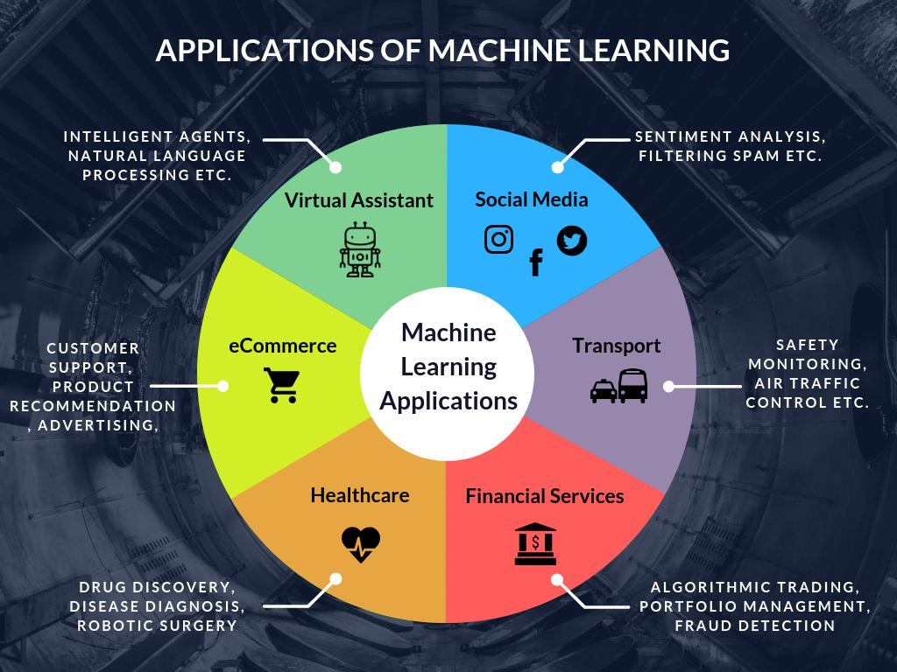

## Table of Contents

## What is machine learning and why is it important?

Machine learning is a type of artificial intelligence where computers learn from data without being specifically programmed. It's like teaching a computer to recognize patterns and make decisions on its own. For example, when you use a smartphone to unlock it with your face, machine learning helps the phone recognize your face among many others.

Machine learning is important because it helps us solve problems that are too complex for traditional computer programs. It can find patterns in huge amounts of data, like predicting the weather or suggesting what movie you might like to watch next. This technology is used in many areas, such as healthcare, where it can help doctors diagnose diseases more accurately, and in business, where it can improve how companies understand their customers.

## What are the different types of machine learning?

There are three main types of machine learning: supervised learning, unsupervised learning, and reinforcement learning. Supervised learning is like having a teacher. You give the computer examples with the right answers, and it learns to make predictions or decisions based on those examples. For instance, if you want to teach a computer to recognize dogs, you show it many pictures of dogs and tell it each time that it's a dog. The computer then learns what a dog looks like and can identify dogs in new pictures.

Unsupervised learning is different because there's no teacher. The computer looks at the data and tries to find patterns or groups on its own. Imagine you have a bunch of mixed fruits, and you want to sort them into groups. The computer might figure out that some fruits are round and others are long, grouping them without you telling it how to do so. This type of learning is useful for discovering hidden structures in data.

Reinforcement learning is like learning by trial and error. The computer, or agent, learns to make decisions by interacting with its environment. It gets rewards for good actions and penalties for bad ones, helping it figure out the best way to achieve a goal. A good example is training a robot to navigate a maze. The robot tries different paths, and when it finds the right way out, it remembers that path for next time. This type of learning is often used in games and robotics.

## How does supervised learning differ from unsupervised learning?

Supervised learning is like having a teacher. You give the computer examples and tell it the right answers. For example, if you want the computer to recognize cats, you show it many pictures of cats and say, "This is a cat." The computer learns from these examples and can then guess if a new picture has a cat in it. This type of learning is used when you know what you want the computer to learn, and you have examples to show it.

Unsupervised learning is different because there's no teacher. You just give the computer a bunch of data and let it find patterns on its own. Imagine you have a pile of mixed fruits, and you want to sort them into groups. The computer might figure out that some fruits are round and others are long, grouping them without you telling it how to do so. This type of learning is useful when you don't know what patterns are in the data, and you want the computer to discover them for you.

## What are some common algorithms used in machine learning?

In machine learning, there are many common algorithms that help computers learn from data. For supervised learning, one popular algorithm is the decision tree. It's like a flowchart where the computer asks questions about the data and makes decisions based on the answers. Another common one is the k-nearest neighbors algorithm, which looks at the data points closest to a new point to make a prediction. For example, if you want to guess someone's favorite food, you might look at the favorite foods of people who are similar to them. Linear regression is also widely used, especially for predicting numbers, like guessing how much a house might cost based on its size and location.

For unsupervised learning, clustering algorithms like k-means are often used. They group similar data points together, which can help find patterns in data without any labels. For instance, if you have a bunch of customer data, k-means can help you find groups of customers who behave similarly. Another algorithm is principal component analysis (PCA), which is used to simplify data by finding the most important features. Imagine you have a lot of information about students, like their grades, sports, and hobbies. PCA can help you focus on the most important information to understand the students better.

Reinforcement learning uses algorithms like Q-learning, where an agent learns to make decisions by trying different actions and getting rewards or penalties. It's like learning to play a game by trying different moves and seeing which ones work best. Another algorithm is the deep Q-network (DQN), which combines Q-learning with neural networks to handle more complex problems, like teaching a computer to play video games by itself.

## How do you prepare data for a machine learning model?

To prepare data for a machine learning model, you first need to collect and gather all the information you want the model to learn from. This might come from different places like databases, files, or even the internet. Once you have all the data, you need to clean it. Cleaning means fixing any mistakes or missing parts in the data. For example, if some numbers are missing or written in the wrong way, you need to correct them. This step is important because if the data is messy, the model won't learn well.

After cleaning, you need to organize the data. This means putting it into a format that the computer can understand easily. Sometimes, you might need to change the way the data is written, like turning words into numbers because computers work better with numbers. You also need to split the data into two parts: one part for training the model and another part for testing it. This helps you see if the model is learning correctly. Finally, you might need to do something called feature engineering, which is creating new pieces of information from the data you already have. For example, if you have the date someone bought something, you might create a new piece of information about what day of the week it was. This can help the model understand the data better.

## What is the role of training, validation, and test datasets?

When you're getting ready to teach a machine learning model, you need to split your data into three parts: training, validation, and test datasets. The training dataset is the biggest part, and it's used to teach the model. You show the model lots of examples, and it tries to learn from them. It's like a student studying for a test. The more examples the model sees, the better it gets at understanding the patterns in the data.

The validation dataset is used while the model is learning to check how well it's doing. It's like a practice test that helps you adjust the way the model is learning. If the model is doing well on the validation data, you know you're on the right track. But if it's not doing well, you might need to change something, like how the model is set up or what data it's using. The test dataset is used at the very end, after the model has finished learning. It's like the final exam. You use this data to see how well the model can predict new, unseen examples. This helps you know if the model will work well in the real world, not just with the data it was trained on.

## How do you evaluate the performance of a machine learning model?

To evaluate the performance of a machine learning model, you use the test dataset. This dataset contains new examples that the model hasn't seen before. You run the model on this data and compare its predictions to the actual correct answers. If the model guesses right most of the time, it's doing well. There are different ways to measure how well the model is doing. For example, you can use accuracy, which is the percentage of correct guesses. Another way is to look at precision and recall, which are useful when you're trying to find something specific in the data.

Sometimes, you need to look at more than just one number to understand how good the model is. For example, a model might be very good at predicting one type of outcome but not so good at predicting another. In these cases, you might use a confusion matrix, which shows you how the model's predictions match up with the real results. You can also use something called the F1 score, which combines precision and recall into one number. This helps you see the overall performance of the model. By looking at all these different measures, you can get a full picture of how well your machine learning model is working.

## What are overfitting and underfitting, and how can they be addressed?

Overfitting happens when a machine learning model learns too much from the training data, including the mistakes and random details. It's like memorizing the answers for a test instead of understanding the material. When you use this model on new data, it doesn't work well because it's too focused on the training data. Underfitting is the opposite problem. It happens when the model doesn't learn enough from the training data. It's like not studying enough for a test. The model is too simple and can't capture the important patterns in the data, so it doesn't work well on either the training or new data.

To address overfitting, you can use techniques like regularization, which adds a penalty for making the model too complex. Another way is to use more data for training, so the model learns the general patterns instead of the specific details. You can also simplify the model by reducing the number of features or using a less complex model. For underfitting, you can try using a more complex model that can capture more patterns in the data. You can also add more relevant features to the data or spend more time training the model. By finding the right balance, you can make sure your model works well on both the training and new data.

## What is the significance of feature selection and dimensionality reduction?

Feature selection and dimensionality reduction are important steps in preparing data for machine learning models. Feature selection means choosing which pieces of information, or features, are most important for the model to learn from. Imagine you're trying to predict if it will rain. You might have information about the temperature, humidity, wind speed, and more. But not all of these are equally important for predicting rain. By selecting the most important features, you help the model focus on what really matters, making it learn faster and work better.

Dimensionality reduction is another way to simplify the data. It's like taking a complicated puzzle and turning it into a simpler one without losing the main picture. This is useful when you have a lot of features, which can make the model slow and hard to understand. By reducing the number of features, you make the model easier to train and less likely to overfit. Techniques like Principal Component Analysis (PCA) are often used for this. Both feature selection and dimensionality reduction help make your machine learning models more efficient and effective.

## How does deep learning differ from traditional machine learning techniques?

Deep learning is a type of machine learning that uses neural networks with many layers. These layers help the computer learn very complex patterns in data. Think of it like learning to recognize a friend's face. Traditional machine learning might need you to tell the computer what to look for, like the shape of the eyes or the color of the hair. But with deep learning, the computer figures out these details by itself, just by looking at a lot of pictures. This makes deep learning really good at tasks like understanding speech, recognizing images, and even playing games.

Traditional machine learning techniques, on the other hand, often use simpler models like decision trees or linear regression. These models are easier to understand and quicker to train, but they might not be as good at handling very complex data. For example, if you want to predict how much a house will cost, traditional methods might look at things like the size of the house and the number of rooms. They work well when the patterns in the data are straightforward. Deep learning, though, can handle much more complicated patterns, but it needs a lot more data and computing power to work well.

## What are some advanced techniques in machine learning, such as ensemble methods?

Ensemble methods are advanced techniques in machine learning where you combine several models to make better predictions. It's like asking a group of friends for advice instead of just one person. By putting together the guesses from different models, you can often get a more accurate answer. One popular ensemble method is called "random forests," where you grow many decision trees and let them vote on the final prediction. Another method is "boosting," where you train models one after the other, with each new model trying to fix the mistakes of the last one. These techniques help make your predictions more reliable and less likely to be wrong.

Another advanced technique is transfer learning, which is like using what you've learned in one subject to help you in another. In machine learning, you can take a model that was trained on one task and use it to help with a different but related task. For example, a model trained to recognize objects in pictures can be tweaked to recognize different objects without starting from scratch. This saves time and resources because you don't need as much data to train the new model. Transfer learning is especially useful in areas like image and speech recognition, where the basic skills needed are similar across different tasks.

## How can machine learning models be deployed and maintained in production environments?

To deploy a machine learning model in a production environment, you first need to make sure it works well on new data. After testing and tweaking the model, you turn it into a format that can run on the computers where it will be used. This might mean putting it into a software package or a cloud service. Once it's ready, you can set it up to work automatically, like predicting what customers might buy next on a website or helping doctors with diagnoses. It's important to keep an eye on the model to make sure it's still working well and giving good results.

Maintaining a machine learning model in production means checking it regularly to see if it's still accurate. Over time, the data the model uses can change, like new trends in what people are buying or new diseases that doctors need to know about. You might need to update the model with new data or even retrain it from scratch to keep it useful. It's also important to keep the software running the model up to date and secure. By doing these things, you can make sure the model keeps helping and doesn't start making bad guesses.

## What are the key components of machine learning in algo trading?

Machine learning in algorithmic trading is a multifaceted process that involves several critical components to ensure accurate predictions and efficient trade execution. These components together form the foundation of a robust trading system utilizing machine learning technology.

1. **Data Collection:** The first step is to gather data from multiple sources, including historical market data, real-time price feeds, social media platforms, and economic reports. This data acts as the backbone for machine learning models, providing the necessary inputs to analyze market trends. Reliable data providers or APIs like Bloomberg and Thomson Reuters are often used to source this data.

2. **Data Preprocessing:** Once data is collected, it must be cleaned and organized into a suitable format for analysis. This involves handling missing values, normalizing data, and converting categorical data into numeric forms. Techniques such as normalization and encoding are essential here. For example, normalization might be performed using the formula:
$$
   x' = \frac{x - \text{min}(x)}{\text{max}(x) - \text{min}(x)}

$$

   where $x$ is the original data point, and $x'$ is the normalized value. This ensures that the data is consistent and ready for model input.

3. **Algorithm Selection:** Selecting the appropriate algorithm is crucial, as it should align with the trading objectives and data characteristics. Commonly used algorithms include decision trees, neural networks, and support vector machines (SVM). The choice of algorithm depends on factors like the size and nature of the dataset and the specific predictive tasks to be accomplished.

4. **Model Training:** Using historical data, models are trained to learn patterns that can predict future market movements. The process involves feeding the algorithm with input data and iteratively adjusting the model's parameters to minimize prediction errors. Libraries such as TensorFlow and scikit-learn in Python provide tools to handle this training process efficiently.

5. **Model Evaluation and Optimization:** To ensure the model performs well, it is backtested against historical data. Backtesting involves evaluating the model's predictions against actual data to assess its accuracy and reliability. Cross-validation techniques are often used to improve model performance and prevent overfitting. The goal is to optimize the model’s parameters for better prediction by methods like grid search or randomized search.

6. **Execution and Risk Management:** Once a model is deemed accurate, it is integrated into the trading system for live execution. Simultaneously, risk management protocols are established to protect against market volatility. This may involve setting stop-loss limits, dynamic hedging strategies, and constant monitoring of market conditions to ensure that risks are adequately managed.

These components collectively enable machine learning systems to make informed trading decisions with enhanced accuracy and efficiency, ultimately leading to a more strategic approach to algorithmic trading.

## What are the popular machine learning algorithms used in algo trading?

Several machine learning algorithms have become instrumental in enhancing the efficiency and effectiveness of algorithmic trading. These algorithms leverage historical data and statistical methods to identify patterns, make predictions, and inform trading decisions. Below are some of the most widely used machine learning algorithms in algo trading.

1. **Linear Regression**:
   Linear regression serves as a fundamental tool for predicting future asset prices based on historical data trends. It models the relationship between a dependent variable, often the price, and one or more independent variables. The basic formula for linear regression is:
$$
   y = \beta_0 + \beta_1x_1 + \beta_2x_2 + \cdots + \beta_nx_n + \epsilon

$$
   Here, $y$ represents the dependent variable, $x_1, x_2, ..., x_n$ are the independent variables, $\beta_0, \beta_1, ..., \beta_n$ are the coefficients, and $\epsilon$ is the error term. Linear regression helps traders discern price movements based on historical data, identifying trends that guide buy or sell decisions.

2. **Decision Trees**:
   Decision trees are a popular choice for making categorized decisions. They use a tree-like model of decisions, whereby each internal node represents a test on an attribute, each branch represents the outcome of the test, and each leaf node denotes a class label. This approach supports multi-variable analysis, aiding traders in decision-making processes that involve complex variable interactions. The structure simplifies the visualization of decision processes, making it easier to interpret trading patterns.

3. **Neural Networks**:
   Inspired by biological neural networks, artificial neural networks (ANNs) are used for recognizing intricate patterns in data. ANNs consist of layers of nodes, each simulating a neuron, that process and transform input data. With the ability to model non-linear relationships, neural networks are particularly advantageous in detecting and forecasting financial market trends that are not easily observable with traditional techniques. Their adaptability and learning capacity make them suitable for dynamic market conditions.

   Basic Python implementation of a [neural network](/wiki/neural-network) might utilize libraries such as TensorFlow or Keras. Here's a simple example:
   ```python
   from keras.models import Sequential
   from keras.layers import Dense

   # Define model
   model = Sequential()
   model.add(Dense(units=32, activation='relu', input_dim=10))
   model.add(Dense(units=1, activation='linear'))

   # Compile model
   model.compile(optimizer='adam', loss='mean_squared_error')

   # Fit model on data (X: input features, Y: target variable)
   model.fit(X, Y, epochs=10, batch_size=32)
   ```

4. **Support Vector Machines (SVM)**:
   SVM is a powerful algorithm for classification tasks, crucial in differentiating data points across categories. It identifies the hyperplane that best separates data points of distinct classes in a high-dimensional space. Its robustness in managing both linear and non-linear data enhances its utility in various trading scenarios where classifying market regimes is critical.

5. **Random Forests**:
   Random forests are an ensemble learning method employing multiple decision trees to improve prediction accuracy and control overfitting. By aggregating the predictions from numerous trees, random forests enhance robustness and reliability. This capability is especially beneficial in algo trading for predicting price movements based on diverse and complex market data. An additional advantage of random forests is their ability to rank the importance of different input features, providing insights into which variables drive market behavior.

Each of these algorithms plays a crucial role in the development and execution of sophisticated trading strategies, allowing traders to harness the predictive power of machine learning for improved market outcomes.

## References & Further Reading

[1]: Bergstra, J., Bardenet, R., Bengio, Y., & Kégl, B. (2011). ["Algorithms for Hyper-Parameter Optimization."](https://papers.nips.cc/paper/4443-algorithms-for-hyper-parameter-optimization) Advances in Neural Information Processing Systems 24.

[2]: ["Advances in Financial Machine Learning"](https://www.amazon.com/Advances-Financial-Machine-Learning-Marcos/dp/1119482089) by Marcos Lopez de Prado

[3]: ["Evidence-Based Technical Analysis: Applying the Scientific Method and Statistical Inference to Trading Signals"](https://www.amazon.com/Evidence-Based-Technical-Analysis-Scientific-Statistical/dp/0470008741) by David Aronson

[4]: ["Machine Learning for Algorithmic Trading"](https://github.com/stefan-jansen/machine-learning-for-trading) by Stefan Jansen

[5]: ["Quantitative Trading: How to Build Your Own Algorithmic Trading Business"](https://books.google.com/books/about/Quantitative_Trading.html?id=j70yEAAAQBAJ) by Ernest P. Chan