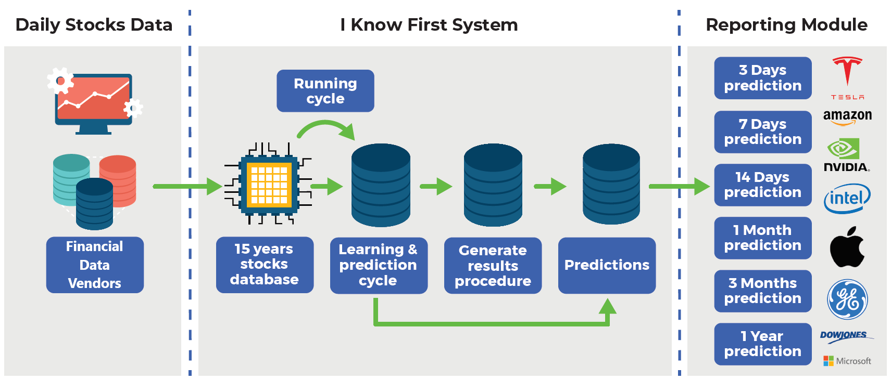

Machine learning has dramatically transformed numerous industries by automating and enhancing decision-making processes, and its integration into market forecasting and algorithmic trading is a noteworthy development. In trading, where milliseconds can determine significant profit or loss, the ability to predict market movements with enhanced accuracy is invaluable. Machine learning models, capable of analyzing vast datasets and recognizing patterns undetectable by human analysts, are increasingly central to developing trading strategies that are both predictive and data-driven.

The application of machine learning in trading encompasses a broad spectrum of techniques and workflows. This includes preprocessing financial data, engineering features that optimize predictive modeling, selecting the appropriate machine learning algorithms, and backtesting strategies to ensure their effectiveness in real-world conditions. The objective is to create models that can anticipate and respond to market changes, optimizing trading decisions to maximize returns.



Modern trading environments provide an abundance of data, ranging from price and volume data to more complex datasets such as economic indicators and sentiment analysis derived from news articles or social media. This wealth of data serves as the foundation for machine learning models that aim to uncover actionable insights. Machine learning algorithms, such as linear regression, decision trees, and more sophisticated models like deep learning, are employed to discern patterns and trends that may not be apparent through traditional analysis methods.

Effective utilization of machine learning in trading demands a comprehensive understanding of both the data and the models applied. It involves a systematic workflow that includes data collection, feature engineering, model selection, training, validation, and deployment. The end goal is to create robust trading systems that leverage machine learning to anticipate market movements and execute trades that yield higher returns than traditional strategies. As the financial markets continue to evolve, the implementation of machine learning-based strategies will play a crucial role in shaping the future of trading operations.

## Table of Contents

## Understanding Market Data

Market data is a fundamental component of algorithmic trading, acting as the lifeblood that informs decisions and strategy executions. Understanding its procurement and utilization is paramount to building robust trading algorithms.

Market data encompasses real-time and historical information on financial instruments, such as stocks, commodities, and currencies. This data is critical for identifying price trends, volatility, and [liquidity](/wiki/liquidity-risk-premium), providing the necessary context to make informed trading decisions. Traders often rely on well-established channels, such as stock exchanges and financial data providers, to source this data.

In contrast, fundamental data offers insight into a company’s intrinsic value by evaluating its financial statements, management quality, and market position. Metrics such as earnings, revenue, and profit margins form the bedrock of [fundamental analysis](/wiki/fundamental-analysis). Incorporating this data enables traders to assess the financial health and growth prospects of firms, complementing market data for a more holistic trading strategy.

Alternative data is a burgeoning field that expands the scope of analytical inputs beyond traditional financial metrics. Sources include social media sentiment, search trends, satellite imagery, and other unconventional datasets. This data can provide unique insights and a competitive edge, capturing emerging trends or anomalies that are not immediately apparent in market and fundamental data.

The synergy of market, fundamental, and [alternative data](/wiki/best-alternative-data) enriches trading strategies. Market data facilitates tactical decisions; fundamental data anchors strategic assessments; alternative data provides an additional layer of refinement and foresight.

To harness these datasets effectively, traders employ a variety of tools and resources. Financial APIs from providers like Bloomberg, Reuters, and Alpha Vantage offer programmatic access to a wealth of information. Data manipulation libraries such as pandas in Python are instrumental in cleaning and analyzing data. For example, the pandas library allows traders to easily manage datasets with commands like:

```python
import pandas as pd

# Load data into a DataFrame
data = pd.read_csv('financial_data.csv')

# Display the first few rows
print(data.head())
```

For more sophisticated data analysis, platforms like QuantConnect and Quantopian offer cloud-based environments for data sourcing and model development. These resources simplify the integration of vast datasets, enabling algorithmic traders to focus on strategy optimization rather than data wrangling.

By understanding and effectively utilizing market data, traders can craft strategies that are more predictive and resilient, leveraging the full spectrum of financial information to gain a competitive advantage in [algorithmic trading](/wiki/algorithmic-trading).

## Feature Engineering for Trading

Feature engineering is a critical phase in the creation of predictive models, particularly within the financial sector. It involves the process of extracting significant features from raw data to facilitate the development of more accurate and effective predictive models. In trading, this is integral as it helps in identifying patterns, trends, and signals that inform decision-making processes. By transforming raw market data into meaningful signals, traders can enhance their strategic approaches.

Alpha factors are one of the primary constructs in financial feature engineering. These factors are calculations or financial metrics used to predict future returns on an asset. Developing alpha factors involves researching potential predictive signals, which often requires an in-depth understanding of market behavior and the nuances of various asset classes. These factors are engineered through rigorous analysis of historical data and theoretical market models to ensure they accurately reflect market dynamics.

The engineering of alpha factors typically involves statistical analysis and [machine learning](/wiki/machine-learning) techniques to identify relevant predictors of asset price changes. This can involve calculating technical indicators such as moving averages or relative strength indices, as well as more complex derivatives of these indicators. Machine learning algorithms are applied to test and validate these factors, optimizing them to ensure robustness and relevance.

Data noise reduction is another essential aspect of feature engineering in trading. Traders often face the challenge of distinguishing between information-rich signals and market noise. To address this, methodologies such as wavelet transform and the Kalman filter are employed. Wavelet transforms decompose a signal into its constituent frequencies, which can help in removing noise by filtering out higher frequency components that may be attributed to market [volatility](/wiki/volatility-trading-strategies) or noise.

The Kalman filter, on the other hand, is a mathematical method that provides an efficient recursive means to estimate the state of a process, thereby reducing noise and enhancing signal clarity. It works by assuming the noise is normally distributed and offers a dynamic approach to filtering by predicting the next state of the observed system based on the previous state. 

```python
import numpy as np

class KalmanFilter:
    def __init__(self, process_variance, estimated_measurement_variance):
        self.process_variance = process_variance
        self.estimated_measurement_variance = estimated_measurement_variance
        self.posteri_estimate = 0.0
        self.posteri_error_estimate = 1.0

    def update(self, measurement):
        priori_estimate = self.posteri_estimate
        priori_error_estimate = self.posteri_error_estimate + self.process_variance

        blending_factor = priori_error_estimate / (priori_error_estimate + self.estimated_measurement_variance)
        self.posteri_estimate = priori_estimate + blending_factor * (measurement - priori_estimate)
        self.posteri_error_estimate = (1 - blending_factor) * priori_error_estimate

        return self.posteri_estimate

# Example usage
kf = KalmanFilter(1e-5, 0.1**2)
measurements = [1, 2, 3, 2, 1]  # Example data
filtered_data = [kf.update(measurement) for measurement in measurements]
```

The combination of using engineered alpha factors and noise reduction techniques allows traders to create robust and accurate predictive models. These techniques form the backbone of [quantitative trading](/wiki/quantitative-trading) strategies and are essential for anyone looking to leverage machine learning in algorithmic trading. By fine-tuning these elements, traders can better detect true market signals and improve their ability to anticipate market movements.

## Machine Learning Models in Trading

Machine learning has become integral to modern trading strategies due to its ability to analyze massive datasets, uncover patterns, and make predictions. Various types of machine learning models offer distinct advantages and applications in trading, each suitable for different aspects of market prediction.

Linear models, such as linear regression, are fundamental tools in trading for establishing relationships between financial variables. They are suitable for basic predictive tasks where the relationship between input and output variables is assumed to be linear. A typical linear regression model takes the form:

$$
y = \beta_0 + \beta_1x_1 + ... + \beta_nx_n + \epsilon
$$

where $y$ represents the dependent variable (e.g., stock price), $x_i$ are the independent variables, $\beta_i$ are the coefficients, and $\epsilon$ is the error term. Although straightforward, linear models are limited in capturing non-linear relationships present in financial data.

Decision trees offer a non-linear modeling approach by splitting data into branches to make predictions based on the conditions of tree nodes. These models are intuitive and interpretative, though they may suffer from overfitting. To mitigate this, ensemble methods like random forests are employed. Random forests aggregate the predictions from multiple decision trees to enhance robustness and accuracy, reducing the likelihood of overfitting. In Python, implementing a random forest can be managed using the scikit-learn library:

```python
from sklearn.ensemble import RandomForestRegressor

# Example of training a Random Forest model
model = RandomForestRegressor(n_estimators=100)
model.fit(X_train, y_train)
```

Bayesian machine learning introduces probabilistic models where predictions are expressed as probability distributions, allowing for uncertainty quantification. This is particularly valuable in trading, where market conditions are volatile. Bayesian methods can be used for time series analysis, aiding in volatility forecasting and statistical [arbitrage](/wiki/arbitrage) strategies. They incorporate prior beliefs and update them with Bayesian inference as new data becomes available, providing a dynamic trading approach.

Time series models like ARIMA (AutoRegressive Integrated Moving Average) are specialized for forecasting stock prices or indices by modeling the temporal dependencies and patterns in sequential data. Time series analysis is essential for trading strategies that rely on historical data to predict future values.

Advanced models, including [deep learning](/wiki/deep-learning) and [reinforcement learning](/wiki/reinforcement-learning), offer complex trading strategies by processing vast amounts of data and learning intricate patterns through multi-layered neural networks. Deep learning models, such as Long Short-Term Memory (LSTM) networks, are effective for time series prediction due to their ability to maintain long-term dependencies in sequence data. Reinforcement learning models, meanwhile, are designed to make decisions by learning policies through trial and error interactions within an environment, optimizing trading strategies by maximizing cumulative rewards.

The exploration of these diverse machine learning models facilitates the development of sophisticated trading strategies, enhancing their predictive capabilities and adaptability to changing market conditions.

## Backtesting and Strategy Evaluation

Backtesting is a crucial process in algorithmic trading, used to evaluate the effectiveness of a trading strategy by applying it to historical market data. By simulating trades on past data, traders can assess the viability and robustness of their strategies before deploying them in live markets, reducing potential risks and losses. Backtesting helps to identify weaknesses in a strategy and provides an opportunity to optimize it by fine-tuning parameters and logic.

The [backtesting](/wiki/backtesting) process typically involves several key steps. First, historical data must be collected and cleaned, ensuring the data set is complete and free of errors or gaps that could distort the results. This data set should closely match the data environment in which the strategy will be deployed. Next, the trading logic and rules are coded into a backtesting framework, which systematically applies these rules to the historical data. This framework tracks the performance and outcomes of each simulated trade, calculating metrics like return, risk, drawdown, and Sharpe ratio, which help to measure the strategy's performance.

An important aspect of backtesting is addressing potential biases that can lead to overfitting—a common pitfall. Overfitting occurs when a model is too closely tailored to historical data, capturing noise instead of signal, which results in poor performance on new data. Strategies should be tested across various market conditions and validated on out-of-sample data, which helps mitigate this risk. Additionally, the look-ahead bias, where future information is inadvertently used in decision-making, should be avoided. The survivorship bias, which occurs when only successful entities are considered, should also be addressed by using complete historical data, including delisted securities.

To effectively conduct backtesting, several tools and libraries have been developed to facilitate this complex process. Backtrader is a popular Python library that provides a versatile framework for strategy development, testing, and optimization. It supports multiple data feeds and offers a variety of built-in indicators and analyzers. Zipline, also a Python-based library, is another powerful option, designed to handle large datasets efficiently. It integrates well with the Quantopian research platform and provides a robust environment for algorithmic trading research.

By using these tools, traders can automate the backtesting process, enabling them to rapidly test multiple strategies and scenarios. Proper backtesting and evaluation, when performed rigorously, form the foundation for creating robust, data-driven trading strategies.

## Conclusion

Machine learning has become a powerful tool in market forecasting and algorithmic trading, providing traders and analysts with unprecedented capabilities to analyze and interpret financial data. Utilizing machine learning in this domain involves a series of steps, beginning with the acquisition and preprocessing of market data. This data serves as the foundation for building predictive models that can identify trends and potential trading opportunities. Feature engineering is then applied to extract meaningful insights and relevant indicators from the raw data, enhancing the model's ability to make accurate forecasts.

Once the data is prepared, a variety of machine learning models can be implemented. These range from simple linear models to more sophisticated algorithms such as decision trees, random forests, and deep learning architectures. Each of these models offers unique advantages and can be selected based on the specific requirements and complexity of the trading strategy. Backtesting is a critical component of this process, allowing traders to evaluate the historical performance of their strategies using past market data. By simulating trades over historical periods, traders can identify potential weaknesses and optimize their models before deploying them in live markets.

The benefits of machine learning-driven trading strategies are significant. By leveraging advanced analytics and predictive modeling, traders can gain a competitive advantage in the financial markets. Machine learning models can uncover hidden patterns and correlations that are not easily perceived through traditional analysis methods. This capability enables the development of more robust and adaptive strategies that can respond to rapidly changing market conditions. Moreover, automation and efficiency are enhanced, with machine learning systems capable of executing trades at high speeds and volumes.

To stay competitive and continue to innovate, traders and financial institutions are encouraged to explore new machine learning technologies continually. The field of machine learning is rapidly evolving, with new algorithms and techniques being developed regularly. Engaging with the latest research, tools, and methodologies is essential for refining trading strategies and maintaining an edge in the market. As more data becomes available and computational power increases, the potential for machine learning in trading will only grow, making it an indispensable component of modern financial analysis and strategy development.

## References & Further Reading

[1]: Lopez de Prado, M. (2018). ["Advances in Financial Machine Learning."](https://www.amazon.com/Advances-Financial-Machine-Learning-Marcos/dp/1119482089) Wiley.

[2]: Jansen, S. (2018). ["Machine Learning for Algorithmic Trading: Master the Basics of AI-based Trading"](https://github.com/stefan-jansen/machine-learning-for-trading) Packt Publishing.

[3]: Chan, E. P. (2008). ["Quantitative Trading: How to Build Your Own Algorithmic Trading Business."](https://github.com/egorpe/EPChan-QuantitativeTrading/blob/master/example7_6.m) Wiley.

[4]: Aronson, D. R. (2007). ["Evidence-Based Technical Analysis: Applying the Scientific Method and Statistical Inference to Trading Signals."](https://www.amazon.com/Evidence-Based-Technical-Analysis-Scientific-Statistical/dp/0470008741) Wiley.

[5]: Ni, Y., Jiang, B., Zhang, L., & Wang, J. (2019). ["Industry Classification Using Machine Learning."](https://www.nature.com/articles/s41560-020-0667-9) Quantitative Finance. 

[6]: Hull, J. C. (2020). ["Options, Futures, and Other Derivatives."](https://elibrary.pearson.de/book/99.150005/9781292410623) Pearson Education Limited.

[7]: Green, J., Hand, J. R. M., & Soliman, M. T. (2011). ["Going, Going, Gone? The Apparent Demise of the Accruals Anomaly."](https://dl.acm.org/doi/10.1287/mnsc.1110.1320) Management Science.

[8]: Tsang, A., Tan, C., & Wen, Y. (2017). ["Machine Learning in Decision Trees and Random Forests."](https://jmlr.org/papers/volume18/16-466/16-466.pdf) IEEE Xplore.