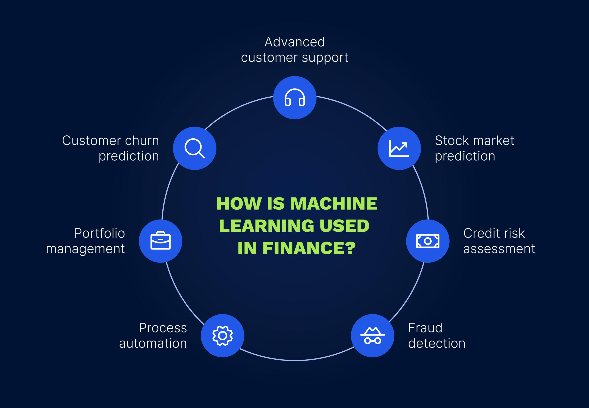

## Table of Contents

## What is machine learning and how does it apply to finance?

Machine learning is a type of artificial intelligence where computers learn from data without being specifically programmed. It's like teaching a computer to recognize patterns and make decisions based on those patterns. Imagine showing a computer lots of pictures of cats and dogs. Over time, the computer learns to tell the difference between them by recognizing features like the shape of their ears or the length of their fur.

In finance, machine learning can be really helpful. For example, banks use it to decide if someone should get a loan. They look at a person's past financial behavior, like how they've paid bills or managed credit, and machine learning helps predict if they'll pay back the loan. Also, machine learning can help in the stock market by analyzing lots of data to find patterns that might predict how stock prices will change. This can help investors make smarter choices about buying or selling stocks.

## Can you explain the basic types of machine learning used in financial applications?

In finance, there are mainly three types of machine learning used: supervised learning, unsupervised learning, and reinforcement learning. Supervised learning is like having a teacher. You show the computer lots of examples with correct answers, and it learns to make predictions or decisions based on those examples. For instance, banks use supervised learning to predict if a loan applicant will default by looking at past data of similar applicants.

Unsupervised learning is different because it's like learning without a teacher. The computer looks at data and tries to find patterns or groups on its own. In finance, this can be used for things like detecting fraud. The computer might find unusual patterns in transactions that could mean someone is doing something they shouldn't.

Reinforcement learning is like learning by trial and error. The computer tries different actions and gets rewards or penalties based on how well it does. In trading, [reinforcement learning](/wiki/reinforcement-learning) can help a computer figure out the best times to buy or sell stocks by learning from past trades and trying to maximize profits.

## How can machine learning improve financial forecasting?

Machine learning can make financial forecasting better by looking at a lot of data quickly and finding patterns that people might miss. It's like having a super smart helper who can look at past stock prices, news articles, and even social media to guess what might happen next in the market. By using all this information, [machine learning](/wiki/machine-learning) can make more accurate predictions about things like stock prices, interest rates, or how well a company might do in the future.

Also, machine learning can keep learning and getting better over time. As it sees more data and gets feedback on its predictions, it can adjust and improve its guesses. This means that the longer you use machine learning for financial forecasting, the better it can get at predicting what will happen. This can help investors and financial planners make smarter decisions and maybe even make more money.

## What are some common machine learning algorithms used in the finance industry?

In the finance industry, a few common machine learning algorithms are used because they work well with the kind of data and problems that come up in finance. One popular algorithm is the Random Forest. It's like a group of decision trees that work together to make predictions. It's good at looking at lots of different pieces of information, like a person's credit history or a company's financial reports, to decide things like if a loan should be approved or how a stock might perform. Another common one is the Support Vector Machine (SVM), which is great at figuring out which group something belongs to, like whether a transaction is normal or possibly fraud.

Another widely used algorithm is Linear Regression, which is simple but powerful. It helps predict a number, like how much a stock price might go up or down, by looking at how different factors, like interest rates or company earnings, affect it. Then there's the K-Nearest Neighbors (KNN) algorithm, which is like asking your neighbors for advice. It looks at similar past cases to predict what might happen next, which can be useful for things like predicting how a customer might behave in the future based on their past actions.

Lastly, Neural Networks are becoming more popular in finance because they can handle really complex patterns in data. They're like a brain made of math that can learn from lots of different types of information, like stock prices, news, and even pictures or voice recordings. This makes them good at things like predicting stock market trends or detecting fraud by looking at unusual patterns in transactions.

## How does machine learning help in fraud detection and prevention in financial services?

Machine learning helps in fraud detection and prevention by looking at lots of data and finding strange patterns that might mean someone is trying to do something bad. For example, if someone suddenly starts spending a lot more money than usual, or if there are transactions from places where the person has never been before, machine learning can spot these unusual things. It's like having a super smart detective who never gets tired and can look at millions of transactions to find the ones that don't seem right.

Once machine learning finds these strange patterns, it can help stop the fraud before it gets worse. For instance, if a credit card company sees a suspicious transaction, it can quickly block the card or ask the cardholder to confirm if the transaction is real. This way, machine learning not only helps catch fraud but also helps prevent it from happening in the first place. By constantly learning from new data, machine learning gets better at spotting fraud over time, making financial services safer for everyone.

## What role does machine learning play in algorithmic trading?

Machine learning plays a big role in [algorithmic trading](/wiki/algorithmic-trading) by helping computers make smart decisions about buying and selling stocks. It does this by looking at a lot of data, like past stock prices, news articles, and even social media posts, to find patterns that can predict how stock prices might change. For example, if machine learning sees that certain news usually makes a stock go up, it can use that information to decide when to buy or sell that stock. This helps traders make better choices and possibly earn more money.

Another way machine learning helps in algorithmic trading is by getting better over time. As it sees more data and learns from past trades, it can adjust its strategies to make even better predictions. This means that the longer a machine learning model is used in trading, the more accurate its predictions can become. It's like having a trading partner that never stops learning and always tries to do better, which can give traders a big advantage in the fast-moving world of the stock market.

## How can machine learning enhance credit scoring and risk assessment?

Machine learning can make credit scoring and risk assessment better by looking at a lot of information quickly and finding patterns that might be hard for people to see. For example, it can look at a person's past behavior, like how they paid bills or used credit, to guess if they will pay back a loan. It can also check things like how much money they make, where they live, and even what they do on social media. By using all this data, machine learning can give a more accurate score of how risky it is to lend money to someone.

Also, machine learning can keep learning and getting better over time. As it sees more data and learns from past decisions, it can adjust and improve its guesses. This means that the longer you use machine learning for credit scoring and risk assessment, the better it can get at predicting who will pay back their loans and who might not. This can help banks and other lenders make smarter choices about who to lend money to, which can save them money and help more people get the loans they need.

## What are the challenges of implementing machine learning in financial institutions?

One big challenge of using machine learning in financial institutions is getting enough good data. Machine learning needs a lot of data to learn from, and this data has to be correct and complete. Sometimes, the data that financial institutions have might be old, missing important details, or just plain wrong. This can make it hard for machine learning to make good predictions. Also, because financial data can be very private, there are strict rules about how it can be used and shared, which can make it even harder to get the data needed for machine learning.

Another challenge is making sure the machine learning models are fair and don't treat people unfairly. For example, if a model uses things like where someone lives or their job to make decisions, it might end up being biased against certain groups of people. This can lead to problems like not giving loans to people who deserve them just because of where they live. Financial institutions need to be very careful to check their machine learning models for bias and make sure they are treating everyone fairly.

Lastly, there's the challenge of keeping up with new technology and making sure that the people working at financial institutions know how to use it. Machine learning is always changing and getting better, so it can be hard for financial institutions to stay up to date. They need to train their employees to understand and use machine learning tools, which can take time and money. Plus, they need to make sure their computer systems can handle the heavy work that machine learning requires, which might mean spending more money on new technology.

## How is machine learning used in portfolio management and optimization?

Machine learning helps in portfolio management by looking at a lot of data to decide which investments might do well. It can look at things like stock prices, news, and even what people are saying on social media to guess how different investments will perform. By using all this information, machine learning can help portfolio managers pick the best mix of stocks, bonds, and other investments to make more money while keeping risk low. It's like having a smart helper who can look at lots of different pieces of information and find the best ways to invest.

Another way machine learning helps is by making portfolio optimization easier. It can look at past data to see how different investments have worked together and then use that information to make the portfolio better. For example, it can find the right balance between risk and reward by adjusting how much money is put into each investment. This means that the portfolio can be changed and improved over time as machine learning learns from new data and market changes. This helps portfolio managers make smarter decisions and keep their investments performing well.

## What ethical considerations should be taken into account when using machine learning in finance?

When using machine learning in finance, it's important to think about fairness. Machine learning models can sometimes treat people unfairly, like if they use things like where someone lives or their job to make decisions. This can lead to problems like not giving loans to people who deserve them just because of where they live. Financial institutions need to check their machine learning models carefully to make sure they are not being biased against certain groups of people. This means looking at the data the models use and making sure it's fair and doesn't leave anyone out.

Another ethical consideration is privacy. Financial data is very private, and there are strict rules about how it can be used and shared. Machine learning needs a lot of data to work well, but this data has to be handled carefully to protect people's privacy. Financial institutions need to make sure they are following all the rules and keeping people's information safe. This means being clear about how data is used and making sure people know what's happening with their information. By being careful about fairness and privacy, financial institutions can use machine learning in a way that's good for everyone.

## How do advanced machine learning techniques like deep learning and reinforcement learning impact finance?

Deep learning, which is a type of machine learning that uses big networks called neural networks, is making a big difference in finance. It's like having a brain made of math that can learn from lots of different types of information, like stock prices, news, and even pictures or voice recordings. This makes it really good at things like predicting stock market trends or detecting fraud by looking at unusual patterns in transactions. Because [deep learning](/wiki/deep-learning) can handle really complex patterns, it can find things that other methods might miss, which can help financial institutions make better decisions and keep their customers' money safe.

Reinforcement learning is another advanced technique that's changing finance. It's like learning by playing a game where the computer tries different actions and gets rewards or penalties based on how well it does. In trading, reinforcement learning can help a computer figure out the best times to buy or sell stocks by learning from past trades and trying to maximize profits. This can give traders a big advantage because the computer can keep learning and getting better over time, which means it can make smarter and smarter decisions as it sees more data. By using these advanced techniques, financial institutions can do a better job at things like managing investments and preventing fraud.

## What future trends can we expect in the integration of machine learning with financial services?

In the future, we can expect machine learning to become even more important in financial services. One big trend will be the use of more advanced machine learning techniques like deep learning and reinforcement learning. These techniques can handle really complex data and make smarter decisions. For example, deep learning could help predict stock market trends by looking at lots of different types of information, like news articles and social media posts. Reinforcement learning could help traders make better decisions by learning from past trades and trying to make more money. As these techniques get better and easier to use, more and more financial institutions will start using them to make their services better and safer.

Another trend will be the use of machine learning to make financial services more personalized. This means that machine learning will help banks and other financial institutions understand each customer better and offer them services that fit their needs. For example, machine learning could look at a person's spending habits and suggest the best type of savings account or investment for them. It could also help people manage their money better by giving them personalized advice and tips. As machine learning gets better at understanding people, it will help make financial services more user-friendly and helpful for everyone.

## References & Further Reading

[1]: ["Algorithmic Trading: Winning Strategies and Their Rationale"](https://www.amazon.com/Algorithmic-Trading-Winning-Strategies-Rationale/dp/1118460146) by Ernest P. Chan (Wiley, 2008).

[2]: ["Advances in Financial Machine Learning"](https://www.amazon.com/Advances-Financial-Machine-Learning-Marcos/dp/1119482089) by Marcos López de Prado (Wiley, 2018).

[3]: ["Machine Learning for Asset Managers"](https://github.com/emoen/Machine-Learning-for-Asset-Managers) by Marcos López de Prado (Cambridge University Press, 2020).

[4]: ["Quantitative Trading: How to Build Your Own Algorithmic Trading Business"](https://www.amazon.com/Quantitative-Trading-Build-Algorithmic-Business/dp/1119800064) by Ernie Chan (Wiley, 2008).

[5]: ["Machine Learning in Finance: From Theory to Practice"](https://www.amazon.com/Machine-Learning-Finance-Theory-Practice/dp/3030410676) by Matthew F. Dixon, Igor Halperin, and Paul Bilokon (Springer, 2020).

[6]: ["Hands-On Machine Learning for Algorithmic Trading"](https://github.com/PacktPublishing/Hands-On-Machine-Learning-for-Algorithmic-Trading) by Stefan Jansen (Packt Publishing, 2018).

[7]: ["Artificial Intelligence and Machine Learning for Business"](https://www.amazon.com/Artificial-Intelligence-Machine-Learning-Business/dp/1999730348) by Scott Chesterton (Independently published, 2020).

[8]: ["Data Science for Algorithmic Trading"](https://admarkon.medium.com/data-science-techniques-in-algorithmic-trading-an-in-depth-analysis-eb54392506ca) by Prateek Joshi (Packt Publishing, 2019).

[9]: ["Python for Algorithmic Trading: From Idea to Cloud Deployment"](https://www.amazon.com/Python-Algorithmic-Trading-Cloud-Deployment/dp/149205335X) by Yves Hilpisch (O'Reilly Media, 2020).

[10]: ["The Handbook of Financial Data and Risk Information"](https://www.cambridge.org/core/books/handbook-of-financial-data-and-risk-information-i/36C1740A30FB4A608742E4211362508C/listing) by Margarita S. Brose, Mark E. Broadie, Paul Embrechts (Cambridge University Press, 2013).