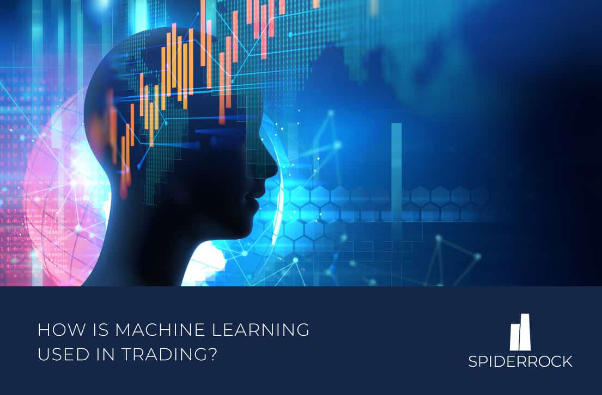

In the modern financial landscape, machine learning (ML) has emerged as a transformative force, particularly in algorithmic trading, commonly known as algo trading. As financial markets have evolved with increasing complexity, the demand for automated trading solutions has surged. ML offers a suite of sophisticated tools and techniques that address this need by automating the analysis of vast datasets, identifying patterns, and executing trades with minimal human intervention. This article explores the significance and application of ML in trading, highlighting its profound impact on the investment industry.

Machine learning enhances trading strategies by providing models that not only process large volumes of financial data but also predict market movements and identify lucrative trading opportunities. Unlike traditional trading methods, ML-based strategies leverage historical data, uncovering trends that may not be immediately visible through conventional analysis. Such capabilities offer traders a competitive edge in a fast-paced financial environment, where timely and accurate decision-making is crucial for success.



Despite these advantages, the implementation of ML-based trading systems is not without challenges and risks. Developing models that are robust and capable of generalization across various market conditions is a significant hurdle. Traders and developers must navigate issues such as data quality, model overfitting, and regulatory constraints. These factors necessitate a delicate balance between harnessing ML's potential and managing the inherent uncertainties of financial markets.

In summary, machine learning is revolutionizing algorithmic trading by enabling more informed and automated decision-making. While presenting new opportunities, it also requires traders to remain vigilant and adaptive to the complexities of these advanced systems.

## Table of Contents

## Understanding Algorithmic Trading

Algorithmic trading is a sophisticated method of executing orders in financial markets through pre-defined, computer-based algorithms. These algorithms utilize complex mathematical models to optimize trade orders based on multiple parameters, ensuring that large volumes of data are processed swiftly, trades are executed at opportune prices, and associated risks are managed effectively.

Central to the efficiency of algorithmic trading is its capability to handle vast data sets. Algorithms can assimilate and analyze historical and real-time market data, enabling the execution of trades in fractions of a second, far surpassing human capabilities. By leveraging these computational efficiencies, traders can operate on narrow margins and execute strategies with high precision.

Machine learning plays a pivotal role in augmenting traditional [algorithmic trading](/wiki/algorithmic-trading) systems. Through its predictive modeling capabilities, ML enables algorithms to forecast price movements and identify trading opportunities by recognizing patterns in historical data. For instance, an ML model might detect trends in stock movements that align with past occurrences, suggesting an opportune time to buy or sell.

The process of algorithmic trading typically involves three fundamental components: data sourcing, model training, and strategy execution. 

1. **Data Sourcing**: This is the foundation of any algorithmic trading strategy as the quality and extent of data direct the development of effective models. Data is gathered from various sources, including historical price data, volume, economic indicators, and sometimes unconventional data such as social media sentiment.

2. **Model Training**: Once data is collected, it is used to train machine learning models. Training involves the use of algorithms to learn patterns from the data, and consequently, make predictions. Various ML algorithms can be employed, such as regression models for price prediction or classification models for buy/sell signals. The models are calibrated to minimize prediction errors while avoiding overfitting, which ensures they generalize well to new, unseen data.

3. **Strategy Execution**: After the model identifies a potential trading opportunity, the strategy execution phase automates trades. This involves converting model outputs into actionable trade signals, which are then executed by interfacing with the market. Speed and accuracy are crucial, as markets can move rapidly, and a delay of even a few milliseconds can impact profitability.

By integrating [machine learning](/wiki/machine-learning) with algorithmic trading, financial market participants can develop adaptive strategies that dynamically respond to market conditions. This synergy enables traders not only to optimize existing strategies but also to innovate new ones, providing a substantial competitive edge in a continuously evolving market landscape.

## Role of Machine Learning in Trading

Machine learning (ML) plays a pivotal role in enhancing trading strategies by analyzing complex datasets to detect patterns and predict market trends with greater accuracy than traditional methods. These algorithms utilize a variety of supervised and unsupervised learning techniques, enabling them to adapt to diverse trading scenarios.

Supervised learning techniques, such as regression analysis and decision trees, allow ML models to build predictive capabilities by learning from historical data. For instance, linear regression can model the relationship between input variables, such as economic indicators, and the financial instrument's price, facilitating future price prediction. Decision trees enhance this by segmenting the data into smaller subsets based on the most impactful features, creating easily interpretable models that can guide trading decisions.

Unsupervised learning algorithms, like clustering and principal component analysis (PCA), help identify inherent structures within datasets without predefined labels. Clustering techniques, such as k-means, group similar data points, aiding in the discovery of market segments or periods with distinct [volatility](/wiki/volatility-trading-strategies) patterns. PCA reduces the dimensionality of data, extracting key features that impact market movements, thus optimizing the input for other predictive models.

Practical applications of ML in trading are varied and impactful. In risk assessment, ML techniques analyze historical price movements and external factors to predict potential market risks, enhancing portfolio resilience. Sentiment analysis, involving natural language processing (NLP), provides insights into market sentiment by analyzing news articles, social media, and other unstructured data sources, allowing traders to gauge investor sentiment's impact on prices. For portfolio optimization, ML algorithms, such as [reinforcement learning](/wiki/reinforcement-learning), dynamically adjust asset allocations based on changing market conditions to maximize returns or minimize risks.

ML models are adept at adapting to changing market conditions, ensuring trading strategies remain relevant over time. By utilizing techniques like continuous learning and model retraining, these models incorporate new data, adapt to new trends, and refine predictions. This adaptability is crucial in fast-paced financial markets, where conditions can shift rapidly due to various factors, including geopolitical events or sudden economic announcements.

In Python, the implementation of these techniques is facilitated by libraries such as scikit-learn and TensorFlow. For example, using scikit-learn, a trader can implement a simple linear regression model to predict stock prices:

```python
from sklearn.linear_model import LinearRegression
import numpy as np

# Example dataset: Features (e.g., economic indicators), Target (Stock prices)
X = np.array([[1, 3], [2, 5], [3, 7]])
y = np.array([10, 20, 30])

# Initialize and train the model
model = LinearRegression().fit(X, y)

# Predict future stock prices
prediction = model.predict(np.array([[4, 9]]))
print("Predicted stock price:", prediction)
```

Such implementations underscore the power of ML in transforming trading strategies, making them more robust, adaptive, and effective in generating desirable outcomes.

## Key Machine Learning Techniques

Machine learning techniques have become integral to algorithmic trading, offering the ability to process vast amounts of data and extract actionable insights. Among the most commonly used techniques are regression models, decision trees, and neural networks.

Regression models are foundational in machine learning and are widely used for their simplicity and interpretability. They are suited for predicting continuous outcomes, crucial for constructing pricing models and assessing risk. Linear regression, in particular, fits a linear relationship between independent and dependent variables, making it apt for scenarios where such relations exist. However, its simplicity can be a limitation in capturing complex market dynamics. For deeper insights, techniques like polynomial regression or regularization methods, such as Lasso and Ridge, can be applied to prevent overfitting and improve predictive accuracy.

Decision trees offer a hierarchical approach to decision-making and are particularly useful for classification tasks. They segment data based on feature value criteria, enabling the identification of patterns within market data. Their transparency makes them attractive, but they can be prone to overfitting. Ensemble methods like Random Forests or Gradient Boosting Machines (GBMs) enhance decision tree performance by combining multiple trees to reduce variance and improve prediction stability.

Neural networks, especially [deep learning](/wiki/deep-learning) models, have revolutionized trading algorithms. Convolutional neural networks (CNNs) are adept at extracting features from grid-like data structures, though their use in trading is less common compared to image processing. Recurrent neural networks (RNNs), and particularly Long Short-Term Memory (LSTM) networks, are highly effective in processing sequential data, making them ideal for time series prediction like stock prices. These models can capture temporal dependencies and offer insights into future market movements.

Furthermore, reinforcement learning (RL) is gaining traction in developing intelligent trading [agents](/wiki/agents). Unlike supervised learning, RL employs a reward-based system to train agents to make decisions. This technique allows the creation of autonomous trading systems that can adapt to market changes by continuously learning from interactions with the environment. A popular algorithm in this domain is Q-learning, which facilitates the agent's understanding of optimal actions to maximize cumulative rewards.

These machine learning techniques each have their strengths and limitations, making them suitable for different trading scenarios. The selection of an appropriate model depends on the nature of the data and the specific trading strategy employed.

## Challenges in Machine Learning-Based Trading

Machine learning (ML) has revolutionized algorithmic trading by offering advanced predictive models and automation capabilities. However, it also presents several challenges, particularly related to data quality and model overfitting. Data quality is paramount, as trading models rely on vast datasets to make informed decisions. Inaccurate or incomplete data can lead to erroneous predictions and suboptimal trading strategies. Ensuring data integrity involves continuous monitoring and validation processes to mitigate the risk of using flawed datasets.

Model overfitting is another significant challenge in ML-based trading. Overfitting occurs when a model performs exceptionally well on historical data but fails to generalize to new, unseen data. This is often due to the model capturing noise rather than the underlying market signal. To combat overfitting, traders should use techniques such as cross-validation, regularization, and pruning in their model development process. Additionally, employing ensemble methods like random forests or boosting can enhance model robustness by combining the strengths of multiple models.

Traders must ensure that their models are robust and capable of adapting to different market conditions. This adaptability requires models to continuously learn and update themselves in response to new data. One practical approach is implementing online learning algorithms, which incrementally update the model as new data becomes available. However, the reliance on historical data presents risks, as past market conditions may not always reflect future scenarios. It is essential to incorporate forward-looking indicators and [alternative data](/wiki/best-alternative-data) sources to account for shifts in market dynamics.

Regulatory and ethical considerations also play a crucial role in ML-based trading. Regulators increasingly scrutinize algorithmic trading systems to ensure transparency and prevent market manipulation. Traders must comply with regulations such as the Market Abuse Regulation (MAR) in Europe and the Security Exchange Commission (SEC) guidelines in the United States. Ethical considerations include addressing potential biases in datasets and ensuring fairness in algorithmic decisions. Transparency in how ML models operate is vital for maintaining trust and accountability in automated trading systems.

In summary, while ML offers transformative potential in trading, addressing challenges related to data quality, overfitting, and ethical considerations is essential for sustainable success. Traders must focus on developing robust models that not only perform well historically but are also adaptable to future market conditions and compliant with regulatory standards.

## Future Trends in ML for Trading

The evolution of machine learning (ML) in trading is anticipated to be significantly shaped by emerging technologies such as quantum computing and sophisticated [artificial intelligence](/wiki/ai-artificial-intelligence) (AI) systems. Quantum computing, with its potential to solve complex problems at unprecedented speeds, could revolutionize data analysis and computation in trading. The ability of quantum computers to process vast amounts of data rapidly might enhance the performance of trading algorithms, enabling more efficient market predictions and strategy development. Consequently, traders could leverage quantum-enhanced ML models to gain deeper insights into market behaviors and execute trades with improved precision and speed.

AI's capability to synthesize large datasets and provide personalized insights is driving a trend toward more individualized trading strategies. Advanced AI systems, adept at discerning granular patterns within extensive data, facilitate the development of bespoke trading strategies tailored to specific investor profiles and market conditions. This personalization is not only about optimizing strategy performance but also involves adapting trading approaches to the unique risk appetites and objectives of individual traders. Such tailored strategies can lead to improved returns and reduced risks, providing a competitive edge in the trading domain.

The integration of alternative data sources is becoming increasingly vital in algorithmic trading. Traditional financial data is now complemented by alternative data like social media sentiment, satellite imagery, and online behavior analytics. These data types provide a more holistic view of market dynamics and can be crucial in predicting market movements that conventional datasets might miss. For instance, social media sentiment analysis can reveal public opinion trends that might precede market shifts, while satellite imagery can be used to assess economic activity levels in real-time.

To prepare for these advancements, traders and financial institutions must invest in the infrastructure and talent necessary to harness these technologies effectively. This includes acquiring expertise in quantum computing and AI, developing robust data pipelines for alternative data processing, and continuously updating ML models. Furthermore, as technology evolves, so too will the regulatory and ethical landscapes, necessitating a proactive approach to compliance and ethical considerations in ML-driven trading solutions.

In summary, the future of ML in trading is set to be transformative, with quantum computing and AI paving the way for innovative strategies and enhanced market insights. By embracing these technologies and adapting to new data paradigms, traders can remain competitive in an increasingly sophisticated financial environment.

## Conclusion

Machine learning (ML) continues to revolutionize algorithmic trading by providing more informed insights and automated decision-making capabilities. As financial markets become increasingly data-driven, ML techniques allow traders to process and analyze vast amounts of data more efficiently than traditional methods, identifying patterns and trends that might otherwise be overlooked. This enhanced data analysis enables traders to develop strategies that are not only more sophisticated but also more responsive to market changes.

Traders leveraging ML can gain a competitive advantage through improved prediction accuracy and the ability to execute trades at optimal times. However, the implementation of ML in trading is not without challenges. Navigating the complexities of model selection, data sourcing, and system integration requires a deep understanding of both machine learning algorithms and market dynamics. Furthermore, the limitations inherent in these advanced systems, such as overfitting and data quality issues, must be carefully managed to ensure robust strategy performance.

The key to success in ML-driven trading lies in continuously adapting strategies to reflect the latest market trends and technological advancements. This includes regularly updating datasets, refining models, and incorporating new data sources. Staying informed on the latest developments in machine learning and artificial intelligence is crucial for maintaining a competitive edge. As technology evolves, traders must remain agile, ready to integrate innovations such as quantum computing and more sophisticated AI systems into their strategies.

Ultimately, the integration of ML in trading strategies holds the promise of greater efficiency, accuracy, and profitability. By automating the decision-making process and enhancing the ability to anticipate market movements, ML not only empowers traders to optimize their strategies but also elevates the overall efficacy of algorithmic trading. As the landscape of financial markets continues to evolve, those who adeptly harness the power of machine learning will likely be best positioned to capitalize on future opportunities.

## References & Further Reading

[1]: ["Machine Learning in Finance: From Theory to Practice"](https://link.springer.com/book/10.1007/978-3-030-41068-1) by Matthew F. Dixon, Igor Halperin, and Paul Bilokon

[2]: ["Advances in Financial Machine Learning"](https://www.amazon.com/Advances-Financial-Machine-Learning-Marcos/dp/1119482089) by Marcos Lopez de Prado

[3]: Chan, E. P. (2009). ["Quantitative Trading: How to Build Your Own Algorithmic Trading Business"](https://github.com/ftvision/quant_trading_echan_book). John Wiley & Sons, Inc.

[4]: ["Hands-On Machine Learning for Algorithmic Trading: Design and implement your own trading strategies using cutting-edge machine learning techniques and Python"](https://www.amazon.com/Hands-Machine-Learning-Algorithmic-Trading/dp/1839217715) by Stefan Jansen

[5]: ["Artificial Intelligence in Asset Management"](https://www.cfainstitute.org/sites/default/files/-/media/documents/book/rf-lit-review/2020/rflr-artificial-intelligence-in-asset-management.pdf) by Claus Pedersen

[6]: Bustos, O., & Pomares-Quimbaya, A. (2017). ["Stock Market Movement Forecast: A Systematic Review."](https://www.sciencedirect.com/science/article/pii/S0957417420302888) Expert Systems with Applications.

[7]: Amrouni, M., Bouri, A., & Kraus, P. (2021). ["A comprehensive review of machine learning in finance: a review of eight years of datified research."](https://link.springer.com/article/10.1007/s00191-020-00670-7) Journal of Economic Behavior & Organization.