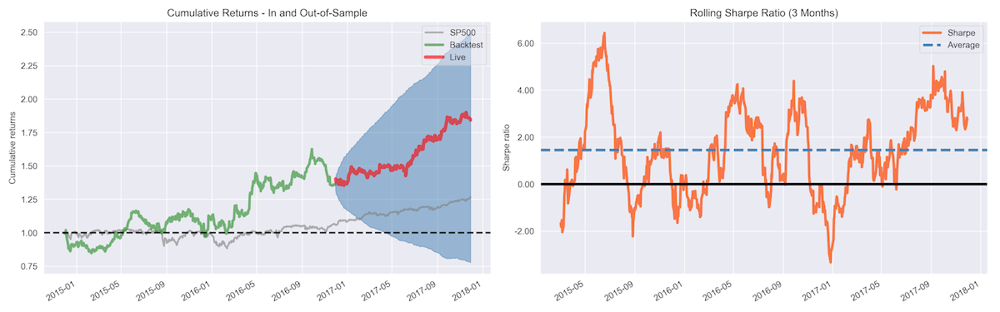

## Table of Contents

## What is machine learning and how does it apply to trading?

Machine learning is a type of artificial intelligence where computers learn from data without being specifically programmed to do so. It's like teaching a computer to recognize patterns and make decisions based on what it has learned. Imagine showing a child different pictures of animals and teaching them to recognize a cat; machine learning works in a similar way, but with lots of data and complex algorithms.

In trading, machine learning can be very useful. Traders use it to analyze large amounts of market data, like stock prices and trading volumes, to find patterns that might predict future price movements. For example, a machine learning model might learn that certain news events tend to cause stock prices to go up or down. Traders can then use these insights to make better decisions about when to buy or sell stocks. This can help them make more profitable trades and manage risks better.

## Can you explain the basic types of machine learning used in trading?

In trading, there are mainly three types of machine learning that traders use: supervised learning, unsupervised learning, and reinforcement learning. Supervised learning is like having a teacher. You give the computer lots of examples of past trades, along with what happened next, and it learns to predict future outcomes based on those examples. For instance, if the computer sees that a stock usually goes up after a certain kind of news, it can use that to help make trading decisions.

Unsupervised learning is more like letting the computer explore on its own. It looks at the data without any specific instructions and tries to find patterns or groups within it. This can be useful for finding hidden trends in the market that traders might not have noticed before. For example, it might group stocks that move similarly together, helping traders understand market dynamics better.

Reinforcement learning is like training a pet. The computer learns by doing, getting rewards for good actions and penalties for bad ones. In trading, this means the computer tries different strategies and learns which ones work best over time. It's like a trader practicing and getting better at making decisions based on what works and what doesn't. This can help improve trading strategies continuously as the market changes.

## How can machine learning help in predicting stock prices?

Machine learning can help predict stock prices by looking at a lot of past data and finding patterns. Imagine you're trying to guess what will happen to a stock price tomorrow. You can use [machine learning](/wiki/machine-learning) to look at what happened to stock prices in the past when similar things were happening, like certain news events or changes in the economy. The computer can learn from this and make a guess about what might happen next.

This kind of prediction isn't perfect, but it can be really helpful. Traders use machine learning models to see if they can spot trends or signals that suggest a stock price might go up or down. By using these predictions, traders can make smarter decisions about when to buy or sell stocks, which can lead to better trading results. It's like having a smart friend who's really good at spotting patterns and giving you advice based on what they've seen before.

## What are some common machine learning algorithms used in trading?

In trading, people use different machine learning algorithms to help them make better decisions. One common algorithm is called linear regression. It's like drawing a straight line through a bunch of data points to see if there's a pattern. Traders use this to see how stock prices might change based on things like the economy or company news. Another popular one is decision trees. This is like a flowchart where the computer asks a series of yes or no questions about the data to make predictions. It's useful for figuring out what might happen to a stock price based on different factors.

Another algorithm that traders like is called k-nearest neighbors (KNN). It's like looking at a group of friends to see what they're doing and then guessing what you might do next. In trading, KNN looks at similar past situations to predict what might happen to a stock price. Then there's support vector machines (SVM), which are good at finding the best way to separate different groups of data. Traders use SVM to predict if a stock price will go up or down based on past patterns. All these algorithms help traders by giving them a better idea of what might happen in the market, even though no prediction is perfect.

## How do traders use machine learning for risk management?

Traders use machine learning to manage risk by looking at a lot of data to understand what might go wrong. They use algorithms to predict how likely it is that a stock will lose value or how much money they might lose if things don't go as planned. This helps them decide how much to invest and when to sell to avoid big losses. For example, if a machine learning model sees that a stock usually goes down after a certain event, the trader can use that information to set limits on how much they're willing to lose.

Another way traders use machine learning for risk management is by figuring out how to spread their investments across different stocks or markets. This is called diversification. Machine learning can help them find the best way to do this by looking at how different investments move together. If one investment goes down, another might go up, and this can help reduce the overall risk. By using these insights, traders can make smarter choices about where to put their money and how to protect it from big drops in the market.

## What data sources are typically used in machine learning models for trading?

Traders use a lot of different data sources to help their machine learning models make good predictions. They look at stock prices and trading volumes, which show how much people are buying and selling. They also use financial reports from companies, like how much money they made or spent. News articles and social media posts are important too because they can affect how people feel about a stock. Economic indicators, like unemployment rates or inflation, also help because they show what's happening in the bigger picture of the economy.

Sometimes, traders even use data that might not seem related to trading at first. For example, they might look at weather reports because bad weather can affect companies that rely on good weather to make money. Satellite images can show how busy a place is, which can be useful for predicting how well a business is doing. All this data helps the machine learning models learn patterns and make better guesses about what might happen to stock prices in the future.

## How can machine learning improve trading strategies?

Machine learning can make trading strategies better by finding patterns in lots of data that people might miss. It's like having a smart friend who looks at all the numbers and news to help you decide when to buy or sell stocks. For example, a machine learning model can look at past stock prices and see that they usually go up after a certain type of news. Traders can use this information to make smarter choices and maybe make more money. It also helps traders see how different things, like the economy or company news, affect stock prices, so they can adjust their strategies to fit what's happening in the market.

Another way machine learning helps is by making trading strategies more flexible. The market changes all the time, and what worked last year might not work this year. Machine learning models can keep learning from new data and adjust the trading strategy to keep up with these changes. This means traders can keep improving their strategies without having to start from scratch every time something new happens. It's like having a tool that gets smarter over time, helping traders stay ahead of the game.

## What are the challenges of implementing machine learning in trading environments?

One big challenge of using machine learning in trading is getting good data. Traders need a lot of information to train their models, but the data has to be clean and reliable. Sometimes, the data can be messy or missing important pieces, which makes it hard for the machine learning models to learn the right things. Also, the market changes all the time, so the data that was good last month might not be useful today. This means traders have to keep updating their data, which can be a lot of work.

Another challenge is making sure the machine learning models don't make mistakes. These models are good at finding patterns, but sometimes they can find patterns that aren't really there. This is called overfitting, and it can lead to bad trading decisions. Traders have to be careful to test their models a lot to make sure they're working right. It's also hard to explain why a machine learning model made a certain decision, which can be a problem if traders need to understand why a trade went wrong.

Lastly, there's the issue of speed and cost. Trading happens very fast, and machine learning models need to keep up. This means traders need powerful computers and good software, which can be expensive. Also, setting up and running these models takes time and expertise. Not everyone has the skills or the money to do it well, so it can be a big challenge for some traders.

## How does machine learning handle high-frequency trading?

Machine learning helps with high-frequency trading by making quick decisions based on a lot of data. In high-frequency trading, computers buy and sell stocks very fast, sometimes in just a few seconds. Machine learning models can look at things like stock prices, trading volumes, and even news to find patterns that can help them decide when to trade. These models need to be really fast because the market changes so quickly, and they have to make decisions before the chance to make money is gone.

One challenge with using machine learning in high-frequency trading is making sure the models can keep up with the speed of the market. Traders need powerful computers and good software to run these models quickly. Also, the models have to be careful not to make mistakes, because even a small error can lead to big losses when trading happens so fast. Despite these challenges, machine learning can be a big help in high-frequency trading by finding patterns and making smart decisions quickly.

## What are the ethical considerations of using machine learning in trading?

Using machine learning in trading brings up some important ethical questions. One big concern is fairness. If only a few traders can use fancy machine learning models, it might not be fair to others who can't afford the same technology. This could make the market less equal, with some people having a big advantage over others. Also, machine learning models can sometimes make mistakes or find patterns that aren't really there. If these mistakes lead to big losses for people, it raises questions about who should be responsible for those losses.

Another ethical issue is transparency. Machine learning models can be hard to understand, even for the people who use them. This makes it tough to explain why a certain trade was made, which can be a problem if things go wrong. Traders and companies need to be open about how they use machine learning so that everyone can trust the market. Also, there's the issue of privacy. Machine learning models often use a lot of data, including personal information from social media or other sources. It's important to make sure this data is used in a way that respects people's privacy and follows the rules.

## How can one evaluate the performance of a machine learning model in trading?

To evaluate how well a machine learning model is doing in trading, traders look at a few key things. One important measure is the model's accuracy, which means how often it gets its predictions right. Traders also look at the model's profitability, or how much money it makes. They compare the model's performance to what would happen if they just bought and held stocks, or if they used a simpler trading strategy. Another thing to check is how much risk the model takes. Traders want to know if the model is making big bets that could lead to big losses, or if it's being careful and managing risk well.

Another way to evaluate a machine learning model is by using [backtesting](/wiki/backtesting). This means running the model on old data to see how it would have done in the past. It's like a practice run to see if the model could have made good trading decisions before. Traders also look at things like the model's stability, which means checking if it keeps working well even when the market changes. They might use different sets of data to test the model and make sure it's not just getting lucky with one set of numbers. By looking at all these things, traders can get a good idea of how well their machine learning model is performing and whether it's helping them make better trades.

## What advanced techniques are being researched to further enhance machine learning in trading?

Researchers are working on some cool new ways to make machine learning even better for trading. One of these is called [deep learning](/wiki/deep-learning). It's like a super smart version of regular machine learning that can understand really complicated patterns in data. Deep learning can look at things like stock prices and news articles and figure out how they might affect the market. It's like having a really smart friend who can see things that normal people might miss. Another thing researchers are looking at is using something called natural language processing (NLP). This helps computers understand and use human language, so they can read news articles and social media posts to find out what people are thinking about stocks. This can give traders a better idea of what might happen next in the market.

Another advanced technique is called ensemble learning. This is when you use a bunch of different machine learning models together to make better predictions. It's like getting advice from a whole team of experts instead of just one person. By combining the strengths of different models, traders can get more accurate predictions and make smarter trading decisions. Researchers are also looking into [reinforcement learning](/wiki/reinforcement-learning), which is like training a pet. The computer tries different trading strategies and learns from its mistakes, getting better over time. These new techniques are helping to make machine learning in trading even more powerful and useful.

## References & Further Reading

[1]: ["Machine Learning in Finance: From Theory to Practice"](https://link.springer.com/book/10.1007/978-3-030-41068-1) by Matthew F. Dixon, Igor Halperin, and Paul Bilokon

[2]: ["Advances in Financial Machine Learning"](https://www.amazon.com/Advances-Financial-Machine-Learning-Marcos/dp/1119482089) by Marcos Lopez de Prado

[3]: Chan, E. P. (2009). ["Quantitative Trading: How to Build Your Own Algorithmic Trading Business"](https://github.com/ftvision/quant_trading_echan_book). John Wiley & Sons, Inc.

[4]: ["Hands-On Machine Learning for Algorithmic Trading: Design and implement your own trading strategies using cutting-edge machine learning techniques and Python"](https://www.amazon.com/Hands-Machine-Learning-Algorithmic-Trading/dp/1839217715) by Stefan Jansen

[5]: ["Artificial Intelligence in Asset Management"](https://www.cfainstitute.org/sites/default/files/-/media/documents/book/rf-lit-review/2020/rflr-artificial-intelligence-in-asset-management.pdf) by Claus Pedersen

[6]: Bustos, O., & Pomares-Quimbaya, A. (2017). ["Stock Market Movement Forecast: A Systematic Review."](https://www.sciencedirect.com/science/article/pii/S0957417420302888) Expert Systems with Applications.

[7]: Amrouni, M., Bouri, A., & Kraus, P. (2021). ["A comprehensive review of machine learning in finance: a review of eight years of datified research."](https://link.springer.com/article/10.1007/s00191-020-00670-7) Journal of Economic Behavior & Organization.