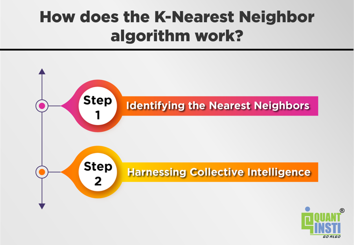

## Table of Contents

## What is the K-Nearest Neighbors (KNN) algorithm?

The K-Nearest Neighbors (KNN) algorithm is a simple way to classify things or make predictions based on how similar they are to other things. Imagine you have a bunch of different fruits, and you want to know if a new fruit is an apple or an orange. You look at the fruits that are most similar to the new one. If most of those similar fruits are apples, then you guess that the new fruit is probably an apple too. The 'K' in KNN stands for the number of similar items you look at to make your guess.

KNN works by measuring the distance between the new item and all the other items you already know about. Common ways to measure this distance include looking at how far apart they are in a straight line or using more complex formulas. Once you find the K closest items, you see what group they belong to and use that to decide what group the new item should be in. KNN is easy to understand and use, but it can be slow if you have a lot of items to compare, and choosing the right number for K can be tricky.

## How does the KNN algorithm work?

The K-Nearest Neighbors (KNN) algorithm works by looking at how similar a new item is to other items you already know about. Imagine you have a new fruit and you want to know if it's an apple or an orange. You compare this new fruit to all the fruits you've seen before. You measure how close each fruit is to the new one using something like a straight line distance or another way to see how similar they are. The 'K' in KNN is a number you pick, and it tells you how many of the closest fruits you should look at.

Once you find the K closest fruits, you check what kind of fruits they are. If most of these closest fruits are apples, then you guess that the new fruit is probably an apple too. If most are oranges, you guess it's an orange. It's like taking a vote among the closest neighbors. The KNN algorithm is simple to use, but it can be slow if you have a lot of fruits to compare, and [picking](/wiki/asset-class-picking) the right number for K can be a bit tricky.

## What are the key components of the KNN algorithm?

The KNN algorithm has a few main parts that make it work. First, you need a way to measure how close or similar things are to each other. This is called a distance metric. Common ones are like measuring the straight line distance between points, but there are other ways too. You also need to decide on the number K, which is how many of the closest items you will look at to make your decision. Picking the right K is important because it can change your results.

The second part is the actual process of using KNN. When you get a new item, you compare it to all the other items you already know about. You find the K items that are closest to the new one using your distance metric. Then, you look at what group these K closest items belong to. If most of them are in one group, you guess that the new item probably belongs to that group too. It's like taking a vote among the closest neighbors. This method is easy to understand and use, but it can be slow if you have a lot of items to compare.

## How do you choose the value of K in KNN?

Choosing the right value of K in the KNN algorithm is important because it can change your results. If K is too small, like 1, your guess might be wrong because it's based on just one neighbor. This can make your results jump around a lot. If K is too big, your guess might be too general and not pay attention to the special details of the new item. A good way to pick K is to try different numbers and see which one gives you the best results. This is called cross-validation.

You can start by trying odd numbers for K to avoid ties when you're guessing between two groups. For example, if you're trying to tell apples from oranges, an odd K helps you make a clear choice. A common starting point is to use the square root of the total number of items you have. But the best K can be different depending on your data, so it's good to test a few different values and see which one works best for your situation.

## What are the advantages of using KNN?

One big advantage of using KNN is that it's really easy to understand and use. You don't need to do a lot of math or make a lot of guesses about your data before you start. You just need to know how to measure how close things are to each other. This makes KNN a good choice for people who are new to working with data or for situations where you want to keep things simple.

Another advantage is that KNN can work well even if your data is a bit messy or not perfectly organized. It can handle data that changes over time or that has a lot of different kinds of information in it. KNN doesn't make big guesses about the shape of your data, so it can be good for situations where other methods might not work well. Plus, if you get new data, you can easily add it to what you already have and use KNN again without starting over.

## What are the disadvantages of using KNN?

One of the main problems with KNN is that it can be really slow. Every time you want to guess what a new item is, you have to compare it to every other item you know about. This can take a long time if you have a lot of items. Also, KNN needs a lot of space to store all the data you're comparing, which can be a problem if you're working with a big computer or a small device.

Another disadvantage is that picking the right number for K can be hard. If you pick a number that's too small, your guesses might be wrong because they're based on just a few neighbors. If you pick a number that's too big, your guesses might be too general and not pay attention to the special details of the new item. You have to try different numbers and see which one works best, which can take a lot of time and effort.

KNN can also be affected by how you measure the distance between items. If you pick the wrong way to measure distance, your guesses might not be very good. This means you have to think carefully about how you want to compare your items, which can be tricky if your data has a lot of different kinds of information in it.

## How do you implement KNN in Python using scikit-learn?

To implement KNN in Python using scikit-learn, you first need to make sure you have the scikit-learn library installed. You can install it using pip if you haven't already. Once you have it, you start by importing the necessary parts from scikit-learn. You'll need to import the KNeighborsClassifier if you're doing classification, or KNeighborsRegressor if you're doing prediction. Then, you create your KNN model by choosing a value for K and setting up the model. For example, if you want to use K=3, you would write something like `knn = KNeighborsClassifier(n_neighbors=3)`.

After setting up your model, you need to train it with your data. You do this by using the `fit` method of your KNN model. You give it your training data and the correct answers for that data. For example, if your training data is in a variable called `X_train` and your correct answers are in `y_train`, you would write `knn.fit(X_train, y_train)`. Once your model is trained, you can use it to make guesses on new data. You do this with the `predict` method. If your new data is in a variable called `X_new`, you would write `predictions = knn.predict(X_new)` to get your guesses. This is how you can use KNN in Python with scikit-learn to classify or predict things based on how similar they are to other things.

## How can you optimize the performance of KNN in Python?

One way to make KNN faster in Python is to use something called a KD-tree or a Ball-tree. These are special ways to organize your data so that finding the closest neighbors is quicker. Instead of looking at every single item to find the closest ones, these trees help you zoom in on the right area faster. Scikit-learn lets you use KD-trees or Ball-trees when you set up your KNN model. You can do this by adding `algorithm='kd_tree'` or `algorithm='ball_tree'` when you create your KNN model. This can make a big difference if you have a lot of data.

Another way to speed up KNN is to use less data. If you have a lot of items, you can try using only some of them to train your model. This is called sampling. You pick a smaller group of items that still represent your whole set of data well. This can make your model run faster because it has less to look at. Also, you can try to use fewer features if your data has a lot of different kinds of information. If some features don't help much with your guesses, you can leave them out. This makes your data simpler and can make KNN run faster.

## What is the impact of different distance metrics on KNN?

The way you measure how close things are to each other, called the distance metric, can really change how well KNN works. The most common way is to use the Euclidean distance, which is like measuring the straight line between two points. This works well for a lot of data, but it might not be the best if your data has different kinds of information or if some parts of your data are more important than others. For example, if you're looking at people's heights and weights, and you care more about height, the Euclidean distance might not give you the best results.

Another distance metric you can use is the Manhattan distance, which is like measuring how far you'd have to walk between two points in a city with streets going up and down and side to side. This can be better if your data has a lot of different kinds of information because it treats each part of the data the same. There's also the Minkowski distance, which is like a mix of Euclidean and Manhattan distances, and you can change how it works by picking a number called 'p'. The right distance metric can make your guesses more accurate, so it's good to try different ones and see which one works best for your data.

## How does KNN handle imbalanced datasets?

KNN can have trouble with imbalanced datasets, where one group has a lot more items than the others. When you use KNN on this kind of data, it might guess the bigger group more often because there are more of those items around. This can make your guesses less accurate for the smaller groups. For example, if you're trying to tell apples from oranges and you have a lot more apples, KNN might guess "apple" a lot, even if the new fruit is actually an orange.

To make KNN work better with imbalanced data, you can try a few things. One way is to change the number of neighbors, K, that you look at. If you pick a bigger K, it might help balance out the guesses a bit more. Another way is to use something called weighted voting, where closer neighbors get more say in the guess. This can help focus on the most important neighbors and make better guesses for the smaller groups. Trying different distance metrics can also help because they might treat the data in a way that helps balance things out.

## What are some advanced techniques for improving KNN, such as weighting and dimensionality reduction?

One way to make KNN better is by using weighting. Instead of treating all the closest neighbors the same, you can give more importance to the ones that are closer to the new item. This is called distance-weighted voting. The idea is that the closer a neighbor is, the more it should influence your guess. This can help make your guesses more accurate, especially if your data is spread out in different ways. Another way to use weighting is to give more importance to certain features of your data if they are more important for your guesses. This can help focus on what really matters and make your KNN model work better.

Another advanced technique is dimensionality reduction. Sometimes, your data has a lot of different kinds of information, called features, and not all of them are helpful for making guesses. Dimensionality reduction helps you pick out the most important features and leave out the ones that don't help much. This makes your data simpler and can make KNN run faster and give better guesses. Common ways to do this are using techniques like Principal Component Analysis (PCA) or t-SNE. These methods look at your data and find the best way to keep the important parts while making it easier for KNN to work with.

## How can you evaluate the performance of a KNN model in Python?

To check how well your KNN model is doing in Python, you can use something called cross-validation. This means you split your data into different parts and use some parts to train your model and other parts to test it. You do this a few times with different parts of your data, and then you see how well your model guessed on average. This helps you get a good idea of how well your KNN model works, even if your data changes a bit. You can use the `cross_val_score` function from scikit-learn to do this easily. Just give it your KNN model, your data, and the right answers, and it will tell you how well your model is doing.

Another way to see how good your KNN model is, is by looking at different numbers that tell you about its performance. For example, if you're doing classification, you can use accuracy, which tells you how often your model guessed right. But accuracy might not be the best if your data is imbalanced, so you can also look at precision, recall, and the F1 score. Precision tells you how many of the things your model said were in a certain group actually were in that group. Recall tells you how many of the things that were actually in a certain group your model found. The F1 score is a mix of precision and recall. You can use the `classification_report` function from scikit-learn to see all these numbers easily.

## What is the K-Nearest Neighbors Algorithm and how does it work?

The K-Nearest Neighbors (KNN) algorithm is a fundamental and versatile [machine learning](/wiki/machine-learning) technique used for classification and regression tasks. This algorithm operates on the principle of identifying the 'k' nearest data points (neighbors) surrounding a target observation to make informed predictions or classifications.

KNN leverages distance metrics to quantify the similarity between data points, with common choices being Euclidean, Manhattan, and Minkowski distances. The Euclidean distance is defined as:

$$

d(x, y) = \sqrt{\sum_{i=1}^{n} (x_i - y_i)^2} 
$$

where $x$ and $y$ are feature vectors of the data points, and $n$ is the number of features. The algorithm classifies a target point by assigning it the majority class among its 'k' closest neighbors in the feature space—a process known as majority voting. In regression, the outcome is typically determined by averaging the values of the nearest neighbors.

KNN's simplicity and effectiveness stem from its reliance on local data patterns, making it suitable for various applications, including financial trading. In this context, traders deploy KNN to analyze historical price data and other financial indicators to anticipate future market trends. By comparing the current market condition with past instances, where the price movements are similar (i.e., nearest neighbors), traders can infer possible market directions.

For example, suppose a trader wants to predict the future price movement of a stock. They would collect historical price data and define various features such as moving averages, [volatility](/wiki/volatility-trading-strategies) indices, and trading [volume](/wiki/volume-trading-strategy). The algorithm then examines the stock's current features against historical instances, calculates distances, and determines the nearest neighbors to forecast its next movement. This predictive capability allows the identification of optimal entry and [exit](/wiki/exit-strategy) points in trading, potentially leading to profitable outcomes. 

In summary, the practical application of KNN in trading involves leveraging past data patterns and utilizing them to make real-time predictions about market behavior, thereby enabling traders to potentially maximize returns and manage risks effectively.

## How does the K-Nearest Neighbors Algorithm work?

The K-Nearest Neighbors (KNN) algorithm operates by identifying 'k' nearest data points within the training dataset, using a predetermined distance metric such as Euclidean or Manhattan distance. The Euclidean distance between two points $(x_1, y_1)$ and $(x_2, y_2)$ is calculated as:

$$
d = \sqrt{(x_2 - x_1)^2 + (y_2 - y_1)^2}
$$

In contrast, the Manhattan distance sums the absolute differences of their coordinates:

$$
d = |x_2 - x_1| + |y_2 - y_1|
$$

Once the k nearest neighbors are determined, the algorithm utilizes these data points to classify or predict the result for a target data point. In classification, the class of the target point is decided by majority vote among its neighbors. For regression tasks, the predicted value is typically the average of the values of its neighbors.

In trading, this model's principle facilitates the analysis of historical price data and indicator patterns to predict future market movements. By examining similar past trading behaviors and their outcomes, traders may gain insights into expected future price trends. For instance, assume you want to predict the price movement of a stock. By analyzing its historical price data along with other technical indicators, KNN can help in clustering patterns and suggesting potential future movements based on the similarities to these historical patterns.

This process in trading involves several steps: selecting the number of neighbors $k$, choosing the appropriate distance metric based on the characteristics of the trading data, and determining the optimal features to include in the model. By applying these methods, KNN aids in pinpointing optimal entry and exit points in trading strategies, potentially improving decision-making accuracy.

## How can KNN be implemented in Python for trading?

To implement K-Nearest Neighbors (KNN) in Python for trading, the process starts with preparing your dataset. Proper preparation involves gathering historical trading data, which could include prices, volume, and other relevant financial indicators. The data should be preprocessed, including handling missing values, normalization, and potentially creating new features that could enhance the predictive power of the model.

**Selecting the Optimal 'k':**

Choosing the appropriate 'k' value is crucial as it impacts the bias-variance trade-off. A lower 'k' can result in a model too sensitive to noise (high variance), while a higher 'k' may smooth out important patterns (high bias). One way to find an optimal 'k' is through cross-validation. This involves dividing the data into multiple subsets, training the model on each subset, and evaluating its performance. You might use a method like k-fold cross-validation to determine which 'k' yields the most reliable results across different training and testing datasets.

**Choosing a Distance Metric:**

KNN relies on distance metrics to find the nearest neighbors. Common choices include Euclidean distance, Manhattan distance, and Minkowski distance. The choice of metric should reflect the nature of the trading data; for example, Euclidean distance is intuitive and works well with normalized data. The formula for Euclidean distance between two points $x_i$ and $x_j$ is:

$$

d(x_i, x_j) = \sqrt{\sum_{n=1}^{N}(x_{in} - x_{jn})^2}
$$

Where $N$ is the number of features.

**Training the KNN Model:**

After selecting 'k' and a distance metric, the next step is to train the KNN model using the prepared dataset. Python provides powerful libraries such as scikit-learn to facilitate this process. Here's a basic example of how to train a KNN model:

```python
import numpy as np
import pandas as pd
from sklearn.model_selection import train_test_split
from sklearn.preprocessing import StandardScaler
from sklearn.neighbors import KNeighborsClassifier
from sklearn.metrics import accuracy_score

# Load dataset
data = pd.read_csv('historical_trading_data.csv')

# Preprocess data
X = data.drop(columns=['target'])
y = data['target']
X_train, X_test, y_train, y_test = train_test_split(X, y, test_size=0.2, random_state=42)

scaler = StandardScaler()
X_train_scaled = scaler.fit_transform(X_train)
X_test_scaled = scaler.transform(X_test)

# Train KNN model
knn = KNeighborsClassifier(n_neighbors=5, metric='euclidean')
knn.fit(X_train_scaled, y_train)

# Evaluate model
predictions = knn.predict(X_test_scaled)
print("Accuracy:", accuracy_score(y_test, predictions))
```

**Making Predictions:**

Once the model is trained, it can be used to predict future market data, which can guide trading decisions. These predictions can be used to develop strategies such as identifying potential buy or sell signals based on the predicted class of future market movements. Ensuring that the model is continuously fed with updated data will help adapt to new market conditions, enhancing its decision-making capability.

To maintain robust performance, consider retraining the model periodically with new data, especially in the volatile context of financial markets. Additionally, evaluating the model's predictions against actual outcomes regularly and adjusting parameters as necessary can further optimize its effectiveness.

## References & Further Reading

[1]: Bergstra, J., Bardenet, R., Bengio, Y., & Kégl, B. (2011). ["Algorithms for Hyper-Parameter Optimization."](https://papers.nips.cc/paper/4443-algorithms-for-hyper-parameter-optimization) Advances in Neural Information Processing Systems 24.

[2]: ["Advances in Financial Machine Learning"](https://www.amazon.com/Advances-Financial-Machine-Learning-Marcos/dp/1119482089) by Marcos Lopez de Prado

[3]: ["Evidence-Based Technical Analysis: Applying the Scientific Method and Statistical Inference to Trading Signals"](https://www.amazon.com/Evidence-Based-Technical-Analysis-Scientific-Statistical/dp/0470008741) by David Aronson

[4]: ["Machine Learning for Algorithmic Trading"](https://github.com/stefan-jansen/machine-learning-for-trading) by Stefan Jansen

[5]: ["Quantitative Trading: How to Build Your Own Algorithmic Trading Business"](https://books.google.com/books/about/Quantitative_Trading.html?id=j70yEAAAQBAJ) by Ernest P. Chan