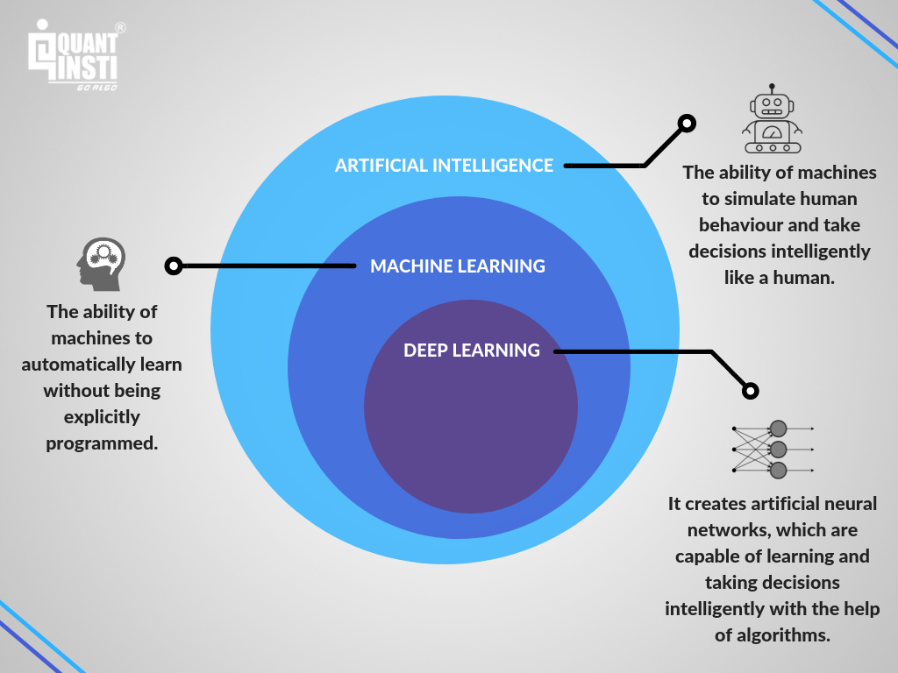

Machine learning (ML) is transforming multiple sectors through advanced analytics and data-driven techniques, with finance being among the most impacted. In finance, algorithmic trading signifies a critical domain where ML has made substantial advancements. Algorithmic trading involves using computer systems to conduct trades according to specified rules and criteria, aiming to optimize profitability and efficiency. The incorporation of machine learning into this field is becoming increasingly prominent, as it allows for the deep analysis of historical and real-time data to extract meaningful patterns and predictive insights.

This article discusses the application of machine learning in algorithmic trading, examining its potential benefits, the challenges it presents, and its critical role in evolving trading strategies. By leveraging ML algorithms, traders and financial firms can analyze extensive datasets efficiently, improving decision-making capabilities and competitive edge in fast-paced markets. For instance, machine learning algorithms can enhance pattern recognition, detect trends and anomalies, and forecast market movements more accurately than traditional statistical methods.

Staying informed about machine learning's integration into algorithmic trading is imperative for players in modern financial markets. The convergence of machine intelligence and financial expertise offers significant opportunities for improved trading performance and strategic advantage. With the ongoing evolution of technology and increasing computational power, understanding and applying machine learning in trading practices are paramount for success in the dynamic landscape of digital finance.

## Table of Contents

## The Rise of Machine Learning in Finance

Machine learning has established a formidable presence in the finance industry due to its capacity to scrutinize intricate datasets and anticipate market trends. Traditionally, the finance sector depended heavily on statistical methods and the intuition of experienced professionals to guide decision-making. However, this landscape is rapidly transforming as companies increasingly pursue data-driven insights offered by [machine learning](/wiki/machine-learning).

Quantitative trading firms and hedge funds have positioned themselves at the vanguard of this transformation. These entities utilize machine learning to automate and enhance their trading operations, seeking to gain a competitive edge by capitalizing on the sophisticated analysis and predictive capabilities that machine learning provides. This shift is evidenced by initiatives such as Man Group's AHL Dimension program and the strategies employed by Taaffeite Capital, both of which demonstrate the successful integration of machine learning into trading mechanisms.

The democratization of machine learning technology can largely be attributed to the accessibility of powerful ML frameworks and the significant advancements in computational capacity. Frameworks such as TensorFlow and PyTorch have lowered the barriers to entry, enabling more firms to leverage [artificial intelligence](/wiki/ai-artificial-intelligence) tools that were once the preserve of only the largest trading entities. The scalability and user-friendly nature of these tools mean that even smaller firms can now implement sophisticated machine learning models without extensive resources.

Additionally, the growth of cloud computing services has granted previously unparalleled access to computational power, eliminating the need for substantial upfront investments in physical infrastructure. This enhancement in computational capability has facilitated real-time data processing and complex model iterations, empowering financial firms to execute strategies that incorporate immediate market feedback.

The rise of machine learning in finance highlights a significant trend towards data-driven decision-making, replacing traditional methods with algorithms capable of processing enormous volumes of data at unprecedented speeds. This capability not only improves the efficiency of trading operations but also opens up new avenues for innovation within the financial markets.

## Advantages of Using Machine Learning in Algorithmic Trading

Machine learning offers several key advantages in [algorithmic trading](/wiki/algorithmic-trading) that enhance both the effectiveness and efficiency of trading strategies. One primary advantage is its enhanced pattern recognition capabilities, which empower traders to identify profitable trading signals. This capability arises from machine learning's proficiency in analyzing vast amounts of structured and unstructured data, allowing for the detection of intricate patterns and trends that may be invisible to traditional statistical methods.

Machine learning models excel in processing large datasets swiftly, enabling rapid reaction to market changes. The ability to ingest and analyze high-frequency data efficiently translates into increased opportunities for traders to capitalize on fleeting market conditions and trends. The swift processing capabilities of machine learning models are essential in today's fast-paced financial markets where the speed of execution can significantly impact profitability.

Automation provided by machine learning greatly reduces human error and ensures the consistent execution of complex trading strategies. By automating decision-making processes, machine learning minimizes manual intervention, thereby reducing the likelihood of errors caused by human emotions and cognitive biases. Automated systems can operate continuously, executing trades based on predefined algorithms, which contributes to a more disciplined trading approach.

In addition, machine learning algorithms demonstrate the capacity to adapt to evolving market conditions, providing dynamic and real-time decision-making support. Through techniques such as [reinforcement learning](/wiki/reinforcement-learning), models can be updated and improved over time by learning from new data, leading to more accurate predictions and better alignment with current market dynamics. This adaptability is crucial in volatile markets where conditions can change rapidly.

The versatility and scalability of machine learning models make them particularly effective for [backtesting](/wiki/backtesting) and refining trading strategies. By simulating trading strategies on historical data, traders can evaluate the potential performance of different approaches and optimize parameters before deploying them in live markets. This process not only aids in strategy refinement but also enhances risk management by allowing traders to assess the robustness and resilience of their models under various market scenarios.

In summary, machine learning offers substantial advantages in algorithmic trading through enhanced pattern recognition, rapid data processing, automated execution, adaptive decision-making, and comprehensive strategy testing. These capabilities collectively contribute to more informed, efficient, and profitable trading practices.

## Challenges and Risks Involved

Machine learning, despite its transformative potential, presents several challenges when applied to algorithmic trading. A notable concern is overfitting, where models are excessively tailored to historical data, capturing noise rather than underlying trends. Overfitting reduces a model's ability to generalize to new, unseen data, thereby compromising its predictive power. This risk underscores the importance of employing techniques such as cross-validation and regularization to ensure robust model performance.

Another significant barrier is the demand for specialized expertise. Developing effective ML models requires a deep understanding of both data science and financial markets. This dual requirement can be prohibitive for firms lacking the necessary skilled personnel, potentially leading to suboptimal model development and deployment. Moreover, the technical complexity of ML algorithms, exemplified by deep neural networks, can result in opaque decision-making processes. This lack of transparency, often referred to as the "black-box" problem, complicates the interpretation and validation of trading decisions, raising concerns over accountability and trust in automated systems.

Furthermore, market [volatility](/wiki/volatility-trading-strategies) poses a continuous challenge to maintaining effective ML models. High-frequency trading environments and unforeseen global events can lead to drastic shifts in market conditions, which may not be adequately captured by pre-existing models. This necessitates regular updates and recalibration, requiring a systematic approach to model maintenance and adaptability.

Risk management is critical in addressing potential inaccuracies in model predictions. Robust validation processes, such as out-of-sample testing and stress testing scenarios, are essential to evaluate model performance under various market conditions. Implementing these processes helps mitigate the risk of significant financial losses.

In summary, while machine learning offers substantial advantages in algorithmic trading, these benefits come with inherent challenges. Addressing these challenges requires a rigorous approach to model development, thorough understanding of trading environments, and proactive risk management strategies.

## Practical Applications of ML in Algorithmic Trading

Machine learning (ML) has become indispensable in enhancing algorithmic trading strategies, offering innovative solutions across various trading formats such as high-frequency trading ([HFT](/wiki/high-frequency-trading-strategies)), statistical [arbitrage](/wiki/arbitrage), and [quantitative trading](/wiki/quantitative-trading). These approaches capitalize on ML's ability to process and analyze massive datasets, allowing traders to identify and exploit market inefficiencies rapidly and efficiently.

High-frequency trading, a domain characterized by rapid execution of a high [volume](/wiki/volume-trading-strategy) of trades, benefits from ML algorithms due to their speed and precision in processing data. Algorithms detect micro-patterns and execute trades within milliseconds, capitalizing on transient market inequities. Utilizing ML for [statistical arbitrage](/wiki/statistical-arbitrage) involves employing statistical models to exploit price differentials between assets that deviate from their historical correlation. These algorithms continually adjust their models based on incoming market data to maintain profitability.

In addition to enhancing trading strategies, ML algorithms also play a critical role in asset pricing and risk assessment. By analyzing historical price movements and a multitude of variables, these algorithms generate predictive analytics, offering traders more accurate pricing models. Risk assessment tools powered by ML evaluate the potential risks associated with different trades or portfolios, assisting in informed decision-making.

Portfolio management and order execution are further areas where ML shows pronounced efficacy. For instance, ML models support dynamic portfolio optimization by adjusting asset allocations based on predictive market analyses, ensuring optimal risk-return ratios. Moreover, in order execution, ML algorithms determine the best execution strategy to minimize market impact and transaction costs.

Technological advancements in ML have facilitated the automation of complex backtesting processes, crucial for the validation and refinement of trading strategies. Backtesting allows traders to simulate the performance of a trading strategy using historical data, and ML automates this process, offering faster and more accurate results.

An emerging application of ML in algorithmic trading is sentiment analysis, where algorithms glean information from vast text datasets, including financial news and social media. This data provides insight into market sentiment, which can significantly influence trading decisions. By processing and interpreting the sentiment accurately, traders can adjust their strategies to reflect market mood dynamics.

ML also excels in creating predictive models that project future price movements, optimizing entry and [exit](/wiki/exit-strategy) points, and ultimately improving trade timing. These models incorporate vast inputs to predict short-term and long-term price trends with increased reliability. The accuracy and efficiency of ML-powered predictions significantly contribute to optimizing trading performance, enhancing profitability for traders employing algorithmic models.

In summary, the integration of machine learning into algorithmic trading paves the way for more sophisticated, adaptable, and effective trading strategies, enabling traders to navigate the financial markets with specialized precision and insight.

## The Future of Machine Learning in Trading

As machine learning technology continues to advance, its applications in trading are expected to become more sophisticated and integrated, offering traders unprecedented tools for optimizing their strategies. The evolution of machine learning in trading is poised to redefine traditional market practices, driven by several key advancements.

One promising area of development is quantum computing. Quantum computers have the potential to dramatically increase processing speeds and improve the accuracy of machine learning models used in trading. The principles of quantum mechanics allow these computers to handle complex computations at a scale unachievable by classical computers, potentially transforming how large datasets are analyzed and enabling more precise market predictions[1].

AI-driven trading platforms are also on the rise, potentially becoming standard across the financial industry. These platforms facilitate the automation of complex trading strategies and data analysis, allowing traders to focus more on oversight and strategic refinement rather than execution. Machine learning algorithms can track and learn from a vast array of market variables, leading to more informed decision-making processes and improved trading outcomes.

However, as machine learning becomes more prevalent in trading, there will be essential ethical considerations and regulatory challenges to address. The opacity of sophisticated algorithms can lead to transparency issues, where the decision-making processes are not easily understood by humans. Ensuring that these systems operate fairly and make ethically sound decisions will be vital, as will compliance with emerging regulations designed to oversee AI and machine learning implementations in financial markets.

In conclusion, machine learning is set to play an instrumental role in shaping the future landscape of financial trading. As the technology matures, its applications are expected to become increasingly integrated across trading operations, offering enhanced capabilities in data processing, strategy development, and market analysis. Traders and firms that leverage these advancements will likely benefit from improved efficiency and competitive advantage, provided they also address the accompanying ethical and regulatory challenges.

---

[1] Harrow, A. W., Hassidim, A., & Lloyd, S. (2009). Quantum algorithm for linear systems of equations. *Physical Review Letters*, 103(15), 150502.

## Conclusion

Machine learning in algorithmic trading presents immense potential but necessitates meticulous implementation and continuous oversight. The integration of machine intelligence with human expertise can enhance trading results, allowing for a more nuanced and strategic approach to market analysis and decision-making. This synergy is critical as machines can process vast volumes of data with unparalleled speed and accuracy, while human traders provide the contextual understanding and strategic insight that technology alone cannot offer.

For traders and firms seeking to harness the benefits of artificial intelligence, a commitment to cultivating specialized talent and establishing a robust technological framework is imperative. Investment in these areas ensures that human capital and technological resources are aligned effectively to support sophisticated trading strategies. Additionally, fostering a culture that encourages ongoing education and skills development in both machine learning and finance is essential for maintaining a competitive edge.

Staying abreast of the latest advancements in machine learning and financial technology is vital. Rapid developments in these fields mean that yesterday's cutting-edge techniques can quickly become outdated. Therefore, continuous learning and adaptation are necessary for traders who wish to leverage emerging tools and methodologies effectively.

Moreover, embracing the opportunities that machine learning offers, while diligently managing its inherent challenges and risks, is crucial for achieving sustained success in algorithmic trading. This involves implementing robust risk management protocols and ensuring that machine learning models are regularly validated and recalibrated to account for changing market conditions. By maintaining a balanced approach, traders can optimize their strategies and improve their ability to respond to the dynamic nature of financial markets.

## References & Further Reading

[1]: Bergstra, J., Bardenet, R., Bengio, Y., & Kégl, B. (2011). ["Algorithms for Hyper-Parameter Optimization."](https://papers.nips.cc/paper/4443-algorithms-for-hyper-parameter-optimization) Advances in Neural Information Processing Systems 24.

[2]: ["Advances in Financial Machine Learning"](https://www.amazon.com/Advances-Financial-Machine-Learning-Marcos/dp/1119482089) by Marcos Lopez de Prado

[3]: ["Evidence-Based Technical Analysis: Applying the Scientific Method and Statistical Inference to Trading Signals"](https://www.amazon.com/Evidence-Based-Technical-Analysis-Scientific-Statistical/dp/0470008741) by David Aronson

[4]: ["Machine Learning for Algorithmic Trading"](https://github.com/PacktPublishing/Machine-Learning-for-Algorithmic-Trading-Second-Edition) by Stefan Jansen

[5]: ["Quantitative Trading: How to Build Your Own Algorithmic Trading Business"](https://www.amazon.com/Quantitative-Trading-Build-Algorithmic-Business/dp/0470284889) by Ernest P. Chan