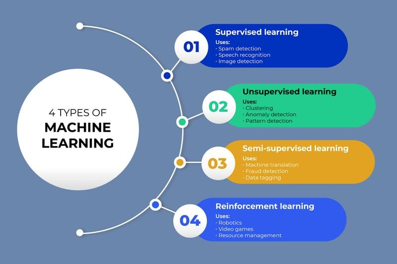

## Table of Contents

## What is machine learning and why is it important?

Machine learning is a type of artificial intelligence where computers learn from data without being specifically programmed. It's like teaching a computer to recognize patterns or make decisions by showing it examples. For instance, by showing a computer many pictures of cats and dogs, it can learn to tell them apart. This is done using algorithms, which are like recipes that the computer follows to learn from the data.

Machine learning is important because it helps us solve problems that are too complex for traditional programming. For example, it can help doctors diagnose diseases more accurately by learning from past medical records. It also powers many everyday technologies, like recommending movies on streaming services or suggesting products on shopping websites. By using machine learning, we can make better decisions, improve efficiency, and even discover new things that we might not have found otherwise.

## What are the main types of machine learning?

There are three main types of machine learning: supervised learning, unsupervised learning, and reinforcement learning. Supervised learning is like having a teacher. You show the computer lots of examples with the right answers, and it learns to make predictions or decisions based on those examples. For instance, if you want a computer to recognize different types of fruits, you would show it many pictures of apples, bananas, and oranges, and tell it what each one is. The computer then uses this information to identify fruits it hasn't seen before.

Unsupervised learning is different because there's no teacher. The computer looks at the data and tries to find patterns or groups on its own. Imagine you have a big pile of clothes, and you need to sort them into different types without knowing what each type is. The computer might group similar clothes together, like all the shirts in one pile and all the pants in another, even though it doesn't know they're called shirts and pants.

Reinforcement learning is like learning by trial and error. The computer, or "agent," learns to make decisions by trying different actions and getting feedback in the form of rewards or penalties. It's similar to playing a game where you get points for doing well and lose points for making mistakes. Over time, the agent figures out the best way to play the game to get the highest score. This type of learning is used in things like training robots or developing strategies in games.

## How does supervised learning differ from unsupervised learning?

Supervised learning is like having a teacher. You give the computer a lot of examples with the right answers, and it learns from them. For example, if you want the computer to tell the difference between cats and dogs, you show it many pictures of cats labeled as cats and dogs labeled as dogs. The computer uses these examples to learn how to identify new pictures it hasn't seen before. It's called "supervised" because you're guiding the computer with the right answers.

Unsupervised learning, on the other hand, is like learning without a teacher. You give the computer data, but you don't tell it what the right answers are. The computer has to figure out patterns or groups on its own. For instance, if you give the computer a bunch of different fruits, it might group them by color or size without knowing they are fruits. It's called "unsupervised" because the computer is left to discover things by itself, without any guidance on what the correct groupings should be.

## What are some common algorithms used in machine learning?

In [machine learning](/wiki/machine-learning), there are many algorithms that help computers learn from data. Some common ones for supervised learning include linear regression, which is used to predict a number, like the price of a house based on its size. Another is logistic regression, which is used to predict yes or no outcomes, like whether an email is spam or not. Decision trees are also popular; they work by making a series of decisions to classify data, similar to following a flowchart. For example, a decision tree might help decide if a loan should be approved based on factors like income and credit score. Support vector machines (SVMs) are used for separating data into different groups, like distinguishing between different types of flowers based on their features.

For unsupervised learning, common algorithms include clustering methods like K-means, which groups similar data points together. Imagine sorting a pile of mixed fruits into groups of apples, bananas, and oranges without knowing what they are called. Another algorithm is principal component analysis (PCA), which helps simplify data by finding the most important features, like reducing a complex dataset to its most essential parts. These algorithms help find patterns in data without any guidance on what the correct groupings should be.

Reinforcement learning uses algorithms like Q-learning, where an agent learns to make decisions by trying different actions and getting feedback. It's like playing a game where you get points for doing well and lose points for mistakes, helping the agent figure out the best strategy over time. Another is deep Q-networks (DQNs), which combine Q-learning with neural networks to handle more complex situations, like teaching a robot to navigate a maze. These algorithms are key in training systems that improve through trial and error.

## How do you prepare data for a machine learning model?

Preparing data for a machine learning model is like getting ingredients ready before cooking a meal. First, you need to collect your data from different places, like surveys, databases, or websites. Once you have your data, you need to clean it. This means fixing any mistakes, like typos or missing information. You might also need to remove data that doesn't fit well with the rest, kind of like taking out a bad apple from a bunch of good ones. After cleaning, you organize the data into a format that the computer can easily understand. This might involve turning words into numbers or grouping similar data together.

Next, you split your data into two parts: one part for training the model and another part for testing it. Think of it like practicing a sport; you use some data to train, and then you use different data to see how well you've learned. You also need to make sure your data is balanced, so the model doesn't learn to favor one outcome over another. For example, if you're trying to predict if an email is spam or not, you want to have a good mix of spam and non-spam emails. Finally, you might need to change your data a bit, like making all the numbers the same size or turning pictures into smaller pieces. This helps the model learn better and faster.

## What is the role of feature selection in machine learning?

Feature selection is like [picking](/wiki/asset-class-picking) the best tools for a job. In machine learning, it means choosing the most important pieces of data, or "features," that will help the computer learn better. Not all data is equally useful, so by selecting only the most relevant features, you can make your model work faster and more accurately. Imagine you're trying to predict if it will rain. You might have data on temperature, humidity, and the color of the sky. The color of the sky might not help much, so you'd leave it out and focus on temperature and humidity.

By doing feature selection, you also make your model simpler and easier to understand. A simpler model is less likely to get confused by too much information, which can lead to better predictions. For example, if you're trying to guess someone's favorite food, you might think about their age, where they live, and what they've eaten before. But knowing their shoe size probably won't help. By leaving out the shoe size, your model focuses on what really matters, making it more effective and easier to explain to others.

## How do you evaluate the performance of a machine learning model?

Evaluating the performance of a machine learning model is like checking how well a student did on a test. You use a part of your data that the model hasn't seen before, called the test set, to see how well it can predict or classify new information. There are different ways to measure this, but common ones include accuracy, which tells you the percentage of correct predictions, and error rate, which tells you the percentage of mistakes. For example, if your model is trying to tell if an email is spam or not, accuracy would show how often it gets it right, while the error rate would show how often it gets it wrong.

Sometimes, just looking at accuracy isn't enough, especially if your data is not balanced. Imagine you're trying to predict a rare disease; if only 1% of people have it, a model that always says "no disease" would be 99% accurate but not very useful. In these cases, you might use other measures like precision, which looks at how many of the positive predictions were correct, and recall, which looks at how many of the actual positives were caught by the model. Another useful measure is the F1 score, which combines precision and recall into one number, giving you a good overall picture of how well your model is doing. By using these different ways to evaluate your model, you can get a better idea of how well it will work in the real world.

## What are overfitting and underfitting, and how can they be addressed?

Overfitting and underfitting are like two sides of a learning problem. Overfitting happens when a machine learning model learns too much from the training data, including the little mistakes and odd details. It's like memorizing a whole book word for word, including typos, instead of understanding the main ideas. When this happens, the model works great on the training data but fails when it sees new data because it can't handle anything different from what it memorized. To fix overfitting, you can use less complex models, add more data, or use techniques like regularization, which helps the model focus on the big picture instead of the tiny details.

Underfitting is the opposite; it's when a model doesn't learn enough from the training data. It's like only reading the title of a book and trying to guess what it's about without looking at the rest. An underfitting model is too simple and misses important patterns, so it doesn't work well on either the training data or new data. To address underfitting, you can try using a more complex model that can capture more details, or make sure you're using all the relevant data and features. Sometimes, giving the model more time to learn or adjusting how it learns can also help it perform better.

## How does deep learning relate to machine learning?

Deep learning is a special type of machine learning. It uses something called neural networks, which are like the brain's way of thinking but in a computer. These neural networks have many layers, and that's why it's called "deep" learning. Deep learning is really good at handling big and complicated data, like pictures, sounds, and words. It can learn to recognize things in photos, understand what people are saying, or even translate languages. It's like a super smart computer that can learn to do things that are hard for regular machine learning.

Even though [deep learning](/wiki/deep-learning) is a part of machine learning, it's different because it can learn on its own without people telling it exactly what to do. In regular machine learning, you often need to show the computer lots of examples and tell it what each example means. But with deep learning, the computer can figure out a lot by itself. It's like giving a kid a bunch of toys and letting them play and learn, instead of teaching them how to play with each toy one by one. Deep learning has made a lot of cool things possible, like self-driving cars and smart assistants on phones.

## What are some advanced techniques in machine learning, such as ensemble methods?

Ensemble methods are like having a team of experts instead of just one. In machine learning, this means using several models together to make better predictions than any single model could do alone. Imagine you're trying to guess the outcome of a soccer match. You could ask one friend who knows a lot about soccer, but it might be better to ask a group of friends who each have different strengths. Some might know about the players' skills, others might understand the teams' strategies, and together they can give you a more accurate prediction. Common ensemble methods include bagging, where you train many models on different parts of the data and then combine their predictions, and boosting, where you train models one after the other, with each new model focusing on the mistakes made by the previous ones.

Another advanced technique is transfer learning, which is like using knowledge from one task to help with another. Imagine you've learned to ride a bike, and now you're trying to learn to ride a scooter. You can use what you already know about balancing and steering to make learning the scooter easier. In machine learning, transfer learning often involves taking a model that was trained on a big dataset, like recognizing objects in pictures, and then fine-tuning it for a new, smaller dataset, like identifying specific types of flowers. This can save a lot of time and resources because you don't have to start from scratch.

## How can machine learning models be deployed in production environments?

Deploying a machine learning model in a production environment is like putting a trained athlete into a real game. First, you need to make sure the model is ready by testing it a lot with different kinds of data to see how well it works. Once you're happy with how it performs, you can start preparing it for the real world. This means turning the model into a format that can be easily used by computers, like saving it as a file. You also need to set up a place for the model to live, like a server or a cloud platform, where it can get data and give predictions quickly and safely.

After setting up the model, you need to keep an eye on it to make sure it keeps working well. This is like a coach watching the game and making changes if needed. You might need to update the model with new data or fix any problems that come up. It's also important to make sure the model is fair and doesn't hurt anyone. For example, if the model is used to decide who gets a loan, you want to make sure it's not treating people unfairly because of things like their age or where they live. By keeping the model running smoothly and treating everyone fairly, you can help make sure it's useful in the real world.

## What are the current trends and future directions in machine learning research?

One of the big trends in machine learning research right now is making models more explainable. This means trying to understand why a model makes the decisions it does. People want to trust machine learning more, especially when it's used in important areas like healthcare or finance. So, researchers are working on ways to make the models' thinking clearer and easier to understand. Another trend is using machine learning to help with big problems like climate change. Scientists are using it to predict weather patterns, understand how forests grow, and even find ways to use energy more efficiently. It's like using a super smart tool to help solve some of the world's biggest challenges.

Looking to the future, machine learning is likely to get even better at handling different types of data, like pictures, sounds, and text, all at the same time. This could help with things like building smarter robots that can see and hear what's going on around them. Another exciting direction is using machine learning to create new things, like designing new medicines or writing music. Imagine a computer helping to invent a new drug that could cure a disease or composing a beautiful song. These are just some of the ways machine learning might change and grow in the future, making our lives easier and more interesting.

## References & Further Reading

[1]: Bergstra, J., Bardenet, R., Bengio, Y., & Kégl, B. (2011). ["Algorithms for Hyper-Parameter Optimization."](https://papers.nips.cc/paper/4443-algorithms-for-hyper-parameter-optimization) Advances in Neural Information Processing Systems 24.

[2]: ["Advances in Financial Machine Learning"](https://www.amazon.com/Advances-Financial-Machine-Learning-Marcos/dp/1119482089) by Marcos Lopez de Prado

[3]: ["Evidence-Based Technical Analysis: Applying the Scientific Method and Statistical Inference to Trading Signals"](https://www.amazon.com/Evidence-Based-Technical-Analysis-Scientific-Statistical/dp/0470008741) by David Aronson

[4]: ["Machine Learning for Algorithmic Trading"](https://github.com/PacktPublishing/Machine-Learning-for-Algorithmic-Trading-Second-Edition) by Stefan Jansen

[5]: ["Quantitative Trading: How to Build Your Own Algorithmic Trading Business"](https://www.amazon.com/Quantitative-Trading-Build-Algorithmic-Business/dp/0470284889) by Ernest P. Chan