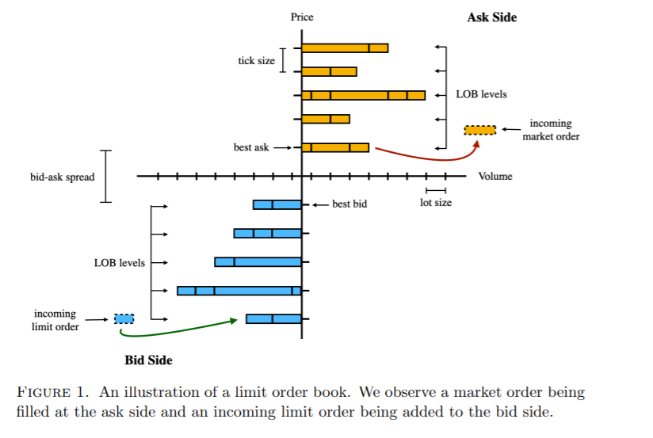

## Table of Contents

## What is machine learning and how does it relate to order flow analysis?

Machine learning is a type of artificial intelligence where computers learn from data to make decisions or predictions. It's like teaching a computer to recognize patterns or make choices by showing it lots of examples. For instance, if you want a computer to recognize pictures of cats, you would show it many cat pictures and tell it, "These are cats." Over time, the computer gets better at figuring out what a cat looks like.

Order flow analysis is about studying the buying and selling activities in the market to understand how prices move. It looks at things like how many people are buying or selling a stock, at what price, and how quickly. By analyzing this data, traders can make better guesses about where the market might go next. Machine learning can help with order flow analysis by finding patterns in the data that humans might miss. For example, a machine learning model could look at lots of past order flow data and predict future price movements based on what it has learned. This can help traders make smarter decisions.

## What is order flow and why is it important in financial markets?

Order flow is the stream of buy and sell orders that come into the market. It shows how many people want to buy or sell a stock or other financial product at any given time. Think of it like a river where the water is the orders, and the direction and speed of the water show how people are trading.

Understanding order flow is important because it helps traders see what is happening in the market right now. By looking at the order flow, traders can get clues about whether prices might go up or down. This can help them decide when to buy or sell. For example, if there are a lot more buy orders than sell orders, it might mean the price will go up soon. Knowing this can help traders make better choices and maybe make more money.

## How can machine learning be used to analyze order flow data?

Machine learning can help analyze order flow data by looking for patterns that humans might not see. Imagine you have a big pile of data about all the buy and sell orders in the market. A [machine learning](/wiki/machine-learning) model can be trained on this data to find out what kinds of patterns lead to prices going up or down. For example, it might learn that when there are a lot of big buy orders coming in quickly, the price usually goes up soon after. By using this information, traders can make better guesses about what will happen next in the market.

Once the machine learning model has been trained, it can keep an eye on the order flow in real-time. This means it can quickly spot when the patterns it learned about are happening again. If the model sees a pattern that usually leads to a price increase, it can tell traders to buy. This can help traders act faster and make more informed decisions. Overall, machine learning makes it easier to understand the huge amount of data in order flow and use it to make smarter trading choices.

## What are the basic types of order flow data that machine learning can process?

Order flow data includes information about buy and sell orders in the market. This data can be broken down into different types that machine learning can process. One type is the order size, which tells how many shares or units someone wants to buy or sell. Another type is the order price, which is the price at which someone wants to buy or sell. There's also the order type, like whether it's a market order, which gets filled right away at the current price, or a limit order, which only gets filled if the price reaches a certain level.

Machine learning can also look at the timing of orders. This includes when the order was placed and how quickly it was filled. This helps the model understand how fast the market is moving. Another important piece of data is the order direction, which tells if the order is a buy or a sell. By looking at all these different types of data together, machine learning can find patterns and make predictions about what might happen next in the market.

## What are some common machine learning algorithms used in order flow analysis?

Some common machine learning algorithms used in order flow analysis are decision trees, random forests, and neural networks. Decision trees are like flowcharts that help the computer decide what to do based on different pieces of data. For example, if there are a lot of buy orders, the decision tree might say to predict that the price will go up. Random forests are groups of decision trees that work together to make better predictions. They can handle a lot of data and find patterns that one tree might miss.

Neural networks are another popular choice. They are inspired by how the human brain works and can learn very complex patterns in the data. Neural networks can look at things like the size of orders, how fast they come in, and whether they are buys or sells, and then predict what the market might do next. These algorithms help traders by making sense of the huge amount of order flow data and giving them useful information to make trading decisions.

## How do you prepare and preprocess order flow data for machine learning models?

To prepare and preprocess order flow data for machine learning models, you first need to gather all the relevant data. This includes details like the size of each order, the price, the type of order (like market or limit), the time it was placed, and whether it was a buy or sell order. Once you have all this data, you need to clean it up. This means getting rid of any mistakes or missing pieces of information. You also need to make sure the data is in a format that the machine learning model can understand. For example, you might need to turn the time of the order into numbers that the computer can work with easily.

After cleaning the data, you need to do something called feature engineering. This is where you create new pieces of information from the data you already have. For example, you might calculate how many buy orders there were compared to sell orders in a certain time period. This new information can help the machine learning model find patterns more easily. Once you have all your features ready, you split the data into two parts: one part for training the model and another part for testing it. This way, you can see how well the model works on data it hasn't seen before. By doing all these steps, you make sure the order flow data is ready for the machine learning model to learn from it and make good predictions.

## What are the key performance metrics to evaluate machine learning models in order flow analysis?

When evaluating machine learning models for order flow analysis, you want to look at a few important things. One key metric is accuracy, which tells you how often the model gets its predictions right. For example, if the model says the price will go up and it does, that's a correct prediction. Another important metric is precision, which shows how many of the model's positive predictions (like saying the price will go up) are actually correct. If the model says the price will go up 100 times, but it only goes up 50 times, the precision would be 50%.

Another metric to consider is recall, which tells you how many of the actual positive cases the model catches. If the price goes up 100 times, and the model predicts it correctly 80 times, the recall is 80%. You also want to look at the F1 score, which is a mix of precision and recall. It's useful because it gives you a single number that shows how well the model balances being right and catching all the important cases. By looking at these metrics, you can see how well your machine learning model is doing at analyzing order flow data and making predictions.

## How can machine learning models help in predicting market trends based on order flow?

Machine learning models can help predict market trends by looking at order flow data and finding patterns that humans might miss. Imagine you have a lot of information about buy and sell orders, like how many orders there are, at what price, and how fast they come in. A machine learning model can learn from this data and figure out what kinds of patterns usually lead to prices going up or down. For example, if the model sees a lot of big buy orders coming in quickly, it might predict that the price will go up soon. By using these patterns, traders can make better guesses about what will happen next in the market.

Once the model is trained on past data, it can watch the order flow in real-time. This means it can spot when the patterns it learned about are happening again. If it sees a pattern that usually leads to a price increase, it can tell traders to buy. This can help traders act faster and make more informed decisions. Overall, machine learning makes it easier to understand the huge amount of data in order flow and use it to predict market trends, helping traders make smarter choices.

## What are the challenges and limitations of using machine learning for order flow analysis?

Using machine learning for order flow analysis can be tricky because the data is always changing and coming in really fast. The market is like a river that never stops moving, and machine learning models need to keep up with this constant flow of information. Sometimes, the patterns the model learns from past data might not work well in the future because the market changes. This can make the predictions less accurate over time. Also, there's a lot of data to process, and it can be hard to make sure the model is looking at the right things and not getting confused by all the noise in the data.

Another challenge is that machine learning models can sometimes find patterns that are just random and not really useful. This is called overfitting, where the model gets too focused on the specific data it was trained on and doesn't work well with new data. It's like memorizing a bunch of facts without understanding the big picture. Also, machine learning models need a lot of data to work well, and getting good, clean data can be hard. If the data is messy or missing important pieces, the model's predictions won't be very good. Despite these challenges, machine learning can still be a powerful tool for order flow analysis if used carefully.

## How can advanced techniques like deep learning enhance order flow analysis?

Deep learning can make order flow analysis even better because it can find really complicated patterns in the data. Think of [deep learning](/wiki/deep-learning) like a super smart brain that can look at a lot of information at once and figure out what's important. For example, it can look at the size of orders, how fast they come in, and whether they are buys or sells, all at the same time. This helps the model understand how all these things work together to move the market. By using deep learning, traders can get more accurate predictions about what the market might do next, which can help them make better trading decisions.

However, using deep learning for order flow analysis also has some challenges. Deep learning models need a lot of data to work well, and they can take a long time to train. Also, these models can sometimes find patterns that are just random and not really useful, which can lead to bad predictions. But if you use deep learning carefully and keep an eye on how well it's doing, it can be a powerful tool for understanding the market and making smarter trades.

## What are some real-world applications of machine learning in order flow analysis?

Machine learning is used in real-world trading to help traders understand the market better. For example, big banks and hedge funds use machine learning models to look at order flow data and predict where prices might go next. They can see patterns in the data that show when a lot of people are buying or selling, and use this information to make smart trades. This helps them make more money by buying low and selling high.

Another way machine learning is used is in high-frequency trading. These are trades that happen very quickly, often in just a few seconds. Machine learning models can watch the order flow in real-time and spot chances to make quick profits. They can buy and sell very fast, taking advantage of small changes in the market. This kind of trading relies a lot on machine learning to make decisions faster than humans can.

## How can one stay updated with the latest developments in machine learning and order flow analysis?

To stay updated with the latest developments in machine learning and order flow analysis, you can follow a few simple steps. First, read blogs and websites that focus on these topics. Websites like Towards Data Science and QuantInsti often have articles about new research and techniques in machine learning and trading. You can also sign up for newsletters from these sites to get the latest news right in your email. Another good way is to follow experts on social media platforms like Twitter or LinkedIn. Many researchers and traders share their latest findings and insights there.

Also, joining online communities and forums can help you stay in the loop. Websites like Kaggle and Reddit have groups where people talk about machine learning and trading. You can ask questions and learn from others who are working on similar things. Lastly, attending webinars and conferences can be really helpful. These events often have talks about the newest ideas and technologies. By doing these things, you can keep learning and stay up-to-date with what's happening in machine learning and order flow analysis.

## What are the components of Order Flow Analysis?

Order flow analysis is rooted in understanding various essential components, including order [books](/wiki/algo-trading-books), trade prints, and market imbalances. These elements collectively provide insights into market dynamics and trader behaviors, pivotal for informed decision-making in [algorithmic trading](/wiki/algorithmic-trading).

### Order Books

An [order book](/wiki/order-book-trading-strategies) is a real-time list of buy and sell orders for a specific financial instrument. It displays the quantities buyers are willing to purchase at various price levels and the quantities sellers are willing to sell. The key features of an order book are the bid and ask prices, representing the highest price a buyer is willing to pay and the lowest price a seller is willing to accept, respectively. The difference between the ask and bid prices is known as the spread, which serves as an indicator of market [liquidity](/wiki/liquidity-risk-premium). A tighter spread often suggests a more liquid market.

The order book is crucial for analyzing market liquidity, defined mathematically as:

$$
\text{Liquidity} = \sum (\text{Volume} \times \text{Price Delta})
$$

where the volume refers to the number of shares or contracts at each price level, and price delta is the change in price level. High liquidity indicates a market in which large orders can be executed with minimal impact on price.

### Trade Prints

Trade prints are records of actual executed trades, providing details such as execution price, [volume](/wiki/volume-trading-strategy), and time. These prints are vital for understanding real market activity, separate from the intent and speculation present in the order book. Analyzing trade prints can reveal the strength of a price movement, whether driven by a few large transactions or numerous smaller ones.

Python code for analyzing trade prints might look like this:

```python
import pandas as pd

# Sample trade prints data
data = {'Time': ['09:00', '09:01', '09:02'],
        'Price': [100.5, 101.0, 100.8],
        'Volume': [200, 150, 300]}

# Create a DataFrame
trade_data = pd.DataFrame(data)

# Calculate average weighted price
trade_data['Weighted Price'] = trade_data['Price'] * trade_data['Volume']
avg_weighted_price = trade_data['Weighted Price'].sum() / trade_data['Volume'].sum()

print(f"Average Weighted Price: {avg_weighted_price}")
```

This script calculates the average weighted price from trade prints, a metric used to assess where most of the trading volume is concentrated.

### Market Imbalances

Market imbalance occurs when there is a significant difference between buy and sell orders within the order book. Imbalances often lead to price movements, as an excess of buy orders over sell orders can drive prices upward, while a surplus of sell orders can push prices downward. Monitoring market imbalances helps traders identify potential breakouts or reversals based on the existing supply and demand.

### Liquidity and Volume Profile Analysis

Liquidity, as represented by the order book, provides a snapshot of current market conditions, while the volume profile shows the historical distribution of trading volume at various price levels. Together, they allow traders to identify areas of support and resistance where significant trading activity has occurred.

Analyzing these components in conjunction can reveal valuable insights into market sentiment. For instance, a high volume of buy orders at a specific price level suggests strong demand, potentially signaling bullish sentiment. Conversely, a large volume of sell orders at a particular level may indicate resistance, suggesting bearish sentiment.

Overall, these components not only elucidate market sentiment but also uncover potential trading opportunities by revealing where market participants are most active, thus enabling more informed and strategic trading decisions.

## References & Further Reading

[1]: Bouchaud, J.-P., Farmer, J. D., & Lillo, F. (2009). ["How Markets Slowly Digest Changes in Supply and Demand."](https://arxiv.org/abs/0809.0822) In Handbook of Financial Markets: Dynamics and Evolution.

[2]: Cont, R. (2011). ["Statistical Modeling of High-Frequency Financial Data."](https://ieeexplore.ieee.org/document/5999562) IEEE Signal Processing Magazine.

[3]: Lopez de Prado, M. (2018). ["Advances in Financial Machine Learning."](https://www.amazon.com/Advances-Financial-Machine-Learning-Marcos/dp/1119482089) Wiley.

[4]: Jansen, S. (2020). ["Machine Learning for Algorithmic Trading: Predictive Models to Extract Signals from Market and Alternative Data for Systematic Trading Strategies"](https://www.amazon.com/Machine-Learning-Algorithmic-Trading-alternative/dp/1839217715) Packt Publishing.

[5]: Chan, E. (2008). ["Quantitative Trading: How to Build Your Own Algorithmic Trading Business."](https://github.com/ftvision/quant_trading_echan_book) Wiley.

[6]: Kissell, R. (2013). ["The Science of Algorithmic Trading and Portfolio Management."](https://www.sciencedirect.com/book/9780124016897/the-science-of-algorithmic-trading-and-portfolio-management) Academic Press.

[7]: Aldridge, I. (2013). ["High-Frequency Trading: A Practical Guide to Algorithmic Strategies and Trading Systems."](https://www.amazon.com/High-Frequency-Trading-Practical-Algorithmic-Strategies/dp/1118343506) Wiley.