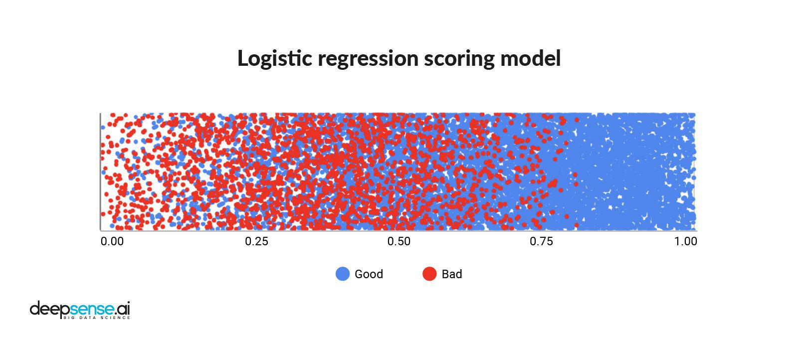

The world of finance is undergoing a rapid transformation, with technology playing an increasingly pivotal role in shaping modern trading strategies. Central to this transformation is the application of machine learning, which is revolutionizing the development and application of risk models in algorithmic trading. Machine learning's ability to process vast amounts of data and uncover patterns that humans might overlook offers a significant advantage in the financial markets. This article will explore how machine learning risk models are being integrated into algorithmic trading, highlighting their importance, the methodologies used, and their impact on financial markets. 

Machine learning models introduce novel ways to analyze data and predict market movements by leveraging algorithms capable of learning from historical and real-time data. These models can identify trends and anomalies, enabling more informed decision-making. Furthermore, machine learning risk models are crucial for those engaged in algorithmic trading, as they help mitigate risks and enhance the performance of trading strategies. By providing insights into potential losses and market conditions, these models enable traders to better anticipate and react to market dynamics. As the financial landscape continues to evolve, understanding and implementing machine learning models will be essential for maintaining a competitive edge and optimizing trading strategies.



## Table of Contents

## Understanding Machine Learning Risk Models

Risk models are integral to trading, serving the vital function of identifying potential losses and supporting informed decision-making processes. In recent years, the adoption of machine learning risk models has dramatically transformed this landscape by leveraging advanced algorithms to analyze expansive datasets, identify hidden patterns, and project future price movements.

Machine learning risk models encompass a spectrum of methodologies, ranging from classical linear models and decision trees to more sophisticated constructs such as neural networks and reinforcement learning algorithms. Linear models, such as linear regression, provide straightforward interpretations and are primarily used when the relationship between variables is linear or close to linear. These models are effective for scenarios with clear, single-layered relationships and can be mathematically expressed as $y = \beta_0 + \beta_1x_1 + \ldots + \beta_nx_n$, where $y$ is the dependent variable, $x$ represents independent variables, and $\beta$ are the coefficients.

Decision trees, on the other hand, employ a branching method to model decisions and their potential consequences, making them particularly useful for handling categorical data and complex interactions within datasets. However, to enhance performance, decision trees are often integrated into ensemble methods like random forests or gradient boosting machines, which aggregate predictions from multiple models to improve accuracy and robustness.

Neural networks, inspired by the human brain, allow for more intricate modeling by processing information through interconnected layers of neurons. These models are particularly well-suited for capturing non-linear dynamics and interactions within financial markets. When expanded into [deep learning](/wiki/deep-learning) architectures, they can analyze vast amounts of unstructured data, offering insights that were previously unattainable. A basic [neural network](/wiki/neural-network) for risk modeling could be coded in Python as follows:

```python
from keras.models import Sequential
from keras.layers import Dense

# Define the neural network model
model = Sequential()
model.add(Dense(units=64, activation='relu', input_dim=input_dim))
model.add(Dense(units=32, activation='relu'))
model.add(Dense(units=1, activation='linear'))

# Compile the model
model.compile(optimizer='adam', loss='mean_squared_error')

# Train the model
model.fit(X_train, y_train, epochs=50, batch_size=10)
```

Reinforcement learning introduces an agent-based approach where trading [agents](/wiki/agents) learn optimal trading strategies through interaction with the environment, receiving rewards or penalties based on their actions. This method is particularly effective for dynamic environments like financial markets, where adaptive strategies are necessary.

Implementing these [machine learning](/wiki/machine-learning) risk models necessitates a thorough understanding of quantitative methodologies combined with qualitative insights into market dynamics. The proficiency of a model heavily relies on the quality of the data input and the sophistication of the algorithms employed. Quality data must be accurate, timely, and robust, while algorithms need to be adeptly chosen and finely tuned to cater to the specific requirements of the market scenario in question.

Ultimately, the integration of machine learning in risk modeling signifies a monumental shift in trading methodologies, enabling unprecedented precision and enhancing strategic performance through sophisticated analytics and predictive capabilities.

## Applications of Machine Learning in Algo Trading

Algorithmic trading (algo trading) integrates machine learning models to automate trading strategies that respond to market conditions with precise timing and adaptation. The synergy between machine learning and algo trading optimizes several elements of trading, primarily through enhancing alpha generation, improving risk management, and providing comprehensive insights into various financial risks.

Machine learning models play a pivotal role in alpha generation by forecasting stock price movements and identifying [arbitrage](/wiki/arbitrage) opportunities. These models analyze extensive datasets to discern underlying patterns and predict potential price fluctuations. By employing statistical methods and algorithms such as support vector machines, neural networks, and regression models, traders can capitalize on discrepancies in market pricing, thereby generating excess returns, known as alpha.

In risk management, machine learning models offer the capability to dynamically adjust trading strategies in response to market [volatility](/wiki/volatility-trading-strategies) and evolving conditions. These models continuously learn from new data inputs, enabling them to update and refine their predictions in real-time. This adaptability ensures that trading strategies remain robust amidst fluctuating market conditions, reducing the risk of significant financial loss.

Furthermore, machine learning models provide vital insights into [liquidity](/wiki/liquidity-risk-premium) risk, credit risk, and market risk by analyzing both historical and real-time data. Liquidity risk models, for example, gauge the ease with which assets can be traded without affecting their price. Credit risk assessments predict the likelihood of a counterparty defaulting on their obligations, while market risk models evaluate the potential losses in an investment due to market movements.

The applications of machine learning in [algorithmic trading](/wiki/algorithmic-trading) extend across various financial instruments, including stocks, options, futures, and [forex](/wiki/forex-system). Each of these instruments presents unique challenges and opportunities that machine learning models can address with tailored strategies. For instance, options trading can benefit from models that assess the underlying asset's volatility, while forex trading can leverage algorithms that analyze currency pairs and macroeconomic indicators.

Python, a popular programming language in the domain of algo trading, offers libraries such as NumPy, pandas, and scikit-learn that facilitate the development and deployment of machine learning models. These tools streamline the process of data manipulation, model training, and performance evaluation, making them invaluable resources for traders seeking to enhance their algorithmic strategies.

By incorporating machine learning models into algo trading, traders can achieve a higher degree of precision and efficiency in executing trades, ultimately leading to more informed and profitable decision-making.

## Challenges in Implementing Machine Learning Risk Models

Machine learning models are powerful tools in algorithmic trading. However, their implementation presents several challenges, notably data quality issues and model overfitting. In financial markets, the integrity of the data that feeds into these models is paramount. Inaccuracies or inconsistencies can lead to faulty predictions and suboptimal trading strategies. Furthermore, overfitting is a common problem where a model performs well on historical data but fails to generalize to new, unseen markets.

The dynamic nature of financial markets, driven by myriad external factors, exacerbates these issues. Sudden geopolitical events, regulatory changes, or economic indicators can render historical data less predictive of future outcomes, as markets may behave differently under new conditions. Thus, reliance on past data could lead to significant risks if not properly accounted for.

Another significant challenge is the opacity of complex machine learning models, such as deep neural networks, which often function as "black boxes." This lack of interpretability creates ethical concerns and complicates the implementation of explainable AI, a requirement for transparency and accountability in financial decision-making processes. The demand for explainable models is growing, aiming to balance predictive power with understandability to stakeholders.

Investment and expertise are also critical barriers to implementing machine learning in trading systems. Developing and deploying robust models require substantial financial resources and access to highly skilled technical employees who understand both machine learning and financial markets. The cost of acquiring high-quality data, coupled with the need for advanced computing infrastructure, can be prohibitive for smaller firms.

Finally, maintaining the efficacy of these models necessitates ongoing training with real-time data. This requirement imposes high demands on computational infrastructure and data management systems, which must handle vast, continuously updating datasets. Failure to promptly adapt models to new market conditions can result in significant financial losses.

In summary, while machine learning holds immense potential for enhancing trading strategies, it is crucial to address these challenges for successful implementation and operation in financial markets.

## Benefits of Machine Learning in Risk Management

Machine learning models significantly enhance the precision of risk assessment, thereby improving the decision-making capabilities of traders and financial institutions. By utilizing complex algorithms and vast datasets, machine learning algorithms can detect patterns and anomalies that are not immediately apparent to human analysts. This enhanced accuracy allows traders to make more informed decisions, minimizing potential losses and maximizing gains.

One of the most significant advantages of employing machine learning in risk management is the ability to perform real-time analytics. Financial markets are characterized by rapid fluctuations, and the ability to analyze and react to data in real time provides traders with a crucial competitive advantage. For instance, machine learning models can process streaming data to identify emerging trends or shifts in market sentiment, thereby enabling timely adjustments to trading strategies.

Stability in trading environments is another benefit provided by machine learning models. By anticipating market shifts, these models help in reducing exposure to risks associated with sudden market movements. Machine learning systems can incorporate historical data and predictive analytics to foresee potential market disruptions, allowing traders to hedge against adverse conditions effectively.

Scalability is a crucial aspect of machine learning systems. These systems can handle immense datasets and perform complex computations at unparalleled speeds. This capability allows them to process and analyze a vast amount of information, including structured and unstructured data, almost instantaneously. For example, a machine learning algorithm could be developed and implemented in Python to manage and analyze huge volumes of tick data:

```python
import pandas as pd
from sklearn.ensemble import RandomForestRegressor

# Load dataset
data = pd.read_csv('market_data.csv')

# Feature selection
features = data.drop(['target'], axis=1)
target = data['target']

# Initialize and train model
model = RandomForestRegressor(n_estimators=100, random_state=42)
model.fit(features, target)

# Predict and assess risk
predictions = model.predict(features)
```

Such scalability is instrumental in executing more complex trading strategies and adapting to evolving market conditions.

Machine learning models also allow for the development of personalized trading strategies by taking into account the varied risk appetites and investment objectives of different clients. This personalization is achieved through models that can be tailored to analyze individual portfolio requirements and preferences, thereby optimizing return on investment according to specific risk tolerance levels.

In summary, the integration of machine learning in risk management not only enhances accuracy and decision-making efficiency but also ensures real-time adaptability and customization, contributing to a more robust and responsive trading strategy.

## Future of Machine Learning in Algo Trading

The integration of machine learning (ML) technology into algorithmic trading is evolving significantly, shaping the future of financial markets. A predominant trend in this evolution is the utilization of deep [reinforcement learning](/wiki/reinforcement-learning) (DRL) to develop self-learning trading agents. Unlike traditional models, DRL agents can autonomously improve their strategies by interacting with market environments. These agents utilize a feedback loop where they receive signals about trading actions' profitability and adjust their strategies accordingly. In this way, DRL facilitates the creation of models that adapt to changing market conditions, potentially enhancing the profitability and robustness of trading strategies.

The integration of [alternative data](/wiki/best-alternative-data) sources is another transformative aspect of ML in trading. Social media platforms, news outlets, and other real-time information streams offer a wealth of data previously underutilized in risk modeling. Machine learning algorithms can process and analyze these large and unstructured data sets to extract sentiment trends, news impacts, and emerging topics that may affect market movements. For instance, natural language processing (NLP) models interpret the sentiment of financial news, enabling traders to predict market reactions to specific events.

Moreover, advancements in [artificial intelligence](/wiki/ai-artificial-intelligence) (AI) and machine learning will continue to stretch the limits of predictive accuracy and risk mitigation. These technologies improve as computational power enhances, allowing for more intricate and high-dimensional data analysis. AI-driven models can identify complex patterns and interdependencies within financial data, offering insights that were previously unattainable through conventional analytical methods.

Continuous innovation in machine learning is also paving the way for the development of more sophisticated, adaptive, and autonomous trading systems. Such systems are capable of not only executing trades but also continuously assessing and adjusting their risk models in response to fluctuating market conditions. This adaptability is crucial in a landscape where the speed and [volume](/wiki/volume-trading-strategy) of trades continuously increase.

Furthermore, the rise of quantum computing may revolutionize ML algorithms in the future, providing even faster data processing capabilities and solving currently intractable problems in risk modeling and prediction.

In conclusion, machine learning's role in algorithmic trading is set to grow, driven by emerging technologies and novel data sources. The potential for self-learning agents, enhanced data integration, and increased predictive precision promises a future where trading systems are more intelligent and autonomous, opening new horizons for risk management and financial strategy innovation.

## Conclusion

Machine learning risk models represent a paradigm shift in how risk is managed in the financial trading sector. These sophisticated models leverage the power of advanced algorithms to process vast amounts of historical and real-time data, extracting insights that enhance the effectiveness and efficiency of algorithmic trading systems. By dynamically adjusting to market volatility and employing real-time analytics, these models provide traders with a crucial advantage, enabling more informed decision-making and the development of robust trading strategies.

As machine learning technologies continue to mature, they will increasingly become indispensable tools for managing financial risks. The continuous advancement of algorithms, such as deep reinforcement learning and neural networks, drives the predictive accuracy of these models further, allowing for precise risk assessments and the anticipation of market shifts. This evolution in technology not only enhances the models’ reliability but also expands their applicability across diverse financial instruments and market conditions.

For traders and financial institutions, embracing machine learning technologies is essential for maintaining a competitive edge in the fast-paced world of financial markets. Staying ahead by adopting these tools facilitates the development of personalized trading strategies that cater to varying risk preferences and objectives. Moreover, the scalability of machine learning systems allows for the handling of immense datasets, enabling complex calculations to be performed quickly and efficiently.

Adopting machine learning in trading strategies opens up new avenues for growth and innovation. It enables traders to mitigate risks effectively while exploring emerging market opportunities. As these technologies continue to evolve, they offer the potential for creating more sophisticated, adaptive, and autonomous trading systems, setting the stage for the future of algorithmic trading in a highly competitive financial landscape.

## References & Further Reading

[1]: Bergstra, J., Bardenet, R., Bengio, Y., & Kégl, B. (2011). ["Algorithms for Hyper-Parameter Optimization."](https://dl.acm.org/doi/10.5555/2986459.2986743) Advances in Neural Information Processing Systems 24.

[2]: ["Advances in Financial Machine Learning"](https://www.amazon.com/Advances-Financial-Machine-Learning-Marcos/dp/1119482089) by Marcos Lopez de Prado

[3]: ["Machine Learning for Algorithmic Trading"](https://github.com/stefan-jansen/machine-learning-for-trading) by Stefan Jansen

[4]: ["Quantitative Trading: How to Build Your Own Algorithmic Trading Business"](https://www.amazon.com/Quantitative-Trading-Build-Algorithmic-Business/dp/1119800064) by Ernest P. Chan

[5]: ["Hands-On Machine Learning with Scikit-Learn, Keras, and TensorFlow"](https://github.com/yanshengjia/ml-road/blob/master/resources/Hands%20On%20Machine%20Learning%20with%20Scikit%20Learn%20and%20TensorFlow.pdf) by Aurélien Géron

[6]: ["Deep Reinforcement Learning in Action"](https://www.manning.com/books/deep-reinforcement-learning-in-action) by Alexander Zai and Brandon Brown

[7]: ["The Book of Alternative Data: A Guide for Investors, Traders and Risk Managers"](https://www.amazon.com/Book-Alternative-Data-Investors-Managers/dp/1119601797) by Alexander Denev and Saeed Amen