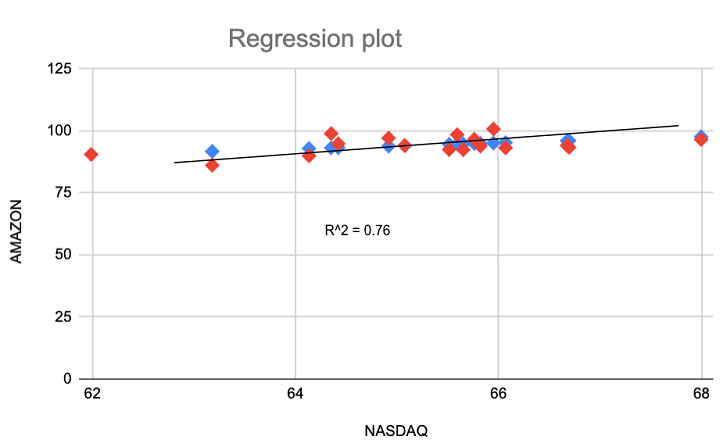

Algorithmic trading has become a cornerstone of modern financial markets, leveraging technology to execute complex trading strategies with speed and precision. Central to these strategies is the application of predictive modeling, where regression analysis plays an indispensable role. By examining the relationships between variables, regression analysis aids traders in deciphering patterns and predicting stock price movements.

Regression analysis, as a statistical tool, is pivotal in determining how dependent variables, such as stock prices, are influenced by one or more independent variables, including historical prices, trading volumes, and economic indicators. This technique allows traders to develop models that capture the underlying dynamics of financial markets, making it a valuable component in the algorithmic trading toolset.



In this article, we will explore the utilization of regression analysis for predicting stock prices, enhancing the capability to make informed trading decisions. Various regression techniques, such as linear regression, logistic regression, and polynomial regression, offer distinct benefits and can be tailored to suit specific trading strategies. By understanding and applying these methods, traders can construct reliable models that inform buy or sell decisions, ultimately contributing to the profitability of trading operations.

This exploration will cover the fundamental principles of regression analysis, discuss its application in trading algorithms, and consider the benefits alongside its limitations, providing a comprehensive overview of this powerful analytical method.

## Table of Contents

## Understanding Regression Analysis

Regression analysis is a statistical method employed to examine the relationship between a dependent variable and one or more independent variables. This analysis is pivotal for determining both the direction and strength of these relationships, thereby aiding researchers and analysts in predicting future outcomes based on historical data.

The central objective of regression is to model the expected value of a dependent variable $(Y)$ based on the value(s) of independent variable(s) $(X_1, X_2, ..., X_n)$. Mathematically, the simplest form of regression analysis, linear regression, is expressed as:

$$
Y = \beta_0 + \beta_1X_1 + \beta_2X_2 + ... + \beta_nX_n + \epsilon
$$

Here, $\beta_0$ represents the intercept, $\beta_1, \beta_2, ..., \beta_n$ denote the coefficients determining the impact of each independent variable, and $\epsilon$ is the error term accounting for the variance in $Y$ not explained by the model.

Linear regression is the cornerstone of regression techniques due to its simplicity and ease of interpretation. It assumes a straight-line relationship between the dependent and independent variables. Despite its straightforward nature, linear regression serves as a foundation for more advanced analysis techniques such as polynomial regression, which accommodates non-linear relationships by incorporating non-linear transformations of the predictor variables.

Here's a simple example in Python demonstrating linear regression using a popular library, `scikit-learn`:

```python
from sklearn.linear_model import LinearRegression
import numpy as np

# Example data
X = np.array([[1], [2], [3], [4], [5]])
Y = np.array([2, 3, 5, 7, 11])

# Create and fit the model
model = LinearRegression()
model.fit(X, Y)

# Coefficients
print("Intercept:", model.intercept_)
print("Coefficient:", model.coef_)
```

In this example, we fit a linear regression model on simple, illustrative data. The model calculates the intercept and coefficient(s) that minimize the sum of squared residuals, providing the best fit line through the data points.

Overall, regression analysis not only enhances the understanding of the data but also facilitates predictions of future trends, crucial for decision-making in fields such as finance, economics, biology, and engineering. Comprehensive grasp of these relationships through regression lays the groundwork for sophisticated predictive models which are integral to fields like [algorithmic trading](/wiki/algorithmic-trading), where rapid, data-driven decisions are essential.

## Types of Regression Techniques in Stock Trading

In stock trading, various regression techniques extend beyond simple linear regression, each offering distinct advantages based on the specific attributes of the data and the trading objectives. Logistic regression is frequently employed when the target variable is categorical, such as predicting whether a stock price will increase or decrease. Unlike linear regression, which predicts a continuous value, logistic regression estimates the probability of class membership using a logistic function:

$$
P(Y=1|X) = \frac{1}{1 + e^{-(\beta_0 + \beta_1X_1 + \ldots + \beta_nX_n)}}
$$

This method is particularly useful for binary outcomes, making it appropriate for situations where traders are interested in directional movements of stock prices.

Polynomial regression, on the other hand, is suited for modeling relationships that are not linear. It extends linear regression by including polynomial terms, thus allowing it to capture the curvature in relationships between variables. It is valuable in capturing nuances in stock price trends where data shows a non-linear pattern. The formula for a second-degree polynomial regression, for instance, is expressed as:

$$
Y = \beta_0 + \beta_1X + \beta_2X^2 + \epsilon
$$

where $Y$ is the dependent variable, $X$ is the independent variable, and $\epsilon$ is the error term.

Another technique, ridge regression, is utilized to tackle multicollinearity issues in datasets where independent variables are highly correlated. By adding a penalty equivalent to the square of the magnitude of coefficients, ridge regression minimizes this complexity. The objective function is modified as:

$$
\min ||Y - X\beta||^2_2 + \lambda||\beta||^2_2
$$

Here, $\lambda$ is a tuning parameter determining the strength of the penalty term.

Lasso regression is similar to ridge regression but uses an $L1$ penalty instead of an $L2$ penalty, which can shrink some coefficients to zero, effectively performing variable selection. This makes lasso regression an effective tool for creating parsimonious models with a focus on significant predictors:

$$
\min ||Y - X\beta||^2_2 + \lambda||\beta||_1
$$

The emergence of non-parametric regression techniques like kernel regression adds another dimension to stock trading analysis. These models do not assume a predefined form for the relationship between variables, offering greater flexibility for modeling complex, non-linear structures.

Each regression technique's applicability is contingent upon the problem's context and characteristics of the data. Traders select specific methods based on various factors, including the dataset's dimensions, the relationship's linearity, and the predictive goals, allowing for tailored strategies to enhance stock trading precision and effectiveness.

## Application of Regression Analysis in Algorithmic Trading

Regression analysis serves as a cornerstone for predictive strategies in algorithmic trading by leveraging extensive historical stock market data to predict future price movements. By identifying patterns and relationships within the data, regression models enable traders to forecast stock prices with a degree of statistical confidence. This predictive capability is crucial in establishing trading strategies that identify optimal points for buying and selling assets, thereby aiming to enhance profitability while managing risk.

A fundamental application of regression in algorithmic trading is in constructing risk-return models. These models typically involve using historical data to establish a relationship between asset returns and various influencing factors, such as economic indicators or market sentiment variables. For instance, a linear regression model might be employed to predict future stock returns based on changes in these factors. The general form of a linear regression model is:

$$
Y = \beta_0 + \beta_1X_1 + \beta_2X_2 + \ldots + \beta_nX_n + \epsilon
$$

where $Y$ is the dependent variable (future stock price or return), $X_1, X_2, \ldots, X_n$ are the independent variables (features like market indicators or historical prices), $\beta_0$ is the intercept, $\beta_1, \beta_2, \ldots, \beta_n$ are the coefficients representing the weight of each predictor, and $\epsilon$ is the error term.

In practical applications, algorithmic traders employ several types of regression techniques depending on the complexity and nature of the data. For example, multiple regression may be applied when considering the influence of various factors. Python, with its powerful libraries such as NumPy, pandas, and scikit-learn, provides a robust environment for implementing these models. Here’s a simple example in Python:

```python
import pandas as pd
from sklearn.model_selection import train_test_split
from sklearn.linear_model import LinearRegression

# Example: Predicting stock returns based on past features
# Load stock data into a DataFrame
data = pd.read_csv('historical_stock_data.csv')

# Select independent variables (e.g., past returns, moving averages)
features = data[['feature1', 'feature2', 'feature3']]
target = data['stock_return']

# Split data into training and testing sets
X_train, X_test, y_train, y_test = train_test_split(features, target, test_size=0.2, random_state=42)

# Initialize and train the regression model
model = LinearRegression()
model.fit(X_train, y_train)

# Predict on the test set
predictions = model.predict(X_test)
```

Through such models, traders can quantify the optimal timing for market entry and [exit](/wiki/exit-strategy) points, subsequently formulating strategies that involve buying when a stock is undervalued and selling when it reaches its predicted potential. This strategy not only maximizes profitability but also allows for a structured approach to managing financial risks inherent in trading activities.

However, it is important to note that while regression models provide valuable insights, they are not infallible. The accuracy of predictions is contingent upon the quality and integrity of the input data, the chosen model, and the tuning of its parameters. Moreover, external factors such as geopolitical events and market anomalies can introduce uncertainties that challenge the predictive capabilities of these models, necessitating a continuous refinement of strategies.

## Building a Regression Model for Stock Prediction

Building a robust regression model for stock prediction necessitates a methodical approach, encompassing data collection, processing, model training, and validation. Each step is crucial to ensure the model is reliable and capable of generating accurate forecasts.

### Data Collection

The foundation of any effective regression model is high-quality data. For stock prediction, the essential data points include historical stock prices such as the opening, high, low, and closing prices. This data is often sourced from financial databases like Yahoo Finance, Bloomberg, or Quandl. A comprehensive dataset might also incorporate trading [volume](/wiki/volume-trading-strategy) and indicators like moving averages or relative strength index (RSI).

```python
import pandas as pd
import yfinance as yf  # For more datasets, visit: https://paperswithbacktest.com/datasets

# Example of fetching historical data using yfinance
ticker = "AAPL"
data = yf.download(ticker, start="2020-01-01", end="2023-01-01")
print(data.head())
```

### Data Processing

Once collected, the data must be cleaned and preprocessed to ensure it is fit for modeling. This step includes handling missing values, outliers, and transforming the data to uncover underlying patterns. Normalization or standardization are common techniques to scale the data, ensuring that all features contribute equally during model training.

```python
# Handling missing values
data.fillna(method='ffill', inplace=True)

# Feature scaling
from sklearn.preprocessing import StandardScaler

scaler = StandardScaler()
scaled_data = scaler.fit_transform(data[['Open', 'High', 'Low', 'Close']])
```

### Model Training

With clean data, the next step is model development. Linear regression is a straightforward starting point, modeling the relationship between independent variables (predictors) and the dependent variable (target) — often the future stock price. The linear regression model aims to find the best-fitting line by minimizing the sum of squared residuals.

The linear regression equation can be described as:

$$
y = \beta_0 + \beta_1x_1 + \beta_2x_2 + \ldots + \beta_nx_n + \epsilon
$$

Where $y$ is the dependent variable, $x_1, x_2, \ldots, x_n$ are independent variables, $\beta_0, \beta_1, \ldots, \beta_n$ are coefficients, and $\epsilon$ is the error term.

```python
from sklearn.model_selection import train_test_split
from sklearn.linear_model import LinearRegression

# Splitting the dataset
X = data[['Open', 'High', 'Low']]
y = data['Close']
X_train, X_test, y_train, y_test = train_test_split(X, y, test_size=0.2, random_state=42)

# Training the Linear Regression model
model = LinearRegression()
model.fit(X_train, y_train)
```

### Validation

The final step in building a regression model is validation, which involves testing its accuracy on unseen data. Cross-validation techniques, like k-fold cross-validation, provide a robust mechanism to assess how the results of the model will generalize to an independent dataset. Metrics such as Mean Absolute Error (MAE), Mean Squared Error (MSE), or R-squared ($R^2$) are commonly used to evaluate model performance.

```python
from sklearn.metrics import mean_squared_error, r2_score

# Predicting and validating the model
y_pred = model.predict(X_test)

# Evaluating model performance
mse = mean_squared_error(y_test, y_pred)
r2 = r2_score(y_test, y_pred)

print(f'Mean Squared Error: {mse}')
print(f'R-squared: {r2}')
```

Building a regression model for stock prediction is a structured process that demands rigorous data handling and meticulous evaluation. While regression models hold promise for predicting stock movements, their accuracy hinges on the quality of input data and the appropriateness of the model selection and tuning.

## Challenges and Considerations

Predicting stock prices using regression models presents inherent challenges due to the volatile and unpredictable nature of financial markets. One significant challenge is the tuning of hyperparameters to prevent overfitting and enhance model accuracy. Overfitting occurs when a model is excessively complex and captures the noise in the data rather than the underlying trend, leading to poor generalization on new data. To address this, practitioners must carefully select and fine-tune hyperparameters, such as the regularization parameter in ridge or lasso regression, to balance model complexity and performance. Cross-validation techniques can assist in this process by providing a way to evaluate model performance on different subsets of data, reducing the risk of overfitting.

Moreover, regression models in stock prediction are susceptible to external influences such as economic events, geopolitical developments, and sudden market shifts. These factors can lead to erratic price movements that are difficult for models based solely on historical data to predict. Incorporating macroeconomic indicators or sentiment analysis from news sources could potentially improve model robustness. However, the challenge lies in quantifying and integrating these external factors into the model without increasing complexity to a detrimental level. For example, a multi-[factor](/wiki/factor-investing) model might be employed where economic indicators are included as additional features alongside historical price data.

Considering these challenges, careful consideration must be given to the choice and implementation of regression techniques to ensure successful deployment in stock trading. This involves regular updates and revisions to the model as new data becomes available or as market dynamics shift. Practitioners must maintain a balance between model complexity and simplicity, ensuring that the model remains flexible enough to adapt to changing conditions while preventing it from becoming overly sensitive to short-term fluctuations.

## Conclusion

Regression analysis stands as a robust tool in algorithmic trading, empowering traders to make informed data-driven decisions. This statistical technique enables the quantification of relationships between stock prices and various influential factors, facilitating predictions that guide trading strategies. While the application of regression analysis holds significant promise for maximizing returns, awareness of its limitations is essential for successful deployment.

One of the main challenges is the inherent unpredictability of financial markets. Regression models, while adept at analyzing historical data, may struggle with the [volatility](/wiki/volatility-trading-strategies) and non-linear nature of real-world stock prices. To mitigate these issues, traders need to continuously refine their models and incorporate new data. This perpetual process of learning and model adaptation addresses market dynamics and enhances predictive accuracy.

Furthermore, successful implementation of regression analysis in algorithmic trading necessitates careful attention to model overfitting. This occurs when a model captures noise in the data rather than the underlying pattern, leading to inaccurate predictions when faced with new data. Techniques such as cross-validation and regularization should be employed to ensure models maintain generalization capability outside the training dataset.

Additionally, external factors such as geopolitical events and economic shifts can considerably impact stock prices, often in ways statistical models cannot predict. As a result, regression analysis should be complemented with other analytical tools and expert insights to account for these variables.

In conclusion, while regression analysis offers promising opportunities for profit maximization in algorithmic trading, unveiling its full potential requires a nuanced understanding of both its capabilities and constraints. The dynamic nature of markets necessitates continuous learning and model adjustments. This adaptability, coupled with a strategic blend of statistical and [fundamental analysis](/wiki/fundamental-analysis), forms the basis of a resilient trading strategy. By embracing these practices, traders can more effectively leverage regression analysis to navigate the complexities of modern financial markets.

## References & Further Reading

[1]: Bergstra, J., Bardenet, R., Bengio, Y., & Kégl, B. (2011). ["Algorithms for Hyper-Parameter Optimization."](https://papers.nips.cc/paper/4443-algorithms-for-hyper-parameter-optimization) Advances in Neural Information Processing Systems 24.

[2]: ["Advances in Financial Machine Learning"](https://www.amazon.com/Advances-Financial-Machine-Learning-Marcos/dp/1119482089) by Marcos Lopez de Prado

[3]: ["Evidence-Based Technical Analysis: Applying the Scientific Method and Statistical Inference to Trading Signals"](https://www.amazon.com/Evidence-Based-Technical-Analysis-Scientific-Statistical/dp/0470008741) by David Aronson

[4]: ["Machine Learning for Algorithmic Trading"](https://github.com/stefan-jansen/machine-learning-for-trading) by Stefan Jansen

[5]: ["Quantitative Trading: How to Build Your Own Algorithmic Trading Business"](https://books.google.com/books/about/Quantitative_Trading.html?id=j70yEAAAQBAJ) by Ernest P. Chan