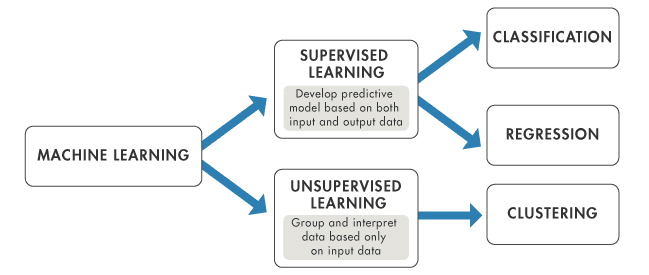

Machine learning, a subset of artificial intelligence, has been transforming the landscape of trading strategies, introducing a level of precision and efficiency previously unattainable. At its core, machine learning employs algorithms that can learn from and make predictions on data, making it an invaluable tool in the complex and data-driven world of trading. This technological evolution is not just a fleeting trend but a fundamental shift in how trading strategies are developed and executed.

In finance, machine learning's impact is particularly pronounced. Trading, a domain historically reliant on human intuition and analysis, is increasingly turning towards these sophisticated algorithms to uncover patterns and insights from vast quantities of market data. This shift is driven by the need for more accurate predictions and faster decision-making processes that can outpace traditional methods. Machine learning algorithms are uniquely equipped to handle the volume, velocity, and variety of financial data, parsing through global market trends, trading volumes, and economic indicators at unprecedented speeds.

The importance of machine learning in trading today cannot be overstated. In a world where financial markets are characterized by high volatility and rapid changes, the ability to quickly analyze and respond to market data is crucial. Machine learning strategies are not only enhancing the accuracy of predictions but also enabling traders to identify new trading opportunities and strategies that would be impossible to discern through traditional means. This evolving landscape signifies a new era in finance, where data-driven and algorithmic trading strategies are becoming the norm, shaping the future of trading and investment.

## Table of Contents

## Basic Concepts

Machine learning is a subset of artificial intelligence where algorithms are designed to analyze data, learn from it, and make decisions or predictions based on that learning. Unlike traditional programming, where tasks are performed based on explicit instructions, machine learning algorithms adjust their actions based on patterns and correlations they uncover in the data, effectively 'learning' from it. This ability to self-learn and adapt makes machine learning particularly suitable for environments characterized by vast amounts of data and change, which is precisely the case in financial markets.

Trading strategies in the financial world refer to a set of rules or guidelines that traders and investors use to guide their buying and selling decisions in the markets. These strategies can range from simple rule-based methods to complex models involving numerous variables. They are essential for navigating the financial markets, as they provide a structured approach to trading, minimizing emotional decision-making and helping to manage risks. The significance of trading strategies lies in their ability to capitalize on market opportunities and mitigate losses in volatile markets.

The intersection of machine learning and trading strategies represents a significant evolution in finance. Machine learning algorithms can analyze large datasets, recognize complex patterns, and make predictions at a speed and accuracy that is unattainable by human traders. This capability enhances the effectiveness of trading strategies, providing insights that are grounded in data analysis rather than intuition.

For a more in-depth understanding of [machine learning](/wiki/machine-learning) and its application in finance, readers can refer to "Advances in Financial Machine Learning" by Marcos López de Prado, which offers a comprehensive overview of how modern machine learning methods are transforming the financial industry[1].

## Types of Machine Learning in Trading

### Supervised

Supervised learning, a predominant branch of machine learning, operates on a straightforward yet powerful principle: learning from labeled training data to make predictions or decisions. In this approach, the algorithm is 'supervised' as it learns from a dataset that includes both the input and the corresponding correct output. The primary goal here is for the algorithm to learn a mapping function from the input to the output. Once trained with enough data, the model can then apply this learned function to new, unseen data to make predictions.

In the context of trading strategies, supervised learning has found extensive application due to its ability to predict future price movements based on historical data. For instance, supervised models can be trained on years of market data, including stock prices, trading [volume](/wiki/volume-trading-strategy)s, and economic indicators, with the aim of forecasting future price trends. Commonly used supervised learning models in trading include linear regression for predicting continuous outcomes, like price changes, and classification models like logistic regression or support vector machines for categorical outcomes, such as identifying whether a stock’s price will go up or down.

The strength of supervised learning in trading lies in its ability to uncover and exploit complex relationships in financial data that might not be immediately apparent or accessible to human traders. By meticulously analyzing historical data, these models can identify patterns and indicators that are predictive of future market movements. However, it's crucial to note that the effectiveness of supervised learning models hinges on the quality of the data they are trained on, as well as the relevance of the features selected for training.

### Unsupervised

Unsupervised learning, a pivotal branch of machine learning, diverges from supervised learning by working with unlabeled data. This means the algorithm is given data without explicit instructions on what to do with it, and there are no correct answers or specific outputs to predict. Instead, the goal of unsupervised learning is to explore the data and find some structure within it. Common methods include clustering, where data is grouped based on similarities, and dimensionality reduction, where data is simplified without losing key information.

In trading strategies, unsupervised learning plays a critical role in identifying hidden patterns and correlations in market data that are not immediately apparent. For example, clustering algorithms can be used to discover groups of stocks that behave similarly or to identify market regimes, such as high [volatility](/wiki/volatility-trading-strategies) periods. Dimensionality reduction techniques like Principal Component Analysis (PCA) are useful in reducing the number of variables in complex datasets, making it easier to analyze and visualize market trends.

One of the primary advantages of unsupervised learning in trading is its ability to handle the vast and often unstructured datasets typical in financial markets. By uncovering underlying patterns and structures in market data, unsupervised learning algorithms can provide traders with insights into market dynamics that might be overlooked with traditional analysis methods. These insights can lead to the development of more sophisticated and nuanced trading strategies that are better aligned with current market conditions.

### Reinforcement Learning

Reinforcement learning (RL) is a type of machine learning where an algorithm learns to make decisions by performing actions in an environment to achieve some goal. The unique feature of RL is its focus on learning from the consequences of actions, rather than from direct instruction or labeled data. In an RL framework, an agent learns to make decisions by receiving rewards or penalties based on its actions. This process of trial and error, combined with a reward system, enables the algorithm to learn optimal strategies over time.

In trading, [reinforcement learning](/wiki/reinforcement-learning) has been utilized to develop dynamic and adaptive trading strategies. Unlike traditional models that may rely on static rules, RL-based strategies can continually learn and adapt to new market conditions. An RL agent can be trained to maximize financial returns by making a sequence of buying and selling decisions, essentially learning a trading strategy that evolves based on market performance feedback.

One of the main advantages of using RL in trading is its ability to consider the sequential and dynamic nature of markets. For example, an RL algorithm can take into account the temporal aspects of trading, such as the impact of holding a position over time or the changing nature of market volatility. This makes RL particularly well-suited for developing strategies for complex trading tasks, such as portfolio management or high-frequency trading.

The application of reinforcement learning in trading is still a relatively new and evolving area, but its potential is significant. For a comprehensive understanding of how RL is being applied in finance, "Machine Learning for Asset Managers" by Marcos López de Prado provides insights into the development and implementation of RL-based trading strategies, demonstrating the innovative ways in which these techniques are being used in the financial sector.

## Developing Machine Learning Trading Strategies

### Steps in Strategy Development

The development of machine learning trading strategies involves a systematic process that ranges from defining the problem to [backtesting](/wiki/backtesting) the strategy.

Initially, the problem setup involves **identifying the specific trading objectives and constraints**, such as predicting stock prices, optimizing a portfolio, or managing risk. This step is crucial as it guides the choice of data, features, and machine learning models to be used.

Next, **data collection** is fundamental, as the quality and quantity of data directly impact the performance of the machine learning model. This involves gathering historical financial data, which may include stock prices, volumes, economic indicators, and news feeds. Ensuring data quality, such as accuracy, completeness, and relevance, is critical at this stage.

After data collection, **feature engineering** is conducted. This process involves selecting and transforming raw data into features that make machine learning algorithms work effectively. In trading strategies, features might include technical indicators like moving averages or fundamental indicators like earnings ratios. The selection of relevant features is a key [factor](/wiki/factor-investing) in building effective models.

**Model selection** then involves choosing an appropriate machine learning algorithm. This choice depends on the nature of the problem (e.g., prediction, classification, or regression), the type of data, and the specific trading goals. Common models in trading include linear regression, decision trees, support vector machines, and neural networks.

Once a model is selected, **training the model with historical data** follows. This process involves adjusting the model parameters to fit the data. The model learns the patterns in the data and how these patterns relate to the desired outcomes, like predicting stock price movements.

After training, **the model is validated** to assess its performance. This typically involves using a separate set of data (validation set) to prevent overfitting and ensure that the model generalizes well to new, unseen data.

The final step is **backtesting**, where the model’s predictions are tested against historical data to simulate how the strategy would have performed in the past. This is crucial for evaluating the effectiveness of a trading strategy before it is deployed in real-world trading. Backtesting helps identify potential issues like overfitting, unrealistic transaction cost assumptions, or model decay over time.

Throughout this process, continuous refinement and adjustment are necessary to improve the model’s accuracy and robustness. The development of machine learning trading strategies is an iterative process, requiring constant evaluation and modification to adapt to changing market conditions.

### Data Collection and Quality

In machine learning trading strategies, the importance of high-quality data cannot be overstated. The entire foundation of a machine learning model's success hinges on the data it is trained on. High-quality data is characterized by its accuracy, completeness, relevance, and timeliness, all of which are crucial for developing effective trading strategies.

Accurate data ensures that the model's predictions are based on reliable information. Inaccuracies in financial data, such as incorrect stock prices or trading volumes, can lead to erroneous predictions and poor trading decisions. Completeness of data is equally important. Missing values or incomplete historical records can lead to biases in the model, affecting its ability to learn effectively.

The relevance of the data is about ensuring that the right data is being used for the right problem. For instance, in a model designed to predict stock prices, relevant data might include not just historical prices but also factors like trading volumes, economic indicators, and company earnings reports. Finally, timeliness refers to the currency of the data. Financial markets are dynamic and ever-changing, making up-to-date data essential for a model to be relevant and effective.

The process of data collection and preparation is thus a critical step in developing machine learning trading strategies. It involves not only gathering sufficient historical data but also cleaning and preprocessing this data to address issues like missing values, outliers, and noise. Data normalization and transformation techniques are often employed to make the data suitable for machine learning algorithms.

In the context of finance, where data is vast and varied, managing and maintaining data quality is a challenging but vital task. The payoff of investing in high-quality data is significant, as it leads to more reliable, accurate, and robust trading models.

### Feature Engineering and Selection

Feature engineering and selection are pivotal in the development of machine learning trading strategies. This process involves transforming raw data into features that effectively represent the underlying patterns and dynamics of financial markets, which the machine learning model will use to make predictions or decisions.

Choosing the right features is crucial as they directly influence the performance of the model. Features in trading algorithms can include a variety of data points, such as historical prices, trading volumes, technical indicators (like moving averages, RSI, and Bollinger Bands), as well as fundamental data (like P/E ratios, earnings reports, and economic indicators). The selection of features depends on the specific objective of the trading strategy. For instance, a strategy focused on short-term price movements might prioritize high-frequency technical indicators, while a long-term investment strategy might lean more on [fundamental analysis](/wiki/fundamental-analysis).

Engineering features often involves processing and transforming data into a more useful form. This might include normalization (scaling all data to a particular range), creating composite indicators (like moving averages), or extracting statistical properties (like mean, variance, and kurtosis) from time series data. The aim is to convert raw financial data into informative, discriminative, and independent features that can improve the model's learning and prediction capabilities.

One critical aspect of feature engineering is to avoid introducing future bias, also known as lookahead bias, where the model inadvertently learns from data that would not be available at the time of prediction in real-world trading. Ensuring that the features used for training the model are realistic and based on information that would be available at the decision-making moment is essential for the development of a viable trading algorithm.

Another important consideration in feature selection is to avoid overfitting, where a model performs well on the training data but poorly on unseen data. Techniques such as cross-validation, where the model is tested on multiple subsets of the data, can help in assessing the generalizability of the features.

## Model Selection and Optimization

### Overview of Common Models

In the world of machine learning trading strategies, a variety of models are employed, each with its unique strengths and applications. These models range from simple linear models to complex [neural network](/wiki/neural-network)s, and their selection depends on the specific requirements of the trading strategy, including the type of data, the complexity of the market dynamics, and the trading objectives.

**Linear regression**, one of the simplest and most widely used models, is often employed for its ease of interpretation and implementation. It's particularly effective in situations where relationships between variables are linear and well-defined. In trading, linear regression can be used to predict future prices based on past price movements and other linearly related economic indicators.

**Decision trees** are another common model in trading strategies. They are used to map out decisions and their possible consequences, including chance event outcomes, resource costs, and utility. Decision trees are particularly useful for constructing predictive models with clear rules, such as identifying when to buy or sell a stock based on certain financial indicators.

**Random Forest**, an ensemble of decision trees, is used to improve the predictive performance and control over-fitting. By combining the predictions from multiple decision trees on different subsets of the dataset, Random Forest can produce more accurate and robust trading signals.

**Support Vector Machines (SVM)** are powerful for classification tasks. In trading, they can be used to classify stocks into buy, hold, or sell categories based on their historical data patterns.

**Neural networks**, particularly deep learning models, have gained popularity in recent years for their ability to model complex non-linear relationships. They are particularly effective in high-frequency trading where the ability to detect subtle patterns and anomalies in vast datasets is crucial.

Finally, **Reinforcement Learning models**, especially in the context of [algorithmic trading](/wiki/algorithmic-trading), are gaining traction. These models learn optimal trading strategies by interacting with a financial environment, receiving feedback in the form of gains or losses, and refining their strategies over time to maximize profitability.

Each of these models has its strengths and weaknesses, and the choice of model is often dictated by the specific characteristics of the trading problem at hand. The book "Machine Learning for Algorithmic Trading" by Stefan Jansen provides a comprehensive overview of these models, offering insights into how they can be effectively applied in the development of cutting-edge trading strategies[2].

### Model Optimization Techniques

Model optimization in machine learning trading strategies is crucial for enhancing performance and achieving better predictive accuracy. Various techniques are employed to optimize models, each addressing different aspects of the model's learning process and prediction capabilities.

One common technique is **hyperparameter tuning**. This involves adjusting the parameters that control the learning process of the model, such as the learning rate, the number of layers in a neural network, or the number of trees in a random forest. Tools like Grid Search, Random Search, or Bayesian Optimization are used to systematically experiment with different combinations of these parameters to find the optimal setup that yields the best performance.

Another key technique is **feature scaling**, where the range of variable values is standardized or normalized. This is particularly important for models like support vector machines or neural networks, which are sensitive to the scale of input data. By ensuring that all features are on a similar scale, feature scaling can help improve the convergence speed of the model and its overall performance.

**Regularization** is another crucial technique used to prevent overfitting, a common problem where the model performs well on training data but poorly on unseen data. Techniques like L1 (Lasso) and L2 (Ridge) regularization add a penalty to the model for complexity, encouraging simpler models that generalize better to new data.

**Cross-validation** is used to assess how the results of a statistical analysis will generalize to an independent data set. It involves dividing the data into a number of subsets, training the model on some subsets while validating on others. This technique helps in evaluating the model’s performance and robustness, ensuring that it is not just tailored to the specific quirks of the training data.

**Ensemble methods**, such as bagging and boosting, combine multiple models to improve robustness and accuracy. Bagging reduces variance and helps avoid overfitting, while boosting focuses on converting weak models into stronger ones by focusing on errors of previous models.

Lastly, **early stopping** is used particularly in the training of neural networks. It involves stopping the training process once the model’s performance on a validation set starts to degrade. This technique helps in preventing overfitting by not allowing the model to train excessively.

Each of these techniques plays a vital role in optimizing machine learning models for trading strategies, ensuring they are not only accurate but also robust and generalizable to new, unseen market data.

### Avoiding Overfitting

Overfitting is a critical challenge in developing machine learning models for trading, where a model performs well on historical data but fails to generalize to new, unseen data. To mitigate this risk, several strategies are employed.

Firstly, data splitting is essential. The data set is divided into separate parts: training, validation, and testing. The model is trained on the training set, the parameters are tuned using the validation set, and the final model’s performance is evaluated on the test set. This approach ensures that the model is not just tailored to the specific dataset it was trained on.

**Cross-validation** further enhances the process of data splitting. Instead of a single split, the data is divided into multiple subsets or 'folds'. The model is trained and validated across these folds, which helps in ensuring that the model's performance is consistent across different data samples.

**Regularization** techniques like L1 (Lasso) and L2 (Ridge) regularization add a penalty to the model for increased complexity. By doing so, they help in keeping the model simpler and more generalizable. These techniques are particularly effective in situations where the number of features is high compared to the number of observations.

**Feature selection** is another critical strategy. It involves selecting only the most relevant features for training the model. This can be achieved through methods such as backward elimination, forward selection, or using models that inherently perform feature selection like decision trees.

**Ensembling methods**, such as bagging and boosting, combine the predictions from multiple models. This diversification can reduce the risk of overfitting by averaging out biases and variances inherent in individual models.

Finally, early stopping is used, especially in training neural networks. Training is halted as soon as the model’s performance on the validation set starts to deteriorate. This prevents the model from learning the noise and specificities in the training set that do not generalize to new data.

To gain a comprehensive understanding of these techniques and their application in financial machine learning, "The Elements of Statistical Learning" by Trevor Hastie, Robert Tibshirani, and Jerome Friedman offers in-depth insights, blending theory with practical applications, and is considered a seminal work in the field.

## Benefits and Challenges

### Benefits

The incorporation of machine learning in trading strategies brings a multitude of benefits, chief among them being automation, enhanced predictive abilities, and overall efficiency improvements.

Automation stands out as one of the most significant benefits. Machine learning algorithms can process and analyze vast amounts of data at speeds unattainable by humans. This capability allows for the execution of complex trading strategies automatically, without the need for constant human supervision. Automation not only speeds up the trading process but also reduces the likelihood of errors associated with manual interventions.

Enhanced predictive abilities are another key advantage. Machine learning models, through their ability to learn from data, can uncover intricate patterns and relationships within the market that might not be apparent through traditional analysis. This enhanced predictive power allows traders to make more informed decisions, potentially leading to more profitable outcomes. Models can forecast market trends, identify potential trading opportunities, and even predict future price movements with a higher degree of accuracy.

Efficiency improvements are also a major benefit. Machine learning algorithms can optimize trading strategies, identifying the most effective approaches while minimizing risks and costs. They can adjust strategies in real-time, responding swiftly to market changes, which is crucial in the fast-paced trading environment. This efficiency not only applies to the speed of decision-making but also to the optimization of resources, leading to more cost-effective trading operations.

The integration of machine learning in trading not only enhances existing strategies but also paves the way for the development of new, innovative approaches. These benefits collectively contribute to a more robust, dynamic, and profitable trading environment.

### Challenges

While machine learning has brought significant advancements in trading strategies, it also presents several challenges, notably in areas like data quality, market anomalies, and overfitting.

Data quality is a paramount concern. Machine learning models are only as good as the data they are trained on. Issues like missing data, erroneous entries, and non-representative samples can lead to inaccurate predictions and misguided strategies. The challenge is not just in acquiring vast amounts of data but ensuring its accuracy, relevance, and timeliness. Financial markets generate an enormous volume of data, and sifting through this to find reliable and actionable information is a substantial task.

Market anomalies present another challenge. These are situations where market behavior deviates from the norm, often due to rare events or unforeseen circumstances. Machine learning models, particularly those heavily reliant on historical data, may not adequately account for these anomalies, leading to poor performance during times of market stress or unusual conditions. Training models to recognize and adapt to such anomalies is a complex task requiring advanced techniques and continuous model refinement.

Overfitting is a critical issue where a model learns to perform exceptionally well on its training data but fails to generalize to new, unseen data. This occurs when a model is too complex, capturing noise in the data as if it were a genuine pattern. Overfitting leads to trading strategies that look promising when tested on historical data but perform poorly in real-world trading. Addressing overfitting requires careful model design, validation methods, and regular testing on out-of-sample data.

These challenges underscore the need for robust machine learning practices in trading strategies, emphasizing the importance of high-quality data, the ability to handle market anomalies, and the implementation of techniques to avoid overfitting.

## Advanced Topics

### Integration of AI and Advanced Algorithms

The integration of Artificial Intelligence (AI) and advanced algorithms into machine learning for trading strategies marks a significant evolution in financial markets. AI technologies enhance machine learning models with greater analytical capabilities, predictive accuracy, and adaptability to market changes.

One of the key integrations is the use of **natural language processing (NLP)** in analyzing financial news, social media, and reports to gauge market sentiment. By processing vast amounts of unstructured data, AI-driven NLP algorithms can identify trends and market-moving events much faster than traditional methods. This provides traders with a valuable edge in predicting market reactions to news events.

**Deep learning**, a subset of AI, has also been increasingly applied in trading. Deep neural networks, with their ability to process large datasets and identify complex, non-linear relationships, are being used to develop sophisticated predictive models. These models are particularly useful in high-frequency trading, where they analyze market data in real time to make rapid trading decisions.

**Reinforcement learning**, another AI technique, is being used to develop adaptive trading systems. These systems learn optimal trading strategies by interacting with the market, receiving feedback in the form of profits or losses, and adjusting their strategies accordingly. This approach enables the creation of dynamic models that evolve with changing market conditions.

Additionally, AI algorithms are being used in risk management by predicting market volatility and identifying potential risk factors in trading strategies. This allows for the development of more robust trading models that can withstand market uncertainties.

The integration of AI and advanced algorithms in machine learning trading strategies offers the promise of more accurate, efficient, and adaptive trading systems. However, it also requires sophisticated infrastructure and expertise to develop and maintain these advanced models.

### Quantitative Approaches

Quantitative approaches in machine learning trading encompass a range of methods that use mathematical and statistical techniques to make trading decisions. These methods focus on quantitative analysis of market data to identify trading opportunities and manage risks.

**Algorithmic trading** is a primary aspect of quantitative approaches, where algorithms are used to execute trades based on specified criteria. These algorithms can process large volumes of data, identify patterns, and execute trades at speeds far beyond human capabilities. They are often used for high-frequency trading, where large numbers of trades are made at high speeds to exploit small price differences.

**Statistical arbitrage** is another quantitative method that uses statistical models to identify mispriced assets based on historical price relationships. Traders use these models to make simultaneous buy and sell trades in different assets, profiting from the price differences.

**Risk management** models form a crucial part of quantitative trading. These models assess potential risks in trading strategies and allocate assets to minimize risk while maximizing returns. Techniques like Value at Risk (VaR) and Conditional Value at Risk (CVaR) are commonly used to measure and manage risk.

**Portfolio optimization** models, such as the Markowitz model, use mathematical techniques to allocate assets in a portfolio in a way that maximizes return for a given level of risk. These models consider the correlation between different assets to optimize the portfolio’s overall performance.

Machine learning models like neural networks, support vector machines, and reinforcement learning are increasingly being integrated into [quantitative trading](/wiki/quantitative-trading) strategies. They are used to predict market movements, identify trading opportunities, and optimize trading strategies based on learning from market data.

The integration of machine learning with quantitative methods represents a significant advancement in trading strategies, offering more sophisticated and adaptable approaches to market analysis and decision-making.

## Backtesting and Performance Evaluation

### Importance of Backtesting

Backtesting is an integral part of developing machine learning trading strategies, serving as a critical tool for assessing the effectiveness of these strategies before they are deployed in live markets. It involves simulating a trading strategy using historical data to determine how the strategy would have performed in the past.

The primary purpose of backtesting is to validate the predictive power and reliability of a trading model. By applying the strategy to historical data, traders can assess whether the model is capable of generating profitable trades, how it performs during different market conditions, and its overall risk profile. This process helps in identifying potential flaws and biases in the strategy, providing an opportunity for refinement before real capital is put at risk.

Backtesting also allows for the evaluation of various performance metrics such as return on investment, Sharpe ratio, drawdowns, and win-loss ratios. These metrics provide insight into the risk-adjusted returns of the strategy, its volatility, and the sustainability of its performance over time.

Another crucial aspect of backtesting is the detection and mitigation of overfitting. Overfitting occurs when a model is too closely tailored to the historical data, making it less effective in predicting future market conditions. Backtesting helps in ensuring that the model is robust and can generalize well to unseen data.

However, backtesting has its limitations. It relies on historical data, and past performance is not always indicative of future results. Market conditions change, and a strategy that worked well in the past may not necessarily do so in the future. Therefore, backtesting should be complemented with other methods such as forward testing and ongoing monitoring of the strategy’s performance in live trading.

### Evaluating Strategy Performance

Evaluating the performance of a trading strategy is a critical aspect of machine learning in trading. Various metrics and mathematical formulas are used to assess the effectiveness and potential profitability of a strategy.

One key metric is the Sharpe Ratio, which measures the risk-adjusted return of a trading strategy. It is calculated as the average return of the strategy minus the risk-free rate, divided by the standard deviation of the strategy's returns. The Sharpe Ratio helps in understanding how much excess return is being received for the extra volatility endured for holding a riskier asset.

$\text{Sharpe Ratio} = \frac{R_p - R_f}{\sigma_p}$

Where $R_p$ is the return of the portfolio, $R_f$ is the risk-free rate, and $\sigma_p$ is the standard deviation of the portfolio's excess return.

Another important metric is the Sortino Ratio, similar to the Sharpe Ratio but only considers downside risk. This is particularly useful for strategies that aim to minimize losses.

$\text{Sortino Ratio} = \frac{R_p - R_f}{\sigma_d}$

Here, $\sigma_d$ represents the standard deviation of the portfolio’s negative asset returns, or downside deviation.

The Maximum Drawdown is used to assess the largest single drop from peak to bottom in the value of a portfolio, before a new peak is achieved. It is an indicator of the downside risk over a specified time period.

$\text{Maximum Drawdown} = \max \left( \max_{t \in [0, T]} \left( \max_{\tau \in [0, t]} V(\tau) - V(t) \right) \right)$

Where $V(t)$ is the portfolio value at time $t$ and $T$ is the total period.

The Win-Loss Ratio and Profit Factor are also commonly used. The Win-Loss Ratio compares the number of winning trades to the number of losing trades. The Profit Factor is the ratio of gross profits to gross losses.

$\text{Profit Factor} = \frac{\text{Total Gross Profit}}{\text{Total Gross Loss}}$

These metrics provide a quantitative means to evaluate and compare the performance of different trading strategies. It's crucial to consider a combination of these metrics, as each provides a different perspective on the strategy's performance and risk profile.

## Future of Machine Learning in Trading

The future of machine learning in trading is poised for significant evolution, driven by advancements in technology and growing data availability. Key predictions and trends in this field suggest an increasingly sophisticated and integrated approach to trading.

One major trend is the growing use of **[alternative data](/wiki/best-alternative-data)** in trading algorithms. Beyond traditional market data, machine learning models are increasingly incorporating non-traditional data sources like social media sentiment, satellite images, and IoT sensor data. These data types offer new insights into market movements and consumer behavior, allowing for more nuanced and timely trading decisions.

Another significant trend is the advancement of **[deep learning](/wiki/deep-learning)** and neural networks in trading. These models, known for their ability to handle vast amounts of unstructured data and learn complex patterns, are expected to become more prevalent. They are particularly suited for high-frequency trading and for developing strategies based on intricate market dynamics.

The integration of **reinforcement learning** in trading strategies is also on the rise. This approach, which learns optimal actions through trial and error, is well-suited for the dynamic and often unpredictable nature of financial markets. It allows algorithms to adapt their strategies in real-time, a critical capability in fast-moving markets.

Furthermore, there is an increasing focus on the explainability of machine learning models in trading. As regulatory bodies demand greater transparency, there is a growing need for models that are not only accurate but also interpretable. **Explainable AI** (XAI) is emerging as a key area of focus, aiming to make complex models more understandable to humans.

Additionally, the convergence of machine learning with blockchain technology is an area to watch. Blockchain can enhance the security and transparency of trading algorithms, providing a verifiable and immutable record of transactions and algorithmic decisions.

**Quantum computing**, still in its nascent stages, holds the potential to revolutionize machine learning in trading. Its ability to process vast datasets at unprecedented speeds could lead to breakthroughs in algorithmic complexity and efficiency.

For a comprehensive analysis of these trends, "Advances in Financial Machine Learning" by Marcos López de Prado provides valuable insights into the future of machine learning in trading. The book discusses emerging technologies and methodologies, offering a glimpse into how the trading landscape is likely to evolve in the face of these advancements.

## Conclusion

In conclusion, the integration of machine learning into trading strategies represents a paradigm shift in the financial sector. Machine learning, with its ability to analyze vast datasets, identify complex patterns, and make predictive decisions, offers significant advantages over traditional trading methods. The use of supervised, unsupervised, and reinforcement learning each brings unique strengths to trading strategies, enhancing their ability to adapt and respond to dynamic market conditions.

The development of these strategies involves a meticulous process that includes problem setup, data collection and quality assurance, feature engineering, model selection, and rigorous backtesting. The common models used in trading, ranging from linear regression to complex neural networks, need to be carefully optimized and regularly evaluated to ensure their effectiveness and relevance.

While the benefits of machine learning in trading, such as automation, improved predictive abilities, and efficiency gains, are clear, the field is not without its challenges. Issues such as data quality, market anomalies, and the risk of model overfitting require ongoing attention. Additionally, ethical considerations and regulatory compliance are paramount in ensuring that these advanced strategies are used responsibly and transparently.

The future of machine learning in trading is bright, with trends indicating further integration of AI and advanced algorithms, increased use of alternative data, and the potential impact of emerging technologies like quantum computing. As this field evolves, it will continue to revolutionize how trading is conducted, offering more sophisticated, efficient, and profitable strategies.

## References & Further Reading

[1]: ["Advances in Financial Machine Learning"](https://www.amazon.com/Advances-Financial-Machine-Learning-Marcos/dp/1119482089) by Marcos López de Prado

[2]: ["Machine Learning for Algorithmic Trading"](https://www.amazon.com/Machine-Learning-Algorithmic-Trading-alternative/dp/1839217715) by Stefan Jansen