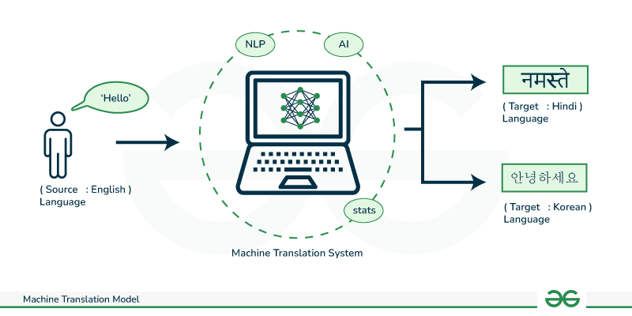

## Table of Contents

## What is machine translation and why is it important?

Machine translation is a type of technology that helps people translate words, sentences, or whole documents from one language to another using a computer. It's like having a digital translator that you can use anytime you need to understand or communicate in a different language. This technology uses special algorithms and lots of data to figure out how to translate text accurately. It's not perfect, but it's getting better all the time as more people use it and more data is collected.

Machine translation is important because it helps break down language barriers around the world. It makes it easier for people who speak different languages to communicate, work together, and share information. This can be really helpful for things like international business, travel, and even just making new friends from other countries. By using machine translation, we can learn about different cultures and ideas more easily, making the world feel a bit smaller and more connected.

## What are the basic components of a machine translation system?

The basic components of a machine translation system include a source text input, a translation engine, and an output in the target language. The source text is what you want to translate, like a sentence in English. The translation engine is the heart of the system. It uses algorithms to understand the source text and then convert it into the target language, like French or Spanish. The output is the translated text that you get at the end.

The translation engine can be based on different methods, like rule-based, statistical, or neural machine translation. Rule-based systems use a lot of grammar rules and dictionaries to translate. Statistical systems look at a lot of examples of translations to figure out the best way to translate. Neural machine translation, which is the newest type, uses artificial neural networks to learn how to translate. These networks are like the brain's way of processing information, and they get better at translating the more data they see.

To make the translation better, machine translation systems often use something called a language model. A language model helps the system understand how words are usually put together in the target language. This makes the translations sound more natural. So, when you use a machine translation system, it's not just translating word by word; it's trying to make the whole sentence sound right in the new language.

## How does the Seq2Seq model work in machine translation?

The Seq2Seq model, short for Sequence to Sequence, is a type of neural machine translation that helps translate text from one language to another. It works by using two main parts: an encoder and a decoder. The encoder takes in the sentence you want to translate, like a sentence in English, and turns it into a special code that the computer can understand. This code is called a "hidden state" and it captures the meaning of the whole sentence. The decoder then takes this hidden state and turns it back into words, but this time in the target language, like French or Spanish.

The magic of the Seq2Seq model happens because it can handle sentences of different lengths. The encoder reads the entire input sentence and compresses it into a fixed-size vector. This vector is then used by the decoder to generate the output sentence one word at a time. The model is trained on lots of example translations, so it learns how to make good translations. Over time, as it sees more examples, it gets better at understanding and translating between languages. This makes the Seq2Seq model very useful for machine translation because it can handle the complexities of human languages.

## What is the role of encoder and decoder in Seq2Seq models?

In Seq2Seq models, the encoder plays a crucial role by taking in the source sentence and turning it into a special code that the computer can work with. This code, called a hidden state, is like a summary of the whole sentence. The encoder reads the sentence from start to finish, and as it goes, it builds up this hidden state. It's kind of like packing all the meaning of the sentence into a small box. This hidden state is then passed on to the decoder, which is the next step in the process.

The decoder takes the hidden state from the encoder and uses it to start building the translated sentence in the target language. It works one word at a time, trying to figure out the best word to use next based on the hidden state and the words it has already chosen. The decoder keeps going until it thinks it has translated the whole sentence. The key thing here is that the encoder and decoder work together to make sure the translation makes sense and captures the meaning of the original sentence. By using this method, Seq2Seq models can handle the tricky job of translating between languages.

## How does attention mechanism improve Seq2Seq models?

The attention mechanism helps Seq2Seq models by making them focus on the most important parts of the sentence they are translating. Imagine you're reading a sentence in English and trying to translate it into French. Instead of just looking at the whole sentence once and trying to remember it all, the attention mechanism lets the model look back at different parts of the sentence as it's translating. This way, it can pay more attention to the words that are really important for understanding the meaning. This makes the translations more accurate because the model can better understand the context and the relationships between words.

For example, when translating a long sentence, the model might need to remember a word from the beginning of the sentence to make the end of the translation correct. With attention, the decoder can look back at the encoder's output and decide which parts are most relevant for each step of the translation. This is especially helpful for languages that have different word orders or for sentences with lots of details. By using attention, Seq2Seq models can handle these challenges better and produce translations that are more natural and accurate.

## What are the limitations of traditional Seq2Seq models?

Traditional Seq2Seq models have some limitations that can make them less effective at translating. One big problem is that they use a fixed-size hidden state to capture the meaning of the whole input sentence. This can be tricky because long sentences have a lot of information, and squeezing it all into one fixed-size code can cause the model to forget important details. This is known as the "vanishing gradient" problem, where the model struggles to remember information from the beginning of a long sequence. As a result, the translations might miss out on key parts of the original sentence, making them less accurate.

Another limitation is that traditional Seq2Seq models translate sentences one word at a time without looking back at the whole input sentence. This means they don't have a good way to focus on the most important parts of the sentence. For example, if a sentence has a lot of details, the model might get confused about which details are most important. This can lead to translations that sound unnatural or miss the point of the original sentence. The attention mechanism, which was developed later, helps solve this problem by letting the model look back at the input sentence and pay more attention to the parts that matter most.

## What is the PCT (Phrase-based Context-aware Translation) model and how does it differ from Seq2Seq?

The Phrase-based Context-aware Translation (PCT) model is a type of machine translation that focuses on translating phrases rather than whole sentences at once. It looks at the context around each phrase to make better translations. This means that PCT tries to understand how words and phrases work together in the sentence, not just translating them one by one. By doing this, PCT can capture the nuances and relationships between words better than some other methods.

PCT differs from Seq2Seq models because it doesn't use a single encoder and decoder to translate the whole sentence. Instead, PCT breaks the sentence into smaller parts and translates these parts while considering the context around them. This approach can lead to more accurate translations because it pays attention to how phrases fit into the bigger picture of the sentence. On the other hand, Seq2Seq models translate the entire sentence at once, which can sometimes miss out on the details and relationships between words that PCT tries to capture.

## How does the PCT model handle context and improve translation accuracy?

The PCT model improves translation accuracy by focusing on translating phrases and considering the context around them. Instead of translating the whole sentence at once, PCT breaks it into smaller parts. It then looks at how each part fits with the words before and after it. This helps the model understand the relationships between words better. For example, if a phrase has a special meaning because of the words around it, PCT can capture that and translate it more accurately. By paying attention to these details, PCT makes translations that sound more natural and true to the original meaning.

In contrast to Seq2Seq models, which use a single encoder and decoder to handle the entire sentence, PCT's approach allows it to be more flexible and context-aware. Seq2Seq models might struggle with long sentences because they compress all the information into one fixed-size code. This can cause them to miss important details. PCT, on the other hand, can handle these challenges better by focusing on smaller parts of the sentence and understanding how they work together. This makes PCT a useful tool for translating languages with different word orders or complex sentence structures.

## What are some advanced techniques used to enhance machine translation models?

Advanced techniques to enhance machine translation models include the use of transformer models, which have become very popular. Transformers work differently from traditional Seq2Seq models. They use something called self-attention, which helps the model understand how all the words in a sentence relate to each other. This makes the translations more accurate because the model can see the whole sentence at once and pay attention to the most important parts. Another technique is back-translation, where the model translates a sentence from the target language back to the source language. This helps the model learn from its own translations and improve over time.

Another advanced technique is fine-tuning, which means training the model on specific types of text or language pairs. This helps the model get better at translating certain kinds of content, like medical or legal documents. Fine-tuning can make the translations more accurate and useful for specific purposes. Additionally, using larger and more diverse datasets can also improve machine translation. The more examples the model sees, the better it gets at understanding and translating different languages. These advanced techniques help make machine translation more powerful and useful for breaking down language barriers.

## How can machine translation models be evaluated and what metrics are commonly used?

Machine translation models are evaluated by comparing their translations to human translations. One common way to do this is by using metrics like BLEU (Bilingual Evaluation Understudy) and METEOR (Metric for Evaluation of Translation with Explicit ORdering). BLEU looks at how many words in the machine translation match the words in the human translation. It also checks if the words are in the right order. METEOR is similar, but it also considers synonyms and different word forms, making it a bit more flexible. These metrics give a score that shows how good the machine translation is, with higher scores meaning better translations.

Another way to evaluate machine translation is by using human evaluation. This means asking people to read the machine translations and rate them on things like accuracy, fluency, and how well they keep the meaning of the original text. Human evaluation can be more accurate than automatic metrics because people can understand the context and nuances of language better than computers. However, it takes more time and can be more expensive. Both automatic and human evaluations help make machine translation models better by showing where they need to improve.

## What are the challenges faced when scaling machine translation models for multiple languages?

Scaling machine translation models to handle multiple languages is a big challenge because each language has its own rules and structures. When you add more languages, the model has to learn a lot more about how words and sentences work in each one. This means the model needs a lot more data to train on, and it can be hard to find enough good examples for every language. Also, some languages might not have as much data available, so the translations for those languages might not be as good. This can make the model uneven in how well it translates different languages.

Another challenge is that the model has to keep the translations accurate and natural-sounding for all languages at the same time. This can be tricky because what works well for one language might not work for another. For example, the order of words can be very different between languages, and the model has to figure out how to handle these differences. To make things even harder, languages can change over time, and the model has to keep up with these changes. This means the model needs to be updated regularly with new data to stay accurate and useful for all the languages it translates.

## How do state-of-the-art models like Transformer and BERT impact the field of machine translation?

State-of-the-art models like Transformer and BERT have made a big difference in machine translation by making translations more accurate and natural-sounding. The Transformer model uses a special way of understanding sentences called self-attention. This helps the model see how all the words in a sentence relate to each other, not just the words next to each other. By doing this, the Transformer can make better translations because it understands the whole sentence at once. BERT, on the other hand, is great at understanding the context of words. It can tell what a word means based on the words around it, which is really helpful for translating languages where the meaning can change depending on the context.

These models have changed the field of machine translation by making it easier to handle different languages and long sentences. They can learn from huge amounts of data and keep getting better over time. This means that translations are not only more accurate but also sound more like something a person would say. As a result, people can communicate and share information across languages more easily. The use of Transformer and BERT has shown that machine translation can keep getting better, helping to break down language barriers around the world.

## References & Further Reading

[1]: Bahdanau, D., Cho, K., & Bengio, Y. (2015). ["Neural Machine Translation by Jointly Learning to Align and Translate."](https://arxiv.org/abs/1409.0473) arXiv preprint arXiv:1409.0473.

[2]: Vaswani, A., Shazeer, N., Parmar, N., Uszkoreit, J., Jones, L., Gomez, A. N., ... & Polosukhin, I. (2017). ["Attention is All You Need."](https://arxiv.org/abs/1706.03762) Proceedings of the 31st International Conference on Neural Information Processing Systems.

[3]: Cho, K., Van Merriënboer, B., Bahdanau, D., & Bengio, Y. (2014). ["On the Properties of Neural Machine Translation: Encoder-Decoder Approaches."](https://arxiv.org/abs/1409.1259) arXiv preprint arXiv:1409.1259.

[4]: Koehn, P. (2009). ["Statistical Machine Translation."](https://www.cambridge.org/core/books/statistical-machine-translation/94EADF9F680558E13BE759997553CDE5) Cambridge University Press.

[5]: Devlin, J., Chang, M. W., Lee, K., & Toutanova, K. (2019). ["BERT: Pre-training of Deep Bidirectional Transformers for Language Understanding."](https://arxiv.org/abs/1810.04805) arXiv preprint arXiv:1810.04805.

[6]: Wu, Y., Schuster, M., Chen, Z., Le, Q. V., Norouzi, M., Macherey, W., ... & Dean, J. (2016). ["Google’s Neural Machine Translation System: Bridging the Gap between Human and Machine Translation."](https://arxiv.org/abs/1609.08144) arXiv preprint arXiv:1609.08144.

[7]: Arivazhagan, N., Bapna, A., Firat, O., Aharoni, R., Johnson, M., & Macherey, W. (2019). ["Massively Multilingual Neural Machine Translation in the Wild: Findings and Challenges."](https://arxiv.org/abs/1907.05019) arXiv preprint arXiv:1907.05019.