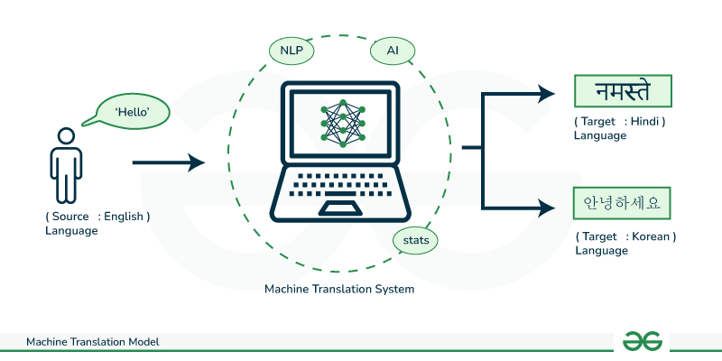

## Table of Contents

## What is machine translation?

Machine translation is the process of using computer programs to translate text or speech from one language to another. It helps people who speak different languages to communicate more easily. For example, if you want to read a book in French but you only understand English, a machine translation tool can help you by translating the French text into English.

There are different ways that machines can translate languages. Some methods use rules and dictionaries to change words from one language to another. Other methods use artificial intelligence and learn from lots of translated texts to make better translations. These AI methods can improve over time as they see more examples of how languages are used. Even though machine translation is very helpful, it's not always perfect and sometimes human translators are needed to make sure the translation is correct and sounds natural.

## How does machine translation differ from traditional translation methods?

Machine translation uses computers to change words from one language to another, while traditional translation is done by people. With machine translation, a computer program looks at the text and tries to translate it using rules or by learning from examples. This can be quick and help many people at the same time. On the other hand, traditional translation involves a person who understands both languages well and can make sure the translation sounds right and keeps the original meaning.

Machine translation can sometimes make mistakes because it might not understand the context or special meanings of words. For example, a computer might not know that "bank" can mean a place to keep money or the side of a river. A human translator would know this and choose the right word. Also, machine translation can improve over time as it learns from more translations, but it still might not catch all the little details that a person would notice. Traditional translation, while slower and more costly, often gives a more accurate and natural-sounding result because a human can think about the whole message and the culture behind the words.

## What are the basic components of a machine translation system?

A machine translation system has a few main parts that work together to change words from one language to another. The first part is the input module, where the text or speech that needs to be translated is put into the system. Next, there's a language analysis part that looks at the text to understand its structure, grammar, and meaning. This part often uses a big dictionary and rules to help figure out what the words mean. After that, the translation engine takes over. It uses different ways to turn the text from the first language into the second language. Some systems use rules to do this, while others use smart math models that learn from lots of examples.

The next part is the output module, which shows the translated text. Sometimes, there's also a part that checks the translation to make sure it makes sense and sounds right. This part can use more rules or other smart methods to fix any mistakes. All these parts together help the machine translation system work well. But, even with all these parts, machine translation can still make mistakes because it's hard for a computer to understand everything about language the way a person can.

## What are the main approaches to machine translation in machine learning?

There are two main ways to do machine translation using machine learning: rule-based methods and data-driven methods. Rule-based methods use a lot of rules about grammar and dictionaries to translate text. They look at the structure of sentences and try to change them from one language to another using these rules. This can work well for simple sentences, but it can be hard to make rules for all the different ways people use language.

Data-driven methods, on the other hand, learn how to translate by looking at a lot of examples of text that has already been translated. There are two popular types of data-driven methods: statistical machine translation (SMT) and neural machine translation (NMT). SMT uses math to find patterns in the examples and guess the best way to translate new text. NMT uses a type of artificial intelligence called neural networks to learn how to translate. It can be very good at understanding the context and meaning of sentences, which can make the translations sound more natural. Both SMT and NMT need a lot of examples to work well, but NMT often gives better results because it can learn more complex patterns in the language.

## Can you explain the difference between rule-based, statistical, and neural machine translation?

Rule-based machine translation uses a set of rules and dictionaries to translate text from one language to another. These rules help the computer understand the grammar and structure of sentences. It looks at each word and tries to find the right word in the other language. This method can work well for simple sentences, but it can be hard to make rules for all the different ways people use language. For example, if you say "I like apples," a rule-based system might translate it correctly, but it might struggle with more complex sentences or idioms.

Statistical machine translation (SMT) learns how to translate by looking at a lot of examples of text that has already been translated. It uses math to find patterns in these examples and guess the best way to translate new text. SMT can be good at understanding how words often go together, but it might not always get the context right. For example, if you say "bank," SMT might look at how often "bank" is used to mean a place for money or the side of a river in the examples it has seen, and choose the most common meaning. 

Neural machine translation (NMT) uses a type of artificial intelligence called neural networks to learn how to translate. It can be very good at understanding the context and meaning of sentences, which can make the translations sound more natural. NMT looks at whole sentences at once, not just individual words, which helps it capture the overall meaning better. For example, if you say "I'm feeling blue," NMT might understand that "blue" here means feeling sad, not the color, because it looks at the whole sentence and the context around the word.

## How does neural machine translation work?

Neural machine translation (NMT) works by using a type of artificial intelligence called neural networks to translate text from one language to another. It learns how to do this by looking at a lot of examples of text that have already been translated. When you give it a new sentence to translate, NMT looks at the whole sentence at once, not just individual words. This helps it understand the overall meaning and context better. For example, if you say "I'm feeling blue," NMT might understand that "blue" means feeling sad, not the color, because it looks at the whole sentence and the context around the word.

The way NMT works is a bit like how a brain learns. It uses something called an encoder to change the sentence in the first language into a special code that the computer can understand. Then, it uses a decoder to change that code back into a sentence in the second language. The encoder and decoder are made up of many layers of math that help the computer learn from the examples. As NMT sees more examples, it gets better at translating because it can find more patterns in the language. This makes the translations sound more natural and correct over time.

## What are some common challenges faced in machine translation?

Machine translation faces many challenges. One big problem is understanding the context of words. Words can mean different things depending on the sentence. For example, "bank" can mean a place to keep money or the side of a river. A machine might not know which meaning to use without understanding the whole sentence. Another challenge is dealing with idioms and expressions that don't translate directly from one language to another. If you say "it's raining cats and dogs," a machine might translate it word for word, which would not make sense in another language.

Another issue is grammar and sentence structure. Different languages have different ways of putting sentences together. For example, in English, we say "I love you," but in Japanese, it might be "Anata ga suki desu," which has a different order. Machines can struggle to change the order correctly while keeping the meaning the same. Also, machine translation can have trouble with rare words or new words that it hasn't seen before. If a machine doesn't have enough examples of a word, it might not know how to translate it correctly.

Lastly, cultural differences can make translation hard. Each language has its own culture and ways of saying things. A machine might not understand these differences and could translate something in a way that sounds strange or even offensive in another language. For example, saying "thumbs up" might be good in one culture but bad in another. These challenges show why machine translation, while helpful, sometimes needs human help to get it right.

## What metrics are used to evaluate the performance of machine translation systems?

To evaluate how well machine translation systems work, people use different metrics. One common metric is BLEU (Bilingual Evaluation Understudy), which looks at how similar the machine's translation is to human translations. BLEU does this by checking how many words and phrases in the machine's translation match those in the human translations. It gives a score from 0 to 1, where a higher score means the machine's translation is more like a human's. Another metric is METEOR (Metric for Evaluation of Translation with Explicit ORdering), which also compares the machine's translation to human translations but pays more attention to meaning and word order.

Another important metric is TER (Translation Edit Rate), which measures how many changes a human would need to make to the machine's translation to make it perfect. A lower TER score means the machine's translation is closer to being correct. There's also the CHRF (Character n-gram F-score), which looks at smaller parts of words to see how well the machine translates. Each of these metrics helps us understand different parts of how good a machine translation system is, but none of them are perfect. Sometimes, human judgment is still the best way to see if a translation sounds right and keeps the original meaning.

## How can machine translation systems be improved through machine learning?

Machine translation systems can be improved through machine learning by using more and better data to train them. When a system sees more examples of text that has already been translated, it can learn more about how languages work. This means using lots of different texts from books, websites, and other places. The more varied the examples, the better the system can understand different ways people use language. Also, making sure the data is good quality helps a lot. If the translations in the examples are correct and sound natural, the system will learn to make better translations too.

Another way to improve machine translation is by using better machine learning models. For example, neural machine translation (NMT) uses neural networks, which are like math models that can learn complex patterns. By making these models bigger and more detailed, they can understand language better. Researchers also try different ways to train these models, like changing how they learn from mistakes or using special tricks to make them focus on important parts of the text. All these things together help machine translation systems get better over time, making translations more accurate and natural-sounding.

## What are the latest advancements in machine translation using deep learning techniques?

The latest advancements in machine translation using deep learning techniques have focused on improving the accuracy and naturalness of translations. One major advancement is the use of transformer models, which are a type of neural network that can understand the context of words better than older models. Transformers use something called "attention mechanisms" to focus on different parts of the sentence when translating. This helps them capture the meaning of the whole sentence, not just individual words. For example, if you say "I'm feeling blue," a transformer model can understand that "blue" means feeling sad, not the color, because it looks at the whole sentence and the context around the word.

Another important advancement is the use of pre-trained models and transfer learning. These models are first trained on a huge amount of text in many languages, which helps them learn general language patterns. Then, they are fine-tuned on specific translation tasks, which makes them even better at translating between certain languages. This approach has led to big improvements in translation quality because the models start with a good understanding of language and then get even better at specific tasks. Researchers are also working on making these models smaller and faster, so they can be used on phones and other devices where space and power are limited.

## How do transfer learning and multilingual models impact machine translation?

Transfer learning and multilingual models have made a big difference in how well machine translation works. Transfer learning means starting with a model that has already learned a lot about language from a huge amount of text. Then, you teach it more about translating between specific languages. This makes the model better at understanding language in general before it focuses on a specific task. For example, if you start with a model that knows a lot about English and Spanish, it can learn to translate between those languages more quickly and accurately.

Multilingual models take this a step further by learning to translate between many languages at the same time. Instead of having separate models for each language pair, like English to Spanish and Spanish to French, a multilingual model can handle all these translations together. This makes the translations more consistent and helps the model understand how different languages relate to each other. By using transfer learning and multilingual models, machine translation systems can give better and more natural-sounding translations for many different languages.

## What are the ethical considerations and potential biases in machine translation?

Machine translation can have ethical issues and biases that come from the data it uses to learn. If the data has mistakes or is not fair, the translations can be wrong or biased too. For example, if the data has more examples of men in certain jobs, the machine might always translate job titles to be male. This can make the translations unfair and not represent everyone equally. Also, machine translation might not work as well for languages that don't have a lot of data, which can leave out people who speak those languages.

Another ethical problem is privacy. When people use machine translation, they might share personal or sensitive information. If the system doesn't keep this information safe, it can be a big problem. Also, machine translation can sometimes change the meaning of what someone says, especially if the text has special meanings or cultural references. This can lead to misunderstandings or even harm if the translation is used in important situations like legal or medical settings. It's important for people who make these systems to think about these issues and try to make them fair and safe for everyone.