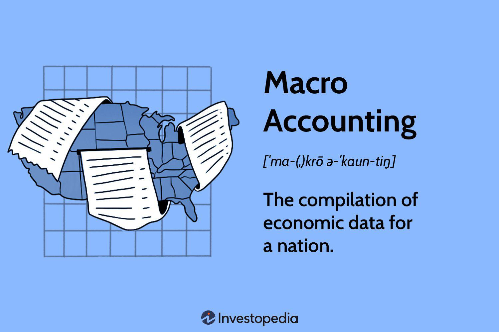

In the dynamic landscape of modern financial markets, the convergence of economic measurement, macro accounting, financial analysis, and algorithmic trading forms the backbone of strategic financial decision-making. These interconnected disciplines collectively shape our understanding of economic health and inform trading strategies, providing key insights into the mechanisms that drive economies and financial systems.

Economic measurement is essential for gauging the vitality of an economy. Indicators such as Gross Domestic Product (GDP), inflation rates, and employment figures serve as comprehensive metrics that represent overarching economic conditions. These indicators are crucial, not only for government policy formulation but also for guiding investor decisions, impacting both macroeconomic frameworks and individual investment strategies.



Macro accounting provides an expansive view of economic data, distinguishing itself from micro accounting through its focus on aggregate economic processes rather than individual entities. This discipline empowers policymakers and investors with critical macroeconomic data, often sourced from periodical government releases, allowing for informed decision-making aimed at stabilizing and growing the economy.

Financial analysis complements these endeavors by offering methodologies to assess a company's health and predict market trends. Techniques such as fundamental analysis, which evaluates financial statements, and technical analysis, which examines historical market data, create a nuanced understanding of financial markets. These analyses are inextricably linked with macroeconomic conditions, influencing and being influenced by the broader economic landscape.

Algorithmic trading introduces a layer of efficiency by leveraging technology to enhance trading speed, accuracy, and efficiency. Algorithms, driven by real-time economic data, optimize trading strategies, allowing market participants to swiftly react to economic indicators and market shifts. This seamless integration revolutionizes market interactions, promoting a data-driven environment where precision and timing are paramount.

Understanding the interconnected nature of these disciplines highlights the necessity for a holistic approach within financial markets. The integration of robust economic measurement, macro accounting insights, rigorous financial analysis, and cutting-edge algorithmic trading is pivotal in navigating complex financial ecosystems. This synthesis not only provides a clearer picture of economic health but also empowers stakeholders to adopt innovative trading strategies grounded in sound economic principles.

## Table of Contents

## Economic Measurement and Indicators

Economic measurement and indicators are crucial tools for understanding the underlying dynamics of an economy. Key metrics such as Gross Domestic Product (GDP), inflation, and employment figures provide essential snapshots of economic health.

GDP is one of the most vital indicators, representing the total market value of all final goods and services produced within a country over a specific period, typically measured quarterly or annually. It is used to gauge the size and growth rate of an economy, providing insights into whether an economy is expanding or contracting. An increase in GDP generally signifies a growing economy, while a decrease may indicate economic distress. The formula for GDP can be expressed as:

$$
\text{GDP} = C + I + G + (X - M)
$$

where $C$ is consumption, $I$ is investment, $G$ is government spending, $X$ is exports, and $M$ is imports. Changes in GDP influence government policy decisions, often guiding interest rates and tax policies to either stimulate or cool down economic activities.

Inflation measures the rate at which the general level of prices for goods and services is rising, consequently eroding purchasing power. It is typically expressed as an annual percentage. A moderate level of inflation is a sign of a growing economy, but hyperinflation or deflation can pose significant challenges. Central banks monitor inflation closely, often adjusting interest rates to maintain stability. The Consumer Price Index (CPI) and the Producer Price Index (PPI) are common measures of inflation.

Employment figures, such as the unemployment rate, highlight the percentage of the labor force that is jobless and actively seeking employment. These figures reflect the economy's performance, signaling the availability or lack thereof of job opportunities, impacting social stability and consumer confidence. High unemployment can lead to decreased consumer spending and slowed economic growth, prompting governments to implement fiscal and monetary policies to boost job creation.

These economic indicators are fundamental to policymakers and investors. Government agencies, such as central banks, utilize these metrics to formulate policies that manage economic growth, control inflation, and address unemployment. For investors, these indicators help in making informed decisions, predicting market trends, and assessing investment risks. For instance, high GDP growth may lead investors to pursue equities, whereas rising inflation figures might influence interest rates and bond yields.

In summary, understanding and interpreting economic indicators like GDP, inflation, and employment are critical for assessing economic performance. They provide valuable insights that directly impact decision-making processes for governments and investors, guiding policy adjustments and investment strategies to navigate economic landscapes effectively.

## The Role of Macro Accounting

Macro accounting plays a critical role in the structuring and analysis of broad economic data sets that are essential for understanding and steering national economies. It is primarily concerned with the larger-scale economic indicators that reflect the health of the economy as a whole, such as Gross Domestic Product (GDP), national income, and expenditure flows.

### Differentiating Macro and Micro Accounting

Macro accounting, as implied by its name, focuses on the aggregate outcomes of economic activity. It examines the economy at a systemic level, compiling data that offer insights into the overall economic performance, growth rates, inflation, and employment [statistics](/wiki/bayesian-statistics). This is distinct from micro accounting, which zeroes in on individual businesses, households, and their financial transactions, focusing on the granular, detailed accounting practices that inform the financial health of smaller units.

The implications of these distinctions are significant for economic policy and financial markets. Macro accounting data guide policy decisions by providing key indicators that policy makers use to formulate fiscal and monetary policies. On the other hand, micro accounting facilitates operational decisions within companies, focusing on financial soundness and accountability on a smaller scale. While micro accounting informs internal corporate strategies, macro accounting underpins broader economic strategies and reforms.

### Importance for Policy Makers and Investors

For policy makers, macroeconomic data serve as foundational tools to devise policies that aim to achieve sustainable economic growth, control inflation, and reduce unemployment. Regular and reliable macro accounting reports are essential for forecasting economic trends and preparing budgetary projections. For instance, information on GDP growth rates helps in designing tax policies and public spending.

For investors, macro accounting provides comprehensive data that help in evaluating the economic environment and making informed investment decisions. The periodical release of macroeconomic statistics—like those from the Bureau of Economic Analysis or the Office for National Statistics—directly influences investor confidence and market behaviors. Investors analyze trends in macro accounting reports to assess economic stability and predict the future direction of markets.

Macro accounting encompasses tools such as national income accounting, which aggregates data about a nation's income and spending, and input-output tables that illustrate relationships between different sectors within an economy. These tools are instrumental in projecting economic outcomes and identifying drivers of growth and recession.

In summary, macro accounting functions as an essential mechanism for compiling and interpreting extensive economic data, differentiating it from the more focused micro accounting processes. Its role is indispensable for forming well-rounded economic policies and guiding investment decisions, underlining its significance in shaping financial strategies and economic governance.

## Financial Analysis Techniques

Financial analysis techniques are critical tools for evaluating the financial health of companies and forecasting market trends. Two primary methods employed in financial analysis are [fundamental analysis](/wiki/fundamental-analysis) and technical analysis. Each offers distinct insights, serving various investor needs and market conditions.

### Fundamental Analysis

Fundamental analysis involves assessing a company’s intrinsic value by examining related economic, financial, and other qualitative and quantitative factors. This methodology aims to determine a company's fair market value by analyzing monetary attributes such as earnings, expenses, assets, and liabilities. Key components of fundamental analysis include:

- **Earnings Per Share (EPS):** This metric measures a company's profit allocated to each share of its common stock, calculated as:  
$$
  \text{EPS} = \frac{\text{Net Income} - \text{Dividends on Preferred Stock}}{\text{Average Outstanding Shares}}

$$

- **Price-to-Earnings Ratio (P/E):** This ratio compares a company’s share price to its earnings per share, providing insights into market expectations of growth. It is calculated as:  
$$
  \text{P/E Ratio} = \frac{\text{Market Value per Share}}{\text{Earnings Per Share}}

$$

- **Return on Equity (ROE):** An indicator of financial performance, ROE measures a corporation's profitability relative to equity:  
$$
  \text{ROE} = \frac{\text{Net Income}}{\text{Shareholder's Equity}}

$$

By examining these metrics, analysts can forecast a company's future performance and decide if its stock is overvalued, undervalued, or fairly priced.

### Technical Analysis

Technical analysis focuses on statistical trends gathered from trading activity, such as price movement and [volume](/wiki/volume-trading-strategy). Unlike fundamental analysis, it considers historical market data to predict future price movements. Key techniques include:

- **Moving Averages:** This technique smooths price data to identify the direction of the trend. For example, the simple moving average (SMA) is calculated by taking an average of a security's prices over a set period.

- **Relative Strength Index (RSI):** A momentum oscillator that measures the speed and change of price movements. The RSI value ranges from 0 to 100, with high and low levels marked at 70 and 30, respectively. It is formulated as:  
$$
  \text{RSI} = 100 - \frac{100}{1 + \frac{\text{Average Gain}}{\text{Average Loss}}}

$$

- **Bollinger Bands:** These are volatility bands placed above and below a moving average. Volatility is based on the standard deviation, which changes as volatility increases or decreases.

### Interplay with Macroeconomic Conditions

Both fundamental and technical analysis are influenced by overarching macroeconomic conditions. For instance, during periods of economic growth, companies typically experience higher sales and profitability, resulting in more favorable fundamental indicators. Conversely, economic downturns can negatively impact these metrics.

In technical analysis, macroeconomic data can cause immediate shifts in market sentiment reflected in price movements. Economic indicators such as interest rates significantly sway market trends, causing price patterns that technical analysts can exploit.

Overall, financial analysis techniques are invaluable for investors aiming to make informed decisions. By incorporating insights from macroeconomic conditions, analysts can enhance their understanding of market dynamics, leading to more accurate forecasts and investment strategies.

## Algorithmic Trading and Efficiency

Algorithmic trading refers to the use of computer programs and algorithms to execute trades in financial markets with minimal human intervention. Its rapid adoption has transformed trading by enhancing efficiency, speed, and accuracy. High-frequency trading, a subset of [algorithmic trading](/wiki/algorithmic-trading), allows market participants to execute trades in fractions of a second, far surpassing human capabilities.

Algorithms play a pivotal role in processing large datasets and making swift trading decisions based on predefined criteria. The efficiency gained through automation reduces transaction costs and optimizes the timing of trade execution, which is crucial in markets where prices fluctuate rapidly. Market [liquidity](/wiki/liquidity-risk-premium) is often improved as algorithms facilitate a high volume of trades, thus narrowing bid-ask spreads and providing more opportunities for traders to enter and [exit](/wiki/exit-strategy) positions.

Economic indicators, such as GDP growth rates, inflation figures, and employment data, significantly influence algorithmic trading strategies. Algorithms analyze these macroeconomic indicators to adjust portfolio allocations, identify [arbitrage](/wiki/arbitrage) opportunities, and capitalize on anticipated market movements. For instance, an unexpected rise in unemployment might trigger algorithms to sell equities and purchase government bonds as traders predict a potential economic slowdown.

Consider the following Python example, illustrating a simplistic approach to incorporating economic indicators into an algorithmic trading strategy:

```python
import yfinance as yf  # For more datasets, visit: https://paperswithbacktest.com/datasets
from datetime import datetime, timedelta
import numpy as np

# Sample economic indicator: monthly unemployment rate
unemployment_rate = {
    '2023-01': 4.0,
    '2023-02': 4.1,
    '2023-03': 4.2,
    # Add more months as needed
}

# Example strategy: reduced equity exposure as unemployment rises
def trading_strategy(date_str, ticker):
    data = yf.download(ticker, start=date_str, end=(datetime.strptime(date_str, '%Y-%m') + timedelta(days=30)).strftime('%Y-%m-%d'))
    latest_unemployment = unemployment_rate.get(date_str, None)

    if latest_unemployment:
        exposure = max(0, 1 - (latest_unemployment - 3.5) / 10)
        print(f"Date: {date_str}, Unemployment Rate: {latest_unemployment}%, Equity Exposure: {exposure*100}%")

        # Adjusted position size based on unemployment rate
        position_value = np.sum(data['Close'] * exposure)
        print(f"Suggested position value: ${position_value:.2f}")

# Example usage
trading_strategy('2023-03', 'AAPL')
```

This script demonstrates a simplified approach where exposure to a stock is inversely proportional to the unemployment rate, with a baseline rate of 3.5%. Strategies may involve more complex models, incorporating additional indicators and dynamic market conditions.

Algorithmic trading harnesses real-time data to refine strategies continually, offering traders the ability to adapt to changing economic landscapes. Despite its advantages, challenges remain, including the need for rigorous risk management and the potential for market disruptions caused by algorithmic errors or unexpected economic shocks. As financial markets continue to evolve, algorithmic trading will remain instrumental in shaping the landscape, driven by advancements in technology and economic analysis.

## Integrating Economic Measurement with Algo Trading

Macroeconomic indicators, such as Gross Domestic Product (GDP), inflation rates, and employment figures, play a critical role in developing algorithmic trading strategies. These indicators provide valuable insights into the economic environment, enabling traders to design algorithms that can anticipate and respond to market changes effectively. 

For instance, GDP growth can signal economic expansion, prompting algorithmic strategies to focus on bullish market movements. Conversely, rising inflation may lead to the anticipation of tighter monetary policies, prompting strategies to hedge against potential risks. By incorporating these macroeconomic indicators, algorithms can better align with market realities, optimizing their predictive accuracy and enhancing trading performance.

Real-time data is vital in refining trading algorithms. The ability to access and process real-time economic data allows algorithmic trading systems to update their strategies promptly in response to new information. This real-time processing capability ensures that trading algorithms remain relevant and responsive in fast-paced market environments. 

Consider a scenario where an unexpected drop in employment figures is reported. An algorithm designed to react to such data can immediately adjust its trading strategy, for example, by selling equities or investing in government bonds, which are often viewed as safe havens during economic downturns. This adaptability is crucial for maintaining a competitive edge in algorithmic trading.

Several case studies highlight the successful integration of economic data into algorithmic trading. A notable example is the use of sentiment analysis in conjunction with economic indicators. By analyzing news articles, social media, and economic data, algorithms can gauge market sentiment and predict potential market movements. Such systems have been employed by hedge funds to detect shifts in investor sentiment more quickly than traditional trading approaches allow.

Another case study involves [machine learning](/wiki/machine-learning) algorithms that incorporate macroeconomic indicators to forecast asset price movements. These algorithms learn from historical data, adjusting their models based on economic conditions. Banks and financial institutions utilize these systems to enhance their trading strategies, often achieving greater returns compared to more conventional methods.

In conclusion, integrating economic measurement with algorithmic trading provides significant advantages by enabling trading systems to react swiftly and accurately to changes in macroeconomic conditions. Utilizing real-time data, these algorithms can continuously refine their strategies, ensuring that they remain aligned with current market environments. The incorporation of economic indicators into algorithmic trading strategies not only increases efficiency but also enhances the ability to predict and capitalize on market movements.

## Challenges and Opportunities

Analysts and traders synthesize data from diverse economic fields to develop comprehensive trading strategies, confronting several challenges in the process. One major challenge is the sheer volume and complexity of data, which includes macroeconomic indicators, financial statements, and real-time market data. As these datasets come from disparate sources, data consistency and quality can vary, making it difficult to derive accurate insights. Additionally, the rapid pace of financial markets demands near-instantaneous analysis, necessitating robust data processing capabilities and advanced computational tools.

The integration of macroeconomic data into trading strategies presents significant opportunities. By combining macroeconomic indicators with financial analysis, traders can gain a deeper understanding of market conditions, enabling them to anticipate economic shifts and adjust their strategies accordingly. For example, incorporating GDP growth rates, inflation trends, and employment figures into model algorithms can provide a more nuanced view of asset pricing and risk management.

Looking ahead, future trends in economic measurement and algorithmic trading are likely to be shaped by advancements in data analytics and machine learning. The rise of big data technologies allows for enhanced data processing and the effective handling of large, unstructured datasets. This evolution in data management supports the development of more sophisticated trading algorithms capable of learning from historical patterns and adapting to new information in real time.

Algorithmic trading is poised to become more personalized and predictive, leveraging machine learning models that can tailor strategies to individual trader preferences while also accounting for broader market conditions. These advancements will likely lead to more efficient markets, characterized by reduced transaction costs and improved liquidity.

Furthermore, the increasing integration of [artificial intelligence](/wiki/ai-artificial-intelligence) into data analysis tools can automate complex decision-making processes, freeing human analysts to focus on strategic planning and innovation. However, this shift also presents challenges in ensuring the transparency and interpretability of AI-driven decisions, which is critical for maintaining trust and compliance in financial markets.

In conclusion, while challenges persist in the synthesis of diverse economic data, ongoing technological advancements offer promising opportunities to refine trading strategies and drive market efficiencies. As economic measurement and trading technologies continue to evolve, stakeholders must adapt to harness these innovations effectively.

## Conclusion

In modern financial markets, the integration of economic measurement, macro accounting, financial analysis, and algorithmic trading reveals a compelling narrative of interconnectedness. This holistic approach not only provides a comprehensive understanding of economic health but also enhances trading strategies and policy-making processes. Each element, from economic indicators to trading algorithms, plays a crucial role in depicting a detailed picture of the economic landscape.

Efficiency optimization is at the heart of both economic and financial success. By leveraging macroeconomic data and financial analysis, stakeholders can identify trends, mitigate risks, and make informed decisions that boost market efficiency. Algorithmic trading, for example, utilizes economic indicators to refine strategies with speed and precision, thereby optimizing trading outcomes.

This interconnected framework encourages stakeholders, including policymakers, investors, and analysts, to adopt a data-driven mindset. Such an approach ensures decisions are grounded in objective economic principles, reducing uncertainty and fostering stability in financial markets. By embracing this comprehensive strategy, stakeholders can derive significant insights, ensuring resilience and growth in a rapidly changing economic environment.

A data-driven approach, fortified by sound economic principles, is paramount for navigating the complexities of modern financial systems. This integration not only streamlines processes but also propels economic advancement, ultimately contributing to a more robust and adaptive market landscape. Therefore, fostering a culture of continuous learning and adaptation is crucial for stakeholders aiming to capitalize on the evolving economic dynamics and technological advancements in financial analysis and trading.

## References & Further Reading

1. **Primary Sources on Economic Measurement and Financial Analysis**:
   - **Government Reports**:
     - "Economic Indicators" by the U.S. Department of Commerce offers comprehensive insights on GDP, inflation, and employment figures. Access it at [www.commerce.gov](https://www.commerce.gov).
     - "World Economic Outlook" published by the International Monetary Fund (IMF) provides global economic trends and analytic insights. Explore it at [www.imf.org](https://www.imf.org).

   - **Academic Journals**:
     - The "Journal of Economic Perspectives" publishes scholarly articles on economic measurement and analysis practices.
     - "The Quarterly Journal of Economics" covers extensive research on financial analysis techniques and their implications for market trends.

2. **Books and Articles on Algorithmic Trading**:
   - "Algorithmic Trading: Winning Strategies and Their Rationale" by Ernie Chan provides practical strategies for leveraging algorithms in trading.
   - "Flash Boys: A Wall Street Revolt" by Michael Lewis examines the impact of high-frequency trading on financial markets, offering a narrative account of its evolution and effects.

3. **Online Resources for Continuous Learning**:
   - **Courses and Tutorials**:
     - Coursera and edX offer courses such as "Financial Markets" by Yale University and "Algorithmic Trading Strategies" to enhance understanding.

   - **Websites and Blogs**:
     - Investopedia at [www.investopedia.com](https://www.investopedia.com) provides up-to-date articles and tutorials on economic and financial strategies.
     - QuantInsti's blog offers in-depth articles and case studies regarding algorithmic trading at [www.quantinsti.com](https://www.quantinsti.com).

These resources collectively provide foundational knowledge and practical insights for those interested in economic measurement, financial analysis, and algorithmic trading strategies, promoting a robust understanding of modern financial markets.

