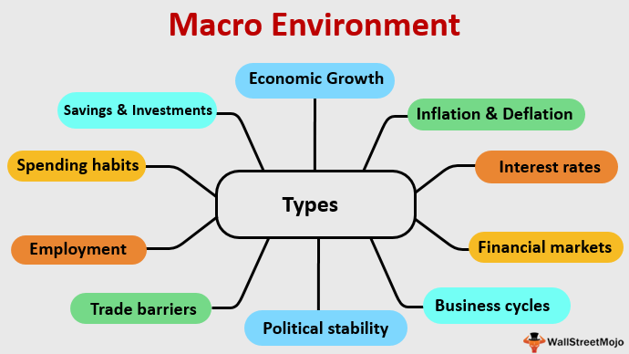

## Table of Contents

## What is the macro environment in economics?

The macro environment in economics refers to the broader factors and conditions that affect an entire economy rather than just a single business or industry. It includes elements like economic growth, inflation rates, unemployment levels, and interest rates. These factors are important because they shape the overall business climate and can influence how companies operate and plan for the future.

For example, if the economy is growing, businesses might see more opportunities to expand because people have more money to spend. On the other hand, high inflation can make things more expensive and reduce what people can buy, which might hurt businesses. Governments and central banks often try to manage these macro factors to keep the economy stable and help it grow. Understanding the macro environment helps businesses make better decisions and prepare for changes.

## How does the macro environment affect businesses and consumers?

The macro environment has a big impact on businesses because it sets the stage for how they can operate. When the economy is doing well, with low unemployment and steady growth, businesses often find it easier to make money. They can sell more products and services because people have jobs and money to spend. But if the economy is struggling, with high unemployment or inflation, businesses might have a hard time. They might need to cut costs, like reducing staff or lowering prices, to stay afloat. Interest rates also matter a lot. If they are high, it can be more expensive for businesses to borrow money for things like expanding or investing in new projects.

For consumers, the macro environment influences their daily lives and financial well-being. When the economy is strong, people usually feel more confident about spending money on things they want, not just what they need. They might buy new cars, go on vacations, or upgrade their homes. But when the economy is weak, people often worry about their jobs and money, so they spend less and save more. Inflation is another big [factor](/wiki/factor-investing). If prices are going up fast, people's money doesn't go as far, and they might have to cut back on spending. Overall, the macro environment shapes how much money people have and what they can afford, which in turn affects their quality of life.

## What are the key components of the macro environment?

The macro environment includes several important parts that affect the whole economy. One key part is economic growth, which is about how fast the economy is getting bigger. When the economy grows, businesses usually do well because people have more money to spend. Another important part is inflation, which is when prices go up. If inflation is high, it can make things more expensive and reduce what people can buy. Unemployment is also a big part of the macro environment. It shows how many people are out of work. When unemployment is low, more people have jobs and money to spend, which is good for businesses.

Interest rates are another key component. They affect how much it costs to borrow money. If interest rates are low, businesses and people can borrow more easily, which can help the economy grow. But if interest rates are high, borrowing becomes more expensive, and it can slow down the economy. Government policies also play a big role in the macro environment. Governments can use policies to try to control things like inflation and unemployment. For example, they might change taxes or spending to help the economy. All these parts together make up the macro environment and shape how well the economy and businesses do.

## Can you explain the difference between macro environment and micro environment?

The macro environment and micro environment are two different levels that affect businesses. The macro environment is all about the big picture stuff that impacts the whole economy. It includes things like how fast the economy is growing, if prices are going up a lot, how many people have jobs, and what the government is doing. These factors are important because they set the stage for how businesses can operate. For example, if the economy is doing well, businesses might find it easier to make money because people have more to spend.

The micro environment, on the other hand, focuses on the smaller, more specific factors that directly affect a single business or industry. This includes things like the company's customers, suppliers, competitors, and even the employees. These are the elements that a business can often influence or react to more directly. For instance, a business might change its products based on what customers want or negotiate better deals with suppliers. While the macro environment sets the overall context, the micro environment is about the day-to-day interactions and decisions that a business makes to succeed in that context.

## How do economic indicators reflect changes in the macro environment?

Economic indicators are like signals that tell us about changes in the macro environment. They help us understand if the economy is doing well or if it's struggling. For example, when the Gross Domestic Product (GDP) goes up, it means the economy is growing. People are buying more stuff, and businesses are making more money. But if the GDP goes down, it might mean the economy is shrinking, and people are spending less. Another important indicator is the unemployment rate. If it's low, more people have jobs, which is good for the economy because they can spend money. But if unemployment is high, it can be a sign that the economy is not doing so well.

Inflation is another key indicator that shows how prices are changing. When inflation is high, it means prices are going up fast, and people's money doesn't go as far. This can make it harder for people to buy things and can hurt the economy. On the other hand, if inflation is too low, it might mean that people aren't spending enough, which can also be a problem. Interest rates are also important because they affect how much it costs to borrow money. When interest rates are low, it's easier for businesses and people to borrow, which can help the economy grow. But if interest rates are high, borrowing becomes more expensive, and it can slow down the economy. By watching these indicators, we can get a good idea of what's happening in the macro environment and how it might change in the future.

## What role does government policy play in shaping the macro environment?

Government policy plays a big role in shaping the macro environment. Governments can use different policies to help the economy grow or to keep it stable. For example, they might change taxes or how much money they spend. If the government lowers taxes, people and businesses have more money to spend, which can help the economy grow. On the other hand, if the government spends more money on things like roads or schools, it can create jobs and also help the economy.

Another way government policy affects the macro environment is through rules and regulations. Governments can make laws that affect how businesses operate. For example, they might set rules about the environment or workers' rights. These rules can make it harder or easier for businesses to do well. Also, central banks, which are often part of the government, can change interest rates. If they lower interest rates, it becomes cheaper to borrow money, which can help the economy grow. But if they raise interest rates, borrowing becomes more expensive, and it can slow down the economy. By using these tools, governments can try to keep the economy healthy and help it grow.

## How do global events influence the macro environment?

Global events can have a big impact on the macro environment of a country's economy. Things like wars, pandemics, or big changes in other countries can shake things up. For example, if there's a war in a place that makes a lot of oil, it can make oil prices go up everywhere. This can make things more expensive and slow down the economy. Or if there's a big health crisis like a pandemic, it can make people stay home and not spend money, which can hurt businesses and lead to more people being out of work.

These events can also affect trade between countries. If one country is having big problems, it might buy less from other countries, which can hurt those economies too. For example, if a big trading partner like China has a slowdown, it can mean less business for countries that sell things to China. Governments and businesses need to pay attention to what's happening around the world because these events can change how well the economy does at home. By understanding these global influences, they can better plan for the future and try to protect their economy from big shocks.

## What are some tools used to analyze the macro environment?

To understand the macro environment, people use different tools to look at the big picture of the economy. One common tool is economic indicators like Gross Domestic Product (GDP), which shows how fast the economy is growing. Another important indicator is the unemployment rate, which tells us how many people are out of work. Inflation rates are also key because they show how quickly prices are going up. By keeping an eye on these indicators, people can get a good sense of how the economy is doing and where it might be headed.

Another tool is economic models, which help people predict what might happen in the economy. These models use math and data to guess how things like interest rates or government spending might affect the economy. For example, a model might show that if the government spends more money, it could help the economy grow. People also use something called SWOT analysis to look at the macro environment. SWOT stands for Strengths, Weaknesses, Opportunities, and Threats. It helps businesses see the big picture and plan for the future by understanding the good and bad things that might affect them.

## How can businesses adapt to changes in the macro environment?

Businesses can adapt to changes in the macro environment by paying close attention to economic indicators like GDP, unemployment, and inflation. For example, if they see that the economy is slowing down and people are spending less, they might decide to cut costs or change their products to meet the new demand. They could also look at interest rates. If rates are low, it might be a good time to borrow money for new projects or expansion. By understanding these big-picture factors, businesses can make smart decisions to keep going strong even when things change.

Another way businesses can adapt is by using tools like SWOT analysis to understand their strengths, weaknesses, opportunities, and threats. This helps them see where they stand in the big picture and plan for the future. For instance, if a global event like a pandemic affects their supply chain, they might need to find new suppliers or change how they do things. Being flexible and ready to change is key. By keeping an eye on the macro environment and using these tools, businesses can stay ahead of the game and keep doing well no matter what happens.

## What are the long-term trends affecting the macro environment?

Long-term trends that affect the macro environment include things like changes in technology, demographics, and the environment. Technology is always getting better and faster. This can help businesses do more with less and reach more people. But it can also make old ways of doing things less important. For example, more people are shopping online now, which changes how stores work. Demographics are about the people in a country, like how many are old or young. If a country has a lot of older people, it might spend more on health care and less on schools. If there are more young people, there might be more jobs and new ideas. The environment is another big trend. Things like climate change can make the economy harder to predict. It can change where people live and work and even how much food we can grow.

Another long-term trend is globalization, which means countries are more connected than ever. This can be good because it lets businesses sell things all over the world. But it can also be hard because if one country has problems, it can affect others. For example, if a big country like China slows down, it can hurt businesses everywhere. Governments also play a big role in long-term trends. They can make rules that help or hurt the economy. For example, they might make laws to protect the environment, which can change how businesses work. By understanding these trends, businesses and governments can plan for the future and try to make the economy better for everyone.

## How does the macro environment impact international trade and investment?

The macro environment has a big effect on international trade and investment. When the economy of a country is doing well, with low unemployment and steady growth, it often means people and businesses have more money to spend on things from other countries. This can make international trade grow because more goods and services are being bought and sold across borders. On the other hand, if a country's economy is struggling, with high unemployment or inflation, it can make international trade harder. Businesses might not want to buy as much from other countries because they are worried about their own money problems. Also, if interest rates are high in one country, it can make it more expensive for businesses to borrow money for big projects like building new factories in other countries, which can slow down international investment.

Global events and long-term trends also play a big role in international trade and investment. For example, if there is a war or a big health crisis like a pandemic, it can mess up supply chains and make it harder for countries to trade with each other. These events can also make businesses more cautious about investing in other countries because they are worried about what might happen next. Long-term trends like technology and climate change can change what countries trade and invest in. Better technology can make it easier to trade things like software and services across the world. But climate change can make it harder to grow certain crops or use certain places for factories, which can change where countries invest and what they trade.

## What are some advanced models used to forecast changes in the macro environment?

One advanced model used to forecast changes in the macro environment is the Dynamic Stochastic General Equilibrium (DSGE) model. This model tries to predict how the economy will change by looking at things like how people spend money, how businesses invest, and what the government does. It uses math and data to guess what might happen if, for example, interest rates go up or if there's a big change in taxes. By understanding these relationships, the DSGE model can help economists and policymakers plan for the future and make better decisions.

Another useful model is the Vector Autoregression (VAR) model. This model looks at how different parts of the economy, like unemployment and inflation, affect each other over time. It uses past data to predict what might happen next. For example, if unemployment goes up, the VAR model can help guess what will happen to inflation and other parts of the economy. This can be really helpful for businesses and governments because it gives them a better idea of what to expect and how to prepare for changes in the macro environment.

## References & Further Reading

[1]: Bergstra, J., Bardenet, R., Bengio, Y., & Kégl, B. (2011). ["Algorithms for Hyper-Parameter Optimization."](https://dl.acm.org/doi/10.5555/2986459.2986743) Advances in Neural Information Processing Systems 24.

[2]: ["Advances in Financial Machine Learning"](https://www.amazon.com/Advances-Financial-Machine-Learning-Marcos/dp/1119482089) by Marcos Lopez de Prado

[3]: ["Evidence-Based Technical Analysis: Applying the Scientific Method and Statistical Inference to Trading Signals"](https://www.amazon.com/Evidence-Based-Technical-Analysis-Scientific-Statistical/dp/0470008741) by David Aronson

[4]: ["Machine Learning for Algorithmic Trading"](https://github.com/stefan-jansen/machine-learning-for-trading) by Stefan Jansen

[5]: ["Quantitative Trading: How to Build Your Own Algorithmic Trading Business"](https://www.amazon.com/Quantitative-Trading-Build-Algorithmic-Business/dp/1119800064) by Ernest P. Chan