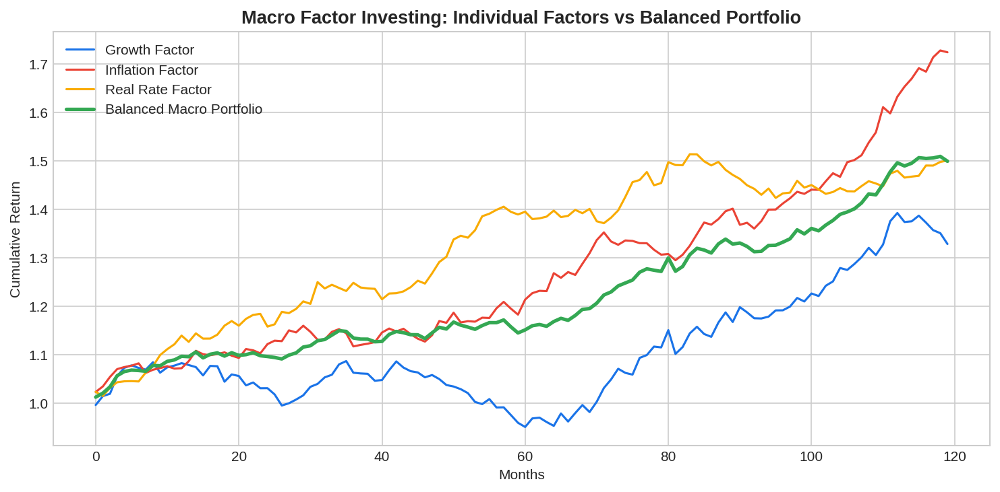

**Macro factor investing** is a portfolio construction framework that allocates capital based on exposure to fundamental economic risk factors — growth, inflation, real rates, and credit — rather than traditional asset classes. The core insight is that assets like stocks, bonds, and commodities are simply bundles of macro factor exposures. By thinking in terms of factors, investors can build truly diversified portfolios that perform across different economic environments, avoiding the hidden concentration that plagues asset-class-based approaches.

## The Four Macro Factors

Most macro factor frameworks decompose risk into four primary dimensions:

| Factor | What It Captures | Assets That Load Positively | Assets That Load Negatively |
|--------|-----------------|---------------------------|---------------------------|
| Growth | Real economic expansion | Equities, credit, cyclical commodities | Govt bonds, defensive sectors |
| Inflation | Rising price levels | Commodities, TIPS, real estate | Nominal bonds, growth stocks |
| Real Rates | Monetary tightening/easing | Cash, short-duration bonds | Gold, long-duration assets |
| Credit | Default risk premium | Corporate bonds, EM debt | Safe-haven assets, treasuries |

The [All Weather Portfolio](https://paperswithbacktest.com/wiki/all-weather-portfolio) popularized by Bridgewater is the most famous application of macro factor investing — it allocates to achieve balanced exposure across growth and inflation states.

## The Macro Factor Model

Each asset's return can be decomposed into macro factor exposures:

$$r_{i,t} = \alpha_i + \beta_{i,\text{growth}} \cdot F_{\text{growth},t} + \beta_{i,\text{inflation}} \cdot F_{\text{inflation},t} + \beta_{i,\text{rates}} \cdot F_{\text{rates},t} + \epsilon_{i,t}$$

A balanced macro portfolio targets equal risk contribution from each factor rather than equal capital allocation. This typically means holding more bonds (low volatility per unit of factor exposure) and fewer equities (high volatility).



## Python Implementation: Factor Decomposition

```python
import numpy as np

def macro_factor_decomposition(asset_returns, factor_returns):
    """
    Decompose asset returns into macro factor exposures using OLS.
    """
    n_assets = asset_returns.shape[1]
    n_factors = factor_returns.shape[1]
    
    # Add intercept
    X = np.column_stack([np.ones(len(factor_returns)), factor_returns])
    betas = np.zeros((n_assets, n_factors + 1))
    
    for i in range(n_assets):
        betas[i] = np.linalg.lstsq(X, asset_returns[:, i], rcond=None)[0]
    
    return betas

# Simulated example
np.random.seed(42)
T = 120  # Monthly

# Macro factors
growth = np.random.normal(0.005, 0.015, T)
inflation = np.random.normal(0.003, 0.01, T)
rates = np.random.normal(0.002, 0.008, T)
factors = np.column_stack([growth, inflation, rates])

# Asset returns = factor exposures + noise
equities = 0.8*growth - 0.2*inflation - 0.3*rates + np.random.normal(0, 0.02, T)
bonds = -0.3*growth - 0.5*inflation + 0.6*rates + np.random.normal(0, 0.008, T)
commodities = 0.3*growth + 0.7*inflation + 0.1*rates + np.random.normal(0, 0.015, T)

assets = np.column_stack([equities, bonds, commodities])
betas = macro_factor_decomposition(assets, factors)

names = ["Equities", "Bonds", "Commodities"]
factor_names = ["Alpha", "Growth", "Inflation", "Rates"]
for i, name in enumerate(names):
    print(f"\n{name}:")
    for j, fn in enumerate(factor_names):
        print(f"  {fn}: {betas[i, j]:+.3f}")
```

## Building a Macro Factor Portfolio

The goal is risk parity across macro factors: equal volatility contribution from growth-sensitive and inflation-sensitive allocations. A typical macro-balanced portfolio holds roughly 30% equities (growth exposure), 40% long-duration bonds (deflation hedge), 15% commodities (inflation hedge), and 15% inflation-linked bonds (real rate exposure) — though the exact weights depend on volatility estimates and the leverage budget.

## Limitations and Risks

Macro factor classifications are not always stable — an asset's factor loading can shift over time. The approach requires leverage to achieve meaningful returns from the bond-heavy allocation. Factor timing (overweighting growth in expansions, inflation in stagflation) is attractive in theory but difficult to execute reliably. Historical correlations between assets and factors can break down during crises.

## Conclusion

Macro factor investing provides a deeper understanding of portfolio risk than traditional asset allocation. By decomposing returns into growth, inflation, and rate exposures, traders can build portfolios that are genuinely diversified across economic scenarios — rather than concentrated in growth risk as most equity-heavy portfolios are. This framework connects naturally to [Barra risk factor analysis](https://paperswithbacktest.com/wiki/barra-risk-factor-analysis) at the stock level and to [dual momentum strategies](https://paperswithbacktest.com/wiki/dual-momentum-trading-strategy) at the asset-class level.

---

**Explore further on PapersWithBacktest:**
- Browse [backtested macro strategies](https://paperswithbacktest.com/strategies) with Python code and performance metrics
- Access [clean historical market data](https://paperswithbacktest.com/datasets) for equities, crypto, and futures
- Take the [algo trading course](https://paperswithbacktest.com/course) — 60+ video lessons and notebooks
- Related wiki pages: [All Weather Portfolio](https://paperswithbacktest.com/wiki/all-weather-portfolio) · [Barra Risk Factor Analysis](https://paperswithbacktest.com/wiki/barra-risk-factor-analysis) · [Dual Momentum Trading Strategy](https://paperswithbacktest.com/wiki/dual-momentum-trading-strategy)
