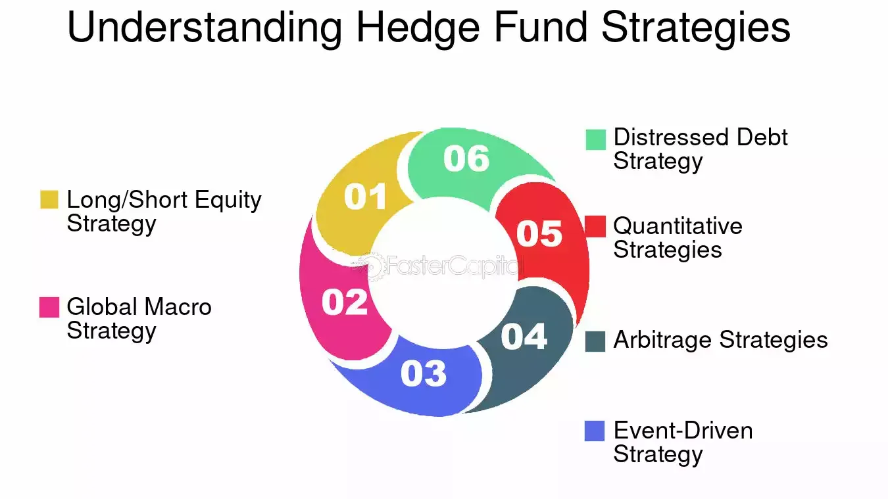

## Table of Contents

## What is a macro hedge and why is it important in investment?

A macro hedge is a strategy that investors use to protect their investments from big changes in the overall economy or market. It's like an insurance policy for your money. For example, if an investor thinks that the economy might go down, they might use a macro hedge to reduce the risk of losing a lot of money. They do this by investing in things that usually do well when the economy is not doing well, like certain types of bonds or commodities.

Macro hedges are important because they help investors manage risk. No one can predict the future, but with a macro hedge, investors can feel a bit safer. It's not about making more money, but about losing less when things go wrong. By using a macro hedge, investors can keep their portfolios stable even when the market is going up and down a lot. This can help them stay calm and make better decisions about their investments.

## How do macroeconomic factors influence investment decisions?

Macroeconomic factors are big things that affect the whole economy, like interest rates, inflation, and unemployment. These factors can make a big difference in how investors decide to put their money. For example, if interest rates go up, it might be a good time to invest in bonds because they will pay more. But if interest rates go down, stocks might look more attractive because borrowing money becomes cheaper for companies, which can help them grow.

Inflation is another big factor. When prices are going up a lot, the value of money goes down. This can make investors nervous because their money won't buy as much in the future. To protect against this, they might invest in things like real estate or commodities, which often go up in value when inflation is high. Unemployment rates also matter. If a lot of people are out of work, it can hurt the economy and make investors worried about companies' profits, which might make them less likely to invest in stocks.

Overall, understanding these macroeconomic factors helps investors make smarter choices. They can use this information to guess what might happen next and adjust their investments to either take advantage of good times or protect themselves during bad times. By keeping an eye on these big economic trends, investors can try to make their money safer and maybe even grow it more over time.

## What are the basic principles behind macro hedging strategies?

Macro hedging strategies are all about protecting your money from big changes in the economy. The main idea is to use investments that move in the opposite direction of the market or economy. For example, if you think the stock market might go down, you could invest in things like gold or government bonds, which often go up when stocks go down. This way, if the market does drop, your losses in stocks might be balanced out by gains in these other investments.

Another important principle is diversification. This means spreading your money across different types of investments so that you're not putting all your eggs in one basket. If one part of your portfolio goes down, another part might go up, helping to keep your overall investment stable. By using a mix of stocks, bonds, commodities, and maybe even currencies, you can create a safety net that protects your money from big economic swings.

Lastly, macro hedging involves staying informed about economic indicators and trends. This means keeping an eye on things like interest rates, inflation, and unemployment rates. By understanding these big economic factors, you can make better guesses about what might happen next and adjust your investments accordingly. It's not about predicting the future perfectly, but about being ready for different scenarios and making smart moves to protect your money.

## Can you explain the role of ETFs in macro hedging?

ETFs, or Exchange-Traded Funds, are a popular tool for macro hedging because they let you invest in a lot of different things at once. Imagine you want to protect your money from a falling stock market. You can buy an ETF that focuses on things like gold or government bonds, which often go up when stocks go down. This way, if the stock market drops, the ETF can help balance out your losses. ETFs are great for macro hedging because they are easy to buy and sell, just like stocks, and they let you spread your money across many different investments without having to buy each one separately.

Another reason ETFs are useful for macro hedging is that they can track big economic trends. For example, if you think inflation is going to go up, you might buy an ETF that invests in commodities like oil or agriculture products. These often do well when inflation rises. Or, if you're worried about a country's economy, you can buy an ETF that focuses on that country's currency or bonds. By using ETFs, you can make smart moves to protect your money from big changes in the economy without having to pick individual stocks or bonds.

## What are some common ETFs used for macro hedging?

Some common ETFs used for macro hedging include those that invest in gold and other precious metals. Gold ETFs, like the SPDR Gold Shares (GLD), are popular because gold often goes up in value when the stock market goes down. This makes them a good way to protect your money during tough economic times. Another type of ETF used for macro hedging is one that invests in government bonds, like the iShares 20+ Year Treasury Bond ETF (TLT). These ETFs can help balance out losses in your stock investments because bonds tend to do well when the economy is struggling.

ETFs that focus on commodities can also be used for macro hedging. For example, the Invesco DB Commodity Index Tracking Fund (DBC) invests in a mix of commodities like oil, gold, and agriculture products. These can be good to have if you're worried about inflation because commodities often go up in value when prices are rising. Another useful ETF for macro hedging is one that tracks the U.S. dollar, like the Invesco DB US Dollar Index Bullish Fund (UUP). If you think the U.S. dollar will get stronger, this ETF can help protect your money from a falling stock market or a weakening economy in other countries.

Overall, ETFs are a flexible and easy way to use macro hedging strategies. By investing in ETFs that focus on gold, government bonds, commodities, or currencies, you can protect your money from big economic changes without having to pick individual investments. This makes it simpler to manage risk and keep your portfolio stable during uncertain times.

## How do investors use ETFs to hedge against inflation?

Investors use ETFs to hedge against inflation by investing in things that usually do well when prices go up. One common way is to buy ETFs that focus on commodities like oil, gold, and agriculture products. For example, the Invesco DB Commodity Index Tracking Fund (DBC) invests in a mix of these commodities. When inflation rises, the prices of these commodities often go up too. By owning this ETF, investors can protect their money from losing value because of inflation.

Another way investors hedge against inflation with ETFs is by buying those that invest in real estate. Real estate often goes up in value when inflation is high, so ETFs like the Vanguard Real Estate ETF (VNQ) can be a good choice. These ETFs own a bunch of real estate investment trusts (REITs), which are companies that own and manage properties. As inflation rises, the rents and property values that these REITs earn can go up, helping to keep the investor's money safe from the effects of inflation.

## What are the advantages and disadvantages of using ETFs for macro hedging?

Using ETFs for macro hedging has several advantages. One big advantage is that ETFs are easy to buy and sell, just like stocks. This means you can quickly adjust your investments if you think the economy is going to change. Another advantage is that ETFs let you spread your money across many different things at once. For example, if you buy an ETF that focuses on commodities, you're not just betting on one thing like oil; you're betting on a whole bunch of commodities. This can help protect your money from big economic swings because if one thing goes down, another might go up. Also, ETFs are often cheaper than buying a bunch of individual stocks or bonds because they have lower fees.

But there are also some disadvantages to using ETFs for macro hedging. One problem is that ETFs can be less flexible than other types of investments. For example, if you want to hedge against a specific risk, like a drop in the value of a certain currency, you might not find an ETF that does exactly what you need. Another disadvantage is that ETFs can sometimes be less effective at hedging than other strategies. This is because ETFs track a whole group of investments, and sometimes the whole group doesn't move the way you expect. Also, while ETFs can help protect your money, they can also limit your potential gains because you're spreading your money out instead of focusing it on one big bet.

## How can alternative investments be used as part of a macro hedge strategy?

Alternative investments can be a good way to protect your money from big changes in the economy. These investments are things like real estate, commodities, hedge funds, and private equity. They don't move the same way as stocks and bonds, so they can help balance out your losses if the stock market goes down. For example, if you think the economy might get worse, you could invest in real estate or commodities like gold. These often do well when the economy is struggling, so they can help keep your money safe.

Another way to use alternative investments for macro hedging is by investing in hedge funds. Hedge funds use special strategies to try to make money no matter what the economy is doing. They might bet against the market or use other clever tricks to protect your money. By putting some of your money into a hedge fund, you can add an extra layer of protection to your investments. This can help you feel more secure, even when the economy is going through tough times.

## What are some examples of alternative investments for macro hedging?

Alternative investments like real estate can be used for macro hedging. If you think the economy might go down, you can invest in real estate because it often does well when other parts of the economy are struggling. For example, people always need places to live, so even if the stock market drops, real estate can still hold its value or even go up. Another good alternative investment for macro hedging is commodities, like gold or oil. These things often go up in price when inflation rises or when the economy is not doing well, so they can help protect your money from losing value.

Another type of alternative investment for macro hedging is hedge funds. Hedge funds use special strategies to try to make money no matter what the economy is doing. They might bet against the market or use other clever tricks to protect your money. By putting some of your money into a hedge fund, you can add an extra layer of protection to your investments. This can help you feel more secure, even when the economy is going through tough times. Private equity is another alternative investment that can be used for macro hedging. It involves investing in private companies that are not listed on the stock market. These investments can be less affected by short-term economic changes, which can help keep your money safe during uncertain times.

## How do advanced investors combine ETFs and alternative investments for optimal macro hedging?

Advanced investors often use a mix of ETFs and alternative investments to protect their money from big economic changes. They might buy ETFs that focus on things like gold or government bonds, which often do well when the stock market goes down. This way, if the market drops, the ETFs can help balance out their losses. At the same time, they might also invest in alternative investments like real estate or commodities. These things can help protect their money from inflation or economic downturns because they don't move the same way as stocks and bonds.

By combining ETFs and alternative investments, advanced investors can create a strong safety net for their money. They might use ETFs to quickly adjust their investments if they think the economy is going to change, because ETFs are easy to buy and sell. Meanwhile, they might use alternative investments like hedge funds or private equity to add an extra layer of protection. These investments can help them feel more secure, even when the economy is going through tough times. By using both types of investments, advanced investors can better manage risk and keep their portfolios stable no matter what happens in the economy.

## What are the key performance indicators to monitor when implementing a macro hedge strategy?

When you're using a macro hedge strategy, you need to keep an eye on some important numbers to make sure it's working well. One big thing to watch is how much your investments are going up or down. This is called volatility. If your macro hedge is doing its job, it should help keep your money from swinging too much when the market is going crazy. Another important number is how your investments are doing compared to the overall market. This is called relative performance. If your macro hedge is working, your investments should be doing better than the market when things are bad.

You should also pay attention to how well your hedge is actually protecting your money. This is called the effectiveness of the hedge. If the economy goes down and your losses are smaller than they would have been without the hedge, that's a good sign. Finally, keep an eye on the costs of your macro hedge. This includes any fees you have to pay for the investments you're using. If the costs are too high, they might eat into the money you're trying to protect. By watching these key numbers, you can make sure your macro hedge strategy is keeping your money safe.

## How can one assess the effectiveness of a macro hedge strategy over time?

To assess the effectiveness of a macro hedge strategy over time, you need to look at how well it has protected your money during different economic conditions. One way to do this is by comparing the performance of your investments with and without the hedge. If the economy goes down and your losses are smaller than they would have been without the hedge, then your strategy is working. You can also look at how much your investments have gone up or down, which is called volatility. A good macro hedge should help keep your money from swinging too much when the market is going crazy.

Another important thing to consider is the cost of your macro hedge. You need to make sure that the fees you pay for the investments you're using don't eat into the money you're trying to protect. Over time, you can keep track of these costs and see if they are worth it. By regularly checking these things—how well your hedge protects your money, how much your investments move, and how much it costs—you can tell if your macro hedge strategy is effective. This way, you can make adjustments if needed to keep your money safe.

## What are the investment alternatives: An overview?

Investment alternatives provide investors with opportunities to diversify their portfolios beyond traditional stocks and bonds. These alternative assets encompass a broad range of options, including real estate, commodities, and cryptocurrencies. Each of these asset types offers distinct characteristics and risk profiles, making them valuable tools for investors looking to hedge against market volatility.

Real estate, as an alternative investment, offers tangible assets that can generate income and appreciate over time. Investments in real estate can be direct through purchasing properties or indirect via Real Estate Investment Trusts (REITs). Real estate tends to have a low correlation with stocks and bonds, making it an effective diversification tool.

Commodities, such as gold, oil, and agricultural products, serve as another alternative investment class. They are physical goods that can be traded on various exchanges. Commodities often act as a hedge against inflation, as their prices typically rise when the cost of living increases. Furthermore, their performance is usually influenced by supply and demand dynamics, geopolitical tensions, and other macroeconomic factors, making them less correlated with traditional financial markets.

Cryptocurrencies represent a more recent addition to the alternative investment landscape. Digital assets like Bitcoin and Ethereum have gained popularity due to their potential for high returns and their inherent technological innovation. However, they also come with significant [volatility](/wiki/volatility-trading-strategies) and regulatory risks. As a decentralized form of currency, cryptocurrencies are not tied to any central bank or government, offering a unique risk profile for investors.

The inclusion of alternative investments in a portfolio can lead to improved returns and reduced risk due to their distinct characteristics and low correlation with traditional assets. For example, modern portfolio theory suggests that by holding a combination of asset classes with varying correlations, investors can optimize their risk-adjusted returns. The concept is often illustrated using the formula for the expected return of a portfolio:

$$
E(R_p) = \sum_{i=1}^{n} w_i \cdot E(R_i)
$$

where $E(R_p)$ is the expected return of the portfolio, $w_i$ is the weight of asset $i$ in the portfolio, and $E(R_i)$ is the expected return of asset $i$.

Alternative investments fit into broader investment strategies by offering unique opportunities for growth and risk management. They allow investors to capitalize on emerging trends and asset classes that respond differently to market events compared to traditional securities. By incorporating alternative investments, investors can build more resilient portfolios capable of withstanding diverse economic conditions.

## References & Further Reading

[1]: Bergstra, J., Bardenet, R., Bengio, Y., & Kégl, B. (2011). ["Algorithms for Hyper-Parameter Optimization."](https://dl.acm.org/doi/10.5555/2986459.2986743) Advances in Neural Information Processing Systems 24.

[2]: Lopez de Prado, M. (2018). ["Advances in Financial Machine Learning."](https://www.amazon.com/Advances-Financial-Machine-Learning-Marcos/dp/1119482089) Wiley.

[3]: Aronson, D. R. (2006). ["Evidence-Based Technical Analysis: Applying the Scientific Method and Statistical Inference to Trading Signals."](https://www.amazon.com/Evidence-Based-Technical-Analysis-Scientific-Statistical/dp/0470008741) Wiley.

[4]: Jansen, S. (2020). ["Machine Learning for Algorithmic Trading."](https://github.com/stefan-jansen/machine-learning-for-trading) Packt Publishing.

[5]: Chan, E. P. (2009). ["Quantitative Trading: How to Build Your Own Algorithmic Trading Business."](https://github.com/ftvision/quant_trading_echan_book) Wiley.

[6]: "Modern Portfolio Theory: Foundations, Analysis, and New Developments" by Elton, E. J., & Gruber, M. J. (1979).

[7]: Fabozzi, F. J., & Markowitz, H. M. (2011). ["The Theory and Practice of Investment Management."](https://onlinelibrary.wiley.com/doi/book/10.1002/9781118267028) Wiley.

[8]: Chincarini, L. B. (2012). ["The Crisis of Crowding: Quant Copycats, Ugly Models, and the New Crash Normal."](https://www.wiley.com/en-us/The+Crisis+of+Crowding%3A+Quant+Copycats%2C+Ugly+Models%2C+and+the+New+Crash+Normal-p-9781118250020) Wiley.

[9]: Lhabitant, F. S. (2004). ["Hedge Funds: Myths and Limits."](https://www.wiley.com/en-us/Hedge+Funds%3A+Myths+and+Limits-p-9780470844779) Wiley.

[10]: Hull, J. C. (2018). ["Options, Futures, and Other Derivatives."](https://www.amazon.com/Options-Futures-Other-Derivatives-10th/dp/013447208X) Pearson.