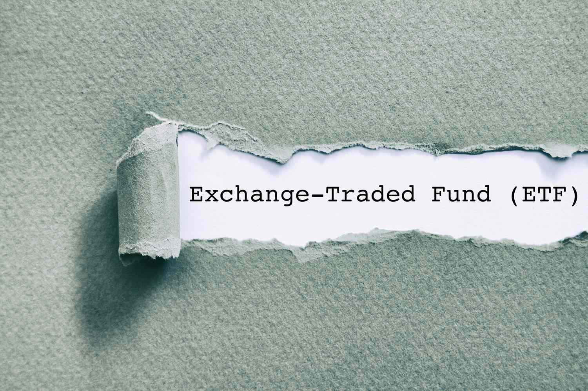

In the dynamic world of investments, diversifying strategies to maximize returns and minimize risks is essential. Investors today face an ever-changing landscape where traditional approaches may not always suffice. This article explores various investment alternatives, focusing on Exchange-Traded Fund (ETF) strategies, macro hedge funds, and algorithmic trading. These methods represent a sophisticated layer of financial innovation, offering investors new avenues to enhance their portfolios and manage uncertainty.

Understanding these concepts can empower investors to make informed decisions in evolving market conditions. ETF strategies allow for targeted exposure to specific sectors or themes, often with lower fees and greater liquidity than traditional mutual funds. Macro hedge funds take a global view, employing techniques to capitalize on macroeconomic trends and insulate against systemic risks. Meanwhile, algorithmic trading leverages technological advancements to execute trades with speed and precision, optimizing them to minimize human error and emotional biases.



Investment strategies through ETFs, macro hedge funds, and algorithmic trading share a common trait: they challenge the conventional wisdom of portfolio management by introducing tools and strategies that adapt to modern market dynamics. Through this exploration, readers will gain insight into how these investments can complement traditional portfolios. By integrating these methods, investors can achieve a well-rounded investment approach that balances risk and return, ultimately fostering long-term financial resilience.

## Table of Contents

## Investment Alternatives: An Overview

Investment alternatives provide investors with opportunities to diversify their portfolios beyond traditional stocks and bonds. These alternative assets encompass a broad range of options, including real estate, commodities, and cryptocurrencies. Each of these asset types offers distinct characteristics and risk profiles, making them valuable tools for investors looking to hedge against market volatility.

Real estate, as an alternative investment, offers tangible assets that can generate income and appreciate over time. Investments in real estate can be direct through purchasing properties or indirect via Real Estate Investment Trusts (REITs). Real estate tends to have a low correlation with stocks and bonds, making it an effective diversification tool.

Commodities, such as gold, oil, and agricultural products, serve as another alternative investment class. They are physical goods that can be traded on various exchanges. Commodities often act as a hedge against inflation, as their prices typically rise when the cost of living increases. Furthermore, their performance is usually influenced by supply and demand dynamics, geopolitical tensions, and other macroeconomic factors, making them less correlated with traditional financial markets.

Cryptocurrencies represent a more recent addition to the alternative investment landscape. Digital assets like Bitcoin and Ethereum have gained popularity due to their potential for high returns and their inherent technological innovation. However, they also come with significant [volatility](/wiki/volatility-trading-strategies) and regulatory risks. As a decentralized form of currency, cryptocurrencies are not tied to any central bank or government, offering a unique risk profile for investors.

The inclusion of alternative investments in a portfolio can lead to improved returns and reduced risk due to their distinct characteristics and low correlation with traditional assets. For example, modern portfolio theory suggests that by holding a combination of asset classes with varying correlations, investors can optimize their risk-adjusted returns. The concept is often illustrated using the formula for the expected return of a portfolio:

$$
E(R_p) = \sum_{i=1}^{n} w_i \cdot E(R_i)
$$

where $E(R_p)$ is the expected return of the portfolio, $w_i$ is the weight of asset $i$ in the portfolio, and $E(R_i)$ is the expected return of asset $i$.

Alternative investments fit into broader investment strategies by offering unique opportunities for growth and risk management. They allow investors to capitalize on emerging trends and asset classes that respond differently to market events compared to traditional securities. By incorporating alternative investments, investors can build more resilient portfolios capable of withstanding diverse economic conditions.

## ETF Strategies: A Deep Dive

Exchange-Traded Funds (ETFs) offer investors a way to access a wide variety of assets with the benefits of [liquidity](/wiki/liquidity-risk-premium) and diversification while maintaining cost efficiency compared to traditional mutual funds. The differing strategies utilized within ETFs provide unique opportunities for investors, depending on their financial goals and risk appetite.

Dividend ETFs focus on stocks that are likely to provide high dividend yields. These ETFs appeal to income-seeking investors and those who prefer a steady stream of income over capital appreciation. A notable advantage of dividend ETFs is the potential for generating consistent cash flow, which is particularly attractive in low-interest-rate environments. However, the drawbacks include limited exposure to high-[growth stocks](/wiki/growth-stocks), possibly resulting in lower overall capital gains.

Thematic ETFs enable investors to concentrate on specific investment themes, such as technological innovation, environmental sustainability, or blockchain technology. This strategy allows investors to support sectors they believe will overperform due to structural changes in the economy or society. Thematic ETFs' strength lies in their potential for high returns if the chosen theme succeeds. Nonetheless, their specialized focus may lead to higher volatility and a concentration risk if the market shifts away from the underlying theme.

Sectoral ETFs target specific industries or sectors, such as healthcare, energy, or consumer goods. Sectoral ETFs provide targeted exposure to sectors that an investor believes will outperform, potentially generating significant returns. Their advantage is the ability to respond flexibly to economic cycles and industry-specific trends. However, these ETFs may suffer if sector-specific downturns occur, limiting diversification benefits typically associated with broader market ETFs.

Leveraged and inverse ETFs offer amplified returns on a daily basis. Leveraged ETFs use derivatives to amplify the returns of a benchmark index, commonly by two or three times. Inverse ETFs aim to deliver the opposite performance of their benchmark index, making them attractive for hedging purposes. The primary advantage of these ETFs lies in their ability to capitalize on short-term market movements. However, they are not suitable for long-term investment due to their complexities and the risk of rapid losses resulting from market volatility.

Choosing the right [ETF](/wiki/etf-trading-strategies) strategy involves considering the investor's risk tolerance and financial objectives. For instance, a conservative investor might prefer dividend ETFs for the income stability they offer, while a more risk-tolerant investor could consider thematic or sectoral ETFs for potentially higher returns. It is crucial to evaluate the trade-off between potential returns and associated risks when incorporating these strategies into a portfolio. By doing so, investors can tailor their investments to align with their financial goals, adjusting as necessary in response to changing market conditions.

## Macro Hedge Funds: Mitigating Systemic Risks

Macro hedge funds are specialized investment vehicles designed to exploit macroeconomic trends while providing a degree of protection against systemic risks. These funds leverage a diverse range of financial instruments, most prominently derivatives, to hedge against economic catalysts such as inflation, currency fluctuations, and geopolitical events.

### Derivative Instruments in Macro Hedge Funds
The core strategy of macro hedge funds involves using derivatives like options, futures, and swaps. These instruments allow fund managers to take highly leveraged positions to speculate on macroeconomic developments or to hedge potential risks. Through derivatives, macro hedge funds can effectively manage exposure to various asset classes, including equities, fixed income, commodities, and currencies.

For instance, if a fund manager anticipates an increase in inflation, they may use [interest rate](/wiki/interest-rate-trading-strategies) swaps or inflation-linked bonds to protect the portfolio from inflationary pressures. Similarly, currency futures can be employed to hedge against adverse currency movements that might impact international investments.

### Performance During Global Events
Historically, macro hedge funds have demonstrated the ability to navigate market turbulence caused by major global events. During the 2008 financial crisis, many macro funds capitalized on the dislocations in the financial markets by using short positions and strategic hedges. Similarly, in periods of geopolitical tension or unexpected economic shifts, these funds often use their strategies to gain from market volatility.

For example, during the Brexit referendum, several macro hedge funds effectively anticipated and positioned themselves for the resulting currency volatility, leading to substantial gains.

### Importance of Forecast Skills and Market Foresight
The success of macro hedge funds heavily relies on the foresight and expertise of fund managers in predicting macroeconomic trends. Their ability to analyze economic indicators, geopolitical developments, and market psychology is crucial in making informed investment decisions. Advanced quantitative models and analytics are often employed to enhance the accuracy of these forecasts.

### Protection Against Economic Shifts
Potential investors view macro hedge funds as a strategic component in diversifying and safeguarding portfolios against broad economic shifts. By exploiting divergent market conditions across different regions and asset classes, these funds offer an opportunity for returns that are uncorrelated with traditional investments.

Investors seeking to mitigate systemic risks often turn to macro hedge funds for their ability to provide downside protection while simultaneously pursuing upside potential through shrewd positioning based on macroeconomic insights. By incorporating these strategies into a broader investment framework, investors can achieve a well-balanced portfolio resilient to global economic uncertainties.

## Algorithmic Trading: Harnessing Technology

Algorithmic trading leverages technology to execute trades with precision and speed, outperforming the limitations of human traders. This automated trading method employs complex algorithms that analyze trading patterns, prices, and voluminous datasets to make rapid decisions. The primary advantage lies in the ability to monitor and act on multiple markets simultaneously, reducing human error and emotional decision-making.

#### Basics of Developing Trading Algorithms

Developing a trading algorithm begins with defining a strategy based on market data and financial theories. An algorithm typically includes parameter inputs, signal generation — often through indicators like moving averages or [momentum](/wiki/momentum) oscillators — and execution protocols. For example, a simple moving average crossover strategy might be coded as follows in Python:

```python
import pandas as pd

def moving_average_strategy(prices, short_window, long_window):
    signals = pd.DataFrame(index=prices.index)
    signals['price'] = prices
    signals['short_mavg'] = prices.rolling(window=short_window, min_periods=1, center=False).mean()
    signals['long_mavg'] = prices.rolling(window=long_window, min_periods=1, center=False).mean()
    signals['signal'] = 0.0
    signals['signal'][short_window:] = np.where(signals['short_mavg'][short_window:] > signals['long_mavg'][short_window:], 1.0, 0.0)
    signals['positions'] = signals['signal'].diff()
    return signals
```

#### Applications in Risk Hedging and Arbitrage

Algorithms are not solely used for executing strategies but also mitigate risks and exploit [arbitrage](/wiki/arbitrage) opportunities. For portfolio risk management, algorithms can rebalance holdings dynamically as market conditions vary, using techniques like delta-neutral strategies that shield against price movements of the underlying asset. Arbitrage algorithms simultaneously purchase and sell equivalent assets in different markets to capitalize on price discrepancies.

#### Ethical Considerations and Market Impact

Despite its efficiencies, [algorithmic trading](/wiki/algorithmic-trading) raises significant ethical concerns. High-frequency trading ([HFT](/wiki/high-frequency-trading-strategies)) — a subset of algorithmic trading — can result in unfair advantages by executing vast numbers of trades within milliseconds, contributing to market volatility and flash crashes. The debate over the responsibility of firms to ensure that their trading practices do not disrupt markets or disadvantage other participants is ongoing, with discussions stressing transparency and regulation.

#### Benefits of Reduced Trading Costs and Minimized Impact

The automation underlying algorithmic trading minimizes operational costs, as the need for manual interventions and associated personnel decreases. Furthermore, algorithms can execute trades in small volumes over multiple venues to avoid significant market impact, especially beneficial for large institutional trades. This method, known as “slicing,” helps maintain price integrity across the market.

By incorporating algorithmic trading into their strategies, investors and institutions benefit from enhanced precision and efficiency. These technological advancements not only optimize performance but also secure advantageous market positions, underscoring the profound impact of technology on modern financial markets.

## Integrating Strategies: A Comprehensive Approach

Combining ETF strategies, macro hedging, and algorithmic trading into a comprehensive investment approach provides investors with diverse exposure across various asset classes, strategies, and market conditions. By integrating these methods, investors can enhance portfolio resilience and potentially boost returns.

Each strategy brings unique strengths: ETFs offer liquidity and cost-efficient diversification, macro hedge funds provide protection against systemic risks, and algorithmic trading leverages technology for efficient trade execution. When combined, they create a synergistic effect that optimizes risk and return profiles.

### Complementary Strategies

ETF strategies can serve as the foundational layer of a portfolio, offering broad exposure to different sectors, indices, or investment themes. For instance, sectoral ETFs can align with macroeconomic insights derived from [hedge fund](/wiki/hedge-fund-trading-strategies) analyses, ensuring that portfolio allocations reflect current economic conditions. 

Macro hedge funds focus on larger economic trends, making them well-suited to mitigate risks associated with specific ETFs. For example, if an investor holds ETFs heavily weighted in equities, a macro hedge fund strategy can be leveraged to hedge against global economic downturns or geopolitical uncertainties, thereby securing the portfolio against unexpected events.

Algorithmic trading, on the other hand, can be employed to optimize the timing and execution of trades, reducing transaction costs and minimizing market impact. Algorithms can also handle risk management tasks, automatically adjusting ETF and hedge fund positions based on predefined criteria or market signals.

### Case Studies

Consider an investor interested in technology sector growth but wary of the high volatility typically associated with tech equities. The investor might use a technology-focused ETF to capture growth from this sector's dynamics. Simultaneously, they could employ a macro hedge strategy to shield against broader market corrections potentially triggered by tech bubbles. An algorithmic trading system could then manage these positions dynamically, ensuring rebalancing occurs when volatility exceeds comfortable thresholds.

### Practical Steps for Integration

To integrate these strategies effectively, investors should start by assessing their risk tolerance, investment timeline, and financial goals. Next, they should allocate resources across the three strategies to best fit their preferences. 

1. **Portfolio Allocation**: Establish the base allocation using ETFs to ensure diversification, based on current market forecasts from macroeconomic analysis.

2. **Risk Management**: Implement macro hedge strategies to guard against systematic risks associated with portfolio assets.

3. **Trade Execution**: Develop and deploy algorithmic trading systems to optimize buy-sell processes and safeguard against execution volatility.

### Aligning Strategies with Investment Objectives

Investors should consider how each component aligns with their overall financial aspirations. For instance, if the goal is long-term growth with moderate risk, the emphasis might be on a well-diversified set of ETFs supplemented by selective macro hedging against specific economic scenarios. Alternatively, short-term speculative pursuits might benefit from a larger allocation to algorithmic trading to exploit minute market inefficiencies rapidly.

By systematically integrating and re-evaluating these strategies, investors can craft a robust investment plan capable of adapting to evolving market landscapes, ultimately aligning their portfolio with personal economic objectives and risk preferences.

## Conclusion: Navigating Complex Markets

Navigating complex markets requires a proactive and informed approach to investing. Throughout this article, we have explored various strategies that can enhance portfolio diversification and resilience, such as ETF strategies, macro hedge funds, and algorithmic trading. These strategies offer innovative ways to manage risk and capitalize on market opportunities.

As market dynamics shift, staying informed about new tools and strategies becomes crucial. Investors must be adaptable, continuously reassessing their strategies in response to emerging information and conditions. This adaptability ensures that investment approaches remain relevant and effective.

By combining education with strategic planning, investors can position themselves for sustained success. Knowledge empowers investors to make informed decisions that align with their financial goals and risk tolerance. Emphasizing continual learning and assessment allows investors to navigate complex financial landscapes effectively, potentially leading to sustained financial success.

## References & Further Reading

[1]: Bergstra, J., Bardenet, R., Bengio, Y., & Kégl, B. (2011). ["Algorithms for Hyper-Parameter Optimization."](https://dl.acm.org/doi/10.5555/2986459.2986743) Advances in Neural Information Processing Systems 24.

[2]: Lopez de Prado, M. (2018). ["Advances in Financial Machine Learning."](https://www.amazon.com/Advances-Financial-Machine-Learning-Marcos/dp/1119482089) Wiley.

[3]: Aronson, D. R. (2006). ["Evidence-Based Technical Analysis: Applying the Scientific Method and Statistical Inference to Trading Signals."](https://www.amazon.com/Evidence-Based-Technical-Analysis-Scientific-Statistical/dp/0470008741) Wiley.

[4]: Jansen, S. (2020). ["Machine Learning for Algorithmic Trading."](https://github.com/stefan-jansen/machine-learning-for-trading) Packt Publishing.

[5]: Chan, E. P. (2009). ["Quantitative Trading: How to Build Your Own Algorithmic Trading Business."](https://github.com/ftvision/quant_trading_echan_book) Wiley.

[6]: "Modern Portfolio Theory: Foundations, Analysis, and New Developments" by Elton, E. J., & Gruber, M. J. (1979).

[7]: Fabozzi, F. J., & Markowitz, H. M. (2011). ["The Theory and Practice of Investment Management."](https://onlinelibrary.wiley.com/doi/book/10.1002/9781118267028) Wiley.

[8]: Chincarini, L. B. (2012). ["The Crisis of Crowding: Quant Copycats, Ugly Models, and the New Crash Normal."](https://www.wiley.com/en-us/The+Crisis+of+Crowding%3A+Quant+Copycats%2C+Ugly+Models%2C+and+the+New+Crash+Normal-p-9781118250020) Wiley.

[9]: Lhabitant, F. S. (2004). ["Hedge Funds: Myths and Limits."](https://www.wiley.com/en-us/Hedge+Funds%3A+Myths+and+Limits-p-9780470844779) Wiley.

[10]: Hull, J. C. (2018). ["Options, Futures, and Other Derivatives."](https://www.amazon.com/Options-Futures-Other-Derivatives-10th/dp/013447208X) Pearson.