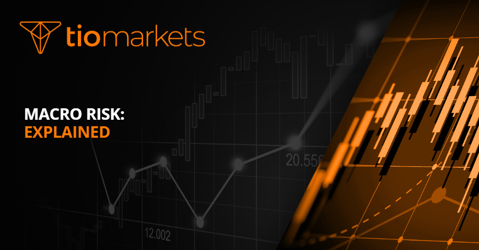

## Table of Contents

## What is macro risk?

Macro risk, also known as country risk, is the risk that comes from investing in a whole country. It includes things like political changes, economic problems, and social unrest that can affect all businesses in that country. For example, if a country has a sudden change in government, it might change its laws and make it harder for businesses to operate.

These risks can be hard to predict and can have a big impact on investments. For instance, if a country's economy goes into a recession, it could lead to lower profits for companies and lower returns for investors. Understanding macro risk is important for anyone thinking about investing in foreign countries because it helps them see the bigger picture and make better decisions.

## How does macro risk differ from micro risk?

Macro risk and micro risk are two different types of risks that investors face. Macro risk is about the big picture - it's the risk that comes from things happening in an entire country or region. This can include political changes, like a new government coming to power and changing laws, or economic problems, like a country going into a recession. These events can affect all businesses in that country, no matter what they do. For example, if a country's currency loses value, it can make it harder for all companies there to do business with other countries.

Micro risk, on the other hand, is more specific. It's about the risks that affect individual companies or small groups of companies. This can include things like a company's management making bad decisions, or a product not selling well. Micro risks are usually easier to predict and manage than macro risks because they are more focused on one company or industry. For example, if a company's factory burns down, that's a micro risk that only affects that one company, not the whole country.

Understanding the difference between macro and micro risk is important for investors. By knowing what kind of risks they might face, they can make better decisions about where to put their money. Macro risks can be harder to manage because they are out of any one company's control, while micro risks can often be addressed by the company itself through better planning and management.

## What are the common sources of macro risk?

Macro risk comes from big changes that can affect a whole country or region. One common source is political changes, like when a new government comes to power and changes laws or policies. This can make it harder for businesses to operate. For example, if a new government raises taxes, it can reduce the profits of all companies in that country. Another source is economic problems, like a country going into a recession. During a recession, people spend less money, which can hurt businesses and lead to lower profits and job losses.

Social unrest is another source of macro risk. If people in a country start protesting or there are riots, it can scare away investors and make it harder for businesses to operate. For example, if there are big protests that block roads, it can stop goods from being delivered on time. Natural disasters, like earthquakes or hurricanes, can also create macro risk. These events can damage a country's infrastructure and economy, making it harder for businesses to recover and grow.

Currency risk is another important source of macro risk. If a country's currency loses value compared to other currencies, it can make it more expensive for that country to buy things from other countries. This can hurt businesses that rely on imports and can also make it harder for a country to pay back debts in foreign currencies. Understanding these sources of macro risk can help investors make better decisions about where to put their money.

## Can you explain how economic indicators relate to macro risk?

Economic indicators are like signs that tell us how well a country's economy is doing. They can help investors understand the macro risk of investing in that country. For example, if a country's unemployment rate is going up, it might mean that people are losing their jobs and not spending as much money. This can hurt businesses and make the whole economy weaker. So, a high unemployment rate could be a sign of higher macro risk because it suggests that the economy might be heading into a recession.

Other economic indicators, like inflation rates and gross domestic product (GDP) growth, also help investors understand macro risk. If inflation is high, it means that prices are going up quickly, which can make it harder for businesses to plan and grow. High inflation can also make a country's currency worth less, which is another source of macro risk. On the other hand, if a country's GDP is growing, it means that the economy is getting bigger and businesses are doing well. This can be a sign of lower macro risk because it suggests that the economy is strong and stable. By keeping an eye on these economic indicators, investors can get a better idea of the macro risks they might face when investing in a country.

## How do geopolitical events influence macro risk?

Geopolitical events, like wars or trade disagreements between countries, can really change the macro risk for investors. If two countries start fighting, it can mess up their economies. For example, if there's a war, it can destroy buildings and roads, making it hard for businesses to keep running. Also, if countries stop trading with each other because they're fighting, it can hurt businesses that rely on selling things to other countries. This can make investors worried about losing their money, so they see the country as having higher macro risk.

Trade disagreements, like when countries put taxes on each other's products, can also increase macro risk. If a country puts a big tax on another country's goods, it can make those goods more expensive and harder to sell. This can hurt businesses in both countries and slow down their economies. When investors see this happening, they might think it's riskier to invest in those countries because their economies might not do well. So, geopolitical events can make investors more cautious and see a country as having higher macro risk.

## What role do interest rates play in macro risk?

Interest rates are really important when it comes to macro risk. They affect how much it costs for businesses and people to borrow money. If interest rates go up, it gets more expensive to borrow, so businesses might not want to take out loans to grow or start new projects. This can slow down the economy because businesses aren't spending as much money. When the economy slows down, it can be riskier for investors because there's a chance that businesses won't do as well and might not make as much money.

On the other hand, if interest rates go down, it's cheaper to borrow money. This can help the economy grow because businesses might take out more loans to expand or start new projects. When the economy is growing, it's usually less risky for investors because businesses are likely to do better and make more money. So, changes in interest rates can make a big difference in how investors see the macro risk of a country. If interest rates are high and the economy is slowing down, investors might see more macro risk. If interest rates are low and the economy is growing, they might see less macro risk.

## How can investors mitigate macro risk in their portfolios?

Investors can lower macro risk by spreading their money across different countries and types of investments. This is called diversification. By not putting all their money in one place, investors can protect themselves if something bad happens in one country or industry. For example, if a country's economy goes into a recession, an investor who has money in other countries might not lose as much because those other countries might be doing better.

Another way to reduce macro risk is by using financial tools like currency hedging. This helps protect against changes in currency values, which can be a big part of macro risk. For example, if an investor owns stocks in a country where the currency is losing value, they can use currency hedging to reduce the impact of that loss. Also, staying informed about global economic trends and political events can help investors make smarter choices and adjust their investments before big problems happen.

## What are the historical examples of macro risk impacting economies?

One big example of macro risk impacting an economy was the 2008 global financial crisis. It started in the United States when many people couldn't pay back their home loans. This caused a lot of banks to lose money and some even went out of business. Because the U.S. economy is so big, this problem spread to other countries around the world. Many countries went into a recession, which means their economies got weaker and a lot of people lost their jobs. Investors who had money in those countries saw their investments lose value because of the high macro risk.

Another example is the Asian financial crisis in 1997. It started in Thailand when the government could no longer support its currency's value. This led to a big drop in the value of the Thai baht, and the problem quickly spread to other countries in Asia like South Korea and Indonesia. Many businesses in these countries had borrowed money in U.S. dollars, and when their own currencies lost value, it became much harder for them to pay back those loans. This caused a lot of economic problems and made it very risky for investors who had money in those countries.

## How do different asset classes respond to changes in macro risk?

Different types of investments, or asset classes, react differently to changes in macro risk. Stocks, which are shares in companies, can go up and down a lot when macro risk changes. If investors think a country's economy is getting riskier, they might sell their stocks in that country, which can make stock prices drop. On the other hand, if they think the economy is getting safer, they might buy more stocks, which can make prices go up. Bonds, which are loans to governments or companies, can also be affected. If macro risk goes up, investors might want safer investments and buy more bonds, especially government bonds, which can make bond prices go up and their interest rates go down.

Other asset classes, like real estate and commodities, also respond to macro risk but in different ways. Real estate, which is property like houses and buildings, can lose value if the economy gets weaker because of high macro risk. People might not want to buy homes if they're worried about losing their jobs, which can make property prices fall. Commodities, like gold and oil, can sometimes be seen as safe places to put money when macro risk is high. For example, if investors are worried about a country's economy, they might buy more gold because it's seen as a safe investment that holds its value even when other investments are losing value.

## What models or theories are used to assess macro risk?

One common way to assess macro risk is by using the Country Risk Model. This model looks at different parts of a country's economy, like how stable its politics are, how strong its economy is, and how well its financial systems work. By studying these parts, the model helps investors figure out how risky it might be to invest in that country. For example, if a country has a lot of political problems and its economy is not doing well, the model might say it's very risky to invest there.

Another way to assess macro risk is by using the Capital Asset Pricing Model (CAPM). This model helps investors understand how much extra return they might get for taking on more risk. It looks at how a country's overall market moves and compares it to a safer investment, like a government bond. If a country's market is very up and down, it might be seen as having high macro risk, and investors might expect to get more money back for investing there. Both of these models help investors make better decisions by giving them a clearer picture of the risks they might face.

## How do global trade policies affect macro risk?

Global trade policies can really change the macro risk for a country. When countries put taxes on each other's goods, called tariffs, it can make those goods more expensive and harder to sell. This can hurt businesses in both countries and slow down their economies. If a country relies a lot on trade with another country and that trade gets harder because of new policies, it can make the economy weaker. Investors might see this as a higher macro risk because there's a chance that businesses won't do as well and might not make as much money.

On the other hand, if countries agree to lower trade barriers and make it easier to buy and sell things, it can help their economies grow. When businesses can trade more easily, they can sell more goods and make more money. This can make the economy stronger and lower the macro risk for investors. But, trade policies can change a lot, and sometimes they can be hard to predict. So, investors need to keep an eye on what's happening with global trade to understand how it might affect the macro risk of the countries they're investing in.

## What future trends might influence the levels of macro risk?

In the future, technology and how countries work together might change the macro risk a lot. As more countries use new technology like [artificial intelligence](/wiki/ai-artificial-intelligence) and big data, their economies could grow faster. But, if they don't use these technologies well, it could make their economies weaker. Also, if countries start working together more on things like climate change and trade, it could make the world economy more stable and lower the macro risk. But, if countries fight more and put up trade barriers, it could make the world economy less stable and raise the macro risk.

Another big thing that could change macro risk in the future is how the world's population is changing. As more people live in cities and the world's population gets older, it could change how economies work. For example, if there are more old people, countries might need to spend more money on healthcare, which could make their economies weaker if they don't plan well. Also, if more people move to cities, it could make some cities grow a lot and become more important to the world economy. This could make the macro risk different in different places. Keeping an eye on these trends can help investors understand how macro risk might change in the future.

## References & Further Reading

[1]: Bergstra, J., Bardenet, R., Bengio, Y., & Kégl, B. (2011). ["Algorithms for Hyper-Parameter Optimization."](https://papers.nips.cc/paper/4443-algorithms-for-hyper-parameter-optimization) Advances in Neural Information Processing Systems 24.

[2]: ["Advances in Financial Machine Learning"](https://www.amazon.com/Advances-Financial-Machine-Learning-Marcos/dp/1119482089) by Marcos Lopez de Prado

[3]: ["Evidence-Based Technical Analysis: Applying the Scientific Method and Statistical Inference to Trading Signals"](https://www.amazon.com/Evidence-Based-Technical-Analysis-Scientific-Statistical/dp/0470008741) by David Aronson

[4]: ["Machine Learning for Algorithmic Trading"](https://github.com/stefan-jansen/machine-learning-for-trading) by Stefan Jansen

[5]: ["Quantitative Trading: How to Build Your Own Algorithmic Trading Business"](https://www.amazon.com/Quantitative-Trading-Build-Algorithmic-Business/dp/1119800064) by Ernest P. Chan