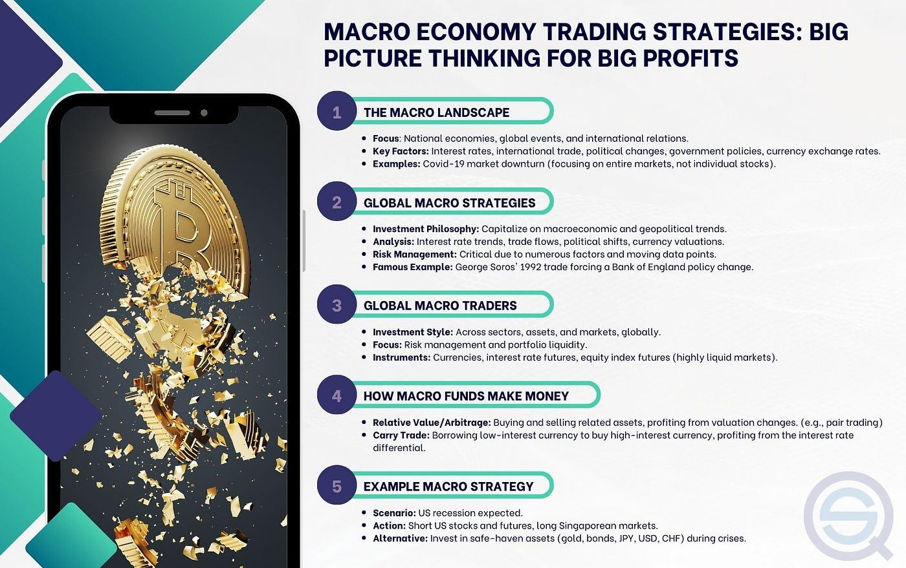

## Table of Contents

## What is macro trading?

Macro trading is a type of investing where people look at big things happening in the world to decide what to buy or sell. This includes things like how countries are doing economically, what interest rates are, and even big events like elections or natural disasters. Traders who do this are called macro traders, and they try to predict how these big events will affect markets like stocks, currencies, and commodities.

Macro traders use a lot of information to make their decisions. They might look at reports about how much a country is growing, how much people are spending, or what the government is doing with money. They also watch news and events around the world because these can change quickly and affect markets. By understanding these big pictures, macro traders try to make smart choices about where to put their money to make a profit.

## What are the key economic indicators that macro traders focus on?

Macro traders pay close attention to several key economic indicators to help them make their trading decisions. One of the most important indicators is Gross Domestic Product (GDP), which tells them how fast a country's economy is growing. They also look at inflation rates, which show how quickly prices for things like food and gas are going up. Unemployment rates are another big one because they show how many people are out of work, which can affect how much people spend and how the economy is doing overall.

Another set of indicators that macro traders focus on includes interest rates set by central banks, like the Federal Reserve in the U.S. Changes in these rates can affect borrowing costs and investment decisions. They also keep an eye on trade balances, which show if a country is exporting more than it's importing or vice versa. This can impact currency values and overall economic health. By understanding these indicators, macro traders can get a good sense of where the economy is headed and make better trading choices.

Lastly, macro traders often look at consumer confidence and manufacturing data. Consumer confidence tells them how people feel about their financial future, which can predict future spending. Manufacturing data, like the Purchasing Managers' Index (PMI), shows how busy factories are and can signal if the economy is expanding or slowing down. All these indicators together help macro traders piece together a bigger picture of the global economy and make informed decisions.

## How do global events influence macro trading strategies?

Global events can really shake up the world of [macro trading](/wiki/macro-trading). When something big happens, like a war or a major election, it can change how people think about the economy. For example, if there's a war, people might worry that it will mess up trade or raise prices for things like oil. This can make macro traders decide to sell certain investments or buy others, like gold, which people often see as a safe place to put money during uncertain times. Elections can also be a big deal because new leaders might change laws or policies that affect the economy, causing traders to adjust their strategies based on what they think will happen next.

Natural disasters are another type of event that can influence macro trading. If a big hurricane hits a country, it might damage factories or farms, which can slow down the economy and affect prices. Macro traders need to think about how these events will change the supply of things and what that means for the markets they're interested in. For instance, if a disaster hurts a country's ability to grow food, traders might expect food prices to go up and adjust their investments accordingly. By keeping an eye on these global events, macro traders can try to stay one step ahead and make smart choices about where to put their money.

## What are the differences between fundamental and technical analysis in macro trading?

Fundamental analysis in macro trading is all about looking at the big picture of the economy. Traders who use this method study things like how fast a country's economy is growing, what the unemployment rate is, and how much prices are going up. They also look at global events, like elections or natural disasters, to understand how these might change the economy. By understanding these big factors, fundamental analysts try to predict where the economy is headed and decide what to buy or sell based on that. It's like trying to guess the future of the economy by looking at all the pieces that make it up.

On the other hand, technical analysis in macro trading focuses on past price movements and patterns. Traders using this method look at charts and graphs to spot trends and patterns in how prices have changed over time. They believe that these patterns can help them predict what prices will do next. Technical analysts don't worry as much about the big economic factors; instead, they think that all the information they need is already in the price movements. It's like trying to predict the future by studying the past, without looking at the reasons behind the price changes.

## Can you explain the concept of carry trade in macro trading?

Carry trade is a strategy that macro traders use to make money from the difference in interest rates between two countries. Imagine you have money in a country where the interest rates are low. Instead of keeping your money there, you could borrow it at that low rate and then move it to another country where the interest rates are higher. By doing this, you can earn more interest on your money than you have to pay back on the loan. It's like getting paid to borrow money, as long as the exchange rate between the two countries stays stable.

However, [carry](/wiki/carry-trading) trade isn't without risks. If the value of the currency you borrowed in goes up compared to the currency you moved your money to, you could lose money when you convert it back. For example, if you borrowed in a country with a low [interest rate](/wiki/interest-rate-trading-strategies) and moved your money to a country with a high interest rate, but then the first country's currency got stronger, you'd have to pay back more than you expected. So, while carry trade can be profitable, macro traders need to keep a close eye on exchange rates and be ready to adjust their strategy if things change.

## What role does currency trading play in macro trading strategies?

Currency trading, also called [forex](/wiki/forex-system) trading, is a big part of macro trading. Macro traders look at big things happening around the world, like how fast economies are growing or what central banks are doing with interest rates. These things can change the value of different currencies. For example, if a country's economy is doing well, its currency might get stronger. Macro traders try to guess these changes and buy or sell currencies to make money from them.

A common strategy in macro trading that involves currencies is called carry trade. In carry trade, traders borrow money in a country with low interest rates and then move that money to a country with high interest rates. They earn the difference in interest rates as profit. But, this can be risky because if the currency they borrowed in gets stronger, they might lose money when they need to pay it back. So, understanding and trading currencies is a key part of what macro traders do.

## How do macro traders use interest rates to guide their strategies?

Macro traders pay a lot of attention to interest rates because these rates can really change how much money they can make. When a country's central bank, like the Federal Reserve in the U.S., changes interest rates, it can affect the whole economy. If interest rates go up, borrowing money becomes more expensive, and people might spend less. This can slow down the economy and make currencies stronger because more people want to save their money there. Macro traders might see this coming and decide to buy that country's currency before it gets stronger.

On the other hand, if interest rates go down, borrowing money becomes cheaper, and people might spend more. This can make the economy grow faster but can also make the currency weaker because people are more likely to spend their money instead of saving it. Macro traders can use this information to decide when to sell a currency or invest in things that do well when interest rates are low, like stocks or real estate. By watching interest rates, macro traders try to guess what will happen next and make their trading choices based on that.

## What are some common macro trading strategies for beginners?

One simple macro trading strategy for beginners is to follow the news and big events. When something big happens, like an election or a natural disaster, it can change how the economy works. Beginners can start by watching the news and learning about these events. They can then look at how these events might affect things like the value of money in different countries or the price of things like oil. For example, if a country is having an election, a beginner might guess that its money will get stronger if the new leader is good for the economy. They can then buy that country's money, hoping to sell it later for a profit.

Another easy strategy for beginners is to use something called carry trade. This means borrowing money from a place where interest rates are low and then moving that money to a place where interest rates are high. The beginner can earn more money from the high interest rates than they have to pay back on the loan. It's like getting paid to borrow money. But, beginners need to be careful because if the money they borrowed in gets stronger, they might lose money when they have to pay it back. So, they should keep an eye on how the value of different countries' money changes.

Lastly, beginners can start by looking at big economic numbers, like how fast a country's economy is growing or how many people are out of work. These numbers can tell them a lot about where the economy is going. For example, if a country's economy is growing fast, its money might get stronger. A beginner can buy that country's money, hoping to sell it later when it's worth more. By understanding these big numbers and how they affect things, beginners can make smart guesses about where to put their money.

## How can a trader develop a successful macro trading strategy?

To develop a successful macro trading strategy, a trader needs to start by understanding the big things happening around the world. This means keeping up with the news and learning about events like elections, natural disasters, and changes in how fast economies are growing. By watching these events, a trader can guess how they might change the value of money in different countries or the price of things like oil. For example, if a country's economy is doing well, its money might get stronger. A trader can buy that country's money, hoping to sell it later for a profit. It's also important to look at big economic numbers, like how many people are out of work or how fast prices are going up. These numbers can help a trader make smart guesses about where to put their money.

Another key part of developing a successful macro trading strategy is learning about different trading methods. One method is called [fundamental analysis](/wiki/fundamental-analysis), where a trader looks at the big picture of the economy to make decisions. Another method is technical analysis, where a trader looks at past price movements to spot patterns and predict what prices will do next. A trader can also try strategies like carry trade, where they borrow money from a place with low interest rates and move it to a place with high interest rates to earn more money. But, it's important to remember that all these strategies come with risks. A trader needs to be ready to change their plan if things don't go as expected. By combining a good understanding of the world with smart trading methods, a trader can develop a strategy that works well for them.

## What advanced tools and models do expert macro traders use?

Expert macro traders use advanced tools and models to make their trading decisions. One common tool is economic forecasting models, which help them predict how fast economies will grow or shrink. These models look at lots of data, like how many people are working, how much money people are spending, and what the government is doing. By understanding these big numbers, traders can guess what will happen to things like the value of money or the price of oil. Another tool they use is risk management software, which helps them figure out how much they could lose if their guesses are wrong. This software can tell them when to buy or sell to keep their losses small.

Another set of tools expert macro traders use includes sophisticated charting and technical analysis software. This software helps them spot patterns in how prices have changed over time. By looking at these patterns, traders can try to predict what prices will do next. They also use [algorithmic trading](/wiki/algorithmic-trading) systems, which are computer programs that can buy and sell things automatically based on the trader's rules. These systems can make trades very quickly and can help traders take advantage of small changes in the market. By using these advanced tools and models, expert macro traders can make smarter decisions and manage their risks better.

## How do geopolitical risks factor into macro trading decisions?

Geopolitical risks are big events like wars or elections that can change how countries work together and affect their economies. Macro traders need to keep an eye on these risks because they can change the value of money or the price of things like oil. For example, if there's a war, it might mess up trade between countries, making it harder to get certain things. This can make prices go up, and traders might decide to buy things they think will get more expensive or sell things that might lose value.

Another way geopolitical risks matter is through big changes in government policies. When a new leader gets elected, they might change laws or how they deal with other countries. This can affect how fast an economy grows or how strong a country's money is. Macro traders try to guess what these changes might mean for the economy and adjust their trading plans. By understanding these risks, traders can make better guesses about where to put their money and how to protect it from big surprises.

## What are the potential risks and rewards associated with macro trading?

Macro trading can be very rewarding because it lets traders make money from big changes in the world. If a trader guesses right about things like how fast a country's economy will grow or what will happen after an election, they can make a lot of money. For example, if they think a country's money will get stronger and it does, they can buy it cheap and sell it for more later. This kind of trading can lead to big profits, especially if the trader is good at understanding and predicting big events.

However, macro trading also comes with big risks. If a trader guesses wrong about what will happen, they can lose a lot of money. For instance, if they think a country's money will get stronger but it gets weaker instead, they might have to sell it for less than they paid. Also, big events like wars or natural disasters can be hard to predict and can change the market quickly. This means traders need to be ready to lose money and should always have a plan to manage their risks.

## References & Further Reading

[1]: Lopez de Prado, M. (2018). ["Advances in Financial Machine Learning."](https://books.google.com/books/about/Advances_in_Financial_Machine_Learning.html?id=oU9KDwAAQBAJ) Wiley.

[2]: Chan, E. P. (2008). ["Quantitative Trading: How to Build Your Own Algorithmic Trading Business."](https://rickorford.com/quantitative-trading/) John Wiley & Sons.

[3]: Jansen, S. (2020). ["Machine Learning for Algorithmic Trading."](https://github.com/stefan-jansen/machine-learning-for-trading) Packt Publishing.

[4]: Aronson, D. R. (2006). ["Evidence-Based Technical Analysis: Applying the Scientific Method and Statistical Inference to Trading Signals."](https://www.wiley.com/en-us/Evidence+Based+Technical+Analysis%3A+Applying+the+Scientific+Method+and+Statistical+Inference+to+Trading+Signals-p-9780470008744) Wiley.

[5]: Hasbrouck, J. (2007). ["Empirical Market Microstructure: The Institutions, Economics, and Econometrics of Securities Trading."](https://academic.oup.com/book/52241) Oxford University Press.