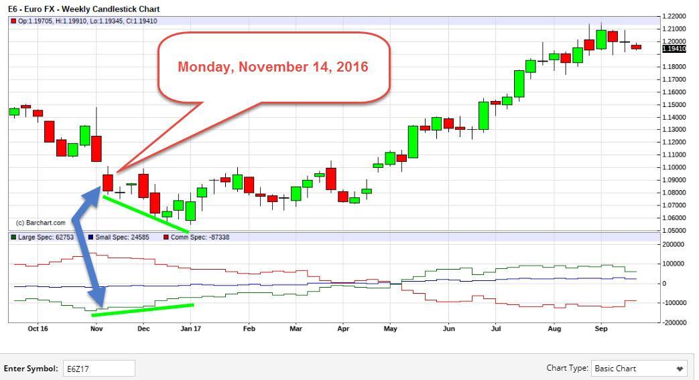

## Table of Contents

## What is macro trading?

Macro trading is a type of investing where people look at big picture things that affect the whole world's economy. Instead of focusing on one company or stock, macro traders pay attention to things like interest rates, inflation, and big events like elections or natural disasters. They use this information to guess which way the markets will move and make their investment choices based on those guesses.

Macro traders often use different financial tools like stocks, bonds, currencies, and commodities to make money. For example, if they think a country's economy will do well, they might buy its currency or invest in its stock market. On the other hand, if they think an economy will struggle, they might sell that country's currency or avoid its stocks. This kind of trading can be risky because it's hard to predict big events, but it can also be very rewarding if the trader's guesses are right.

## How does macro trading differ from other types of trading?

Macro trading is different from other types of trading because it focuses on big, global events and economic indicators rather than individual companies or stocks. While other traders might look at a company's earnings, leadership, or products, macro traders pay attention to things like interest rates, inflation rates, and major world events like elections or natural disasters. This means they try to predict how these big factors will affect markets as a whole, rather than focusing on the performance of specific stocks or assets.

In contrast, other types of trading, like [day trading](/wiki/day-trading-spy) or swing trading, often involve buying and selling stocks or other assets within a short time frame, sometimes even within the same day. These traders might use technical analysis, looking at charts and patterns to make quick decisions. Macro traders, on the other hand, might hold onto their investments for longer periods, as they are betting on broader economic trends that take time to play out. This difference in focus and time horizon means that [macro trading](/wiki/macro-trading) can be less about quick profits and more about understanding and anticipating large-scale economic shifts.

## What are the key economic indicators that macro traders monitor?

Macro traders keep an eye on a bunch of important numbers that help them understand how the world's economy is doing. They look at things like interest rates, which are what banks charge each other for loans. If interest rates go up, it might mean borrowing money will be more expensive, and that can slow down the economy. Another big thing they watch is inflation, which is when prices for stuff like food and gas go up over time. If inflation is high, it can mean people's money doesn't go as far, and that can change how they spend and invest.

They also pay attention to unemployment rates, which tell them how many people are out of work. High unemployment can mean the economy is struggling, while low unemployment can mean it's doing well. Gross Domestic Product (GDP) is another big one, which measures the total value of all goods and services a country produces. If GDP is growing, it's a good sign for the economy. Macro traders use all these numbers to guess where the economy might be headed and make their trading decisions based on those guesses.

Lastly, they watch things like consumer confidence, which shows how people feel about their financial future. If people feel good, they're more likely to spend money, which can help the economy grow. Macro traders also look at trade balances, which show if a country is exporting more than it's importing, or the other way around. All these indicators help macro traders see the big picture of the world's economy and decide where to put their money.

## How can global events influence macro trading strategies?

Global events can really shake things up for macro traders. When something big happens, like a war or a natural disaster, it can change how people and countries spend and invest their money. For example, if there's a war, it might make oil prices go up because people worry about where oil comes from. Macro traders might then decide to buy oil or sell stocks in countries that rely a lot on oil. Big events like elections can also matter a lot. If a new leader gets elected and they want to change things, like taxes or trade rules, traders have to guess how those changes will affect the economy and adjust their plans.

These events can also change how safe people feel about putting their money in different places. If there's a lot of uncertainty, people might move their money to safer investments, like gold or government bonds. Macro traders need to watch these shifts and decide if they should do the same. Sometimes, global events can even make whole markets go up or down. For instance, if a big country like the U.S. or China has a problem, it can affect the whole world's economy. Macro traders have to be ready to change their strategies quickly to make the most of these big changes.

## What are the common tools and platforms used in macro trading?

Macro traders use a bunch of different tools to help them understand and predict the economy. One common tool is economic calendars, which show when important economic reports like unemployment rates or GDP numbers will come out. Traders use these to prepare for how the market might react. Another tool is financial news platforms like Bloomberg Terminal or Reuters, which give traders up-to-the-minute news and data. They can see what's happening around the world and how it might affect their trades. Lastly, traders often use economic indicators dashboards, which gather all the important numbers in one place so they can see the big picture easily.

For trading itself, macro traders use platforms like MetaTrader 4 or 5, which let them buy and sell different kinds of investments like currencies, stocks, and commodities. These platforms have tools for analyzing charts and patterns, which helps traders make decisions. Some also use more advanced software like NinjaTrader or TradingView, which have extra features for tracking and analyzing data. These tools help macro traders manage their investments and react quickly to changes in the economy.

## How do macro traders use leverage and what are the associated risks?

Macro traders often use leverage to try and make more money from their trades. Leverage means borrowing money to invest more than you actually have. For example, if you have $1,000, you might use leverage to control a $10,000 investment. This can be good if the trade goes well, because you can make a lot more money than you put in. But it can also be bad if the trade goes the other way, because you could lose more money than you started with.

The big risk with using leverage is that it can make losses bigger. If the market moves against what the trader expected, they might have to pay back the borrowed money and lose their own money too. This can happen really fast, especially in markets that change a lot. Because of this, macro traders have to be very careful and keep a close eye on their trades. They also need to have a good plan for managing their risks, like setting limits on how much they're willing to lose.

## What role do central banks play in macro trading?

Central banks are really important for macro traders because they control things like interest rates and the money supply. When a central bank changes interest rates, it can affect the whole economy. If they raise rates, borrowing money becomes more expensive, and that can slow down spending and investment. If they lower rates, borrowing becomes cheaper, which can help the economy grow faster. Macro traders watch these moves closely because they can change how people and businesses behave, which in turn affects markets.

Central banks also have a big say in how much money is in the economy. They can print more money or take it out of circulation, which can change inflation rates. If there's too much money, prices might go up, and if there's not enough, prices might go down. Macro traders need to guess what central banks will do next and how it will affect the economy. This can help them decide whether to buy or sell different investments. So, understanding what central banks are doing is a big part of macro trading.

## How can one develop a successful macro trading strategy?

Developing a successful macro trading strategy starts with understanding the big picture of the world's economy. You need to keep an eye on important numbers like interest rates, inflation, and unemployment. These numbers can tell you a lot about where the economy might be headed. You should also pay attention to big events like elections or natural disasters, because they can change how people spend and invest. By studying these things, you can start to guess what might happen next and make your trading decisions based on those guesses.

Once you have a good understanding of the economy, you need to use tools like economic calendars and financial news platforms to stay up-to-date. These tools help you know when important reports are coming out and what's happening around the world. You also need to think about how much risk you're willing to take. Using leverage can help you make more money, but it can also make you lose more if things don't go your way. A good strategy includes setting limits on how much you're willing to lose and being ready to change your plans if the economy shifts in unexpected ways.

## What are some historical examples of successful macro trades?

One famous macro trade was made by George Soros in 1992. He bet against the British pound, thinking it was overvalued. He borrowed a lot of pounds and sold them, expecting the price to fall. When the British government couldn't keep the pound's value up, Soros made a huge profit. This trade is known as "Black Wednesday" and Soros made about $1 billion from it. It shows how understanding big economic moves can lead to big wins in macro trading.

Another example is when Stanley Druckenmiller, who worked with Soros, made a big bet on the U.S. dollar in the early 1980s. At the time, the U.S. had high inflation and interest rates were going up. Druckenmiller guessed that the dollar would get stronger because of these changes. He bought a lot of dollars and made a big profit when the dollar's value went up. This trade shows how paying attention to things like interest rates and inflation can help macro traders make smart decisions.

## How do geopolitical tensions affect macro trading decisions?

Geopolitical tensions, like fights between countries or big political changes, can really shake up the world's economy. When countries are not getting along, it can make people worried about the future. This worry can make them move their money to safer places, like gold or government bonds. Macro traders need to watch these tensions closely because they can change how people and countries spend and invest. For example, if two big countries are fighting over trade, it might make the prices of things like oil or steel go up or down. Traders have to guess how these changes will affect the markets and adjust their plans accordingly.

These tensions can also make whole markets go up or down. If there's a war or a big political change, it can make the economy of a country or even the whole world go through big ups and downs. Macro traders need to be ready to change their strategies quickly to make the most of these big changes. For instance, if a country is having a lot of problems because of a war, traders might sell that country's currency or stocks and buy safer investments. Understanding how geopolitical tensions can affect the economy is a big part of being a successful macro trader.

## What advanced analytical techniques are used in expert macro trading?

Expert macro traders use a lot of fancy math and computer tools to understand the economy better. One way they do this is by using something called econometric models. These models help them see how different parts of the economy, like interest rates and unemployment, affect each other. They also use something called time series analysis, which looks at how economic numbers change over time. This can help them predict what might happen next. Another tool they use is [machine learning](/wiki/machine-learning), which is a kind of computer program that can learn from data and make guesses about the future. These advanced techniques help traders make smarter decisions about where to put their money.

Another important technique is called sentiment analysis. This is when traders use computers to look at what people are saying on the internet, like on social media or news sites, to see how people feel about the economy. If a lot of people are worried, it might mean the economy will go down. If people are happy, it might mean the economy will go up. Traders also use something called scenario analysis, where they think about different things that could happen in the future and how they would affect their trades. By using these advanced tools and techniques, macro traders can get a better idea of what might happen in the economy and make better trading decisions.

## How can macro traders manage and mitigate risks effectively?

Macro traders can manage and mitigate risks by setting clear limits on how much they are willing to lose on each trade. This is called setting a stop-loss order, which automatically sells an investment if it drops to a certain price. By doing this, traders can make sure they don't lose more money than they can handle. Another way to manage risk is by not putting all their money into one trade. Instead, they spread their money across different investments, which is called diversification. This way, if one trade goes bad, they still have other investments that might do well.

Traders also use something called risk-reward ratios to decide if a trade is worth it. This means they look at how much they could lose compared to how much they could gain. If the potential gain is much bigger than the potential loss, it might be a good trade. They also keep an eye on the news and economic reports to stay ahead of big changes that could affect their trades. By staying informed and adjusting their strategies as needed, macro traders can better handle the ups and downs of the market.

## References & Further Reading

[1]: ["Fundamental Analysis."](https://www.investopedia.com/terms/f/fundamentalanalysis.asp) Investopedia.

[2]: ["Technical Analysis."](https://www.investopedia.com/terms/t/technicalanalysis.asp) Investopedia.

[3]: Taleb, Nassim Nicholas. ["The Black Swan: The Impact of the Highly Improbable."](https://www.amazon.com/Black-Swan-Impact-Highly-Improbable/dp/0141034599) Random House, 2010.

[4]: Schwager, Jack D. ["Market Wizards: Interviews with Top Traders."](https://www.wiley.com/en-us/Market+Wizards%3A+Interviews+with+Top+Traders-p-9781118273050) Wiley, 2012.

[5]: Tharp, Van K. ["Definitive Guide to Position Sizing: How to Evaluate Your System and Use Position Sizing to Meet Your Objectives."](https://www.amazon.com/Definitive-Guide-Position-Sizing-Objectives/dp/0935219099) International Institute of Trading Mastery, 2008.

[6]: Soros, George. ["The Alchemy of Finance."](https://www.wiley.com/en-us/The+Alchemy+of+Finance%3A+Reading+the+Mind+of+the+Market-p-9780471445494) Wiley, 2003.

[7]: Ilmanen, A. (2011). ["Expected Returns: An Investor's Guide to Harvesting Market Rewards."](https://www.wiley.com/en-us/Expected+Returns%3A+An+Investor%27s+Guide+to+Harvesting+Market+Rewards-p-9781119990727) Wiley.