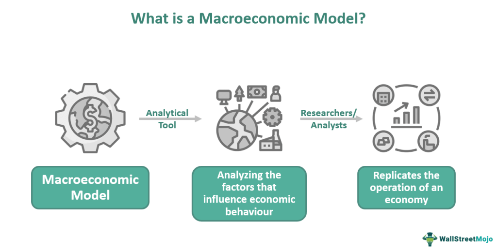

In today's interconnected global landscape, economic events occurring in one part of the world can have far-reaching effects on financial markets across the globe. Understanding the intricate dance of global economies and financial systems is crucial for those looking to navigate the complexities of these markets effectively. Central to this understanding are the fields of macroeconomics and algorithmic trading—two disciplines that offer valuable tools and insights for market participants.

Macroeconomics, the study of economies at a large scale, focuses on crucial indicators such as national output, unemployment, and inflation. By examining these indicators, one can gauge the health and direction of an economy. Governments and policymakers use macroeconomic insights to implement monetary and fiscal policies aimed at stabilizing economic conditions, which in turn affect currency values, interest rates, and market dynamics. Comprehending these macroeconomic concepts is vital for predicting economic conditions and informing trading strategies.



Algorithmic trading, on the other hand, utilizes automated systems to execute trades based on pre-defined criteria, allowing traders to process large volumes of data quickly and respond to market changes with precision. In a world where financial markets are rife with inefficiencies and are influenced by macroeconomic shifts, algorithmic trading offers a strategic advantage. It enables traders to leverage these shifts by swiftly adjusting their strategies in response to new data.

This article aims to explore the influence of global economic events on macroeconomics and how these insights can be integrated into effective algorithmic trading strategies. Through this exploration, we seek to provide a comprehensive guide for traders and investors, equipping them with the knowledge to make informed decisions in an ever-evolving market environment. We will dissect the components of macroeconomic analysis, explore the nuances of algorithmic trading, and present best practices for leveraging these insights to succeed in volatile markets.

## Table of Contents

## Understanding Macroeconomics

Macroeconomics examines the economy in a broad context, focusing on overall phenomena rather than individual markets. It encompasses studies of national output, unemployment, and inflation to gauge economic health and stability. 

Key indicators provide vital insights into macroeconomic dynamics. Gross Domestic Product (GDP) measures a country's economic output and overall economic performance. It reflects the total value of all goods and services produced over a specific time period. An increase in GDP suggests economic growth, while a decrease indicates a contraction. GDP can be expressed as:

$$
\text{GDP} = C + I + G + (X - M)
$$

where $C$ is consumption, $I$ is investment, $G$ is government spending, $X$ is exports, and $M$ is imports.

The unemployment rate is another crucial indicator, representing the percentage of the labor force that is jobless and actively seeking employment. High unemployment rates may signal economic distress, as they often correlate with lower consumer spending, reduced investment, and decreased economic activity. Conversely, a low unemployment rate often indicates a healthy economy with strong demand for labor.

Inflation rate measures the rate at which the general level of prices for goods and services rises, eroding purchasing power. Central banks often aim to control inflation within a target range to ensure price stability. Persistent inflation can lead to uncertainty and discourage investment, whereas deflation can lead to a decrease in consumer spending.

Governments utilize monetary and fiscal policies to stabilize economies and influence these macroeconomic indicators. Monetary policy, managed by central banks, involves controlling the money supply and interest rates to achieve macroeconomic objectives such as controlling inflation, consumption, growth, and [liquidity](/wiki/liquidity-risk-premium). For example, lowering interest rates can stimulate borrowing and spending, boosting economic activity.

Fiscal policy involves the use of government revenue collection (taxation) and expenditure to influence the economy. By adjusting tax rates and government spending, governments can either stimulate economic growth or cool down an overheating economy. An expansionary fiscal policy, characterized by increased government spending and tax cuts, is used to combat unemployment and stimulate growth, whereas a contractionary policy aims to reduce inflation through decreased spending and increased taxes.

Understanding these macroeconomic concepts and indicators is paramount for predicting economic conditions. They inform trading strategies as investors assess economic health and anticipate shifts within financial markets. Analyzing macroeconomic trends, traders and investors can align their portfolios to optimize returns and mitigate risks associated with economic cycles.

## Impact of Global Events on Macroeconomic Indicators

Global events have profound and often immediate impacts on macroeconomic indicators, altering the landscape in which businesses and economies operate. Such events include financial crises, geopolitical tensions, and pandemics. Each of these has the potential to disrupt economic activities and shift traditional patterns of production, consumption, and investment. 

During a financial crisis, for example, consumer confidence typically plummets, leading to decreased spending and delayed investments. This behavior results in significant drops in national output, as measured by Gross Domestic Product (GDP). Additionally, financial institutions may face liquidity shortfalls, tightening credit supply, which further exacerbates economic slowdowns. One notable example is the Global Financial Crisis of 2007-2008, which led to a severe worldwide economic downturn, significantly altering global macroeconomic indicators such as unemployment rates and inflation.

Geopolitical tensions, such as trade wars or regional conflicts, have similar destabilizing effects. These events can disrupt supply chains, alter trade balances, and lead to resource scarcities. For instance, tensions between major global economies can lead to tariffs and trade barriers that increase costs for businesses and consumers alike, affecting economic growth indicators.

Pandemics, such as the COVID-19 outbreak, emphasize the extent to which global events can dramatically affect macroeconomics. During the COVID-19 pandemic, unprecedented worldwide unemployment rates and economic contractions were observed, with massive impact on GDP and public sector borrowing levels. Lockdowns and restrictions resulted in steep declines in consumer demand and disruptions in production, while governments implemented substantial fiscal stimulus packages to mitigate these effects.

Therefore, understanding the impact of such global events on macroeconomic indicators is crucial for investors and policymakers. By analyzing these impacts, stakeholders can better forecast market movements and adjust strategies appropriately. This involves not only examining direct effects on economic indicators but also considering potential secondary and tertiary effects that might arise. For instance, a geopolitical event might initially impact oil prices, which in turn could influence transportation costs and broader inflation rates. 

Moreover, in-depth macroeconomic analysis is made more effective with the use of advanced computational methods, including algorithmic modeling. Investors often utilize algorithms to process large datasets to identify trends and correlations within macroeconomic indicators that may be influenced by global events. Python, for instance, offers libraries such as Pandas and NumPy, which can handle vast amounts of economic data, enabling better forecasting and strategic planning.

In conclusion, the interplay between global events and macroeconomic indicators represents a crucial area of study for investors aiming to effectively navigate the complexities of the financial markets and make informed decisions.

## Algorithmic Trading: An Overview

Algorithmic trading, often referred to as algo trading, represents a significant advancement in the world of finance, where the execution of trading orders is automated and governed by complex algorithms. These algorithms, designed to follow predefined criteria such as timing, price, or [volume](/wiki/volume-trading-strategy), allow for the processing and analysis of vast amounts of market data to make trades within moments—far quicker than human capabilities.

At its core, [algorithmic trading](/wiki/algorithmic-trading) relies on mathematical models and strategies to identify and capitalize on market inefficiencies. This rapid data processing capability is essential for traders who aim to exploit subtle market changes that may arise due to macroeconomic shifts. By utilizing these algorithms, traders can efficiently scan numerous market sources, evaluate the best entry or [exit](/wiki/exit-strategy) points, and execute trades with precision.

For example, let $P(t)$ be the price of an asset at time $t$. An algorithm might be set to execute a buy order when the price drops below a certain threshold, $P_{\text{buy}}$, given by:

$$
P_{\text{buy}} = \bar{P} - k \cdot \sigma
$$

where $\bar{P}$ is the moving average price, $\sigma$ is the standard deviation, and $k$ is a constant parameter determining the sensitivity of the buy condition.

Additionally, the efficiency stems from the fact that these algorithms can operate continuously, devoid of the emotional biases that can affect human decision-making. This [factor](/wiki/factor-investing) is particularly advantageous during high [volatility](/wiki/volatility-trading-strategies) periods influenced by macroeconomic events, where emotions can lead to irrational trading behavior.

Python is a popular language for developing these algorithms, thanks to libraries like `pandas` and `NumPy` for data manipulation and analysis, and `PyAlgoTrader` for executing complex trading strategies. A simple example of an automated trading strategy in Python could look as follows:

```python
import pandas as pd
import numpy as np

# Fetch historical data
def get_price_data():
    # placeholder for data retrieval
    return pd.DataFrame(...) 

data = get_price_data()

# Calculate moving average and standard deviation
data['Moving Average'] = data['Price'].rolling(window=20).mean()
data['Standard Deviation'] = data['Price'].rolling(window=20).std()

# Define buy and sell signals
def generate_signals(data, k=2):
    data['Buy Signal'] = np.where(data['Price'] < (data['Moving Average'] - k * data['Standard Deviation']), 1, 0)
    data['Sell Signal'] = np.where(data['Price'] > (data['Moving Average'] + k * data['Standard Deviation']), -1, 0)
    return data

signals = generate_signals(data)

# Execute trades based on signals
def execute_trades(signals):
    for index, row in signals.iterrows():
        if row['Buy Signal']:
            # Place a buy order
            pass
        elif row['Sell Signal']:
            # Place a sell order
            pass

execute_trades(signals)
```

The key advantage of algorithmic trading lies in its ability to minimize transaction costs and enhance the speed and accuracy of trading operations. This approach is particularly effective in capitalizing on transient [arbitrage](/wiki/arbitrage) opportunities and managing sizable volume trades without impacting market prices. In essence, algorithmic trading has positioned itself as a cornerstone of modern trading practices, offering unparalleled efficiency and strategic advantage in navigating complex financial markets driven by macroeconomic dynamics.

## Integration of Macroeconomics in Algorithmic Trading

Macroeconomic analysis plays a pivotal role in developing algorithmic trading strategies capable of exploiting global events. Algorithms, designed to assess vast amounts of economic data, are programmed to respond to various economic indicators and news events. This allows them to execute trades based on predefined criteria that reflect the current economic conditions.

Algorithms can analyze historical data to identify patterns and relationships between macroeconomic variables and asset prices. For example, changes in GDP, inflation rates, or unemployment figures can influence currency values, stock prices, and bond yields. Algorithmic trading strategies can be built around these relationships by coding rules that trigger buy or sell orders when certain conditions are met. This approach is particularly effective in responding to high-impact news events such as central bank policy decisions or geopolitical tensions, which can lead to rapid market fluctuations.

To implement such strategies, algorithms often utilize [machine learning](/wiki/machine-learning) techniques to improve their predictive accuracy over time. A popular approach is to train models on historical data, identifying trends that may indicate future market movements. For example, regression analysis can be used to model the relationship between economic indicators and asset returns. Consider the simple linear regression model:

$$
R_t = \alpha + \beta \times X_t + \epsilon_t
$$

Here, $R_t$ represents the asset return at time $t$, $\alpha$ is a constant, $\beta$ is the coefficient that measures the sensitivity of the return to the macroeconomic indicator $X_t$, and $\epsilon_t$ is the error term. By estimating these coefficients using historical data, the model can predict future returns based on changes in the indicator $X_t$.

Python, with its wealth of libraries like pandas, scikit-learn, and statsmodels, provides robust tools for building such models. A simple Python script to perform linear regression might look like this:

```python
import pandas as pd
from sklearn.linear_model import LinearRegression

# Load data
data = pd.read_csv('economic_data.csv')
X = data['indicator'].values.reshape(-1, 1)  # Macroeconomic indicator
y = data['returns'].values  # Asset returns

# Create and fit model
model = LinearRegression()
model.fit(X, y)

# Predict future returns
future_indicator = [[future_indicator_value]]
predicted_return = model.predict(future_indicator)
print(f"Predicted Return: {predicted_return}")
```

This integration of macroeconomic analysis into algorithmic trading allows traders to systematically leverage economic insights to inform their strategies. By continuously updating algorithms with the latest data and refining models to account for new market dynamics, traders can maintain an edge in increasingly complex financial markets.

## Best Practices for Algorithmic Trading in Volatile Markets

In the fast-paced and often unpredictable financial markets, especially during periods of heightened volatility, traders must employ effective strategies to safeguard their investments and capitalize on opportunities. Staying informed about economic events and indicators holds paramount importance for developing proactive trading strategies. Traders can interpret these events to anticipate market movements, thus adjusting their algorithmic models to remain responsive and effective.

Diversification across asset classes serves as a foundational strategy to mitigate risk exposure in volatile markets. By distributing investments across different financial instruments, such as stocks, bonds, commodities, and currencies, traders can reduce the adverse impact of a significant downturn in any single market. This approach leverages the principle that different asset classes often react differently to the same economic events, thereby stabilizing the overall investment portfolio.

Adopting robust risk management techniques is essential, particularly the implementation of stop-loss orders. These orders are designed to limit an investor's loss on a position in a security by triggering a sale once the price reaches a predetermined level. This mechanism protects against sharp and sudden market shifts that may not be immediately apparent to human traders but can be swiftly recognized and acted upon by trading algorithms.

For example, a stop-loss order can be set using a simple Python script within an algorithmic trading system. Here's a basic illustration of a Python function for setting a stop-loss:

```python
def place_stop_loss_order(current_price, stop_loss_percentage):
    stop_loss_price = current_price * (1 - stop_loss_percentage / 100)

    # Code to place a stop-loss order at stop_loss_price
    print(f"Placing stop-loss order at {stop_loss_price}")

# Example usage
current_price = 150.00  # Current price of the asset
stop_loss_percentage = 5  # Stop-loss set at 5% below the current price
place_stop_loss_order(current_price, stop_loss_percentage)
```

In this example, if the asset's current price is $150, and the stop-loss is set at 5%, the function calculates the stop-loss price at $142.50. The code then places an order to sell if the asset reaches this price, thus protecting the trader from further losses.

In highly volatile market conditions, algorithmic trading systems can be programmed to dynamically adjust stop-loss levels, taking into account changing market volatility patterns and the trader’s risk tolerance. Additionally, continuous monitoring and analysis of economic indicators, such as interest rates, inflation data, and geopolitical developments, allow these systems to refine their strategies and maintain a competitive edge.

Adhering to these best practices enables traders to navigate the complexities of volatile markets effectively, blending informed decision-making with technological capabilities to optimize performance and manage risk efficiently.

## Case Studies of Successful Algorithmic Strategies

Algorithmic trading strategies have evolved significantly in recent years, adapting to various macroeconomic events and market conditions. Analyzing historical success stories provides valuable insights into effective strategy design and execution. Key examples include algorithmic responses to seismic events such as Brexit and major central bank policy decisions.

### Case Study: Brexit

The United Kingdom's decision to leave the European Union, widely known as Brexit, was a major geopolitical event that had significant impacts on global financial markets. Algorithmic traders who successfully navigated the uncertainty surrounding the event were those who integrated real-time news analysis and sentiment data into their systems. By utilizing natural language processing (NLP) algorithms, traders were able to assess market sentiment quickly and accurately, responding to news developments as they occurred.

Python, a popular language for algorithmic traders, can be used to implement sentiment analysis using libraries such as `nltk` and `TextBlob`. For example, an algorithm might look like this:

```python
from textblob import TextBlob

def analyze_sentiment(news_text):
    analysis = TextBlob(news_text)
    return analysis.sentiment.polarity

def make_trade_decision(polarity):
    if polarity > 0.1:
        return 'BUY'
    elif polarity < -0.1:
        return 'SELL'
    else:
        return 'HOLD'
```

This simple sentiment analysis function evaluates news sentiment and recommends a trading action based on sentiment polarity.

### Case Study: Central Bank Policy Decisions

Central bank policy announcements, such as [interest rate](/wiki/interest-rate-trading-strategies) changes or quantitative easing measures, can cause significant market movements. Successful algorithmic strategies often incorporate economic indicator data alongside the announcements themselves to make informed trading decisions.

For instance, the European Central Bank (ECB) announcements are closely watched events. Algorithms that succeeded during these times often utilized economic forecast models, which predicted the potential impacts of policy changes on currency pairs, particularly the EUR/USD. These models were enhanced with machine learning algorithms capable of processing vast amounts of historical data to detect patterns and forecast potential outcomes.

One effective technique is using regression analysis to predict currency movements in response to policy changes. A basic implementation using Python's `scikit-learn` library might involve training a model on historical interest rate data and currency pair movements:

```python
from sklearn.linear_model import LinearRegression
import numpy as np

# Example data
X = np.array([[0.25], [0.5], [1.0], [1.5], [2.0]])  # Interest rates
y = np.array([1.2, 1.15, 1.1, 1.0, 0.9])  # EUR/USD values

model = LinearRegression().fit(X, y)

# Predict effect of a new interest rate
new_rate = np.array([[1.25]])
predicted_value = model.predict(new_rate)
```

In these case studies, the key to success lay in the adaptability of the algorithms and their ability to process and respond to new information swiftly. This adaptability, paired with informed decision-making bolstered by comprehensive market data analysis, underscores the effectiveness of algorithmic trading in managing the complexities presented by global events.

## Conclusion

In today’s interconnected financial landscape, grasping the intricate relationship between macroeconomics and algorithmic trading is crucial for gaining an edge in global markets. The fusion of macroeconomic analysis with algorithmic trading provides traders with powerful tools to navigate economic fluctuations effectively. By leveraging macroeconomic insights, traders can anticipate the effects of global events, thus crafting strategies that are responsive and adaptive.

Macroeconomic analysis forms the backbone of successful trading strategies, as it allows traders to assess how events like policy changes or economic data releases impact market dynamics. Incorporating such analysis into algorithmic models enables traders to adjust swiftly to market signals. For instance, an algorithm programmed to react to changes in economic indicators such as GDP growth rates or inflation data can capitalize on emerging trends. 

As financial markets are subject to rapid and dramatic changes, maintaining agility and a well-informed approach becomes essential. Traders must continuously monitor global market indicators and adapt their strategies to account for both expected and unforeseen events. This proactive stance ensures that trading systems remain robust amidst market volatility, safeguarding against potential risks while seizing profitable opportunities.

In conclusion, understanding and applying macroeconomic analysis within algorithmic trading is indispensable for capitalizing on global market dynamics. By staying informed and agile, traders can enhance their capability to make informed decisions, ensuring success in ever-evolving markets.

## References & Further Reading

[1]: "Advances in Financial Machine Learning" by Marcos Lopez de Prado. A comprehensive resource on the intersection of machine learning and finance.

[2]: Chan, E.P. (2008). "Quantitative Trading: How to Build Your Own Algorithmic Trading Business." Offers insights into developing algorithmic trading strategies.

[3]: Aronson, D.R. (2006). "Evidence-Based Technical Analysis: Applying the Scientific Method and Statistical Inference to Trading Signals." Provides a scientific approach to technical analysis.

[4]: Jansen, S. (2018). "Machine Learning for Algorithmic Trading." Explores the application of machine learning techniques in algorithmic trading.

[5]: Markowitz, H. (1952). "Portfolio Selection." The Journal of Finance, 7(1), 77-91. A foundational paper in finance literature on diversification and risk management. 

[6]: Bergstra, J., Bardenet, R., Bengio, Y., & Kégl, B. (2011). "Algorithms for Hyper-Parameter Optimization." Advances in Neural Information Processing Systems 24, details on optimization in machine learning applicable to trading.