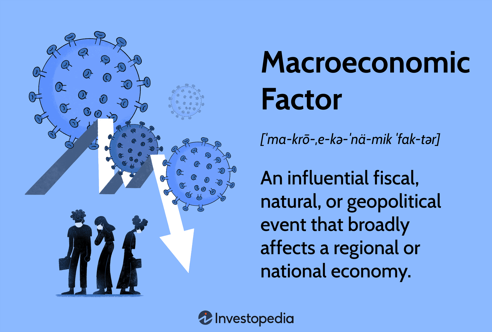

## Table of Contents

## What are macroeconomic factors?

Macroeconomic factors are big things that affect a whole country's economy. They include stuff like how much people earn, how many people have jobs, how much stuff costs, and how much money is being spent. These factors can make the economy grow or shrink. For example, if lots of people have jobs and are earning good money, they will spend more, which can help the economy grow. But if lots of people lose their jobs, they will spend less, and the economy might shrink.

Another important macroeconomic factor is interest rates. This is the cost of borrowing money. If interest rates are low, it's cheaper for people and businesses to borrow money, which can lead to more spending and investment. But if interest rates are high, borrowing becomes more expensive, and people might spend and invest less. Governments also use interest rates to control inflation, which is when prices go up over time. By changing interest rates, they can try to keep the economy stable.

Other macroeconomic factors include things like how much a country trades with other countries, how much money the government spends, and how much taxes people have to pay. All these things together can make the economy stronger or weaker. For example, if a country exports a lot of goods, it can help the economy grow. But if the government spends too much money and has to raise taxes, it might slow down the economy. Understanding these factors helps people make better decisions about money and investments.

## How do macroeconomic factors influence an economy?

Macroeconomic factors play a big role in shaping how well a country's economy does. Things like how much people earn, how many people have jobs, and how much stuff costs all affect how much money people have to spend. If lots of people have jobs and are [earning](/wiki/earning-announcement) good money, they'll spend more, which can help the economy grow. But if lots of people lose their jobs, they'll spend less, and the economy might shrink. Interest rates are also important because they decide how expensive it is to borrow money. Low interest rates can make it cheaper to borrow, so people and businesses might spend and invest more. High interest rates make borrowing more expensive, so people might spend and invest less.

Governments use interest rates to control inflation, which is when prices go up over time. By changing interest rates, they try to keep the economy stable. Other factors like how much a country trades with other countries, how much the government spends, and how much taxes people have to pay also matter. If a country exports a lot of goods, it can help the economy grow. But if the government spends too much money and has to raise taxes, it might slow down the economy. All these factors together can make the economy stronger or weaker, and understanding them helps people make better decisions about money and investments.

## What are the main types of macroeconomic factors?

Macroeconomic factors are big things that affect a whole country's economy. They include things like how much money people earn, how many people have jobs, and how much stuff costs. When people earn more and have jobs, they spend more money, which can make the economy grow. But if people lose their jobs or earn less, they spend less, and the economy might shrink. Another important [factor](/wiki/factor-investing) is interest rates, which is the cost of borrowing money. Low interest rates make it cheaper to borrow, so people and businesses might spend and invest more. High interest rates make borrowing more expensive, so people might spend and invest less.

Governments use interest rates to control inflation, which is when prices go up over time. By changing interest rates, they try to keep the economy stable. Other factors that affect the economy include how much a country trades with other countries, how much the government spends, and how much taxes people have to pay. If a country exports a lot of goods, it can help the economy grow. But if the government spends too much money and has to raise taxes, it might slow down the economy. All these factors together can make the economy stronger or weaker, and understanding them helps people make better decisions about money and investments.

## Can you provide examples of economic indicators?

Economic indicators are like signs that tell us how the economy is doing. One example is the unemployment rate, which shows the percentage of people who want to work but can't find a job. If the unemployment rate is low, it means more people have jobs and are earning money, which is good for the economy. Another example is the Gross Domestic Product (GDP), which measures the total value of all goods and services produced in a country. If GDP is growing, it means the economy is doing well because more stuff is being made and sold.

Inflation rate is another important indicator. It tells us how fast the prices of things are going up. If inflation is high, it means things are getting more expensive quickly, which can make it harder for people to buy what they need. On the other hand, the Consumer Price Index (CPI) tracks the average price of a basket of goods and services over time. If the CPI goes up, it means the cost of living is increasing. These indicators help people and governments understand the health of the economy and make better decisions.

## How do interest rates affect macroeconomic conditions?

Interest rates are like the price of borrowing money. When interest rates are low, it's cheaper for people and businesses to borrow money. This can make them spend and invest more, which can help the economy grow. For example, if a business can borrow money at a low rate, it might decide to buy new equipment or expand. More spending and investment can lead to more jobs and higher incomes, making the economy stronger. But when interest rates are high, borrowing money becomes more expensive. People and businesses might decide to borrow less and spend less, which can slow down the economy. If businesses aren't borrowing to grow, they might not create new jobs, and people might feel less confident about spending money.

Governments use interest rates to control the economy. They can raise interest rates to slow down the economy if things are growing too fast and prices are going up too quickly, which is called inflation. By making borrowing more expensive, the government can cool down the economy and keep prices from rising too fast. On the other hand, if the economy is slowing down and not enough people have jobs, the government might lower interest rates. This makes borrowing cheaper, encouraging more spending and investment, which can help the economy grow again. So, interest rates are a powerful tool that governments use to keep the economy balanced and stable.

## What role does inflation play in the economy?

Inflation is when the prices of things go up over time. It's important because it affects how much money people can buy with their earnings. If inflation is high, the money people have doesn't go as far because everything costs more. This can make life harder for people, especially if their wages don't go up at the same time. On the other hand, a little bit of inflation can be good for the economy. It encourages people to spend money now instead of saving it, because they know prices will be higher later. This spending can help the economy grow.

Governments and central banks try to keep inflation at a steady, low level. They do this by changing interest rates, which is the cost of borrowing money. If inflation is too high, they might raise interest rates to make borrowing more expensive. This can slow down spending and help bring prices down. If inflation is too low or if the economy is slowing down, they might lower interest rates to make borrowing cheaper. This encourages more spending and can help the economy grow. So, inflation is a big part of how the economy works, and managing it is key to keeping things stable.

## How does employment rate impact the economy?

The employment rate is really important for the economy. It shows how many people have jobs. When lots of people have jobs, they earn money and can spend it on things they need and want. This spending helps businesses grow and can make the economy stronger. If more people are working, it means more money is moving around, which can lead to more jobs and more growth. It's like a good cycle that keeps the economy going.

But if the employment rate goes down and lots of people lose their jobs, it can be bad for the economy. When people don't have jobs, they don't have as much money to spend. This can make businesses sell less and maybe even close down. When businesses struggle, they might have to let go of more workers, which makes the problem worse. So, a high employment rate is good for the economy, but a low employment rate can make it weaker.

## What is the significance of GDP as a macroeconomic factor?

GDP, or Gross Domestic Product, is like a big scoreboard for a country's economy. It tells us the total value of all the goods and services made in a country over a certain time, usually a year. When GDP goes up, it means the economy is doing well because more things are being made and sold. This can make people feel confident about their jobs and money, and it can lead to more spending and investment. So, GDP is a really important way to see if the economy is growing or not.

If GDP is growing, it's a sign that the economy is strong. More people might have jobs, and businesses might be doing well. But if GDP goes down, it can mean the economy is shrinking. This can make people worried about their jobs and less likely to spend money. Governments and businesses watch GDP closely because it helps them make decisions about things like taxes, spending, and interest rates. Understanding GDP helps everyone know how the economy is doing and what might happen next.

## How do government policies influence macroeconomic factors?

Government policies can really change how the economy works. One way they do this is by setting interest rates. If the government thinks the economy is growing too fast and prices are going up too much, they might raise interest rates. This makes borrowing money more expensive, so people and businesses might spend less, which can slow down the economy and help control inflation. On the other hand, if the economy is slowing down and not enough people have jobs, the government might lower interest rates. This makes borrowing cheaper, encouraging more spending and investment, which can help the economy grow again.

Another way government policies affect the economy is through taxes and spending. If the government decides to spend more money on things like roads, schools, and hospitals, it can create jobs and help the economy grow. But if they need to pay for this spending, they might raise taxes. Higher taxes can make people and businesses have less money to spend, which might slow down the economy. Governments have to balance their spending and taxes carefully to keep the economy stable. By making smart choices about these policies, they can help make the economy stronger and keep things running smoothly.

## What are the global impacts of macroeconomic factors?

Macroeconomic factors in one country can affect the whole world. When a big economy like the United States or China does well, it can help other countries too. For example, if the US economy grows, it might buy more stuff from other countries, which can help those countries' economies grow too. But if a big economy is doing badly, it can hurt other countries. If the US economy slows down, it might buy less from other countries, which can make their economies weaker. So, what happens in one country can have a big impact on the whole world.

Another way macroeconomic factors affect the world is through things like interest rates and exchange rates. If a country raises its interest rates, it might make its currency stronger. This can make it harder for other countries to sell things to that country because their goods become more expensive. On the other hand, if a country lowers its interest rates, its currency might get weaker, making it easier for other countries to sell things there. Also, if one country has a lot of inflation, it can affect other countries by making prices go up everywhere. So, the choices countries make about their economies can have big effects all over the world.

## How can businesses adapt to changes in macroeconomic factors?

Businesses need to keep an eye on macroeconomic factors because they can change how well the business does. If interest rates go up, it might be harder for a business to borrow money to grow. So, they might need to find other ways to get money, like saving more or finding investors. If the economy is doing badly and people are losing their jobs, businesses might sell less stuff. They could adapt by making cheaper products or finding new ways to reach customers, like selling online. Understanding these big changes helps businesses make smart choices to keep going strong.

Another way businesses can adapt is by changing what they do based on how the economy is doing. If the economy is growing and people are spending more, a business might decide to make more expensive products or open new stores. But if the economy is slowing down, they might need to be careful and cut costs. This could mean making less stuff or letting go of some workers. By paying attention to things like unemployment rates, inflation, and interest rates, businesses can plan ahead and stay ready for whatever happens in the economy.

## What advanced models are used to predict macroeconomic trends?

Advanced models help experts guess what will happen to the economy. One popular model is the Dynamic Stochastic General Equilibrium (DSGE) model. This model looks at how different parts of the economy, like how much people spend and how much businesses produce, work together. It uses math to predict how the economy might change if something big happens, like a change in interest rates or a new government policy. By understanding these connections, experts can make better guesses about the future.

Another model that's used a lot is the Vector Autoregression (VAR) model. This model looks at how different economic numbers, like unemployment and inflation, change over time and affect each other. It uses past data to predict what might happen next. For example, if unemployment goes up, the model can guess how that might change inflation and other parts of the economy. These models help businesses and governments plan for the future by giving them a better idea of what might happen.

## References & Further Reading

[1]: Bergstra, J., Bardenet, R., Bengio, Y., & Kégl, B. (2011). ["Algorithms for Hyper-Parameter Optimization."](https://dl.acm.org/doi/10.5555/2986459.2986743) Advances in Neural Information Processing Systems 24.

[2]: ["Advances in Financial Machine Learning"](https://www.amazon.com/Advances-Financial-Machine-Learning-Marcos/dp/1119482089) by Marcos Lopez de Prado

[3]: ["Evidence-Based Technical Analysis: Applying the Scientific Method and Statistical Inference to Trading Signals"](https://www.amazon.com/Evidence-Based-Technical-Analysis-Scientific-Statistical/dp/0470008741) by David Aronson

[4]: ["Machine Learning for Algorithmic Trading"](https://github.com/stefan-jansen/machine-learning-for-trading) by Stefan Jansen

[5]: ["Quantitative Trading: How to Build Your Own Algorithmic Trading Business"](https://www.amazon.com/Quantitative-Trading-Build-Algorithmic-Business/dp/1119800064) by Ernest P. Chan