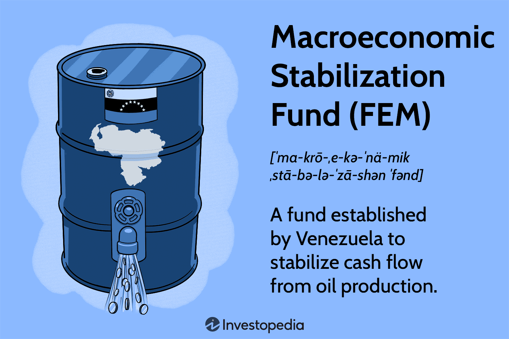

Economic policy serves as a critical tool for governments to influence a nation's economic growth, stabilize markets, and maintain fiscal balance. At the heart of such policies is macroeconomic stabilization, which aims to reduce economic volatility, ensuring steady growth, and safeguarding national wealth. Within this context, the Macroeconomic Stabilization Fund (FEM) emerges as a pivotal mechanism, specifically designed to stabilize Venezuela's economy, which has frequently been affected by the volatility of global oil prices.

Algorithmic trading, a significant advancement in modern financial markets, has gained relevance in crafting economic policies that aid macroeconomic stabilization. By employing complex algorithms to conduct high-speed trading, it contributes to liquidity, thereby mitigating market volatility. Currently, the integration of algorithmic trading with macroeconomic tools like the FEM Fund represents a strategic movement toward a more resilient economic policy framework.

This article explores several key focus areas: the FEM Fund's role in fostering stability, various macroeconomic stabilization strategies, and the application of algorithmic trading in maintaining economic equilibrium. Special emphasis is placed on Venezuela, a nation whose economic policies are deeply intertwined with oil revenues. The unpredictable nature of oil prices has considerably influenced Venezuela's economic stability, underscoring the critical need for effective stabilization mechanisms.

Readers can expect an in-depth examination of the FEM Fund, its historical context and utilization under President Hugo Chávez, and the repercussions of its utilization or neglect. Discussion will extend to the broader role of stabilization funds in economic policy, exemplified by successful case studies such as Norway and Russia. The analysis will also cover algorithmic trading, highlighting both its benefits and potential risks. The article will conclude with a detailed case study on Venezuela, offering insights into alternative strategies for economic stabilization and comparing its experiences with other nations that have effectively utilized such funds. This comprehensive exploration will provide policymakers with valuable perspectives on integrating algorithmic trading and stabilization funds into robust economic planning.

## Table of Contents

## Understanding the Macroeconomic Stabilization Fund (FEM)

The Macroeconomic Stabilization Fund (FEM) was established by Venezuela in 1998, primarily to stabilize cash flows derived from oil production. This initiative was in response to the volatility inherent in oil revenues, which can lead to fiscal instability in economies heavily dependent on this commodity. The FEM was created at the request of the International Monetary Fund (IMF) as a mechanism to buffer the economy against the unpredictable fluctuations in oil prices. The fund's principal objective was to accumulate reserves during periods of high oil prices, which could then be used to maintain consistent government spending and economic stability during downturns in the oil market.

Historically, the FEM was intended to serve as a countercyclical fiscal tool, allowing Venezuela to smooth out the boom-and-bust cycles typical in oil-dependent economies. However, the administration and evolution of the FEM took a significant turn under President Hugo Chávez. Despite the strategic foresight in establishing the fund, Chávez's government made numerous attempts to dismantle the FEM, redirecting its resources toward financing immediate social programs and government expenditures rather than preserving them for future economic stability. This approach undermined the fund's capacity to act as a stabilizing force.

The decision to rely less on the FEM had severe implications for Venezuela's economy. During periods of declining oil prices, the absence of sufficient reserves in the FEM to support government spending exacerbated fiscal deficits and contributed to economic instability. The outcomes included hyperinflation, reduced public sector investment, and a reliance on external borrowing, all of which further strained the nation’s financial health.

The potential benefits of the FEM, and similar stabilization funds, in managing revenue [volatility](/wiki/volatility-trading-strategies) from natural resources are considerable. Such funds can serve as financial safeguards to ensure that short-term fluctuations in commodity prices do not destabilize broader economic policies. By accumulating savings during periods of high revenue, stabilization funds help maintain steady government expenditures, protect social programs, and reduce the need for abrupt fiscal adjustments or borrowing. This financial predictability is crucial for long-term economic planning and investment, which can foster an environment of sustained growth and development.

## Role of Stabilization Funds in Economic Policy

Stabilization funds are financial reserves established by governments to buffer their economies against fluctuations in revenues, particularly from volatile resources like oil. The central purpose of these funds is to ensure economic stability and predictable fiscal revenue, enabling governments to maintain steady expenditure levels despite varying income.

The mechanisms by which stabilization funds insulate economies primarily involve the accumulation of surplus revenues during periods of high resource prices and their disbursement when prices fall. By smoothing revenue flows over time, these funds mitigate the fiscal impact of economic volatility. For instance, if a country experiences a windfall due to high oil prices, the surplus can be saved in the stabilization fund. Conversely, in times of low prices, the accumulated savings can be used to finance government spending, thereby stabilizing budgetary outcomes.

Oil-dependent economies often face significant challenges due to the inherent volatility in oil markets. Large fluctuations in oil prices can lead to severe boom-and-bust cycles, affecting economic planning and social stability. Maintaining steady government revenue through stabilization funds is crucial as it allows for consistent public service provision, infrastructure development, and social welfare programs, regardless of external market conditions.

Norway and Russia offer insightful case studies on the effective use of stabilization funds. Norway's Government Pension Fund Global, often referred to as the Oil Fund, has been instrumental in stabilizing its economy. By channeling oil revenues into the fund, Norway has been able to transform finite natural resources into a sustained source of wealth for future generations while avoiding overheating the economy. Similarly, Russia's National Wealth Fund aims to provide financial stability in the face of external financial and macroeconomic shocks, helping balance the country's budget.

Stabilization funds help reduce fiscal volatility by ensuring that government expenditures do not fluctuate erratically with commodity prices. This stability is crucial for macroeconomic performance, as it encourages investment, maintains public confidence, and reduces the risk of inflation. Additionally, having a financial buffer allows governments to implement counter-cyclical fiscal policies, such as increasing public spending during economic downturns to stimulate growth.

In conclusion, stabilization funds are vital tools in economic policy, particularly for countries reliant on exports of volatile commodities. While their effectiveness depends on prudent management and governance, their role in fostering long-term economic stability is invaluable. These funds enable countries to mitigate the risks associated with revenue volatility, thereby contributing to sustainable economic growth and development.

## Algorithmic Trading in Macroeconomic Stabilization

Algorithmic trading, also known as algo trading, refers to the use of computer algorithms to automate the process of executing trading orders in financial markets. These algorithms leverage vast amounts of data and complex mathematical models to make quick decisions on buying or selling assets, typically with minimal human intervention. The rise of [algorithmic trading](/wiki/algorithmic-trading) has revolutionized financial markets by increasing the speed and efficiency of transactions, enhancing [liquidity](/wiki/liquidity-risk-premium), and mitigating price volatility.

Algorithmic trading plays a significant role in macroeconomic stabilization. One of its primary contributions is providing liquidity to financial markets. By ensuring that there are always buyers and sellers, algorithmic trading helps maintain market stability, which is crucial for an economy's macroeconomic health. Moreover, by facilitating rapid transactions, algorithmic trading reduces bid-ask spreads, thereby promoting efficient market operations and stabilizing asset prices.

The application of algorithmic trading in managing stabilization funds presents noticeable advantages. Stabilization funds, which are designed to protect economies from volatile revenue sources like oil, can benefit from algorithmic trading strategies by optimizing investment decisions. Algorithms can process market data to forecast trends and execute trades that maximize returns or minimize risks. This capability allows funds to allocate resources more effectively, maintaining stable revenue streams for governments and mitigating the adverse effects of global economic fluctuations.

However, the use of algorithmic trading also carries potential risks. Algorithmic failures can lead to significant market disruptions, exemplified by events like the 2010 Flash Crash in U.S. stock markets. Furthermore, algorithms can be manipulated for unethical purposes, such as spoofing, where traders place orders they intend to cancel to deceive the market. These risks necessitate stringent regulatory frameworks and constant oversight to ensure that algorithmic trading continues to support market stability rather than undermine it.

Experts have varied perspectives on the future role of algorithmic trading in economic policy and market stabilization. Some argue that as algorithms become more sophisticated, they will be essential tools for policymakers in managing economic cycles and stabilizing financial systems. These experts emphasize the potential of [machine learning](/wiki/machine-learning) and [artificial intelligence](/wiki/ai-artificial-intelligence) to enhance the predictive accuracy and adaptability of trading algorithms. Others caution against over-reliance on technology, stressing the importance of maintaining human oversight to address issues of accountability and ethical decision-making in financial markets.

In summary, while algorithmic trading offers significant benefits for macroeconomic stabilization, its integration into economic policy must be handled judiciously, balancing technological advancements with risk management and regulatory measures.

## Case Study: Venezuela's Economic Policy and FEM Fund

Venezuela's economic policy has been heavily reliant on its oil revenues, which account for a significant portion of the country's GDP and public sector finances. The establishment of the Macroeconomic Stabilization Fund (FEM) in 1998 was a strategic response to manage the volatility associated with oil price fluctuations. The FEM was designed to stabilize the country's cash flow by saving surplus oil revenues during periods of high oil prices to be utilized during downturns. However, the administration and utilization of the FEM faced several challenges.

The FEM initially aimed to reduce the country's economic vulnerability to external shocks by creating a buffer stock of financial resources. Despite this intention, the fund's management encountered significant hurdles, particularly during the tenure of President Hugo Chávez. There was a shift towards using oil revenues for immediate political and social programs, which led to questions about the effectiveness of the FEM. Ultimately, the fund was not utilized to its full potential due to these divergence priorities, and its financial reserves dwindled over time.

The consequences of not effectively employing the FEM were profound. Without an adequate buffer, Venezuela was less insulated from oil price declines. This lack of resource management exacerbated economic instability, resulting in inflation, devaluation, and a debt crisis. The Venezuelan economy became increasingly susceptible to oil market volatility, leading to severe economic distress during periods of low oil prices.

Alternative strategies that Venezuela could have considered involve stricter governance and clearer rules for fund utilization, similar to models adopted by countries with successful stabilization mechanisms. For instance, Norway's Government Pension Fund Global and Chile's Economic and Social Stabilization Fund exemplify effective management of natural resource revenues. These countries established transparent frameworks for saving and withdrawing funds, allowing them to mitigate resource volatility impacts seamlessly.

In comparative terms, Norway employs a fiscal rule that limits spending of oil revenues to a portion of the expected return on the Government Pension Fund Global, thereby ensuring intergenerational equity and stabilization. Russia's National Wealth Fund also illustrates a model where surplus oil revenue is accumulated during high price periods, providing a cushion during low price periods. These examples demonstrate the importance of long-term strategic planning and fiscal discipline in stabilization fund management.

In summary, Venezuela's experience with the FEM Fund underscores the necessity of robust economic policy frameworks and disciplined use of stabilization mechanisms. These elements are crucial in securing macroeconomic stability, especially for countries with significant dependence on volatile natural resources like oil.

## Conclusion

Stabilization funds play a crucial role in economic policy, particularly for nations dependent on volatile natural resources such as oil. These funds aim to insulate economies from revenue fluctuations, thereby ensuring fiscal stability. The Macroeconomic Stabilization Fund (FEM) of Venezuela, established in 1998, serves as a significant case study in understanding the importance and challenges of such mechanisms. Although conceived to stabilize cash flow from oil production, Venezuela's partial reliance on the FEM Fund led to severe economic instability as oil prices fluctuated, highlighting the necessity for consistent fund utilization and strategic management in oil-dependent economies.

Algorithmic trading presents both opportunities and challenges in macroeconomic stabilization. Its capacity to enhance market liquidity and reduce volatility makes it a valuable tool for managing stabilization funds. However, risks such as algorithmic failures and potential market manipulation necessitate careful oversight. As financial technology evolves, the integration of algorithmic trading in economic policy could offer innovative ways of enhancing macroeconomic stability, enabling more dynamic responses to market changes.

Venezuela's experience with the FEM Fund underscores the complexities faced by economies heavily reliant on a single commodity. The failure to fully leverage the FEM has resulted in significant economic challenges, offering a cautionary tale for other resource-rich nations. Effective implementation and consistent policy application are essential for achieving desired economic outcomes.

Future developments in macroeconomic stabilization could involve advanced analytics and machine learning to optimize fund management and improve predictive capabilities. Enhanced transparency and regulatory frameworks will be vital in harnessing the benefits of algorithmic trading while mitigating its risks.

Policymakers should consider a strategic integration of algorithmic trading and stabilization funds into economic plans. By leveraging these tools, they can potentially achieve greater fiscal security and economic resilience. A proactive approach will be necessary to navigate the complexities of modern financial systems and ensure stable economic growth in fluctuating global markets.

## References & Further Reading

[1]:  **Davis, J.** (1994). [“Stabilization programs: the historical experience.”](https://en.wikipedia.org/wiki/1) IMF Economic Review. *International Monetary Fund.*

[2]:  **Hagen, J. V., & Holger, W.** (2002). ["Fiscal Policy and Macroeconomic Stabilization in the Euro Area."](https://www.twoplayergames.org/) *Oxford University Press.*

[3]:  **Lopez de Prado, M.** (2018). ["Advances in Financial Machine Learning."](https://math.microsoft.com/en) *John Wiley & Sons.*

[4]:  **Norges Bank.** (Annual Reports). ["Management of the Government Pension Fund Global."](https://en.wikipedia.org/wiki/List_of_logic_symbols) *Norwegian Ministry of Finance.*

[5]:  **Sinnott, E., Nash, J., & De La Torre, A.** (2010). ["Natural Resources in Latin America and the Caribbean: Beyond Booms and Busts?"](https://www.symbolab.com/solver/algebra-calculator) *World Bank Publications.*

[6]:  **Truby, J.** (2020). ["Governance networks in financial stability: The EU, Norway and Russia."](https://www.mathsisfun.com/numbers/factorial.html) *Journal of Banking Regulation.*

[7]:  **Zhu, Y.** (2003). ["Algorithmic trading: The basics."](https://sprunki.org/sprunki-phase-7) *MIT Press.*