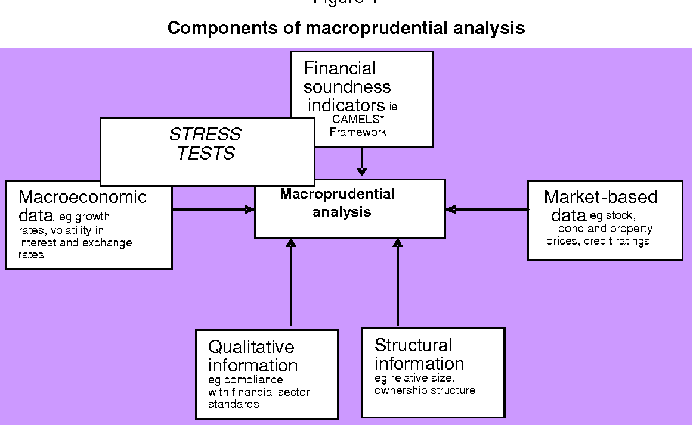

## Table of Contents

## What is macroprudential analysis?

Macroprudential analysis is a way to look at the big picture of the financial system to see if it's stable and safe. Instead of focusing on individual banks or companies, it looks at the whole system to spot risks that could cause big problems for everyone. This is important because if one part of the financial system fails, it can affect other parts and even the whole economy.

People who do macroprudential analysis use different tools and data to find out where the risks are. They might look at things like how much debt people and businesses have, how connected banks are to each other, and how the economy is doing overall. By understanding these risks, they can suggest rules and actions to make the financial system stronger and less likely to have big crashes.

## Why is macroprudential analysis important for financial stability?

Macroprudential analysis is important for financial stability because it helps us see the big picture of the financial system. Instead of just looking at one bank or company, it looks at everything together. This helps us find risks that could cause big problems for everyone, not just one part of the system. By understanding these risks, we can take steps to make the whole financial system stronger and safer.

If we didn't do macroprudential analysis, we might miss important signs that the financial system is in trouble. For example, if too many people and businesses have a lot of debt, it could lead to a big crash if they can't pay it back. Macroprudential analysis helps us spot these dangers early and take action, like making rules to limit how much debt people can take on. This way, we can prevent big problems before they happen and keep the economy stable.

## What are the key differences between microprudential and macroprudential approaches?

Microprudential and macroprudential approaches are two ways to look at the financial system, but they focus on different things. Microprudential analysis looks at individual banks or companies to make sure they are safe and sound. It's like checking if one tree in a forest is healthy. The goal is to protect each bank or company from going bankrupt and to make sure they follow rules to keep their own finances in order.

On the other hand, macroprudential analysis looks at the whole forest, not just one tree. It tries to understand how all the parts of the financial system work together and how they might affect each other. The goal is to spot risks that could cause big problems for the entire system, like a financial crisis. By looking at the big picture, macroprudential analysis helps make rules and take actions to keep the whole financial system stable and safe.

In simple terms, microprudential is about making sure each part of the financial system is strong, while macroprudential is about making sure the whole system works well together and doesn't fall apart. Both are important, but they focus on different levels of the financial system to keep it stable.

## What are the main objectives of macroprudential policy?

The main goal of macroprudential policy is to keep the whole financial system stable and safe. It does this by looking at the big picture and trying to spot risks that could cause big problems for everyone. Instead of focusing on just one bank or company, macroprudential policy looks at how all the parts of the financial system work together. By understanding these risks, it can help make rules and take actions to prevent big crashes and keep the economy running smoothly.

Another important objective of macroprudential policy is to reduce the chance of a financial crisis. It does this by keeping an eye on things like how much debt people and businesses have, how connected banks are to each other, and how the economy is doing overall. If it sees that too many people are borrowing too much money, for example, it might suggest rules to limit how much debt they can take on. This way, it can stop problems from getting out of control and protect the whole financial system from falling apart.

## What types of risks does macroprudential analysis aim to address?

Macroprudential analysis aims to address risks that could affect the whole financial system, not just one bank or company. It looks at things like how much debt people and businesses have. If too many people are borrowing a lot of money, it could lead to big problems if they can't pay it back. This type of risk is called systemic risk, and it's a big focus of macroprudential analysis because it can cause a financial crisis that hurts everyone.

Another type of risk that macroprudential analysis tries to manage is the risk that comes from how connected banks and other financial institutions are to each other. If one bank gets into trouble, it can affect other banks that it's connected to, and this can spread like a domino effect. By understanding these connections, macroprudential analysis can help make rules to stop this from happening and keep the financial system stable.

Overall, macroprudential analysis is about spotting and reducing risks that could cause big problems for the whole economy. It looks at the big picture to make sure the financial system stays strong and safe, even when things get tough. By doing this, it helps prevent financial crises and keeps the economy running smoothly for everyone.

## What are some common macroprudential tools and instruments?

Macroprudential tools and instruments are ways to keep the financial system safe and stable. One common tool is setting limits on how much debt people and businesses can take on. This is called a loan-to-value ratio or a debt-to-income ratio. By putting these limits in place, it helps stop people from borrowing too much money, which can cause big problems if they can't pay it back. Another tool is setting aside money as a buffer, called countercyclical capital buffers. This means banks have to keep extra money on hand during good times, so they can use it to stay strong if things get tough.

Another important instrument is stress testing. This is when banks and other financial companies are tested to see how they would handle a big financial crisis. By doing these tests, it helps make sure they are ready for tough times and can keep going even if things go wrong. There are also tools like capital requirements, which are rules that say how much money banks need to have to cover their risks. This helps make sure banks are strong and can handle problems without causing a bigger crisis. By using these tools and instruments, macroprudential policy helps keep the whole financial system safe and stable.

## How is data collected and analyzed in macroprudential analysis?

In macroprudential analysis, data is collected from many different places to get a full picture of the financial system. This includes information from banks, other financial companies, and even government agencies. They look at things like how much debt people and businesses have, how much money banks are lending, and how the economy is doing overall. This data can come from reports that banks have to submit, surveys of households and businesses, and even public records. By gathering all this information, macroprudential analysts can see the big picture and spot any risks that might cause problems for the whole financial system.

Once the data is collected, it's analyzed to find out where the risks are. Analysts use different methods and tools to make sense of all the information. They might use computer models to predict what could happen if things go wrong, or they might look at trends over time to see if there are any warning signs. By understanding these risks, they can suggest rules and actions to make the financial system stronger and less likely to have big crashes. This analysis helps keep the economy stable and safe for everyone.

## What methodologies are used to assess systemic risk in macroprudential analysis?

To assess systemic risk in macroprudential analysis, experts use different methods to understand how the whole financial system could be in danger. One common method is network analysis, which looks at how banks and other financial companies are connected to each other. If one bank gets into trouble, it can affect other banks that it's connected to, and this can spread like a domino effect. By understanding these connections, experts can see where the risks are and suggest rules to stop problems from spreading.

Another method used is stress testing, where banks and other financial companies are tested to see how they would handle a big financial crisis. This helps experts understand how strong the financial system is and where it might be weak. They also use models to predict what could happen if things go wrong. These models look at things like how much debt people and businesses have, how the economy is doing, and other factors that could cause big problems. By using these methods, experts can spot risks early and take action to keep the financial system stable and safe.

## How do policymakers use stress testing in macroprudential analysis?

Policymakers use stress testing in macroprudential analysis to see how strong the financial system is and where it might be weak. They do this by putting banks and other financial companies through pretend tough times, like a big financial crisis, to see if they can handle it. This helps them understand if the banks have enough money and resources to keep going even when things go wrong. By doing these tests, policymakers can find out which parts of the financial system need to be stronger and make rules to help them get there.

The results from stress testing help policymakers make the financial system safer for everyone. If they see that some banks might fail during a crisis, they can tell those banks to keep more money on hand as a safety net. They can also use the results to set rules about how much debt people and businesses can take on, to stop them from borrowing too much money. By using stress testing, policymakers can spot risks early and take action to keep the whole financial system stable and prevent big crashes.

## What are the challenges and limitations of implementing macroprudential policies?

Implementing macroprudential policies can be hard because there are many challenges and limitations to think about. One big challenge is figuring out the right rules to use. There's no one-size-fits-all answer, so policymakers have to guess which rules will work best for their country's financial system. This can be tricky because the financial system is always changing, and what worked yesterday might not work today. Another challenge is that these rules can affect the economy in ways that are hard to predict. If the rules are too strict, they might slow down the economy by making it harder for people and businesses to borrow money. But if they're not strict enough, they might not do a good job at stopping big problems from happening.

There are also limitations to how well macroprudential policies can work. One big limitation is that these policies can't stop all financial crises. Even with the best rules in place, unexpected things can still happen that cause big problems. Another limitation is that it can be hard to get everyone to follow the rules. Banks and other financial companies might try to find ways around the rules to keep making money, which can make the policies less effective. Plus, macroprudential policies often need to work together with other kinds of rules, like those that focus on individual banks. If these different rules don't work well together, it can be harder to keep the whole financial system safe and stable.

## How can macroprudential analysis be integrated with other economic policies?

Macroprudential analysis can be integrated with other economic policies to make the whole financial system stronger and safer. One way to do this is by working together with monetary policy, which is about controlling the amount of money in the economy. For example, if macroprudential analysis shows that too many people are borrowing too much money, the central bank might decide to raise interest rates to make borrowing more expensive. This can help stop people from taking on too much debt and keep the financial system stable. By combining these policies, they can work together to keep the economy running smoothly and prevent big problems.

Another way to integrate macroprudential analysis with other economic policies is by working with fiscal policy, which is about how the government spends and taxes money. If macroprudential analysis finds that the financial system is at risk, the government might decide to spend more money on things like infrastructure to help the economy grow. This can make the financial system stronger by creating more jobs and increasing people's incomes. By using macroprudential analysis to guide these other policies, policymakers can make sure they are doing everything they can to keep the financial system safe and the economy stable.

## What are the latest advancements and future directions in macroprudential analysis?

The latest advancements in macroprudential analysis include using more advanced data analysis and computer models. These tools help experts understand the financial system better and spot risks more quickly. For example, they now use [machine learning](/wiki/machine-learning) to look at huge amounts of data and find patterns that could mean trouble. They also use network analysis to see how connected banks and other financial companies are, which helps them understand how problems could spread. These new methods make macroprudential analysis more accurate and helpful in keeping the financial system safe.

In the future, macroprudential analysis is likely to become even more important as the financial system gets more complicated. Experts will keep working on better ways to collect and analyze data, maybe even using real-time data to spot risks as they happen. They might also focus more on how global financial systems are connected, because problems in one country can quickly affect others. By keeping up with these changes and using new tools, macroprudential analysis can help make the financial system stronger and more stable for everyone.

## References & Further Reading

[1]: Adrian, T., & Liang, N. (2018). ["Monetary Policy, Financial Conditions, and Financial Stability."](https://www.ijcb.org/journal/ijcb18q0a3.pdf) International Monetary Fund Working Paper.

[2]: Danielsson, J., Shin, H. S., & Zigrand, J.-P. (2013). ["Endogenous Risk and Risk Management."](https://www.riskresearch.org/papers/DanielssonShinZigrand2013/) Journal of Banking & Finance, 37(8), 2760-2783.

[3]: Basel Committee on Banking Supervision. (2016). ["The Basel Framework."](https://www.bis.org/bcbs/basel3.htm) Bank for International Settlements. 

[4]: FSB. (2014). ["Global Shadow Banking Monitoring Report."](https://www.fsb.org/2014/11/global-shadow-banking-monitoring-report-2014/) Financial Stability Board.

[5]: Carney, M. (2019). ["Enabling Financial Stability in a Global Context."](https://www.bankofengland.co.uk/-/media/boe/files/speech/2019/the-growing-challenges-for-monetary-policy-speech-by-mark-carney.pdf) Bank of England Speech. 

[6]: Lopez de Prado, M. (2018). ["Advances in Financial Machine Learning."](https://www.amazon.com/Advances-Financial-Machine-Learning-Marcos/dp/1119482089) Wiley.

[7]: Gomber, P., Arndt, B., Lutat, M., & Uhle, T. (2011). ["High-Frequency Trading."](https://papers.ssrn.com/sol3/papers.cfm?abstract_id=1858626) Electronic Markets, 21(2), 89-99.

[8]: SEC. (2021). ["Strengthening Automated and High-Frequency Trading Regulation Across All Exchanges."](https://www.reuters.com/legal/litigation/sec-consider-rules-that-boost-transparency-high-frequency-trading-firms-sec-2021-11-17/) U.S. Securities and Exchange Commission Report.