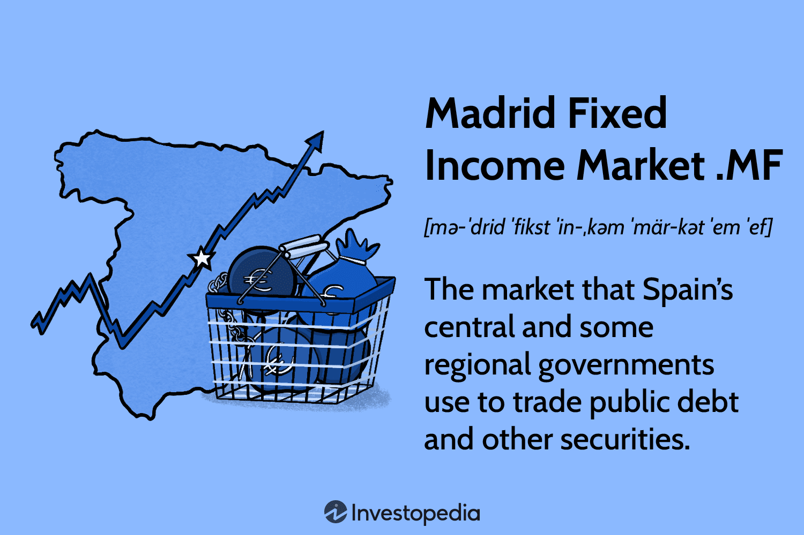

## Table of Contents

## What is the Madrid Fixed Income Market?

The Madrid Fixed Income Market, also known as the AIAF (Asociación de Intermediarios de Activos Financieros), is a part of the Spanish financial market where people and businesses can buy and sell fixed income securities. These securities include bonds, debentures, and other types of loans that pay a fixed interest rate over time. The market helps companies and the government raise money by issuing these securities, and it provides investors with a place to invest their money and earn a steady income.

The AIAF is regulated by the Spanish National Securities Market Commission (CNMV), which makes sure that everything is done fairly and transparently. This market is important for the Spanish economy because it helps with the flow of money between those who need it and those who have it to invest. It also helps to spread risk and provides a way for investors to diversify their portfolios by including fixed income assets.

## How does the Madrid Fixed Income Market function?

The Madrid Fixed Income Market, known as AIAF, works like a big store where people can buy and sell bonds and other fixed income securities. Companies and the government come to this market when they need to borrow money. They do this by selling bonds to investors. Investors buy these bonds because they want to earn a steady income from the interest the bonds pay. The market helps match people who need money with those who have money to lend, making it easier for everyone.

When someone wants to buy or sell a bond, they do it through a broker, who is like a helper in the market. The broker makes sure the trade happens smoothly and at a fair price. The AIAF has rules to make sure everyone plays by the same rules and that the market is fair. The Spanish National Securities Market Commission watches over the AIAF to make sure everything is done correctly. This way, the market helps the Spanish economy by providing a safe place for borrowing and investing.

## What types of securities are traded in the Madrid Fixed Income Market?

In the Madrid Fixed Income Market, people trade different kinds of fixed income securities. The most common ones are bonds, which are like loans that companies or the government sell to investors. These bonds pay back the money with interest over time. Another type is debentures, which are similar to bonds but are not backed by any specific assets of the issuer. They rely on the creditworthiness of the company issuing them.

There are also other types of securities like commercial paper, which are short-term loans that companies use to manage their cash flow. Asset-backed securities are another type, where the payments come from a pool of assets like mortgages or car loans. All these securities help companies and the government raise money and give investors a way to earn a steady income.

## Who are the main participants in the Madrid Fixed Income Market?

The main participants in the Madrid Fixed Income Market are issuers and investors. Issuers are usually companies or the government who need to borrow money. They do this by selling bonds and other fixed income securities. This helps them raise money to grow their business or fund public projects. Investors, on the other hand, are people or institutions like banks and pension funds who have money to lend. They buy these securities to earn a steady income from the interest payments.

Brokers and dealers also play a key role in the market. Brokers act as middlemen, helping buyers and sellers find each other and complete their trades. Dealers, meanwhile, buy and sell securities for their own accounts, which helps keep the market liquid. The Spanish National Securities Market Commission oversees the whole market to make sure everything is fair and transparent. This helps keep the trust of all participants in the Madrid Fixed Income Market.

## How can one invest in the Madrid Fixed Income Market?

To invest in the Madrid Fixed Income Market, you first need to find a broker. A broker is like a helper who knows how to buy and sell bonds and other fixed income securities. You can talk to your bank or search online to find a broker who can help you. Once you have a broker, you can tell them which bonds or securities you want to buy. Your broker will then look for the best price and help you make the purchase.

After buying the securities, you will start [earning](/wiki/earning-announcement) interest over time. This interest is like a reward for lending your money to the company or government that issued the bond. You can keep the bond until it matures, which means you get your money back plus the interest, or you can sell it to someone else if you need your money back sooner. Your broker will help you with selling, too. By investing in the Madrid Fixed Income Market, you can earn a steady income and help companies and the government raise money for their projects.

## What are the trading hours of the Madrid Fixed Income Market?

The Madrid Fixed Income Market, or AIAF, is open for trading from Monday to Friday. The trading hours are from 9:00 AM to 5:30 PM, local time in Spain. This means you can buy and sell bonds and other fixed income securities during these hours.

If you want to invest in this market, you need to make sure your trades happen within these times. Your broker will help you place your orders during the trading hours. This way, you can be part of the market and earn income from your investments.

## What are the risks associated with investing in the Madrid Fixed Income Market?

Investing in the Madrid Fixed Income Market comes with some risks that you should know about. One big risk is [interest rate](/wiki/interest-rate-trading-strategies) risk. This means that if interest rates go up, the value of the bonds you own can go down. This happens because new bonds will be issued with higher interest rates, making your older bonds less attractive to other investors. Another risk is credit risk, which is the chance that the company or government that issued the bond might not be able to pay you back. If they have money problems, you might lose some or all of your investment.

Another risk to think about is [liquidity](/wiki/liquidity-risk-premium) risk. This means that sometimes it can be hard to sell your bonds quickly if you need your money back fast. If not many people want to buy the bonds you have, you might have to sell them for less than you paid. Also, inflation risk can affect your investment. If prices go up a lot, the money you earn from your bonds might not be worth as much as when you first invested. Understanding these risks can help you make smarter choices when you invest in the Madrid Fixed Income Market.

## How does the Madrid Fixed Income Market impact the broader Spanish economy?

The Madrid Fixed Income Market helps the Spanish economy by letting companies and the government borrow money easily. When companies need money to grow or start new projects, they can sell bonds in this market. This helps them get the money they need without going to a bank. The government can also sell bonds to pay for things like roads and schools. This market makes it easier for them to raise money, which can help the whole economy grow because more projects can be started.

Investors also benefit from the Madrid Fixed Income Market because they can buy bonds and earn a steady income from the interest. This gives them a safe place to invest their money. When more people invest in the market, it helps keep the economy stable. The market also helps spread risk because investors can buy different types of bonds. This means if one company has problems, investors are not likely to lose all their money. Overall, the Madrid Fixed Income Market is important for making sure money moves smoothly around the Spanish economy.

## What are the regulatory bodies overseeing the Madrid Fixed Income Market?

The Madrid Fixed Income Market, also known as AIAF, is watched over by the Spanish National Securities Market Commission, which is called CNMV. The CNMV makes sure that everything in the market is done fairly and that people follow the rules. They check that the companies and the government who sell bonds tell the truth about their financial situation. This helps keep the market safe for investors.

The CNMV also makes sure that brokers and dealers in the market act honestly. They keep an eye on all the trades to make sure no one is cheating. By doing this, the CNMV helps build trust in the Madrid Fixed Income Market, which is important for the whole Spanish economy.

## How has the Madrid Fixed Income Market evolved over the past decade?

Over the past ten years, the Madrid Fixed Income Market has grown a lot. More companies and the government have been using the market to borrow money by selling bonds. This has made the market bigger and more important for the Spanish economy. The market has also started to use new technology to make trading easier and faster. This means that investors can now buy and sell bonds more quickly and easily than before.

The market has also seen more types of bonds being traded. For example, green bonds, which help pay for projects that are good for the environment, have become more common. This shows that the market is trying to help with big issues like climate change. Also, the rules have gotten stricter to make sure everything is fair and safe for investors. The Spanish National Securities Market Commission, or CNMV, has been working hard to watch over the market and make sure everyone follows the rules.

## What are some advanced strategies for trading in the Madrid Fixed Income Market?

One advanced strategy for trading in the Madrid Fixed Income Market is called duration matching. This means you try to match the time when your bonds will pay you back with the time when you need your money. For example, if you know you need money in five years, you would buy bonds that will pay back in about five years. This helps you plan better and reduces the risk that changes in interest rates will hurt your investment. By carefully choosing bonds with the right duration, you can make sure your money is there when you need it.

Another strategy is called yield curve positioning. This involves looking at the different interest rates for bonds that mature at different times and trying to guess where interest rates are going. If you think interest rates will go down, you might buy long-term bonds because their prices will go up when rates fall. If you think rates will go up, you might buy short-term bonds because they won't lose as much value. By understanding the yield curve and making smart choices, you can try to earn more money from your investments in the Madrid Fixed Income Market.

## How does the Madrid Fixed Income Market compare to other major fixed income markets globally?

The Madrid Fixed Income Market, also known as AIAF, is smaller compared to some of the world's biggest fixed income markets like the U.S. and Germany. The U.S. has the biggest bond market in the world, with lots of different kinds of bonds being traded every day. Germany's bond market is also very big and important in Europe because Germany is a strong economy. Even though the Madrid Fixed Income Market is smaller, it is still very important for Spain and helps companies and the government get the money they need.

The Madrid Fixed Income Market is different from other markets because it focuses a lot on bonds from Spanish companies and the Spanish government. In the U.S. and Germany, you can find bonds from all over the world. The Madrid market is also watched over by the Spanish National Securities Market Commission, which makes sure everything is fair and safe. In other countries, different groups watch over their markets, but they all want the same thing: to keep the market honest and trustworthy. Even though the Madrid market is smaller, it is still a key part of the Spanish economy and helps investors earn a steady income.

## References & Further Reading

[1]: Bergstra, J., Bardenet, R., Bengio, Y., & Kégl, B. (2011). ["Algorithms for Hyper-Parameter Optimization."](https://dl.acm.org/doi/10.5555/2986459.2986743) Advances in Neural Information Processing Systems 24.

[2]: ["Advances in Financial Machine Learning"](https://www.amazon.com/Advances-Financial-Machine-Learning-Marcos/dp/1119482089) by Marcos Lopez de Prado

[3]: ["Evidence-Based Technical Analysis: Applying the Scientific Method and Statistical Inference to Trading Signals"](https://www.amazon.com/Evidence-Based-Technical-Analysis-Scientific-Statistical/dp/0470008741) by David Aronson

[4]: ["Machine Learning for Algorithmic Trading"](https://github.com/stefan-jansen/machine-learning-for-trading) by Stefan Jansen

[5]: ["Quantitative Trading: How to Build Your Own Algorithmic Trading Business"](https://github.com/LucindaYa/quant-resources/blob/master/Quantitative%20Trading%20How%20to%20Build%20Your%20Own%20Algorithmic%20Trading%20Business.pdf) by Ernest P. Chan