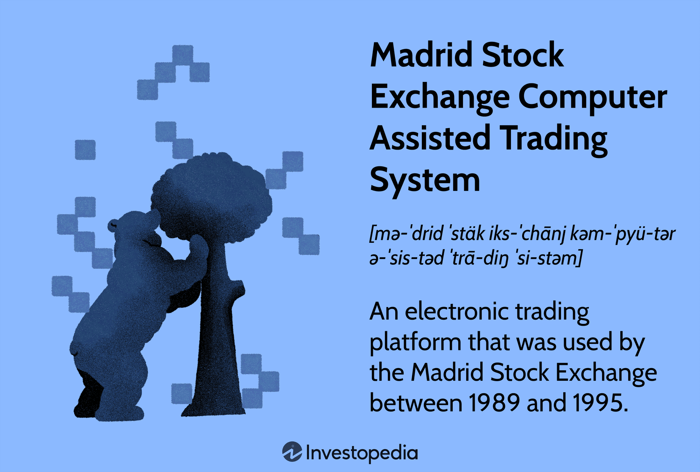

## Table of Contents

## What is the Madrid Stock Exchange Computer Assisted Trading System?

The Madrid Stock Exchange Computer Assisted Trading System, often called the SIBE (Sistema de Interconexión Bursátil Español), is a computer system that helps people buy and sell stocks in Spain. It connects all the stock exchanges in Spain, like Madrid, Barcelona, Bilbao, and Valencia, so that trading can happen easily across the country. This system makes trading faster and more efficient because it uses computers to match buyers and sellers automatically.

SIBE was first used in 1995 and has been updated over time to keep up with new technology. It helps traders by showing them real-time prices and letting them make trades quickly. The system also keeps everything fair by following strict rules, so everyone has an equal chance to trade. This has made the Spanish stock market more reliable and attractive to investors from around the world.

## How does the Madrid Stock Exchange Computer Assisted Trading System work?

The Madrid Stock Exchange Computer Assisted Trading System, or SIBE, works by connecting all the stock exchanges in Spain, like Madrid, Barcelona, Bilbao, and Valencia, into one big network. When someone wants to buy or sell a stock, they use a computer to send their order into the SIBE system. The system then looks for the best match for that order. If someone wants to buy a stock, SIBE will find the lowest price someone is willing to sell at. If someone wants to sell, SIBE will find the highest price someone is willing to buy at. Once it finds a match, the trade happens automatically, making it fast and fair for everyone.

SIBE also keeps track of all the trades that happen and shows real-time prices so everyone can see what's going on in the market. This helps traders make smart decisions because they can see what prices stocks are trading at right now. The system follows strict rules to make sure everything is fair and transparent. This means that no one can cheat or get special treatment, which makes the Spanish stock market trustworthy. Since SIBE started in 1995, it has been updated to use the latest technology, helping to keep the market efficient and attractive to investors from around the world.

## What are the main components of the Madrid Stock Exchange Computer Assisted Trading System?

The Madrid Stock Exchange Computer Assisted Trading System, known as SIBE, has several key parts that work together to make trading smooth and fair. The main part is the trading engine, which is like the brain of the system. It matches buy and sell orders quickly and fairly. There's also a system that shows real-time prices and trade information, so everyone can see what's happening in the market. This helps traders make good choices about when to buy or sell stocks.

Another important part is the network that connects all the stock exchanges in Spain, like Madrid, Barcelona, Bilbao, and Valencia. This network makes sure that orders from different places can be matched together, no matter where they come from. SIBE also has strict rules and checks to make sure everything is done correctly and fairly. This includes systems to watch for any unusual activity and to make sure no one is cheating. All these parts together make SIBE a reliable and efficient system for trading stocks in Spain.

## What types of securities can be traded using the Madrid Stock Exchange Computer Assisted Trading System?

The Madrid Stock Exchange Computer Assisted Trading System, or SIBE, lets people trade many different types of securities. You can trade stocks, which are shares in companies. This means you can buy or sell pieces of big Spanish companies like Banco Santander or Telefonica. You can also trade bonds, which are like loans to companies or the government. They pay you back with interest over time. Another type of security you can trade on SIBE is Exchange-Traded Funds (ETFs), which are like baskets of different stocks or bonds that you can buy and sell like a single stock.

In addition to these, SIBE also allows trading of derivatives, which are more complex securities. Derivatives include options and futures. Options give you the right to buy or sell a stock at a certain price in the future, while futures are agreements to buy or sell something at a set price on a specific date. All these different types of securities can be bought and sold using SIBE, making it a very versatile trading system that meets the needs of many different kinds of investors.

## How does the Madrid Stock Exchange Computer Assisted Trading System benefit traders?

The Madrid Stock Exchange Computer Assisted Trading System, or SIBE, helps traders a lot by making trading quick and easy. When someone wants to buy or sell a stock, the system looks for the best price and matches the order right away. This means traders don't have to wait long to make a trade, and they can get the best price available. SIBE also connects all the stock exchanges in Spain, so traders can buy and sell no matter where they are in the country. This makes it easier for them to find someone to trade with.

Another big benefit is that SIBE shows real-time prices and trade information. This means traders can see what's happening in the market all the time, which helps them make smart choices about when to buy or sell. The system also follows strict rules to make sure everything is fair. This means traders can trust that they're getting a fair deal and that no one is cheating. Overall, SIBE makes trading faster, easier, and more trustworthy for everyone.

## What are the historical developments of the Madrid Stock Exchange Computer Assisted Trading System?

The Madrid Stock Exchange Computer Assisted Trading System, known as SIBE, was first introduced in 1995. Before SIBE, trading in Spain was done in a more traditional way, with people shouting and using hand signals on the trading floor. When SIBE came along, it changed everything by using computers to match buy and sell orders automatically. This made trading much faster and more efficient. SIBE was a big step forward for the Spanish stock market, helping it become more modern and connected.

Over the years, SIBE has been updated many times to keep up with new technology. These updates have made the system even faster and better at handling lots of trades at once. SIBE now connects all the major stock exchanges in Spain, like Madrid, Barcelona, Bilbao, and Valencia, into one big network. This means traders from all over the country can trade with each other easily. The system has also added new types of securities that can be traded, like bonds and derivatives, making it more useful for different kinds of investors. Thanks to these developments, SIBE has helped make the Spanish stock market more reliable and attractive to people from around the world.

## How does the Madrid Stock Exchange Computer Assisted Trading System integrate with global financial markets?

The Madrid Stock Exchange Computer Assisted Trading System, or SIBE, helps connect Spain's stock market with the rest of the world. It does this by following international standards for trading and by being part of bigger global networks. This means that investors from other countries can easily buy and sell stocks in Spain, and Spanish traders can trade stocks from other countries too. SIBE uses the same rules and technology that many other big stock markets use, which makes it easier for everyone to trade across borders.

SIBE also works with other big stock exchanges around the world. For example, it is connected to the European Union's trading systems, which lets traders in Spain trade with people in other European countries easily. This connection helps make the Spanish stock market more attractive to international investors because they can trade in Spain as easily as they can in their own countries. By being part of these global networks, SIBE helps make the Spanish stock market a bigger player in the world of finance.

## What are the security measures in place to protect transactions on the Madrid Stock Exchange Computer Assisted Trading System?

The Madrid Stock Exchange Computer Assisted Trading System, or SIBE, uses many security measures to keep transactions safe. One important way is by using strong encryption to protect the information that is sent back and forth during trading. This means that even if someone tries to steal the data, they won't be able to read it. SIBE also has systems that watch for any strange activity, like if someone is trying to make too many trades at once or if they are trading in a way that doesn't seem normal. If something suspicious happens, the system can stop the trading and alert people to check what's going on.

Another way SIBE keeps transactions secure is by making sure that only authorized people can use the system. Traders need special codes and passwords to log in, and these are checked every time someone tries to make a trade. The system also keeps detailed records of every trade, so if there's ever a problem, they can go back and see exactly what happened. This helps to make sure that everything is done correctly and fairly, and it makes it easier to fix any issues that come up.

## How does the Madrid Stock Exchange Computer Assisted Trading System handle high-frequency trading?

The Madrid Stock Exchange Computer Assisted Trading System, or SIBE, is designed to handle high-frequency trading well. High-frequency trading is when computers make lots of trades very quickly, often in just a few seconds. SIBE can handle this because it is very fast and can process many orders at the same time. It uses powerful computers and special software that can match buy and sell orders quickly, making sure that high-frequency traders get the best prices available.

SIBE also has rules to make sure high-frequency trading is fair for everyone. It watches for any unusual activity that might be a sign of cheating or trying to manipulate the market. If it sees something strange, it can slow down or stop trading to check what's happening. This helps keep the market safe and fair, even when lots of high-frequency trades are happening.

## What are the regulatory compliance requirements for using the Madrid Stock Exchange Computer Assisted Trading System?

Using the Madrid Stock Exchange Computer Assisted Trading System, or SIBE, means following lots of rules set by the Spanish government and the European Union. These rules are there to make sure trading is fair and safe for everyone. Traders need to register with the Spanish National Securities Market Commission (CNMV) and follow their rules. They also need to keep good records of all their trades and report any big changes in their trading activity. This helps the regulators keep an eye on the market and stop any cheating or fraud.

SIBE also has to follow special rules about how it works and how it keeps information safe. It uses strong security measures to protect the data and make sure only the right people can use the system. There are also rules about how fast and how many trades can happen to make sure the system can handle high-frequency trading without problems. All these rules help keep the Spanish stock market trustworthy and fair for everyone who uses it.

## How can one optimize trading strategies using the Madrid Stock Exchange Computer Assisted Trading System?

To optimize trading strategies using the Madrid Stock Exchange Computer Assisted Trading System, or SIBE, traders should start by using the real-time data that the system provides. SIBE shows current prices and trade information, which helps traders see what's happening in the market right away. By looking at this data, traders can make better decisions about when to buy or sell stocks. For example, if they see that a stock's price is going up, they might decide to buy it quickly to take advantage of the trend. Also, traders can use tools that analyze past data to find patterns and predict what might happen next in the market. This can help them plan their trades more carefully.

Another way to optimize trading strategies on SIBE is to use the system's ability to handle high-frequency trading. Since SIBE can process many trades very quickly, traders can set up automatic trading programs that buy and sell stocks based on certain rules. These programs can react to market changes faster than a person can, which can be a big advantage. Traders should also pay attention to the rules and security measures that SIBE has in place. By following these rules, traders can avoid problems and make sure their trades are safe and fair. Overall, using SIBE's features like real-time data, high-frequency trading, and strict rules can help traders make smarter and more successful trades.

## What future advancements are expected for the Madrid Stock Exchange Computer Assisted Trading System?

In the future, the Madrid Stock Exchange Computer Assisted Trading System, or SIBE, is expected to keep getting better with new technology. One big change might be using even faster computers and better software to handle more trades at once. This will make trading even quicker and smoother. SIBE might also start using [artificial intelligence](/wiki/ai-artificial-intelligence) to help traders make better decisions. AI could look at lots of data and find patterns that people might miss, helping to predict what will happen in the market.

Another thing that might happen is that SIBE will connect even more with other stock markets around the world. This would let traders in Spain buy and sell stocks from more countries easily. Also, SIBE might add new types of securities to trade, like new kinds of bonds or other financial products. All these changes will help make the Spanish stock market more modern and attractive to investors from everywhere.

## References & Further Reading

[1]: ["Trading Systems Reviewed: The Role of CATS in Modern Stock Exchanges"](https://en.wikipedia.org/wiki/CATS_(trading_system)) by Oxford Academic

[2]: Gorham, M. & Singh, N. (2009). ["Electronic Exchanges: The Global Transformation from Pits to Bits"](https://archive.org/details/electronicexchan0000gorh) by Elsevier Finance

[3]: Hasbrouck, J. (2007). ["Empirical Market Microstructure: The Institutions, Economics, and Econometrics of Securities Trading"](https://www.amazon.com/Empirical-Market-Microstructure-Institutions-Econometrics/dp/0195301641) by Oxford University Press

[4]: Domowitz, I. & Lee, R. (1998). ["The Management of Human and Algorithmic Order Flow on Electronic Trading Systems"](https://www.academia.edu/124099074/International_Cross_Listing_and_Order_Flow_Migration_Evidence_from_an_Emerging_Market) Financial Analysts Journal

[5]: Chordia, T., Roll, R., & Subrahmanyam, A. (2001). ["Market Liquidity and Trading Activity"](https://onlinelibrary.wiley.com/doi/abs/10.1111/0022-1082.00335) The Journal of Finance