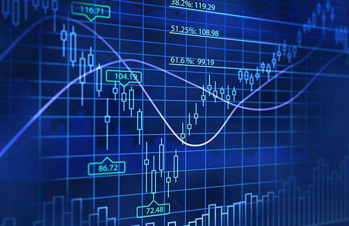

The financial markets have undergone substantial changes with the rise of algorithmic trading, also known as algo trading. It represents a shift towards automated, high-speed trading processes driven by complex algorithms. This paper examines how algo trading intersects with the Madrid Stock Exchange, focusing on the technological innovations that have altered traditional trading methods. The Madrid Stock Exchange, known for its historical significance and economic influence, has incorporated these advancements to adapt to the evolving global financial landscape.

By examining the Madrid Stock Exchange, we can understand how algorithmic trading strategies have affected market operations and investor engagement. As technology continues to reshape the configuration of financial markets, the Madrid Stock Exchange stands as a testament to the benefits of integrating electronic systems and automated methodologies. This further emphasizes the necessity for traders and investors alike to grasp the dynamics of these systems.

Exploring the history, impact, and future prospects of algorithmic trading in the context of the Madrid Stock Exchange is essential for financial professionals. Doing so provides insights not only into the transformation of local markets but also into broader global trading networks. With an ever-changing financial ecosystem, staying informed about these developments is crucial for effectively leveraging algorithmic trading as an integral tool for gaining competitive advantages in complex market conditions. Understanding these elements is therefore vital for those seeking to utilize algo trading effectively and efficiently.

## Table of Contents

## Understanding the Madrid Stock Exchange (MAD .MA)

The Madrid Stock Exchange (Bolsa de Madrid), as the largest securities market in Spain, plays a crucial role in the nation's financial infrastructure. Established in 1831, the exchange has been a central platform for trading a diverse array of securities, including those of banks, railway companies, and industries such as iron and steel. Over the years, the exchange has witnessed significant evolutions, notably its transition to electronic trading in 1993. This shift marked a transformative phase, modernizing trading activities and enhancing operational efficiency.

The operational framework of the Madrid Stock Exchange is characterized by its adoption of electronic trading systems, beginning with the implementation of the Madrid Stock Exchange Computer Assisted Trading System (MSE CATS). This system was a pivotal development, laying the groundwork for automated trading processes. MSE CATS was later succeeded by more advanced systems, including the Sistema de Interconexión Bursátil Español (SIBE), which further facilitated interconnected and continuous market operations, thereby improving the liquidity and accessibility of the market.

Historically, the Madrid Stock Exchange has been instrumental in shaping Spain's financial markets by providing a structured mechanism for securities trading and contributing to the nation's economic development. Its transformation to electronic trading has not only streamlined trading processes but has also attracted a broader spectrum of market participants, ranging from individual investors to large institutional bodies.

The exchange operates within a well-defined regulatory framework designed to ensure market integrity, transparency, and fairness. Regulatory bodies, such as the Comisión Nacional del Mercado de Valores (CNMV), oversee operations, implementing measures to prevent fraud and market manipulation. These regulations are pivotal in maintaining investor confidence and promoting market stability.

Additionally, the Madrid Stock Exchange has initiated several measures to enhance transparency and operational efficiency. This includes real-time data dissemination, robust trading platforms, and comprehensive risk management protocols. Such initiatives are crucial for maintaining a competitive edge and ensuring the smooth functioning of the market in an increasingly globalized financial environment.

In summary, the Madrid Stock Exchange stands as a cornerstone of Spain's financial markets, continually evolving to meet the demands of modern trading. Its strategic advancements in technology and commitment to regulatory compliance have positioned it as a leading securities market in Europe.

## History and Evolution of Algorithmic Trading on the Madrid Stock Exchange

Algorithmic trading has dramatically transformed financial markets worldwide, and the Madrid Stock Exchange (Bolsa de Madrid) is no exception. The foundational shift towards automated trading in Spain began with the implementation of the Madrid Stock Exchange Computer Assisted Trading System (MSE CATS) in 1989. This system was based on the framework developed by the Toronto Stock Exchange, primarily designed to streamline the process of matching buy and sell orders. The MSE CATS facilitated a more efficient trading process by significantly reducing the time and manual effort required for trade execution.

In 1995, the MSE CATS was replaced by the Sistema de Interconexión Bursátil Español (SIBE). This newer system represented a significant advancement in trading technology by ensuring continuous and interconnected market operations. SIBE's implementation allowed for the seamless integration of orders across different markets, enhancing the [liquidity](/wiki/liquidity-risk-premium) and depth of the Spanish securities market. The move towards interconnected systems reflected a global trend, where stock exchanges embraced technology to improve efficiency and transparency in trading activities.

The transition from MSE CATS to SIBE marked a pivotal moment in the evolution of the Madrid Stock Exchange. The SIBE system introduced a more sophisticated order processing capability, which not only improved the accuracy and speed of transaction executions but also fostered greater market participation by reducing barriers to entry for investors. The system's capabilities included the ability to handle larger volumes of orders and execute trades based on complex algorithms that analyze vast amounts of market data in real-time.

Technological advancements in these systems laid the groundwork for the further development of [algorithmic trading](/wiki/algorithmic-trading) on the Madrid Stock Exchange. By automating the matching process and enabling continuous trading sessions, SIBE and its successors improved both market efficiency and the ability of traders to respond to market events swiftly. Moreover, these systems minimized human error and allowed for the implementation of complex trading strategies that require high-speed data processing and execution.

Overall, the evolution of algorithmic trading on the Madrid Stock Exchange has been characterized by continuous technological progress, aimed at achieving faster and more reliable trading processes. By building on the initial framework established by MSE CATS and expanding through SIBE, the exchange has maintained its competitive edge in an increasingly digital financial landscape.

## Impact of Algorithmic Trading on Market Efficiency and Transparency

Algorithmic trading, or algo trading, has drastically transformed the Madrid Stock Exchange's operational landscape by enhancing both market efficiency and transparency. The integration of algorithmic systems enables real-time access to price information and offers seamless order matching, effectively streamlining the trading process. This technological advancement minimizes human error, ensuring greater accuracy and expediting trade execution.

One of the key impacts of algorithmic trading on efficiency is the significant increase in market liquidity. Algorithms can process vast amounts of data rapidly and execute trades at optimal times, thus providing continuous liquidity and narrowing bid-ask spreads. Such liquidity improvements are crucial for both institutional and retail traders, as they lead to lower transaction costs and more stable market conditions.

Automated systems eliminate many inefficiencies associated with manual trading, reducing latency and increasing the speed of trade execution. This is particularly important in high-frequency trading environments, where timing is critical. As a consequence, participants experience improved accessibility to the market, as algorithm-driven systems enable them to execute trades that align precisely with their desired strategies.

The transition from traditional trading methods to electronic platforms has also broadened market participation. An increased number of market players—including hedge funds, investment banks, and private investors—now employ sophisticated algorithms to manage their trading activities. This democratization of trading mechanisms enhances competition and fosters innovation within the financial ecosystem.

Overall, the impact of algorithmic trading on the Madrid Stock Exchange underscores the importance of continued technological investment and adaptation in financial markets. By providing a more efficient and transparent trading environment, algo trading helps maintain the integrity and competitiveness of the exchange on a global scale.

## Algorithmic Trading Strategies and Their Implementation

Algorithmic trading strategies on the Madrid Stock Exchange (Bolsa de Madrid) encompass a spectrum of approaches, including [trend following](/wiki/trend-following), [arbitrage](/wiki/arbitrage), [market making](/wiki/market-making), and mean reversion. Each of these strategies exhibits unique characteristics and suitability under different market conditions, leveraging complex algorithms capable of processing extensive market data rapidly to make informed trading decisions.

### Trend Following
Trend following strategies seek to capitalize on the [momentum](/wiki/momentum) of stocks or indices. By identifying and following a definable trend, these algorithms aim to benefit from prolonged price movements. The core principle is that securities that have been rising steadily will continue to rise, and the same applies to declining securities. A common method used in this strategy is the moving average crossover, where a shorter moving average crosses above a longer one, indicating a buy signal, and vice versa for a sell signal.

**Pros:**
- Trend following is relatively straightforward to implement with clear signals.
- It can perform well in markets with strong, sustained trends.

**Cons:**
- It may lead to false signals in sideways or choppy markets.
- High sensitivity to market noise can result in frequent trades with varying success.

### Arbitrage
Arbitrage involves exploiting price differentials of the same asset across different markets or forms. This strategy typically aims to profit from temporary inefficiencies in the market. In the context of the Madrid Stock Exchange, traders might engage in [statistical arbitrage](/wiki/statistical-arbitrage) by identifying mispricings between related financial instruments.

**Pros:**
- Arbitrage potentially offers low-risk, high-frequency short-term profits.
- It contributes to market efficiency by correcting mispricings.

**Cons:**
- Opportunities are often fleeting and require sophisticated technology to detect and execute.
- Requires significant capital and infrastructure investment to be effective.

### Market Making
Market making strategies provide liquidity to financial markets by placing simultaneous buy and sell orders. The goal is to profit from the bid-ask spread while maintaining a neutral position regarding market direction. On the Madrid Stock Exchange, market makers play a crucial role in ensuring that other market participants can execute their orders smoothly.

**Pros:**
- Market makers earn a steady income from the bid-ask spread.
- They play a vital role in enhancing liquidity and reducing transaction costs for other traders.

**Cons:**
- High-frequency execution means market makers are exposed to significant market risk.
- Requires constant monitoring and adjustment to maintain profitability amidst market fluctuations.

### Mean Reversion
Mean reversion strategies are based on the assumption that asset prices will return to their historical averages over time. Traders implementing this approach on the Madrid Stock Exchange analyze price deviations from the mean to determine when to buy undervalued assets or sell overvalued ones.

**Pros:**
- Beneficial in mature markets where prices exhibit cyclical patterns.
- Typically involves lower turnover than trend-following, reducing transaction costs.

**Cons:**
- Extended deviations from the mean can lead to significant drawdowns.
- Requires robust statistical models to accurately determine the 'mean' and the significance of deviations.

These algorithmic trading strategies each play a critical role on the Madrid Stock Exchange, offering various approaches to capitalizing on different market conditions. Understanding the nuances of each strategy enables traders to tailor their practices, enhance decision-making, and optimize trading outcomes effectively. As algorithmic trading continues to evolve, strategic adaptation and advanced analytics will remain essential to navigating these dynamic financial environments.

## Future Prospects of Algorithmic Trading on the Madrid Stock Exchange

Algorithmic trading on the Madrid Stock Exchange is poised for substantial advancements as technology evolves, with [artificial intelligence](/wiki/ai-artificial-intelligence) (AI) and [machine learning](/wiki/machine-learning) playing pivotal roles in this transformation. These technologies promise to augment trading strategies by enhancing data analysis capabilities, enabling more precise predictions of market trends, and automating decision-making processes.

The incorporation of AI and machine learning in algo trading promises to offer traders significant opportunities to refine their strategies. These technologies can process and analyze vast amounts of data far beyond human capabilities, leading to smarter, more responsive trading algorithms. For instance, machine learning models can be trained to recognize patterns and trends that are not immediately apparent, allowing for a proactive approach in trading decisions. This could result in algorithms that adjust swiftly to market movements, optimizing trades for better outcomes.

Conversely, the digital transformation also poses challenges. As algorithms become more sophisticated, the complexity of these systems increases. This complexity necessitates enhanced regulatory measures, ensuring that ethical standards and market stability are upheld. Regulators might need to implement frameworks that monitor the impact of advanced algorithms to prevent potential systemic risks and ensure fair market practices.

Furthermore, cross-market integration is expected to rise, supported by algorithmic trading. The ability to access and trade on multiple markets seamlessly can provide traders with a competitive edge, capitalizing on arbitrage opportunities and diversifying investment strategies. This development could lead to the Madrid Stock Exchange integrating more closely with other global markets, fostering a more interconnected financial environment.

Strategically, traders and investors on the Madrid Stock Exchange should focus on adapting to these technological changes by investing in the necessary infrastructure and skill sets. Knowledge in AI and machine learning, coupled with a deep understanding of the securities market, will be essential for leveraging algorithmic trading effectively. Institutions may need to prioritize hiring data scientists and software engineers to build and maintain sophisticated trading systems.

Reflecting on the overall legacy of algorithmic trading, its integration into the Madrid Stock Exchange represents a critical evolution in trading practices. By merging technology with trading, the exchange has enhanced its operational efficiency and broadened market access. As the landscape continues to change, mastering algorithmic trading will be key to maintaining a competitive advantage in the global market. The future of the Madrid Stock Exchange, propelled by algorithmic trading, demonstrates the profound impact of technological advancements on financial markets worldwide.

## Conclusion

The Madrid Stock Exchange has embraced algorithmic trading as a core component of its operational framework. The adoption of systems such as MSE CATS and SIBE has transformed the exchange into a modern trading hub, significantly enhancing efficiency and market access. These technological advancements facilitate real-time trading operations, reducing latency and enabling high-frequency trading—a hallmark of contemporary financial markets.

As the financial landscape continues to evolve, algorithmic trading is expected to remain an indispensable tool for navigating the complexities of the stock market. The integration of machine learning and artificial intelligence into trading strategies promises to further refine the predictive abilities of algorithms, allowing for more precise market forecasts and decision-making processes. This evolution offers exciting prospects for improving trading strategies and gaining a competitive edge.

This article highlights the importance of continuous adaptation and learning in leveraging algorithmic trading effectively on the Madrid Stock Exchange. Traders and investors must stay informed about technological and regulatory developments to optimize their trading activities. By aligning with these innovations, market participants can harness the full potential of algorithmic trading, ensuring they remain at the forefront of the financial sector.

Ultimately, understanding the synergy between technology and trading is crucial for achieving competitive advantages in today’s dynamic market environment. As algorithms become increasingly sophisticated, those who adeptly integrate these tools into their trading frameworks will likely experience enhanced performance and greater market success. This continuous interaction between technological innovation and trading expertise will define the future landscape of the Madrid Stock Exchange and beyond.

## References & Further Reading

[1]: Chaboud, A. P., Chiquoine, B., Hjalmarsson, E., & Vega, C. (2014). ["Rise of the Machines: Algorithmic Trading in the Foreign Exchange Market"](https://www.jstor.org/stable/43612951). The Journal of Finance, 69(5), 2045-2084.

[2]: Gomber, P., Arndt, B., Lutat, M., & Uhle, T. (2011). ["High-Frequency Trading"](https://papers.ssrn.com/sol3/papers.cfm?abstract_id=1858626). In: Algorithmic Trading and DMA: An introduction to direct access trading strategies.

[3]: Mackenzie, D. (2015). ["Mechanizing the Merc: The Contemporary History of Futures Trading"](https://pubmed.ncbi.nlm.nih.gov/26387525/). Social Studies of Science, 45(1), 68-92.

[4]: Le Halle, J. P., & Laruelle, S. (Eds.). (2013). ["Market Microstructure in Practice"](https://books.google.com/books/about/Market_Microstructure_In_Practice_Second.html?id=TtFKDwAAQBAJ) (Vol. 1). World Scientific.

[5]: Hendershott, T., Jones, C. M., & Menkveld, A. J. (2011). ["Does Algorithmic Trading Improve Liquidity?"](https://onlinelibrary.wiley.com/doi/full/10.1111/j.1540-6261.2010.01624.x). The Review of Financial Studies, 24(3), 835-859.