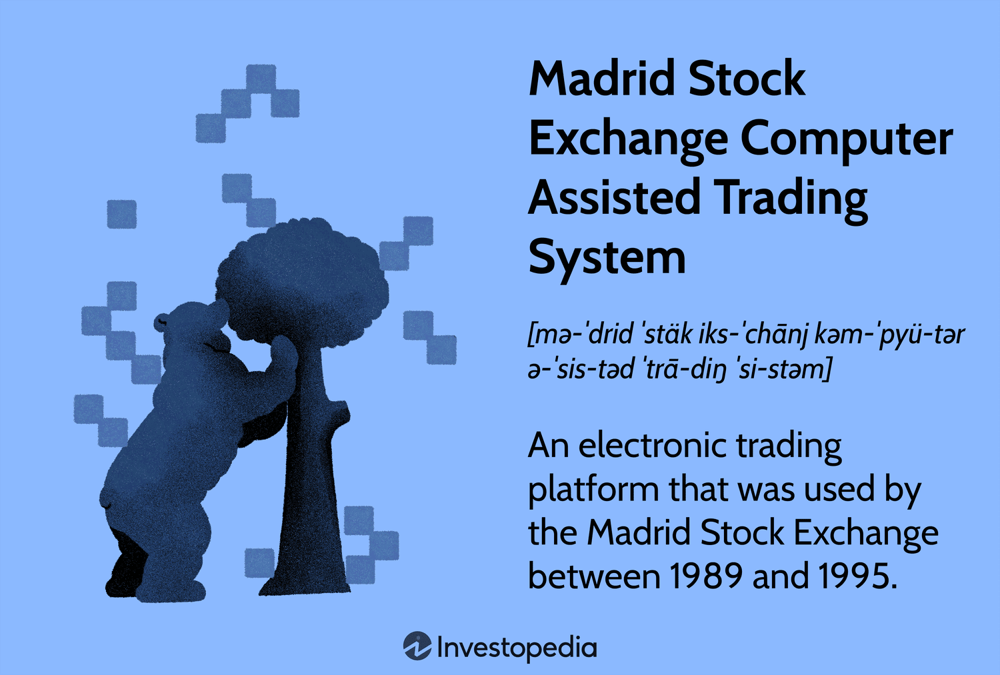

## Table of Contents

## What is the Madrid Stock Exchange (MA)?

The Madrid Stock Exchange, also known as Bolsa de Madrid, is a stock exchange located in Madrid, Spain. It is one of the four stock exchanges in Spain, along with Barcelona, Bilbao, and Valencia. The Madrid Stock Exchange is the largest and most important of these, playing a key role in the Spanish economy. It allows companies to raise money by selling shares to the public, and it provides a place for people to buy and sell these shares.

The exchange was founded in 1831 and has a long history of trading. It is part of a larger group called BME (Bolsas y Mercados Españoles), which manages all the stock exchanges in Spain. The Madrid Stock Exchange is important not just for Spain but also for Europe, as it helps connect Spanish businesses with investors from around the world. People can trade stocks, bonds, and other financial products on this exchange, making it a central hub for financial activity in Spain.

## Where is the Madrid Stock Exchange located?

The Madrid Stock Exchange is located in Madrid, the capital city of Spain. It is found in the heart of the city, at the Palacio de la Bolsa, which is on the street called Plaza de la Lealtad. This building is an important landmark and is easy to find because it is close to other famous places like the Retiro Park and the Paseo del Prado.

The Palacio de la Bolsa is a beautiful old building that was built in the neoclassical style. It was finished in 1893 and has been used for the stock exchange ever since. The building itself is not just a place for trading; it also has a museum where people can learn about the history of the stock market in Spain.

## What types of securities are traded on the Madrid Stock Exchange?

The Madrid Stock Exchange trades many different types of securities. The main ones are stocks, which are shares in companies. When you buy a stock, you own a small part of that company. The exchange also trades bonds, which are loans that people can buy. Companies and governments sell bonds to raise money, and when you buy a bond, you are lending them money and they pay you back with interest.

Besides stocks and bonds, the Madrid Stock Exchange also deals in other financial products. These include ETFs, which are funds that track the performance of a group of stocks or an index. There are also derivatives, which are contracts that get their value from something else, like stocks or commodities. These can be used for investing or to manage risk. Overall, the Madrid Stock Exchange offers a wide variety of securities to meet different investment needs.

## How does one start trading on the Madrid Stock Exchange?

To start trading on the Madrid Stock Exchange, you first need to open an account with a broker. A broker is a person or a company that helps you buy and sell stocks. You can choose a broker that works online or one that you can visit in person. Once you have picked a broker, you will need to fill out some forms with your personal information and maybe some money to start your account. This process is like opening a bank account but for trading stocks.

After your account is set up, you can start trading. You can use the broker's website or app to see which stocks are available on the Madrid Stock Exchange. You can then decide which stocks you want to buy or sell. When you want to make a trade, you tell your broker what you want to do, and they will do it for you. Remember, trading stocks can be risky, so it's a good idea to learn about the companies you are investing in and maybe even talk to a financial advisor before you start.

## What are the trading hours of the Madrid Stock Exchange?

The Madrid Stock Exchange is open for trading from Monday to Friday. The regular trading hours are from 9:00 AM to 5:30 PM, local time in Madrid. This is when most of the buying and selling of stocks happens.

There are also times before and after the regular hours when you can trade. These are called pre-market and after-hours trading. Pre-market trading starts at 8:00 AM and goes until the regular session begins at 9:00 AM. After-hours trading happens from 5:30 PM to 8:00 PM. These extra times let people trade when the main session is not open.

## What is the role of the Madrid Stock Exchange in the Spanish economy?

The Madrid Stock Exchange plays a big role in the Spanish economy. It helps companies get money by letting them sell shares to people. When a company sells shares, it can use the money to grow its business, create new jobs, and make new products. This is good for the economy because it helps businesses do well and helps the country grow.

The exchange also helps people invest their money. When people buy and sell stocks, they can make money if the stocks go up in value. This can help people save for the future, like for retirement or buying a house. The Madrid Stock Exchange connects Spanish businesses with investors from all over the world, making it easier for money to move around and help the economy grow.

## How does the Madrid Stock Exchange contribute to the global financial market?

The Madrid Stock Exchange is important in the global financial market because it helps connect Spanish companies with investors from all around the world. When people from different countries buy and sell stocks on the Madrid Stock Exchange, it makes it easier for money to move between countries. This can help the Spanish economy grow and also helps global investors find new places to invest their money. By being a part of the larger group called BME (Bolsas y Mercados Españoles), the Madrid Stock Exchange works together with other exchanges in Spain and Europe to make the global market stronger.

Also, the Madrid Stock Exchange offers many different types of financial products like stocks, bonds, ETFs, and derivatives. This variety attracts investors from around the world who are looking for different ways to invest their money. When these investors trade on the Madrid Stock Exchange, they help make the global market more active and connected. This activity can lead to more stable and growing economies not just in Spain, but in other countries too.

## What are the major indices associated with the Madrid Stock Exchange?

The main index at the Madrid Stock Exchange is the IBEX 35. This index shows how the 35 biggest and most traded companies in Spain are doing. It's a bit like a report card for the Spanish stock market. People use the IBEX 35 to see if the market is going up or down and to compare how well Spain's economy is doing compared to other countries.

There are also other important indices at the Madrid Stock Exchange. The IBEX Medium Cap tracks the performance of medium-sized companies, while the IBEX Small Cap focuses on smaller companies. These indices help investors see how different parts of the Spanish economy are doing. Together, these indices give a full picture of the market and help people make smart choices about where to invest their money.

## What are the listing requirements for companies on the Madrid Stock Exchange?

To list on the Madrid Stock Exchange, a company needs to meet certain rules. They must have a minimum share capital, which means they need to have a certain amount of money from selling shares. The company also needs to have been in business for at least three years, unless it's a special case. They have to provide a lot of information about their business, like financial reports and how they plan to use the money they raise. This helps investors understand what they are buying into.

There are also rules about how the company is run. They need to have a board of directors with enough independent members to make sure decisions are fair. The company must follow all the laws and rules set by the exchange and other regulators. This includes regular reporting of their financial health and any big changes in the company. By meeting these requirements, the company shows it is ready to be part of the public market and can be trusted by investors.

## How does the Madrid Stock Exchange regulate trading and ensure market integrity?

The Madrid Stock Exchange works hard to make sure trading is fair and honest. They have rules that everyone must follow when buying and selling stocks. They watch the market all the time to catch any bad behavior, like trying to trick people or cheating. If someone breaks the rules, they can be punished, like getting fined or even banned from trading. This helps keep the market safe for everyone who wants to invest.

They also make sure companies tell the truth about their business. Companies have to share regular reports about how they are doing, so investors know what's going on. If a company lies or hides important information, the exchange can take action against them. By doing all this, the Madrid Stock Exchange helps make sure the market works well and people can trust it.

## What technological systems does the Madrid Stock Exchange use for trading?

The Madrid Stock Exchange uses a high-tech system called SIBE (Sistema de Interconexión Bursátil Español) for trading. This system is like a big computer that connects all the stock exchanges in Spain, including Madrid, Barcelona, Bilbao, and Valencia. It helps people buy and sell stocks quickly and easily. SIBE makes sure that everyone gets a fair chance to trade, and it can handle lots of trades at the same time without getting mixed up.

Besides SIBE, the Madrid Stock Exchange also uses other tech tools to keep things running smoothly. They have systems that watch the market to make sure no one is cheating or doing anything wrong. These systems can spot strange trading patterns and alert the exchange so they can check it out. By using these technologies, the Madrid Stock Exchange makes sure that trading is safe and fair for everyone.

## How have recent economic trends affected the performance of the Madrid Stock Exchange?

Recent economic trends have had a big impact on the Madrid Stock Exchange. One of the main trends is inflation, which has been going up in many countries, including Spain. When inflation is high, the prices of things go up, and this can make people worried about the future. This worry can cause them to sell their stocks, which can make the stock market go down. Also, the interest rates set by the European Central Bank have been changing. When interest rates go up, borrowing money becomes more expensive, and this can slow down the economy. A slower economy often means lower stock prices, and the Madrid Stock Exchange has felt this effect.

Another big trend is the recovery from the global health crisis. As countries have started to open up again, businesses have been getting back to normal, and this has helped the stock market. The Madrid Stock Exchange has seen some good days because of this recovery. But there are also new worries, like problems with supply chains and higher energy prices. These issues can make it harder for companies to make money, and this can affect their stock prices. Overall, the Madrid Stock Exchange has been going up and down because of these different economic trends.

## References & Further Reading

[1]: Chaboud, A. P., Chiquoine, B., Hjalmarsson, E., & Vega, C. (2014). ["Rise of the Machines: Algorithmic Trading in the Foreign Exchange Market"](https://www.jstor.org/stable/43612951). The Journal of Finance, 69(5), 2045-2084.

[2]: Gomber, P., Arndt, B., Lutat, M., & Uhle, T. (2011). ["High-Frequency Trading"](https://papers.ssrn.com/sol3/papers.cfm?abstract_id=1858626). In: Algorithmic Trading and DMA: An introduction to direct access trading strategies.

[3]: Mackenzie, D. (2015). ["Mechanizing the Merc: The Contemporary History of Futures Trading"](https://pubmed.ncbi.nlm.nih.gov/26387525/). Social Studies of Science, 45(1), 68-92.

[4]: Le Halle, J. P., & Laruelle, S. (Eds.). (2013). ["Market Microstructure in Practice"](https://books.google.com/books/about/Market_Microstructure_In_Practice_Second.html?id=TtFKDwAAQBAJ) (Vol. 1). World Scientific.

[5]: Hendershott, T., Jones, C. M., & Menkveld, A. J. (2011). ["Does Algorithmic Trading Improve Liquidity?"](https://onlinelibrary.wiley.com/doi/full/10.1111/j.1540-6261.2010.01624.x). The Review of Financial Studies, 24(3), 835-859.