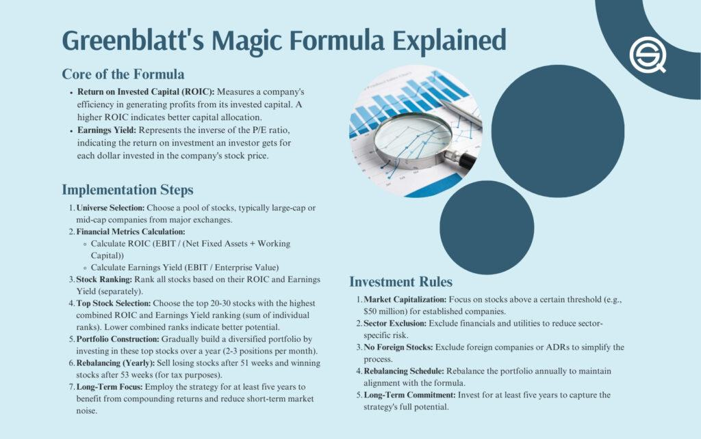

In today's fast-paced stock market, investors are constantly on the lookout for robust strategies to maximize returns while minimizing risks. One such approach is the Magic Formula, devised by renowned investor Joel Greenblatt. The Magic Formula is celebrated for its simplicity and efficacy in identifying undervalued stocks possessing high growth potential. At its core, this formula uses a quantitative strategy to rank stocks based on specific financial metrics, focusing on companies that consistently deliver strong financial performance.

This article examines the Magic Formula, exploring its potential integration with algorithmic trading systems—an innovation that could revolutionize investing strategies. By leveraging technology, investors can execute trades with a high degree of speed and precision that is unattainable through manual processes, enhancing the effectiveness of the Magic Formula. The strategy's mechanics, benefits, potential drawbacks, and practical application in a diversified investment portfolio will be detailed throughout the piece.



Furthermore, the blending of the Magic Formula with algorithmic trading presents unique opportunities in modern financial markets. This integration allows investors to capitalize on fleeting opportunities by making swift, data-driven decisions. As the article progresses, it will highlight how the synergy between the Magic Formula and algorithmic trading can be exploited to unlock value, providing a competitive edge in today's complex trading environment. The analysis will underscore the transformative potential of combining these methods to optimize investment outcomes, ultimately enabling investors to navigate contemporary markets with innovative approaches.

## Table of Contents

## Understanding the Magic Investing Formula

The Magic Formula is a systematic approach to stock selection, developed by Joel Greenblatt, that utilizes two principal metrics: Return on Invested Capital (ROIC) and Earnings Yield (EY). This quantitative strategy aims to identify undervalued companies with strong potential for profit generation.

**Return on Invested Capital (ROIC)** is a critical measure of a company's capability to generate returns from its capital investments. It is calculated as follows:

$$
\text{ROIC} = \frac{\text{Net Operating Profit After Tax (NOPAT)}}{\text{Invested Capital}}
$$

where Invested Capital is typically the sum of equity and debt used for growth and operational purposes. A higher ROIC indicates a business efficiently converting invested funds into profits.

**Earnings Yield (EY)** serves as a counterpart to the Price-to-Earnings (P/E) ratio, offering insight into what investors earn per dollar invested in a stock. It is expressed as:

$$
\text{EY} = \frac{\text{Earnings Per Share (EPS)}}{\text{Price per Share}} = \frac{1}{\text{P/E ratio}}
$$

Higher EY suggests that the stock is potentially undervalued, offering more earnings relative to its price, which can be an attractive proposition for investors seeking value.

Greenblatt's Magic Formula simplifies the stock selection process by ranking a universe of stocks based on these two metrics. Companies that score well on both ROIC and EY are considered fundamentally strong, often with robust financial health and reasonable market prices.

By focusing on measurable financial metrics, the Magic Formula aids in reducing the emotional biases that often cloud investment decisions. By targeting companies with a compelling combination of high efficiency and value, this strategy seeks to identify candidates likely to produce superior long-term returns. It offers investors a disciplined framework for selecting stocks based not on speculative market sentiments but on concrete, quantitative data.

## Algorithmic Trading and the Magic Formula

Algorithmic trading involves the use of pre-defined rules and computer models to execute trades with unparalleled speed and precision. This method aligns seamlessly with the Magic Formula's structured approach, enhancing stock selection by eliminating human biases. At its core, [algorithmic trading](/wiki/algorithmic-trading) automates the process of ranking and selecting stocks that meet the Magic Formula criteria, capitalizing on data-driven environments where timely decision-making is crucial.

The Magic Formula, created by Joel Greenblatt, focuses on selecting stocks based on Return on Invested Capital (ROIC) and Earnings Yield (EY). This formula is rule-based, which makes it suitable for integration into algorithmic trading systems. By utilizing programming languages like Python, traders can develop algorithms that scan vast amounts of financial data to apply the Magic Formula metrics and rank stocks efficiently in real-time. The following Python snippet demonstrates how one might begin to implement such a ranking system:

```python
import pandas as pd

# Assuming `data` is a DataFrame containing 'ticker', 'roic', and 'earnings_yield'
data = pd.read_csv('stock_data.csv')

# Apply the Magic Formula scoping
def apply_magic_formula(data):
    # Rank stocks by ROIC and Earnings Yield
    data['roic_rank'] = data['roic'].rank(ascending=False)
    data['ey_rank'] = data['earnings_yield'].rank(ascending=False)

    # Calculate a combined rank
    data['combined_rank'] = data['roic_rank'] + data['ey_rank']

    # Sort by combined rank
    sorted_data = data.sort_values('combined_rank')
    return sorted_data

# Select top N stocks based on Magic Formula ranking
top_stocks = apply_magic_formula(data).head(30)
print(top_stocks)
```

Using algorithms like this allows traders to exploit opportunities rapidly, a necessity in today's complex markets. This integration ensures precise execution with minimal latency, a key advantage when competing in environments where milliseconds can determine profitability.

Furthermore, the ability of algorithms to process large datasets swiftly means the Magic Formula can be applied to a broader universe of stocks, enhancing the diversification of a portfolio. By continually running these algorithms, traders can ensure their portfolios remain aligned with the Magic Formula parameters, automatically adapting to changes in the market.

The seamless integration of algorithmic trading and the Magic Formula represents a significant paradigm shift in investment strategies, offering individual investors the ability to compete with institutional players through technology. This powerful combination maximizes efficiency, ensuring that investment choices are both data-driven and unemotional.

## Implementing the Magic Formula in Your Portfolio

To successfully implement the Magic Formula in your portfolio, begin by identifying a suitable universe of stocks. Typically, this involves selecting mid to large-cap companies that are traded on major stock exchanges, such as the New York Stock Exchange or NASDAQ. This focus ensures [liquidity](/wiki/liquidity-risk-premium) and reduces exposure to the potentially higher [volatility](/wiki/volatility-trading-strategies) found in small-cap stocks.

The next step is to calculate the Return on Invested Capital (ROIC) and Earnings Yield (EY) for each stock in your selected universe. ROIC can be calculated using the formula:

$$
\text{ROIC} = \frac{\text{Net Operating Profit After Tax (NOPAT)}}{\text{Invested Capital}}
$$

This formula measures how efficiently a company generates profits relative to the capital it has invested in its operations. Calculating the EY, which is the inverse of the Price-to-Earnings (P/E) ratio, involves:

$$
\text{Earnings Yield} = \frac{\text{Earnings Per Share (EPS)}}{\text{Market Price per Share}}
$$

This metric indicates the earnings a company generates per dollar invested in its stock, useful for evaluating fundamentally sound investments.

Once these calculations are complete, rank the stocks based on a combination of their ROIC and EY. A straightforward ranking system involves selecting stocks with the highest ROIC and EY, providing a balance of profitability and attractive valuations. You could, for example, assign scores to each stock according to their ranking in both metrics, then sum these scores to derive an overall ranking.

To illustrate, consider the following Python snippet that demonstrates how you might rank stocks using hypothetical data:

```python
import pandas as pd

# Sample data representing stocks with their respective ROIC and EY values
data = {
    'Stock': ['Company A', 'Company B', 'Company C'],
    'ROIC': [0.15, 0.12, 0.20],
    'EY': [0.08, 0.10, 0.07]
}

# Create a DataFrame
df = pd.DataFrame(data)

# Rank stocks based on ROIC and EY
df['ROIC Rank'] = df['ROIC'].rank(ascending=False)
df['EY Rank'] = df['EY'].rank(ascending=False)

# Combined rank
df['Combined Rank'] = df['ROIC Rank'] + df['EY Rank']

# Select top stocks based on Combined Rank
selected_stocks = df.nsmallest(2, 'Combined Rank')
print(selected_stocks)
```

After identifying the top-ranked companies, construct a diversified portfolio by selecting stocks from various sectors. This diversification reduces sector-specific risks, enhancing the prospect of stable returns across different economic conditions.

Finally, regularly rebalance your portfolio. This involves periodically reassessing and adjusting your holdings to align with your initial investment criteria and the Magic Formula's parameters, typically on a quarterly or annual basis. Rebalancing ensures that your portfolio remains optimally positioned according to the quantitative insights provided by the Magic Formula.

## Criticisms and Considerations

While effective, the Magic Formula, proposed by Joel Greenblatt, has its set of criticisms and considerations. The formula's main premise is to simplify stock selection using quantitative measures like Return on Invested Capital (ROIC) and Earnings Yield (EY); however, it falls short in assessing qualitative factors which significantly affect stock performance. 

One primary criticism is the Magic Formula's oversight of intangible elements such as company management quality, competitive advantages, and industry-specific dynamics, which are crucial for a holistic investment evaluation. Consequently, the potential for overlooking stocks that excel in these qualitative areas might result in missed long-term opportunities.

Furthermore, the effectiveness of the Magic Formula can vary across different market environments. In stable or bullish markets, the formula may deliver promising returns; however, its performance might diminish during volatile or bearish periods. Another limitation is its inapplicability to small-cap stocks. Small-caps often present unique growth opportunities but come with higher volatility and risk, which the formula does not account for, thereby excluding potentially lucrative investments from analysis.

Additionally, critics highlight the possible impact of changing market dynamics and the formula's widespread adoption. As more investors apply the Magic Formula, it may lead to a saturation effect, where the associated stocks become overvalued, subsequently reducing potential returns.

Some analysts propose incorporating additional financial metrics to enhance the Magic Formula's robustness, such as debt-to-equity ratios or dividend yields. By accounting for a company's leverage and income distribution policies, investors can achieve a nuanced understanding and better align with individual risk thresholds and investment goals.

In conclusion, while the Magic Formula provides an accessible, methodical approach to stock selection, it’s essential for investors to recognize its limitations. Tailoring the strategy to include qualitative assessments and market condition considerations can improve suitability and effectiveness for personal investment objectives. Thus, adapting the Magic Formula to specific needs and continually monitoring its performance relative to changing market conditions remains vital for maximizing its potential.

## Conclusion

The Magic Formula, as devised by Joel Greenblatt, presents a disciplined and methodical approach to stock market investing that emphasizes value and efficiency through quantitative means. By prioritizing companies with strong financial health and compelling valuations, the Magic Formula enables investors to make informed decisions based on robust metrics, specifically Return on Invested Capital (ROIC) and Earnings Yield (EY). This method inherently reduces emotional bias often associated with investing and favors long-term gains over speculative ventures.

The integration of algorithmic trading amplifies the Magic Formula's potential by introducing speed and precision in stock selection processes. Algorithmic systems can seamlessly apply the Magic Formula's criteria across a vast array of data, identifying and executing profitable trades at a pace that human traders cannot match. This synergy between a rules-based investing strategy and technological execution serves as a powerful tool for average investors, enhancing their ability to achieve high returns in dynamic markets.

Despite its advantages, the Magic Formula is not infallible. It is not a guaranteed path to success but rather a valuable component within a diversified investment strategy. Its simplicity and quantitative nature make it accessible and practical, yet it is imperative for investors to be cognizant of its limitations. These include its potential underperformance in certain market conditions and its exclusion of qualitative factors, such as management quality or market trends.

Recognizing the merits and boundaries of the Magic Formula, alongside the transformative capabilities of algorithmic trading, investors can chart more reliable paths to sustained financial growth. Successful implementation requires understanding the theoretical groundwork while remaining flexible to adapt and tailor the approach according to individual investment objectives and evolving market dynamics. As with any investment strategy, ongoing evaluation and adjustment are crucial to align with personal goals and risk tolerance.

## References & Further Reading

[1]: Greenblatt, J. (2005). ["The Little Book That Still Beats the Market"](https://www.amazon.com/Little-Book-Still-Beats-Market/dp/0470624159). Wiley.

[2]: Lopez de Prado, M. (2018). ["Advances in Financial Machine Learning"](https://www.amazon.com/Advances-Financial-Machine-Learning-Marcos/dp/1119482089). Wiley.

[3]: Aronson, D. (2006). ["Evidence-Based Technical Analysis: Applying the Scientific Method and Statistical Inference to Trading Signals"](https://www.amazon.com/Evidence-Based-Technical-Analysis-Scientific-Statistical/dp/0470008741). Wiley.

[4]: Chan, E. P. (2009). ["Quantitative Trading: How to Build Your Own Algorithmic Trading Business"](https://github.com/ftvision/quant_trading_echan_book). Wiley.

[5]: Jansen, S. (2020). ["Machine Learning for Algorithmic Trading - Second Edition"](https://www.amazon.com/Machine-Learning-Algorithmic-Trading-alternative/dp/1839217715). Packt Publishing.