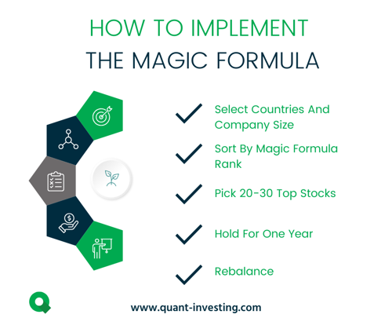

## Table of Contents

## What is Magic Formula Investing?

Magic Formula Investing is a strategy created by Joel Greenblatt. It is a way to pick stocks that might give good returns. The strategy uses two main things to choose stocks: the company's earnings compared to its price, and how well the company uses its money to make more money. This is called the earnings yield and return on capital. By looking at these two things, the Magic Formula tries to find companies that are both cheap and good at making money.

To use the Magic Formula, you first find a list of at least 30 stocks that have high earnings yield and high return on capital. Then, you rank these stocks based on these two measures. After ranking, you pick the top stocks and buy them. You hold these stocks for a year and then repeat the process. The idea is that by sticking to this simple formula, you can beat the market over time without needing to be an expert in picking stocks.

## Who developed the Magic Formula Investing strategy?

Joel Greenblatt developed the Magic Formula Investing strategy. He is a well-known investor and a teacher. He wrote about his strategy in a book called "The Little Book That Beats the Market." In the book, he explains how anyone can use his simple formula to pick good stocks.

The Magic Formula looks at two main things to choose stocks: how much the company earns compared to its price, and how well the company uses its money to make more money. These are called earnings yield and return on capital. By focusing on these two things, the formula tries to find companies that are both cheap and good at making money.

## What are the key components of the Magic Formula?

The Magic Formula has two key parts that help pick good stocks. The first part is called earnings yield. This looks at how much money a company makes compared to its price. If a company is cheap but makes a lot of money, it has a high earnings yield. The second part is called return on capital. This shows how well a company uses its money to make more money. A company with a high return on capital is good at turning its money into even more money.

To use the Magic Formula, you find a list of at least 30 stocks that have high earnings yield and high return on capital. Then, you rank these stocks based on these two things. After ranking, you pick the top stocks and buy them. You keep these stocks for a year and then do the whole process again. The idea is that by following this simple formula, you can do better than the market over time without needing to be an expert in [picking](/wiki/asset-class-picking) stocks.

## How does the Magic Formula rank companies?

The Magic Formula ranks companies by looking at two things: earnings yield and return on capital. Earnings yield is how much money a company makes compared to its price. If a company is cheap but makes a lot of money, it has a high earnings yield. Return on capital shows how well a company uses its money to make more money. A company with a high return on capital is good at turning its money into even more money.

To rank the companies, you first make a list of at least 30 companies that have high earnings yield and high return on capital. Then, you rank these companies based on these two things. You give each company two scores: one for earnings yield and one for return on capital. After that, you add up the scores to see which companies are at the top. The companies with the highest total scores are the ones you pick to invest in.

## What is the significance of Return on Capital in the Magic Formula?

Return on Capital is really important in the Magic Formula because it shows how good a company is at using its money to make more money. Think of it like this: if you have some money, you want to use it in a way that will give you the most back. A company with a high Return on Capital is like a good investment because it's using its money really well to earn more money.

In the Magic Formula, Return on Capital is one of the two main things you look at when picking stocks. The other thing is earnings yield. By looking at both of these, the Magic Formula tries to find companies that are not only cheap but also really good at making money. This helps you pick stocks that might give you good returns over time.

## How is Earnings Yield calculated in the Magic Formula?

Earnings Yield in the Magic Formula is a way to see how much money a company makes compared to its price. To find the Earnings Yield, you take the company's earnings before interest and taxes (EBIT) and divide it by the company's enterprise value. The enterprise value is like the total value of the company, including its stock price, debt, and minus any cash it has. So, if a company makes a lot of money (high EBIT) but costs less (low enterprise value), it will have a high Earnings Yield.

This measure helps you find companies that are cheap but still make a lot of money. A high Earnings Yield means the company is like a good deal because you're getting a lot of earnings for the price you pay. In the Magic Formula, you rank companies by their Earnings Yield along with their Return on Capital to pick the best stocks to invest in.

## What are the steps to implement the Magic Formula Investing strategy?

To use the Magic Formula Investing strategy, first you need to find a list of at least 30 companies. Look for companies that have a high Earnings Yield and a high Return on Capital. Earnings Yield is how much money a company makes compared to its price. You find it by dividing the company's earnings before interest and taxes (EBIT) by its enterprise value. Return on Capital shows how well a company uses its money to make more money. Once you have your list, rank the companies based on these two things. Give each company a score for Earnings Yield and another score for Return on Capital. Then, add up the scores to see which companies are at the top.

After you rank the companies, pick the top ones with the highest total scores. Buy these stocks and hold them for a year. The idea is that these companies are both cheap and good at making money, which might give you good returns. After a year, sell the stocks and start the process again. By following these steps and sticking to the Magic Formula, you can try to beat the market over time without needing to be an expert in picking stocks.

## Can the Magic Formula be applied to different market sizes, such as small-cap or large-cap stocks?

Yes, the Magic Formula can be used for different sizes of companies, like small-cap or large-cap stocks. Small-cap stocks are smaller companies, and large-cap stocks are bigger companies. The Magic Formula looks at how much money a company makes compared to its price (Earnings Yield) and how well it uses its money to make more money (Return on Capital). These things can be checked for any company, no matter its size. So, you can use the Magic Formula to find good stocks in both small and large companies.

When you use the Magic Formula on different market sizes, you might find different kinds of opportunities. Small-cap stocks might be riskier but could have more room to grow. Large-cap stocks might be safer but might not grow as fast. By sticking to the Magic Formula's rules of picking stocks with high Earnings Yield and high Return on Capital, you can try to find the best stocks in any market size. Just remember to always have at least 30 stocks in your list to spread out the risk.

## What are the potential risks and limitations of using the Magic Formula?

Using the Magic Formula can have some risks and limits. One big risk is that the stock market can change a lot, and even if you follow the formula, you might still lose money. The Magic Formula looks at things like how much money a company makes compared to its price and how well it uses its money. But these things can change over time, and if they do, the stocks you pick might not do well. Also, the formula might not work well during times when the market is going down a lot, because it doesn't take into account things like how the whole market is doing.

Another limit is that the Magic Formula doesn't look at everything about a company. It only focuses on two things: earnings yield and return on capital. This means it might miss other important stuff, like how good the company's leaders are or if there are any big problems coming up for the company. Also, the formula needs you to have at least 30 stocks to spread out the risk, but this can be hard to do if you don't have a lot of money to invest. So, while the Magic Formula can be a helpful tool, it's not perfect and you need to be careful and think about other things too.

## How does the Magic Formula perform compared to broader market indices?

The Magic Formula has been shown to do better than the broader market indices over time. Joel Greenblatt, who made the Magic Formula, says that it can beat the market by a lot if you stick with it for many years. In his book, he shows that from 1988 to 2004, the Magic Formula did much better than the S&P 500, which is a big index that shows how the market is doing. This means that if you used the Magic Formula to pick stocks, you might have made more money than if you just put your money in the S&P 500.

But, the Magic Formula doesn't always beat the market every year. Some years, it might do worse than the market. This is because the stock market can be up and down, and the Magic Formula looks at things like how much money a company makes compared to its price and how well it uses its money. These things can change, and if they do, the stocks you pick might not do well. So, while the Magic Formula can be a good way to try to beat the market over many years, you need to be ready for some years where it might not work as well.

## Are there any tools or software available to help with Magic Formula Investing?

Yes, there are tools and software that can help with Magic Formula Investing. Websites like MagicFormulaInvesting.com offer free screening tools where you can find lists of stocks that fit the Magic Formula's rules. These tools take away the hard work of looking up and ranking companies based on their earnings yield and return on capital. You just need to put in your choices, and the tool will give you a list of stocks to look at.

Another tool is the Validea Magic Formula Screener, which is part of a bigger set of investment tools. This tool also helps you find stocks that match the Magic Formula's way of picking stocks. It's easy to use and can save you a lot of time. There are also other investment platforms like Finviz and Morningstar that let you set up your own screens to find stocks with high earnings yield and high return on capital, even if they don't have a tool made just for the Magic Formula.

## How can an investor adapt the Magic Formula to their personal investment strategy?

An investor can adapt the Magic Formula to fit their own way of investing by changing how they pick stocks and how long they keep them. For example, if you don't want to buy and sell stocks every year, you could keep the stocks for longer, like two or three years. Or, if you want to focus on certain types of companies, like tech companies or ones that are good for the environment, you can use the Magic Formula to pick stocks only from those groups. This way, you can still use the formula's rules about earnings yield and return on capital, but you can make it fit your own goals and what you believe in.

Another way to adapt the Magic Formula is to mix it with other ways of picking stocks. You might use the formula to find a list of good stocks, but then look at other things too, like how the company is run or what's happening in the world that might affect the company. This can help you make better choices. Also, if you don't have a lot of money to invest, you might need to pick fewer stocks than the 30 the formula says to use. That's okay, but you need to know it might be riskier because you're not spreading out your money as much. By making these changes, you can use the Magic Formula in a way that works best for you.

## What is the Magic Investing Formula and how does it work?

The Magic Formula is a systematic approach to stock selection, developed by Joel Greenblatt, that utilizes two principal metrics: Return on Invested Capital (ROIC) and Earnings Yield (EY). This quantitative strategy aims to identify undervalued companies with strong potential for profit generation.

**Return on Invested Capital (ROIC)** is a critical measure of a company's capability to generate returns from its capital investments. It is calculated as follows:

$$
\text{ROIC} = \frac{\text{Net Operating Profit After Tax (NOPAT)}}{\text{Invested Capital}}
$$

where Invested Capital is typically the sum of equity and debt used for growth and operational purposes. A higher ROIC indicates a business efficiently converting invested funds into profits.

**Earnings Yield (EY)** serves as a counterpart to the Price-to-Earnings (P/E) ratio, offering insight into what investors earn per dollar invested in a stock. It is expressed as:

$$
\text{EY} = \frac{\text{Earnings Per Share (EPS)}}{\text{Price per Share}} = \frac{1}{\text{P/E ratio}}
$$

Higher EY suggests that the stock is potentially undervalued, offering more earnings relative to its price, which can be an attractive proposition for investors seeking value.

Greenblatt's Magic Formula simplifies the stock selection process by ranking a universe of stocks based on these two metrics. Companies that score well on both ROIC and EY are considered fundamentally strong, often with robust financial health and reasonable market prices.

By focusing on measurable financial metrics, the Magic Formula aids in reducing the emotional biases that often cloud investment decisions. By targeting companies with a compelling combination of high efficiency and value, this strategy seeks to identify candidates likely to produce superior long-term returns. It offers investors a disciplined framework for selecting stocks based not on speculative market sentiments but on concrete, quantitative data.

## How can you implement the Magic Formula in your portfolio?

To successfully implement the Magic Formula in your portfolio, begin by identifying a suitable universe of stocks. Typically, this involves selecting mid to large-cap companies that are traded on major stock exchanges, such as the New York Stock Exchange or NASDAQ. This focus ensures [liquidity](/wiki/liquidity-risk-premium) and reduces exposure to the potentially higher [volatility](/wiki/volatility-trading-strategies) found in small-cap stocks.

The next step is to calculate the Return on Invested Capital (ROIC) and Earnings Yield (EY) for each stock in your selected universe. ROIC can be calculated using the formula:

$$
\text{ROIC} = \frac{\text{Net Operating Profit After Tax (NOPAT)}}{\text{Invested Capital}}
$$

This formula measures how efficiently a company generates profits relative to the capital it has invested in its operations. Calculating the EY, which is the inverse of the Price-to-Earnings (P/E) ratio, involves:

$$
\text{Earnings Yield} = \frac{\text{Earnings Per Share (EPS)}}{\text{Market Price per Share}}
$$

This metric indicates the earnings a company generates per dollar invested in its stock, useful for evaluating fundamentally sound investments.

Once these calculations are complete, rank the stocks based on a combination of their ROIC and EY. A straightforward ranking system involves selecting stocks with the highest ROIC and EY, providing a balance of profitability and attractive valuations. You could, for example, assign scores to each stock according to their ranking in both metrics, then sum these scores to derive an overall ranking.

To illustrate, consider the following Python snippet that demonstrates how you might rank stocks using hypothetical data:

```python
import pandas as pd

# Sample data representing stocks with their respective ROIC and EY values
data = {
    'Stock': ['Company A', 'Company B', 'Company C'],
    'ROIC': [0.15, 0.12, 0.20],
    'EY': [0.08, 0.10, 0.07]
}

# Create a DataFrame
df = pd.DataFrame(data)

# Rank stocks based on ROIC and EY
df['ROIC Rank'] = df['ROIC'].rank(ascending=False)
df['EY Rank'] = df['EY'].rank(ascending=False)

# Combined rank
df['Combined Rank'] = df['ROIC Rank'] + df['EY Rank']

# Select top stocks based on Combined Rank
selected_stocks = df.nsmallest(2, 'Combined Rank')
print(selected_stocks)
```

After identifying the top-ranked companies, construct a diversified portfolio by selecting stocks from various sectors. This diversification reduces sector-specific risks, enhancing the prospect of stable returns across different economic conditions.

Finally, regularly rebalance your portfolio. This involves periodically reassessing and adjusting your holdings to align with your initial investment criteria and the Magic Formula's parameters, typically on a quarterly or annual basis. Rebalancing ensures that your portfolio remains optimally positioned according to the quantitative insights provided by the Magic Formula.

## References & Further Reading

[1]: Greenblatt, J. (2005). ["The Little Book That Still Beats the Market"](https://www.amazon.com/Little-Book-Still-Beats-Market/dp/0470624159). Wiley.

[2]: Lopez de Prado, M. (2018). ["Advances in Financial Machine Learning"](https://www.amazon.com/Advances-Financial-Machine-Learning-Marcos/dp/1119482089). Wiley.

[3]: Aronson, D. (2006). ["Evidence-Based Technical Analysis: Applying the Scientific Method and Statistical Inference to Trading Signals"](https://www.amazon.com/Evidence-Based-Technical-Analysis-Scientific-Statistical/dp/0470008741). Wiley.

[4]: Chan, E. P. (2009). ["Quantitative Trading: How to Build Your Own Algorithmic Trading Business"](https://github.com/ftvision/quant_trading_echan_book). Wiley.

[5]: Jansen, S. (2020). ["Machine Learning for Algorithmic Trading - Second Edition"](https://www.amazon.com/Machine-Learning-Algorithmic-Trading-alternative/dp/1839217715). Packt Publishing.