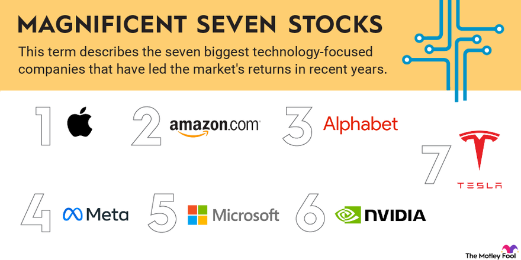

## Table of Contents

## What are the Magnificent Seven stocks?

The Magnificent Seven stocks are a group of seven big technology companies in the United States. These companies are Apple, Microsoft, Alphabet (Google's parent company), Amazon, Nvidia, Tesla, and Meta Platforms (which used to be called Facebook). They are called "magnificent" because they have been doing really well in the stock market and are very important in the tech industry.

These seven companies have a lot of influence on the economy and technology. They are known for their innovation and for making products and services that many people use every day. For example, Apple makes iPhones, Microsoft makes Windows, and Amazon is a big online store. Because they are so successful, many investors want to buy their stocks, hoping to make money as the companies grow.

## Why are they called the Magnificent Seven?

The term "Magnificent Seven" comes from a famous old movie about seven brave heroes. People started using this name for the seven big tech companies because they are seen as leaders in the tech world. These companies are Apple, Microsoft, Alphabet (Google's parent company), Amazon, Nvidia, Tesla, and Meta Platforms (formerly known as Facebook). They are called "magnificent" because they have been doing really well in the stock market and are very important in the tech industry.

These companies have a lot of influence on the economy and technology. They are known for their innovation and for making products and services that many people use every day. For example, Apple makes iPhones, Microsoft makes Windows, and Amazon is a big online store. Because they are so successful, many investors want to buy their stocks, hoping to make money as the companies grow. The name "Magnificent Seven" captures how impressive and powerful these companies are seen to be.

## Which companies are included in the Magnificent Seven?

The Magnificent Seven are a group of seven big technology companies in the United States. These companies are Apple, Microsoft, Alphabet (Google's parent company), Amazon, Nvidia, Tesla, and Meta Platforms (which used to be called Facebook). They are called the Magnificent Seven because they are very successful and important in the tech world.

These companies have a lot of influence on the economy and technology. They make things that many people use every day, like iPhones from Apple, Windows from Microsoft, and the online store Amazon. Because they do so well, many people want to buy their stocks to make money as the companies grow.

## What industries do the Magnificent Seven stocks represent?

The Magnificent Seven stocks come from different parts of the technology industry. Apple, Microsoft, and Alphabet (Google's parent company) are big in making software and devices. Apple makes iPhones and iPads, Microsoft makes Windows and Xbox, and Alphabet owns Google, which is famous for its search engine and other services. Amazon is known for its online store, but it also does a lot in cloud computing with its service called Amazon Web Services (AWS).

Nvidia is important in the world of computer chips, especially for graphics cards that help with gaming and [artificial intelligence](/wiki/ai-artificial-intelligence). Tesla is all about electric cars and also works on batteries and solar energy. Meta Platforms, which used to be called Facebook, focuses on social media and connecting people online through platforms like Facebook, Instagram, and WhatsApp. These companies together cover a lot of the tech world, from making hardware and software to providing services online.

## How have the Magnificent Seven stocks performed historically?

The Magnificent Seven stocks have done really well over the years. They have grown a lot and made a lot of money for people who invested in them. For example, Apple's stock has gone up a lot since it first started selling iPhones. Microsoft's stock has also grown a lot, especially when it started doing well with cloud computing. Amazon's stock has seen big jumps, especially during times when more people were shopping online. Alphabet, the company that owns Google, has also seen its stock value increase as more people use the internet for searching and other things.

Nvidia's stock has had big increases, especially when it started making chips for artificial intelligence and gaming. Tesla's stock has been very exciting, going up and down a lot, but overall it has grown a lot because more people want electric cars. Meta Platforms, which used to be called Facebook, has also seen its stock go up and down, but it has grown over time as more people use social media. Overall, these seven companies have done very well and have been important parts of the stock market, helping to drive the economy forward.

## What are the key factors driving the success of these companies?

The success of the Magnificent Seven companies comes from many things. One big reason is that they keep making new things that people want. For example, Apple keeps making better iPhones and iPads, and Microsoft keeps making better versions of Windows and other software. These companies also use new technology like artificial intelligence and cloud computing to make their products even better. This helps them stay ahead of other companies and keeps people wanting to buy their products.

Another important thing is that these companies have a lot of people using their products every day. For example, billions of people use Google to search the internet, and millions shop on Amazon. This means these companies can make a lot of money from ads and selling things. They also have a lot of money to spend on making their products even better. This cycle of making money and using it to improve their products helps them keep growing and doing well.

Lastly, these companies are really good at understanding what people want and need. They listen to their customers and use that information to make their products better. For example, Tesla listens to what people want in electric cars and keeps making them better. This focus on the customer helps these companies stay popular and keep growing.

## How do the Magnificent Seven stocks contribute to the overall market?

The Magnificent Seven stocks are really important for the whole stock market. They are big companies like Apple, Microsoft, and Amazon, and they make up a big part of the market. When these companies do well, it can make the whole market go up. This is because a lot of money is invested in them, so their success can pull the market up with them. For example, if Apple's stock goes up a lot, it can make the whole market look better.

These companies also help the economy by creating jobs and making new things. They spend a lot of money on research to make better products, which can lead to new technology that helps other businesses too. When they do well, it can make people feel more confident about the economy, which can lead to more spending and investing. So, the Magnificent Seven not only affect the stock market but also have a big impact on the economy as a whole.

## What are the risks associated with investing in the Magnificent Seven?

Investing in the Magnificent Seven can be risky because their stocks can go up and down a lot. For example, Tesla's stock can change a lot in a short time, which can be exciting but also scary. If the stock goes down, you could lose money. Also, these companies are so big that if something goes wrong with one of them, it can affect the whole market. This means that if you have a lot of your money in these stocks, you could lose a lot if the market goes down.

Another risk is that these companies might not keep doing as well as they have in the past. They face a lot of competition, and new companies could come along and do better. For example, if someone makes a better phone than Apple, people might stop buying iPhones. Also, these companies depend a lot on new technology, and if they can't keep up with new inventions, their stocks could go down. So, even though they have done well in the past, there's no guarantee they will keep doing well in the future.

## How do the financial metrics of the Magnificent Seven compare to their peers?

The Magnificent Seven companies, like Apple, Microsoft, and Amazon, have some financial metrics that are better than their peers. For example, they often have higher profits and more money coming in than other companies in their industries. Apple makes a lot of money from selling iPhones and other products, and Microsoft does well with its software and cloud services. Amazon's online store and cloud computing business also bring in a lot of money. These companies have strong financial positions, which means they have a lot of money to spend on new projects and to keep growing.

However, not all their financial metrics are better than everyone else's. For example, some of these companies, like Tesla, can have a lot of debt, which can be risky. Also, their stocks can be more expensive than other companies' stocks, which means you might have to pay more to buy them. This can make them riskier because if their stock prices go down, you could lose more money. But overall, the Magnificent Seven have strong financials that help them stay ahead of many other companies in the market.

## What are the future growth prospects for each of the Magnificent Seven companies?

Apple has a good chance to keep growing. They are always making new iPhones, iPads, and other devices that people want. They are also getting into new areas like health and fitness, which could help them make more money in the future. Apple has a lot of loyal customers, so if they keep making things that people like, they should do well.

Microsoft is also looking strong for the future. They are doing really well with their cloud computing business, which is growing fast. They also have a lot of people using their software like Windows and Office, and they are getting into new areas like gaming and artificial intelligence. If they keep up with new technology, Microsoft should keep growing.

Amazon has a bright future too. Their online store is still growing, and their cloud computing business, AWS, is doing very well. They are also getting into new areas like health care and groceries, which could help them make more money. Amazon is good at finding new ways to grow, so they should keep doing well. Alphabet, which owns Google, is also in a good position. They have a lot of people using their search engine and other services, and they are working on new things like self-driving cars and health care. If they keep innovating, Alphabet should keep growing.

## How have the Magnificent Seven stocks influenced investment strategies?

The Magnificent Seven stocks have changed how people invest. Because these companies like Apple, Microsoft, and Amazon are so big and successful, many investors want to put their money into them. They think that by investing in these companies, they can make a lot of money as the companies keep growing. This has led to more people focusing their investments on technology stocks, hoping to get big returns. Some people even build their whole investment plan around these seven companies, thinking they are a safe bet because they have done so well in the past.

However, this focus on the Magnificent Seven can also be risky. Because these stocks are so popular, their prices can go up a lot, making them expensive to buy. If something goes wrong with one of these companies, it can affect the whole market. So, some investors try to balance their portfolios by not putting all their money into these seven stocks. They might also look for other companies that could grow in the future, spreading their investments to reduce risk. This way, they can still benefit from the success of the Magnificent Seven but also protect themselves if things don't go as planned.

## What expert analyses and forecasts exist regarding the future performance of the Magnificent Seven?

Experts have different opinions about how the Magnificent Seven will do in the future. Some think these companies will keep growing because they are always coming up with new things. For example, Apple might keep making better iPhones and get into new areas like health. Microsoft is doing well with cloud computing and could grow even more in that area. Amazon's online store and cloud business are strong, and they are trying new things like health care. These experts believe that as long as these companies keep innovating and finding new ways to make money, they will do well.

However, other experts think there might be some challenges ahead. They worry that these companies are so big that it might be hard for them to keep growing at the same fast pace. Also, new companies could come along and do better in some areas. For example, if someone makes a better phone than Apple, people might stop buying iPhones. There's also the risk that the stock market could go down, which would affect these companies because they are such a big part of it. So, while many experts are optimistic, they also say it's important to be careful and not put all your money into these seven stocks.

## References & Further Reading

[1]: Bergstra, J., Bardenet, R., Bengio, Y., & Kégl, B. (2011). ["Algorithms for Hyper-Parameter Optimization."](https://papers.nips.cc/paper/4443-algorithms-for-hyper-parameter-optimization) Advances in Neural Information Processing Systems 24.

[2]: ["Advances in Financial Machine Learning"](https://www.amazon.com/Advances-Financial-Machine-Learning-Marcos/dp/1119482089) by Marcos Lopez de Prado

[3]: ["Evidence-Based Technical Analysis: Applying the Scientific Method and Statistical Inference to Trading Signals"](https://www.amazon.com/Evidence-Based-Technical-Analysis-Scientific-Statistical/dp/0470008741) by David Aronson

[4]: ["Machine Learning for Algorithmic Trading"](https://github.com/stefan-jansen/machine-learning-for-trading) by Stefan Jansen

[5]: ["Quantitative Trading: How to Build Your Own Algorithmic Trading Business"](https://www.amazon.com/Quantitative-Trading-Build-Algorithmic-Business/dp/1119800064) by Ernest P. Chan