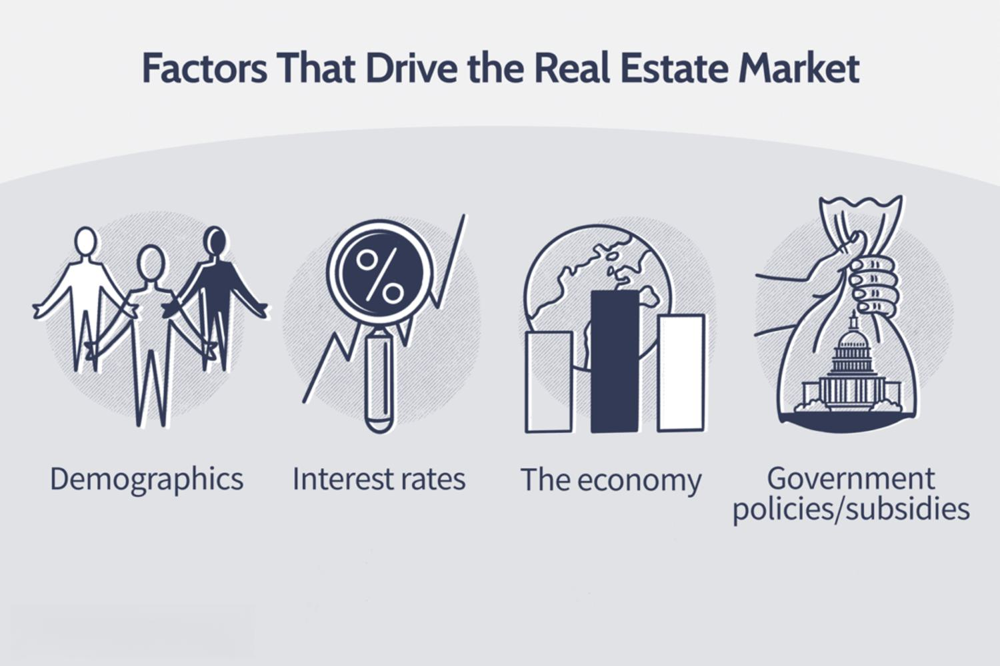

## Table of Contents

## What is the real estate industry?

The real estate industry is all about buying, selling, and renting land, homes, and buildings. It includes many different jobs like real estate agents who help people find properties, property managers who take care of buildings, and developers who build new homes and offices. This industry is important because it helps people find places to live and work, and it also helps the economy grow.

Real estate can be a big investment. When people buy property, they hope it will increase in value over time. This is called appreciation. People can also earn money by renting out their properties to others. The real estate market can change a lot, sometimes prices go up and sometimes they go down. Many things can affect the market, like the economy, interest rates, and how many people want to buy or rent.

Overall, the real estate industry plays a big role in our lives. It affects where we live, how much we pay for our homes, and even the value of our investments. Whether you are buying your first home, renting an apartment, or investing in property, the real estate industry is something that touches almost everyone.

## What are the main segments of the real estate industry?

The real estate industry is divided into several main segments. One big segment is residential real estate, which includes homes where people live. This can be houses, apartments, condos, and even vacation homes. People either buy these homes to live in them or to rent them out to others. Another segment is commercial real estate, which includes buildings used for business. This can be offices, shopping centers, hotels, and warehouses. Companies buy or rent these spaces to run their businesses.

Another important segment is industrial real estate, which focuses on properties used for manufacturing, storage, and distribution. This includes factories, warehouses, and logistics centers. These properties are essential for businesses that need space to make or store products. Lastly, there is land, which is undeveloped property that can be used for future development. Developers might buy land to build new homes, offices, or other types of real estate. Each segment plays a different role in the economy and meets different needs of people and businesses.

## What is residential real estate and what types of properties does it include?

Residential real estate is all about homes where people live. It's the biggest part of the real estate world because everyone needs a place to call home. This segment includes different types of homes like single-family houses, which are standalone homes for one family. There are also multi-family homes, like duplexes or triplexes, where a few families live in the same building but have their own separate spaces. Condominiums, or condos, are another type where people own their unit but share common areas like hallways or pools with others in the building.

Apart from these, residential real estate also includes apartments, which people usually rent instead of buying. Apartments can be in big buildings with lots of units or smaller buildings with just a few. Vacation homes are another type, which people might use for holidays or rent out to others. Lastly, there are mobile homes and tiny homes, which are smaller and can be moved from one place to another. All these different types of homes make up the residential real estate segment, helping people find the right place to live.

## What is commercial real estate and what are its key subcategories?

Commercial real estate is all about properties used for business. This includes any building or land that businesses use to make money. It's different from homes because it's not where people live, but where they work, shop, or enjoy services. Commercial real estate is important because it helps businesses run and grow, and it also affects the economy by creating jobs and bringing in money.

There are a few main types of commercial real estate. One big type is office spaces, where companies have their offices. This can be big skyscrapers in a city or smaller buildings in the suburbs. Another type is retail spaces, like shopping malls, stores, and restaurants where people buy things or eat out. There are also industrial properties, which are used for making things, storing them, or moving them around. These include factories, warehouses, and distribution centers. Each type of commercial real estate serves a different purpose for businesses, helping them do what they need to do.

## What is industrial real estate and what types of properties fall under this segment?

Industrial real estate is all about properties that businesses use for making, storing, or moving things. These properties help companies do their work, like making products or keeping them safe until they are sold. Industrial real estate is important because it helps the economy by creating jobs and keeping businesses running smoothly.

There are different types of properties in industrial real estate. One type is warehouses, which are big buildings where companies store things they make or sell. Another type is factories, where workers and machines make products. There are also distribution centers, which are used to get products from one place to another quickly. All these types of properties help businesses work better and grow.

## What is the role of land in the real estate industry?

Land is a very important part of the real estate industry. It is the starting point for all types of real estate, whether it's homes, offices, or factories. Developers buy land to build new properties on it. This can be anything from a single house to a big shopping center. Land is also important because its value can go up over time, making it a good investment for people who buy it.

Land can be used in many ways in the real estate world. Some people buy land to keep it for the future, hoping that it will become more valuable. Others might use it for farming or other activities. Land can also be developed into different types of real estate, like turning a big piece of land into a neighborhood with many homes. The way land is used can have a big impact on the economy and the community around it.

## How does the real estate investment trust (REIT) sector work?

A Real Estate Investment Trust, or REIT, is a company that owns and often operates income-generating real estate. People can buy shares in a REIT, kind of like buying stock in a company. When the REIT makes money from its properties, it pays out most of that money to the people who own its shares. This is called a dividend. REITs have to pay out at least 90% of their taxable income as dividends, which means they don't pay much in taxes.

REITs can own many different types of properties, like apartments, shopping centers, offices, or even hotels. This makes it easier for people to invest in real estate without having to buy a whole building themselves. They can just buy shares in a REIT and still get money from the rent or other income those properties make. REITs can be a good way for people to invest in real estate and get regular income from it, without the hassle of managing properties themselves.

## What are the differences between buying and leasing in various real estate segments?

When it comes to residential real estate, buying a home means you own it and can do what you want with it, like painting the walls or adding a room. You can also sell it later if you want to move or if the price goes up. But buying a home can be expensive because you need a big down payment and then you have to pay a mortgage every month. Leasing, or renting, a home is different because you don't own it. You pay rent every month to live there, but you can't change the place much. It's usually cheaper to rent than to buy, and it's easier to move if you need to.

In commercial real estate, buying a property like an office or a store means you own it and can use it for your business. You can make changes to the building and might make money if you rent out parts of it to other businesses. But buying commercial property can be really expensive and comes with a lot of responsibility. Leasing a commercial space means you pay rent to use it for your business, but you can't change it much without permission. It's often cheaper and easier to lease, especially if you're not sure how long you'll need the space.

For industrial real estate, buying a factory or warehouse means you own it and can use it to make or store things. You can make changes to fit your needs and might make money by renting out space to other companies. But buying industrial property can be a big investment and comes with a lot of costs and responsibilities. Leasing an industrial space means you pay rent to use it, but you can't change it much. Leasing is often less expensive and more flexible, which can be good if your business needs might change.

## How do economic factors influence different segments of the real estate market?

Economic factors play a big role in the real estate market. For example, interest rates can affect how much it costs to borrow money for buying a home or a business property. When interest rates are low, more people can afford to buy homes because their monthly payments are smaller. This can make the residential real estate market grow. On the other hand, when interest rates go up, fewer people can afford to buy, which can slow down the market. The economy's overall health also matters. When the economy is doing well, people have more money to spend on homes and businesses, which can make real estate prices go up. But if the economy is not doing well, people might not have as much money, and real estate prices can go down.

Different segments of the real estate market can be affected in different ways by the economy. In the commercial real estate segment, businesses might need more office space when the economy is growing, which can increase demand and push up prices. But if the economy slows down, businesses might not need as much space, and the demand for commercial properties can drop. In the industrial real estate segment, the economy can affect how much businesses need to make or store things. When the economy is good, factories and warehouses might be busier, which can increase the demand for industrial properties. But if the economy is bad, these properties might not be as busy, and their value can go down. Overall, the economy has a big impact on all parts of the real estate market.

## What are some advanced investment strategies specific to different real estate segments?

In the residential real estate segment, one advanced investment strategy is house flipping. This means buying a home that needs repairs, fixing it up, and then selling it for a profit. It can be a good way to make money, but it takes a lot of work and some risk. Another strategy is buying rental properties. Investors can buy homes and rent them out to tenants, making money from the rent every month. This can be a steady source of income, but it also means being a landlord and taking care of the property.

In the commercial real estate segment, a strategy is to invest in properties with long-term leases. This means buying a building where businesses have signed long leases, so the investor knows they will get rent money for a long time. It can be a safe way to invest, but it might not make as much money as riskier investments. Another strategy is to invest in real estate development, which means buying land and building new properties on it. This can be very profitable if the new buildings are successful, but it also comes with a lot of risk and takes a long time.

In the industrial real estate segment, one strategy is to invest in properties that are in high demand, like warehouses near big cities. These properties can be very valuable because many businesses need them for storing and moving goods. Another strategy is to invest in properties that can be used for many different things, like a building that can be a factory or a warehouse. This flexibility can make the property more valuable because it can be used in different ways as the economy changes.

## How do zoning laws and regulations affect development in various real estate segments?

Zoning laws are rules that tell people what they can build and do with their land. These laws affect all parts of real estate. In residential areas, zoning laws say what kind of homes can be built, like houses or apartments. They also say how tall buildings can be and how close they can be to each other. If someone wants to build a big apartment building in a place where only small houses are allowed, they might not be able to do it because of zoning laws. These rules help keep neighborhoods the way people like them and can make sure there are enough homes for everyone.

In commercial areas, zoning laws decide what kinds of businesses can be there. For example, a zoning law might say that only stores and restaurants can be in a certain area, but not factories. This helps keep business areas busy and useful for people who shop or eat there. Zoning laws can also affect how easy it is to build new offices or shopping centers. If the rules are strict, it might be hard to build new things, which can slow down growth. But if the rules are more relaxed, it might be easier to build, and the area can grow faster.

Industrial areas have their own zoning laws too. These rules say what kinds of factories or warehouses can be built and where they can go. Zoning laws can make sure that industrial areas are safe and don't bother people who live nearby. For example, a factory that makes a lot of noise might not be allowed near homes. Zoning laws can also help make sure there are enough places for businesses to make and store things. If the rules are too strict, it might be hard to build new factories or warehouses, which can slow down the economy. But if the rules are fair, they can help businesses grow and create jobs.

## What are the emerging trends and future predictions for the real estate industry segments?

In the residential real estate segment, one big trend is the rise of smart homes. These are homes that use technology to make life easier, like lights that turn on by themselves or thermostats that you can control from your phone. Another trend is the growing interest in sustainable living, with more people wanting homes that are good for the environment, like ones with solar panels or green roofs. In the future, we might see more homes built in cities because more people want to live close to where they work and play. Also, as more people work from home, homes might have more space for offices.

In the commercial real estate segment, a major trend is the shift to flexible workspaces. Companies are looking for offices that can be changed easily, like ones with moveable walls or shared spaces. Another trend is the growth of e-commerce, which is making more demand for warehouses and distribution centers. In the future, we might see more mixed-use buildings that have offices, stores, and homes all in one place. This can make cities more lively and convenient for people. As technology keeps changing, commercial spaces will need to keep up to meet the needs of businesses.

In the industrial real estate segment, one trend is the use of automation in factories and warehouses. Robots and machines are being used more to make things faster and cheaper. Another trend is the need for more space for online shopping, which means more warehouses and distribution centers. In the future, industrial areas might become more connected to cities, making it easier to move goods around. As the world keeps changing, industrial real estate will need to be flexible and ready for new ways of doing business.

## References & Further Reading

[1]: Bergstra, J., Bardenet, R., Bengio, Y., & Kégl, B. (2011). ["Algorithms for Hyper-Parameter Optimization."](https://papers.nips.cc/paper/4443-algorithms-for-hyper-parameter-optimization) Advances in Neural Information Processing Systems 24.

[2]: ["Advances in Financial Machine Learning"](https://www.amazon.com/Advances-Financial-Machine-Learning-Marcos/dp/1119482089) by Marcos Lopez de Prado

[3]: ["Evidence-Based Technical Analysis: Applying the Scientific Method and Statistical Inference to Trading Signals"](https://www.amazon.com/Evidence-Based-Technical-Analysis-Scientific-Statistical/dp/0470008741) by David Aronson

[4]: ["Machine Learning for Algorithmic Trading"](https://github.com/stefan-jansen/machine-learning-for-trading) by Stefan Jansen

[5]: ["Quantitative Trading: How to Build Your Own Algorithmic Trading Business"](https://www.amazon.com/Quantitative-Trading-Build-Algorithmic-Business/dp/1119800064) by Ernest P. Chan