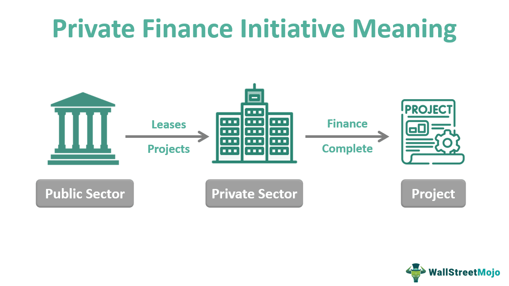

In this article, we explore the multifaceted concept of Main Street, highlighting its significance within local economies and drawing a comparison to Wall Street. Main Street serves as a term to describe small, independent businesses that form the backbone of local economies. These businesses include retail stores, cafes, service providers, and other enterprises that offer personalized services to their communities. Unlike the high finance arena typically associated with Wall Street, Main Street represents the traditional and everyday economic activities that support local job creation and economic stability.

Throughout this article, we analyze the various government programs designed to support Main Street businesses, which are crucial for revitalizing local economies and preserving their cultural heritage. Programs such as the Main Street Lending Program and initiatives under Main Street America provide essential financial assistance to ensure these businesses can thrive.



We also classify the types of Main Street businesses and discuss their impact on economic growth. These enterprises range from retail shops and restaurants to service-oriented businesses. Their involvement in community engagement and reflection of local cultural identity underscore their significance beyond mere economic contributions.

In contrast, Wall Street symbolizes large-scale financial markets and investments. While economic policies might sometimes prioritize Wall Street, leading to potential disadvantages for Main Street, both are essential for achieving balanced economic growth.

Additionally, this article examines algorithmic trading—an advanced trading strategy that automates trading decisions through computer algorithms. Typically associated with Wall Street, it increasingly becomes accessible to Main Street investors via various platforms. Familiarity with algorithmic trading can offer new avenues for delegating, optimizing, and diversifying investment strategies.

Finally, we consider opportunities for investing in Main Street businesses. The advent of peer-to-peer lending and crowdfunding platforms has made such investments more accessible, albeit with challenges like limited access to capital and competition from larger corporations.

Overall, Main Street remains vital to local economies by offering cultural, economic, and social benefits. Despite challenges from larger market players, support from government initiatives and local communities is essential for the sustainability of Main Street businesses. Understanding the dynamic between Main Street and Wall Street, along with incorporating innovative tools like algorithmic trading, can enhance strategic investment outcomes, ultimately benefiting both local and broader economic frameworks.

## Table of Contents

## What is Main Street?

Main Street is commonly used to represent the array of small, independent businesses that populate America's towns and cities. These businesses form the backbone of local economies, offering essential services and products while fostering a sense of community. Typical Main Street businesses include retail stores, cafes, restaurants, and various service providers, each contributing to the economic fabric of their localities.

Main Street serves as a symbol of the traditional, everyday economy, which contrasts starkly with the high finance and complex investment activities most commonly associated with Wall Street. Where Wall Street embodies global financial markets, large-scale investments, and corporate enterprises, Main Street epitomizes localized economic activity driven by independent entrepreneurship. This distinction highlights a divergence in economic scale and influence, with Main Street focused on organic growth, community partnerships, and direct consumer relationships. The significance of Main Street lies in its role in fueling economic activity on a more intimate, community-based level, often serving as the primary source of employment and economic development in smaller regions.

According to the Small Business Administration (SBA), small businesses accounted for 44% of U.S. economic activity in 2019, underscoring Main Street's vital contribution to the national economy. This economic segment is integral in job creation, responsible for two-thirds of new jobs, enhancing the importance of supporting Main Street enterprises amidst broader economic policies and trends. Therefore, understanding and supporting Main Street's unique contribution remains crucial to securing a balanced and sustainable economic future.

## Understanding Main Street Businesses

Main Street businesses encompass a diverse array of small enterprises that are known for providing personalized services tailored to their local customer base. These small enterprises typically include retail stores, cafes, restaurants, service-oriented businesses, and other niche markets that cater to the specific needs of their communities. One of the defining characteristics of Main Street businesses is their commitment to customer service and their ability to offer unique products and experiences that differ from those provided by larger corporations.

The role of Main Street businesses in local communities is fundamental to economic stability and job creation. They contribute significantly to local economies by generating employment opportunities and ensuring the circulation of money within their communities. According to a report by the U.S. Small Business Administration, small businesses created 12.9 million net new jobs over the last 25 years, accounting for roughly two-thirds of new job creation [1]. These businesses often employ local residents, which strengthens community ties and reduces unemployment rates.

Despite facing challenges from larger corporations, Main Street businesses maintain an essential cultural and economic presence. They contribute to the unique identity of their respective communities and are often involved in local events, sponsorships, and other community-based activities. This cultural significance is amplified by their role in preserving local traditions and fostering a sense of belonging among residents.

However, the sustainability and growth of Main Street businesses are often hindered by limited access to capital, competition from larger chains, and fluctuating market conditions. To remain competitive, many small business owners focus on distinguishing their offerings through high-quality service and unique products. The advent of technology also offers opportunities for Main Street businesses to expand their reach and efficiency through online sales platforms and digital marketing strategies.

In conclusion, Main Street businesses play a pivotal role in supporting local economies and enriching the cultural fabric of their communities. Their contribution to job creation and economic stability is substantial, underscoring the need for continued support from local governments and community members to ensure their ongoing success amid competitive pressures from larger corporate entities.

---

[1] U.S. Small Business Administration, Office of Advocacy, "Small Business GDP: Update 2002-2010," January 2022.

## Types of Main Street Businesses

Main Street businesses encompass a wide array of enterprises that are integral to the fabric of local economies. These businesses typically include retail shops, restaurants, cafes, and various service-oriented enterprises. A defining characteristic of Main Street businesses is their emphasis on personalized service and deep community engagement, often leading to a unique customer experience that larger, more impersonal businesses may struggle to provide.

Retail shops on Main Street often include local boutiques, specialty stores, and family-owned businesses that offer a curated selection of goods tailored to the preferences and needs of the local community. Restaurants and cafes on Main Street are frequently independently owned, serving menus that reflect local culinary traditions and preferences. These eateries not only serve as venues for dining but also as social hubs where community members gather.

Service-oriented businesses on Main Street, such as barber shops, salons, and repair shops, contribute significantly to the local economy by addressing the everyday needs of residents. These businesses thrive on repeat clientele and word-of-mouth referrals, fostering a strong community bond.

Main Street businesses often mirror the cultural identity of their locality, acting as custodians of local history and tradition. For example, in areas with a rich artistic heritage, Main Streets may feature galleries and artisan studios, highlighting regional crafts and art. This reflection of local culture makes Main Street a unique and vital part of any society, ensuring diversity and vibrancy in the commercial landscape.

In essence, Main Street represents an economic model centered around community values and cultural richness, providing not just goods and services, but also contributing to the social capital of the areas they serve.

## Main Street vs. Wall Street

Wall Street and Main Street represent two distinct facets of the American economy, each playing a critical role in the nation's financial landscape. Wall Street, synonymous with high finance, is characterized by large-scale financial markets and complex investment mechanisms. This financial district in New York City serves as a hub for major brokerages, investment banks, and stock exchanges, facilitating transactions that can influence global economies. Its operations include trading stocks, bonds, derivatives, and other financial instruments, making it a pivotal element in the international financial ecosystem.

In contrast, Main Street symbolizes the everyday economic activity found in local communities. It is associated with small businesses, such as retail stores, cafes, and service providers, which constitute the backbone of local economies. These businesses focus on providing goods and services to their immediate communities, fostering economic stability and employment at a grassroots level. Main Street emphasizes personalized service and community engagement, often reflecting the cultural identity and needs of its locality.

Economic policies often have varying impacts on Wall Street and Main Street. Policies tailored to benefit large financial markets can sometimes inadvertently disadvantage small businesses. For instance, during economic downturns, central banks may lower interest rates to stimulate investment in riskier assets like stocks, primarily benefiting Wall Street entities with significant equity investments. However, these policies might not directly address Main Street's needs, such as access to affordable credit or consumer demand. This divergence highlights the necessity for balanced economic policies that foster both financial sector growth and grassroots economic wellbeing.

Both Wall Street and Main Street are essential for holistic economic growth. Wall Street fuels investment and capital mobility, driving innovation and economic development on a large scale. It enables companies to raise capital through stock offerings and facilitates international trade and investment. Meanwhile, Main Street supports local entrepreneurship and innovation, contributing significantly to job creation and the distribution of wealth within communities.

A balanced approach that considers the symbiotic relationship between these two economic realms is vital. Policymakers must strive to ensure that financial market policies do not overshadow the needs of local economies. Supporting Main Street businesses through initiatives like tax incentives, subsidies, and access to credit can complement strategies aimed at bolstering financial markets, leading to sustainable and inclusive economic growth for all.

## Government Programs Supporting Main Street

Government programs play a pivotal role in supporting Main Street, the backbone of local economies composed of small businesses. These programs are designed to provide financial stability, promote entrepreneurship, and preserve the cultural and historical fabric of communities.

One significant initiative is the Main Street Lending Program, established by the Federal Reserve. This program was specifically designed to support small and medium-sized enterprises (SMEs) facing financial difficulties due to unforeseen economic downturns like the COVID-19 pandemic. By offering loans to eligible businesses, the Main Street Lending Program aims to maintain employment and sustain operations during challenging times. The program targets businesses too large for the Paycheck Protection Program (PPP) but too small to access traditional capital markets, providing a vital financial bridge for these Main Street entities.

Another key initiative is Main Street America, a nonprofit organization that works to revitalize historic commercial districts. This program leverages a four-point approach focusing on design, economic vitality, promotion, and organization to rebuild community-based businesses. By fostering local engagement and investment, Main Street America helps communities transform their economic landscapes while preserving their unique historical identities. This approach not only stimulates economic growth but also ensures community resilience and sustainability.

Furthermore, various state and local government initiatives complement these national programs by offering grants, tax incentives, and low-interest loans tailored to the specific needs of their communities. These localized efforts often concentrate on boosting entrepreneurship, supporting minority-owned businesses, and enhancing technological infrastructure to make Main Street businesses more competitive in a digital economy.

Collectively, these government programs are crucial for strengthening local economies. They provide the necessary resources for small businesses to adapt and thrive amidst changing economic conditions, ensuring that Main Street continues to be a vibrant and integral part of the national economy.

## Exploring Algorithmic Trading

Algorithmic trading, often referred to as algo trading, leverages computer algorithms to execute trading decisions with minimal human intervention. This technique employs pre-programmed instructions to assess market variables such as timing, price, and [volume](/wiki/volume-trading-strategy), facilitating rapid transactions that can capitalize on fleeting market opportunities.

Predominantly associated with Wall Street, [algorithmic trading](/wiki/algorithmic-trading) is integral to high-frequency trading ([HFT](/wiki/high-frequency-trading-strategies)) firms. These firms exploit price inefficiencies using algorithms designed to process substantial volumes of data in fractions of a second. Consequently, algo trading has reshaped financial markets by increasing [liquidity](/wiki/liquidity-risk-premium) and narrowing bid-ask spreads.

However, algorithmic trading is not solely the domain of Wall Street professionals; it is increasingly accessible to smaller investors, often referred to as Main Street investors. Online brokerage platforms have democratized access to algo trading by offering tools and educational resources. Retail investors can now utilize algorithmic strategies for personal investment portfolios, allowing for more efficient trade execution and risk management.

Understanding algorithmic trading can significantly enhance an investor's portfolio diversification. By automating trading decisions, investors can mitigate emotional biases that often affect trading performance. Algorithms can be customized to implement specific strategies, such as [momentum](/wiki/momentum) trading or mean reversion, tailored to an investor's risk profile and market outlook.

Moreover, the availability of open-source trading frameworks, such as QuantConnect or Zipline, provides Main Street investors with the means to develop, test, and deploy algorithms. The following is an example of a simple Python-based trading algorithm using QuantConnect:

```python
class SimpleMovingAverage(QCAlgorithm):
    def Initialize(self):
        self.SetStartDate(2020, 1, 1)
        self.SetEndDate(2023, 1, 1)
        self.SetCash(100000)

        self.equity = self.AddEquity("AAPL", Resolution.Daily).Symbol
        self.fast_sma = self.SMA(self.equity, 50, Resolution.Daily)
        self.slow_sma = self.SMA(self.equity, 200, Resolution.Daily)

    def OnData(self, data):
        if not self.fast_sma.IsReady or not self.slow_sma.IsReady:
            return

        if self.fast_sma.Current.Value > self.slow_sma.Current.Value:
            self.SetHoldings(self.equity, 1.0)
        elif self.fast_sma.Current.Value < self.slow_sma.Current.Value:
            self.Liquidate(self.equity)
```

This code represents a basic moving average crossover strategy where the algorithm buys Apple Inc. (AAPL) stock when its 50-day moving average crosses above the 200-day moving average and sells when the opposite occurs.

Overall, while algo trading introduces the risk of technical glitches and market [volatility](/wiki/volatility-trading-strategies)—especially during flash crashes—it remains a valuable tool. By incorporating algorithmic trading into their strategies, investors can potentially enhance returns, reduce transaction costs, and achieve greater market insight.

## Investing in Main Street

Investing in Main Street businesses presents a unique opportunity for individuals looking to support local economies while potentially [earning](/wiki/earning-announcement) significant returns. Main Street, encompassing small and independent businesses, forms the backbone of many communities by fostering economic growth, innovation, and cultural identity. As traditional forms of investment often favor larger corporations, several modern avenues have emerged that allow investors to channel their funds into Main Street enterprises effectively.

One of the most influential developments in this area is the rise of peer-to-peer lending platforms. By connecting individual investors with small businesses seeking capital, these platforms eliminate the need for traditional banking intermediaries, thereby reducing financing costs. Investors on these platforms can directly fund businesses and, in return, receive interest on their investments. This model not only provides businesses with much-needed capital but also offers investors the potential for better yields compared to conventional savings accounts or bonds.

Crowdfunding platforms also significantly enhance accessibility to Main Street investments. Websites like Kickstarter or Indiegogo allow businesses to raise funds for specific projects by appealing directly to potential supporters. Investors can back businesses in exchange for early access to products, equity stakes, or other rewards. This democratization of investment has enabled individuals to support enterprises aligned with their values and interests while enabling businesses to reach a broader and potentially global audience.

Despite these advances, investing in Main Street is not without its challenges. One significant hurdle is the limited access to capital that many small businesses face, derived mainly from stringent lending criteria and the high risk perceived by traditional financial institutions. This scarcity of funds can hinder business growth, making platforms that offer alternative financing vital for sustaining Main Street businesses.

Furthermore, competition from larger, more established corporations presents an ongoing challenge. These companies often benefit from economies of scale, allowing them to offer lower prices and greater marketing reach. Main Street businesses typically rely on personalized service, niche markets, and community support to remain competitive. Therefore, investors must consider these risks and the potential for returns when deciding to invest in Main Street businesses.

In conclusion, investing in Main Street businesses is increasingly accessible through platforms like peer-to-peer lending and crowdfunding. These channels provide crucial support to small enterprises while offering investors a means to diversify their portfolios. Although challenges such as limited capital access and competition persist, well-strategized investments can lead to economic benefits and contribute significantly to the vibrancy of local communities.

## Conclusion

Main Street plays an essential role in bolstering local economies by providing cultural, economic, and social benefits. These small, independent businesses serve as community pillars, fostering personal connections and supporting cultural identity. Nonetheless, Main Street faces significant challenges from larger corporations which often have greater resources and market influence. The competitive pressure necessitates robust support from government programs and local communities, which are vital for ensuring the survival and prosperity of Main Street enterprises.

Governmental initiatives like the Main Street Lending Program and local revitalization efforts such as Main Street America have been instrumental in providing financial aid and preserving the historical significance of these economic hubs. These programs aim not only to maintain but also to bolster the economic frameworks within localities, thereby enhancing overall community resilience.

The dynamic between Main Street and Wall Street demonstrates the necessity for a balanced economic approach. Wall Street, representing high finance and large-scale investment, often operates in contrast with the smaller-scale, community-driven focus of Main Street. However, both are integral to achieving comprehensive economic growth. Understanding this interplay is crucial for policymakers and investors alike, to ensure policies are crafted that sustain both spheres.

Moreover, integrating modern investment tools like algorithmic trading can significantly enhance investment strategies for those involved with both Main Street and Wall Street. Algorithmic trading, which employs complex algorithms to make trading decisions, has traditionally been associated with Wall Street. Yet, with advancements in technology and accessibility, Main Street investors are also beginning to utilize these sophisticated tools to diversify and optimize their investment portfolios.

In conclusion, Main Street’s significance extends beyond simple economic contributions; it embodies the cultural and social fabric of communities across the nation. Its survival amid growing competition requires enduring support from both government initiatives and community stakeholders. By effectively leveraging the synergies between Main Street and Wall Street, and employing innovative trading tools, investors can craft viable strategies that bolster both local economies and their investment portfolios.

## References & Further Reading

[1]: U.S. Small Business Administration, Office of Advocacy, "Small Business GDP: Update 2002-2010," January 2022. Available at: [U.S. Small Business Administration](https://advocacy.sba.gov/wp-content/uploads/2019/05/Small-Business-GDP-Update-2002-2010-Research-Summary.pdf)

[2]: ["Advances in Financial Machine Learning"](https://www.amazon.com/Advances-Financial-Machine-Learning-Marcos/dp/1119482089) by Marcos Lopez de Prado

[3]: ["Machine Learning for Algorithmic Trading"](https://github.com/stefan-jansen/machine-learning-for-trading) by Stefan Jansen

[4]: Federal Reserve, "Main Street Lending Program," available at: [Federal Reserve Main Street Lending](https://www.federalreserve.gov/monetarypolicy/mainstreetlending.htm)

[5]: Main Street America, available at: [Main Street America](https://mainstreet.org/the-latest/news/registration-now-open-main-street-now-2025)