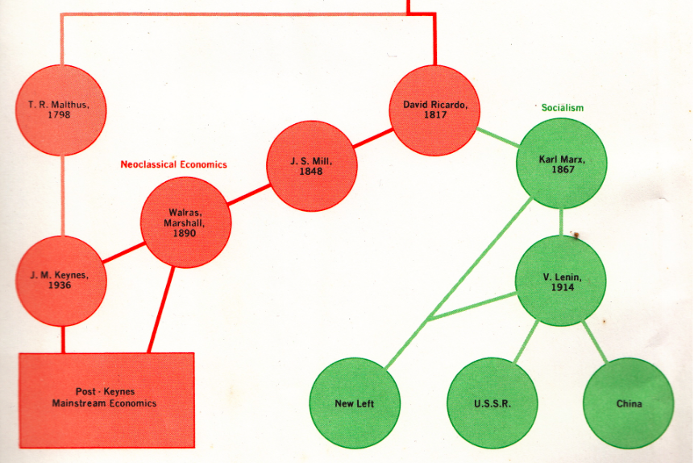

## Table of Contents

## What is mainstream economics?

Mainstream economics is the type of economics that most economists learn and use. It includes ideas and theories that are widely accepted and taught in universities. These ideas help economists understand how the economy works, how people make choices about buying things, and how businesses decide what to produce. Mainstream economics often focuses on things like supply and demand, how markets work, and how prices are set.

One important part of mainstream economics is the use of mathematical models. These models help economists predict what might happen in the economy. For example, they can predict how changes in interest rates might affect how much people spend. Mainstream economics also looks at big economic issues like unemployment, inflation, and economic growth. It tries to find ways to make the economy work better for everyone.

## What are the key principles of mainstream economics?

Mainstream economics is built on a few key ideas that help us understand how the economy works. One big idea is supply and demand. This means that the price of something is decided by how much people want it and how much of it is available. If lots of people want a product and there isn't much of it, the price goes up. If there's a lot of a product and not many people want it, the price goes down. Another important idea is that people make choices based on what they think will make them the happiest or most satisfied. This is called rational behavior. Economists believe that people usually try to get the most out of what they have, whether it's money, time, or other resources.

Another key principle is the use of markets to organize economic activity. Mainstream economics believes that markets, where buyers and sellers come together, are the best way to decide what gets produced, how much, and at what price. This idea is called the market mechanism. Economists also focus on how the economy grows over time. They look at things like how much people are working, how much businesses are investing, and how new technology can help make the economy bigger. This growth is important because it can lead to more jobs and higher living standards for everyone.

Lastly, mainstream economics uses a lot of math to understand and predict economic behavior. Economists build models that help them see what might happen if something in the economy changes, like if the government raises taxes or if there's a new technology. These models help economists give advice to businesses and governments about how to make the economy work better. Overall, mainstream economics tries to explain how the economy works and how to make it better for everyone.

## How does mainstream economics differ from other economic schools of thought?

Mainstream economics is different from other schools of thought because it focuses a lot on using math and models to understand the economy. It believes that people make choices based on what will make them the happiest, and that markets are the best way to organize economic activity. Mainstream economists think that by studying supply and demand, and how prices work, we can predict what will happen in the economy. They also look at big issues like unemployment and inflation, and try to find ways to make the economy grow and work better for everyone.

Other schools of thought, like Keynesian economics, focus more on the role of the government in the economy. Keynesians believe that the government should step in to help when the economy is not doing well, like during a recession. They think that government spending can help boost the economy and create jobs. Another school of thought, called Austrian economics, believes that the market should be left alone as much as possible. Austrian economists think that government interference can cause more problems than it solves, and that the market will fix itself if left alone. They also focus a lot on how people make choices and how those choices affect the economy.

Marxist economics is another different approach. It focuses on how the economy is divided between different groups of people, like workers and owners. Marxists believe that the economy is not fair because workers do not get a fair share of what they produce. They think that big changes, like changing who owns businesses, are needed to make the economy work better for everyone. Each of these schools of thought has its own way of looking at the economy and what should be done to make it better, which is different from the mainstream approach.

## What are the most common models used in mainstream economics?

Mainstream economics uses several common models to help understand how the economy works. One of the most used models is the supply and demand model. This model shows how the price of something is decided by how much people want it and how much of it is available. If a lot of people want something and there's not much of it, the price goes up. If there's a lot of something and not many people want it, the price goes down. This model helps economists predict what will happen to prices and how much of something will be bought and sold.

Another important model is the aggregate demand and aggregate supply model. This model looks at the whole economy and helps economists understand things like inflation and unemployment. Aggregate demand is all the spending in the economy, and aggregate supply is all the goods and services produced. When these two are balanced, the economy is doing well. But if aggregate demand is too low, there can be a recession with high unemployment. If aggregate demand is too high, it can cause inflation. This model helps economists figure out how to keep the economy stable and growing.

A third model often used is the production possibilities frontier. This model shows the different combinations of goods and services that an economy can produce given its resources and technology. It helps economists understand the trade-offs that come with producing more of one thing and less of another. For example, if a country decides to produce more cars, it might have to produce fewer computers. This model helps in making decisions about how to use resources in the best way to meet the needs of the economy.

## Can you explain the role of supply and demand in mainstream economics?

In mainstream economics, supply and demand is a key idea that helps explain how prices are set and how much of something gets bought and sold. Supply is how much of a product or service is available, while demand is how much people want that product or service. When there's a lot of something but not many people want it, the price goes down because sellers have to lower the price to sell it. On the other hand, if a lot of people want something but there's not much of it, the price goes up because sellers can charge more.

This model of supply and demand helps economists predict what will happen in the market. For example, if a new technology makes it cheaper to produce cars, the supply of cars will go up. If the demand stays the same, the price of cars will go down. Or, if a new study comes out saying that eating apples is really good for your health, the demand for apples might go up. If the supply stays the same, the price of apples will go up. By understanding these changes, economists can give advice to businesses and governments about how to make the economy work better for everyone.

## What are the criticisms of mainstream economics from heterodox economists?

Heterodox economists, who have different ideas about how the economy works, often criticize mainstream economics for being too focused on math and models. They say that these models don't always show what's really happening in the economy because they make too many assumptions. For example, mainstream economics often assumes that people always make choices that will make them the happiest, but heterodox economists say that's not always true. People might make choices based on habits, emotions, or other things that models don't take into account.

Another big criticism is that mainstream economics pays too much attention to markets and not enough to other important parts of the economy, like how power and money are divided among different groups of people. Heterodox economists think that the economy is not just about supply and demand, but also about who has the power to make decisions and how fair the economy is. They believe that mainstream economics doesn't do a good job of looking at these issues and can miss important problems like inequality and how the economy affects different groups of people in different ways.

## How has mainstream economics evolved over the past century?

Over the past century, mainstream economics has changed a lot. It started with ideas from people like John Maynard Keynes in the early 1900s. Keynes thought that the government should help the economy when it's not doing well, like during a recession. His ideas became really important during the Great Depression and World War II. After that, economists started using more math and models to understand the economy. They began to focus a lot on how people make choices and how markets work. This led to the development of new theories like the neoclassical synthesis, which mixed Keynes' ideas with older ideas about markets.

In the latter half of the 20th century, mainstream economics kept evolving. In the 1970s and 1980s, new ideas like rational expectations and monetarism became popular. These ideas said that people think about the future when they make choices, and that the amount of money in the economy is really important. Later, in the 1990s and 2000s, behavioral economics started to become a big part of mainstream economics. This field looks at how people actually make choices, which might not always be the best or most rational. Today, mainstream economics still uses a lot of math and models, but it also tries to understand more about how people really behave and how to make the economy work better for everyone.

## What role do assumptions play in mainstream economic models?

Assumptions are really important in mainstream economic models. They help economists simplify the world so they can understand it better. For example, economists often assume that people always make choices to be as happy as possible. This makes it easier to predict what people will do, but it's not always true in real life. People might make choices based on habits or feelings instead. Another common assumption is that markets work perfectly. This means that everyone knows everything they need to know, and there are no problems like too much power in one place. This helps economists build models, but it doesn't always match what happens in the real world.

Even though assumptions can make models less accurate, they are still useful. They let economists focus on the big ideas and see how things might change if something in the economy shifts. For example, if the government changes taxes, economists can use models to predict what might happen to prices and jobs. Without assumptions, it would be hard to make these predictions. But it's important for economists to remember that the real world is more complicated than their models. They need to check their predictions against real data and be ready to change their models if they're wrong.

## How do mainstream economists address issues like inequality and environmental sustainability?

Mainstream economists have started to pay more attention to issues like inequality and environmental sustainability in recent years. For inequality, they look at how income and wealth are spread out among people. They use models to see how things like taxes, education, and jobs can help make the economy fairer. Some mainstream economists suggest that the government should do more to help people who are not doing well, like giving them money or better education. They also study how globalization and technology can make inequality worse and try to find ways to fix it.

When it comes to environmental sustainability, mainstream economists think about how the economy can grow without hurting the planet. They use something called "environmental economics" to look at how pollution and using up resources affect the economy. They suggest ideas like putting a price on pollution, so companies have to pay if they pollute a lot. This can help make the air and water cleaner. Mainstream economists also study how to use energy and resources in a smarter way, so the economy can keep growing but in a way that's good for the environment too.

## What are the empirical methods used in mainstream economics to test theories?

Mainstream economists use different ways to test their ideas about the economy. One common way is to look at data from the past. They collect information about things like how much people spend, how many people have jobs, and what prices are doing. Then, they use this data to see if their theories are right. For example, if they think that raising taxes will make people spend less, they can check old data to see if that happened before. This helps them know if their ideas are good or if they need to change them.

Another way economists test their theories is by doing experiments. Sometimes, they can set up experiments where they change one thing and see what happens. For example, they might give some people money and see if it changes how much they spend. Other times, they use natural experiments, which are things that happen in the world without anyone planning them. For example, if a new law changes taxes in one place but not another, economists can compare what happens in both places to see if their theories are right. These experiments help economists learn more about how the economy works and make their ideas better.

## How do mainstream economic policies influence government decision-making?

Mainstream economic policies help governments make decisions by giving them ideas about how to make the economy work better. Economists use models and data to suggest things like how much the government should spend, what taxes should be, and how to help people who are not doing well. For example, if the economy is not growing and people are losing jobs, mainstream economists might suggest that the government should spend more money to create jobs and help the economy grow again. They might also suggest changing taxes to make sure everyone pays their fair share and to help reduce inequality.

Governments often listen to these suggestions because they want to make good decisions for their country. Mainstream economic policies can help governments understand big issues like inflation, unemployment, and how to keep the economy growing. For example, if prices are going up too fast, economists might suggest that the government should raise interest rates to slow down spending and bring prices back down. By using these ideas, governments can try to make the economy work better for everyone and solve problems as they come up.

## What are the future challenges and potential reforms suggested for mainstream economics?

Mainstream economics faces some big challenges in the future. One challenge is dealing with new technologies like [artificial intelligence](/wiki/ai-artificial-intelligence) and how they change the economy. Economists need to understand how these technologies affect jobs and growth. Another challenge is climate change. The economy needs to grow in a way that doesn't hurt the planet, and economists need to find ways to make that happen. Inequality is also a big issue. The gap between rich and poor is growing, and mainstream economics needs to find better ways to make the economy fairer for everyone.

To meet these challenges, some economists suggest reforms. They think mainstream economics should pay more attention to real-world problems like inequality and the environment. They want economists to use more data and real-life examples, not just math and models. Some also suggest that mainstream economics should work with other fields like sociology and psychology to understand how people really behave. By making these changes, mainstream economics can become better at helping governments and businesses make the economy work for everyone.

## References & Further Reading

[1]: Kahneman, D. (2011). ["Thinking, Fast and Slow."](https://link.springer.com/article/10.1007/s00362-013-0533-y) Farrar, Straus and Giroux.

[2]: Tversky, A., & Kahneman, D. (1974). ["Judgment Under Uncertainty: Heuristics and Biases."](https://www2.psych.ubc.ca/~schaller/Psyc590Readings/TverskyKahneman1974.pdf) Science, 185(4157), 1124-1131.

[3]: McCauley, J. L. (2004). ["Dynamics of Markets: Econophysics and Finance."](https://assets.cambridge.org/97805210/36283/frontmatter/9780521036283_frontmatter.pdf) Cambridge University Press.

[4]: Shiller, R. J. (2015). ["Irrational Exuberance."](https://link.springer.com/article/10.1007/s00712-015-0462-4) Princeton University Press.

[5]: Lopez de Prado, M. (2018). ["Advances in Financial Machine Learning."](https://www.amazon.com/Advances-Financial-Machine-Learning-Marcos/dp/1119482089) Wiley.

[6]: U.S. Securities and Exchange Commission (SEC). (2010). ["Findings Regarding the Market Events of May 6, 2010."](https://www.sec.gov/news/studies/2010/marketevents-report.pdf)