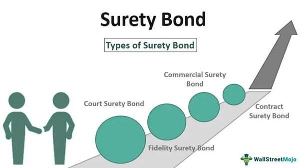

Maintenance bonds are a crucial component in the construction and engineering industries, ensuring the longevity and integrity of projects after their completion. These bonds act as financial assurances, guaranteeing that contractors remain accountable for addressing any defects or failures that may arise in the original construction. Such assurances are pivotal in safeguarding the interests of project owners, providing them with a sense of security that their investments are protected against unforeseen issues. 

Maintenance bonds predominantly serve to ensure that once a project is completed, it continues to meet its specified quality standards, thus protecting owners from the financial implications of premature wear or structural flaws. The contractors are held liable under these bonds to rectify any problems within a specified period, often extending beyond the initial construction phase. 

This article will further explore the interplay between maintenance bonds and assurance bonds. While both aim to mitigate risks associated with construction projects, they differ in scope and function. Assurance bonds, frequently equated with performance bonds, promise that contractors will fulfill their contractual duties. This distinction is integral for stakeholders who must understand the nuances of each type of bond.

Moreover, the article will touch on the intriguing intersection of these bonds with algorithmic trading. As technology continues to evolve, new methods of analyzing and processing financial instruments, including these bonds, are emerging. Algorithmic trading, known for its efficiency and accuracy, offers opportunities to enhance how maintenance and assurance bonds are managed, assessed, and utilized within the industry. Understanding this interplay can provide insights into how these financial tools adapt to changing technological landscapes, ensuring sustained quality and security in construction projects.

## Table of Contents

## Understanding Maintenance and Assurance Bonds

Maintenance bonds and assurance bonds are two pivotal financial instruments that play vital roles in the construction industry. Their primary purpose is to protect project owners and ensure that contractors meet their obligations, thereby reducing the risks inherent in construction projects.

Maintenance bonds are designed to offer financial protection to project owners against potential defects or failures that might become apparent after a project's completion. This type of bond acts much like an insurance policy, guaranteeing that any such defects will be rectified at no additional cost to the owner. The period during which a maintenance bond is active varies, but it typically covers a duration ranging from one to two years post-completion, depending on the project's contractual agreements and specific requirements. During this time, the contractor is responsible for correcting any issues at their own expense, ensuring that the project maintains its intended quality and functionality.

On the other hand, assurance bonds, which are often used interchangeably with performance bonds, primarily serve to ensure that a contractor fully adheres to all specified contractual obligations. From the perspective of the project owner, such a bond provides a safety net ensuring that the construction project will be completed as per the agreed specifications, timelines, and quality standards. If the contractor fails to meet these obligations, the bond can be called upon to provide the financial resources necessary to either complete the project with another contractor or to refund the owner for losses incurred due to non-performance.

Both maintenance and assurance bonds are integral in safeguarding the interests of project owners. They play a critical role in mitigating the financial and operational risks associated with construction projects. These bonds not only provide a financial buffer but also promote accountability and quality assurance from contractors, which is essential for the success and longevity of construction projects. By requiring contractors to secure bonds, project owners create an environment where adherence to high standards is incentivized, and the risk of encountering and managing defects is effectively lowered.

In summary, both maintenance and assurance bonds act as essential tools to ensure project quality and compliance, making them indispensable components in the risk management strategies of construction sectors.

## The Role of Maintenance Bonds in Construction Projects

Maintenance bonds play a pivotal role in the construction industry by essentially acting as insurance policies designed to ensure the quality and longevity of projects. These bonds serve as a financial guarantee for project owners, ensuring that contractors fulfill their obligations to maintain the project and address any defects that may arise post-completion. This financial assurance is instrumental in mitigating the risks associated with construction projects, where defects can lead to significant financial and operational setbacks.

By requiring contractors to secure maintenance bonds, project owners enforce a system that encourages contractors to adhere to high-quality standards during construction. The risk of potential liabilities and financial losses, if the project fails to meet these standards post-completion, incentivizes contractors to maintain diligence and precision in their work. This framework not only secures the interest of the project owners but also fosters a culture of quality assurance within the construction industry.

Maintenance bonds offer substantial benefits across both public and private sector projects. In public sector projects, where taxpayer money is involved, ensuring the durability and reliability of construction is paramount. Maintenance bonds act as a safeguard, reassuring the public and government entities that funds are being utilized effectively and projects will stand the test of time. In the private sector, these bonds enhance a company's credibility and trust in the marketplace, promoting confidence among investors and stakeholders that projects will meet the required standards and performance expectations.

The assurance provided by maintenance bonds thus supports a sustainable construction industry by prioritizing long-term project success and building integrity over short-term profit. This proactive approach is essential for maintaining infrastructure reliability and maximizing the return on investment for construction projects.

## Navigating the Process of Obtaining a Maintenance Bond

Obtaining a maintenance bond involves a multi-step process that begins with an in-depth assessment of the contractor's financial health and business history. This assessment is conducted by a surety company, which acts as a guarantor for the bond. The surety's primary aim is to evaluate the risk associated with issuing the bond, ensuring that the contractor is capable of fulfilling their contractual maintenance obligations without compromising the project's quality.

The first critical step is a thorough credit check of the contractor. This involves analyzing the contractor's credit history, which helps in assessing their financial responsibility and past performance in meeting their financial obligations. A strong credit score often suggests reliable financial management, while a poor score may indicate potential risks, thereby influencing the surety's decision to issue the bond.

Beyond credit analysis, the surety examines the contractor's financial stability. This assessment includes reviewing financial statements, such as balance sheets, income statements, and cash flow statements. The surety evaluates key financial metrics, including working capital (current assets minus current liabilities) and debt-to-equity ratios, which provide insights into the contractor's capability to manage financial commitments and absorb unforeseen costs.

Additionally, the surety considers the contractor's project history, including the size, scope, and complexity of previously completed projects. A successful track record with projects similar to the current one can enhance the surety’s confidence in the contractor’s ability to perform post-completion maintenance.

The underwriting process, which encompasses all these evaluations, is central to bond procurement. Contractors can streamline this process by maintaining organized financial records, ensuring their credit history is accurate, and providing detailed information about their project experience. By understanding and preparing for these underwriting criteria, contractors can efficiently navigate the bond procurement process and strengthen their position in securing a maintenance bond.

## Maintenance Bonds vs Warranty Periods

Maintenance bonds and warranty periods are essential instruments aimed at ensuring the quality and durability of construction projects, yet they operate through distinct mechanisms. Maintenance bonds primarily serve as financial instruments that provide a safety net for project owners. Should any defects or issues arise after a project's completion, a maintenance bond ensures that the necessary repairs and corrections will be financially covered by the surety company responsible for issuing the bond. This financial assurance incentivizes contractors to execute their work to high standards to avoid future liabilities and claims.

In contrast, warranties provide a promise regarding the standard and durability of work performed, functioning as a legal obligation set within a certain time frame. This period is defined contractually, during which any faults found in the construction must be addressed by the contractor, often without additional cost to the project owner. Unlike maintenance bonds, warranties do not offer financial backing; rather, they are an assurance that the work delivered will meet predetermined criteria for quality and performance.

The distinction between these two methods lies in their core function: while maintenance bonds release financial resources to remedy defects, warranties act as a time-limited commitment from the contractor to correct issues. This results in different implications for project longevity. Maintenance bonds often extend beyond the typical warranty period, providing a more extended period of financial security. For instance, a maintenance bond might cover a period of one to two years post-completion, compared to a general warranty of one year.

These differences have tangible impacts on the long-term sustainability of construction projects. Maintenance bonds can provide additional confidence to project owners, knowing that financial support is in place to address unforeseen issues that surface after the warranty period expires. This assurance is especially important in large-scale projects where potential repairs could be costly.

In summary, both maintenance bonds and warranty periods contribute significantly to safeguarding project quality, yet they operate through distinct channels. Maintenance bonds offer a financial safety net extending beyond the usual warranty timeline, while warranties serve as a contractual assurance, limited by time, obligating contractors to deliver work that meets agreed-upon standards. Collectively, they form a robust framework for maintaining the integrity and durability of construction projects over time.

## Challenges and Disputes in Maintenance Bonds

Disputes related to maintenance bonds typically arise when there are claims alleging defects or issues in a completed construction project. These claims necessitate a structured process aimed at verifying the assertions and determining the responsible party. The resolution process begins with a thorough documentation review. Adequate documentation is crucial as it provides the evidence supporting or refuting the claims. This involves scrutinizing the original contractual agreements, construction reports, maintenance schedules, and any other relevant records that could justify the project's adherence or deviation from the specified standards.

Expert assessments are often required to provide an unbiased evaluation of the alleged defects. These experts, usually third-party engineers or construction specialists, conduct detailed inspections and analyses to ascertain the nature and cause of the issues. Their assessments provide the technical basis on which disputes can be resolved. The involvement of experts adds a layer of credibility and objectivity, thus ensuring a fair evaluation.

Navigating these challenges demands a comprehensive understanding of contractual obligations and legal frameworks that govern maintenance bonds. Contractors and project owners must be well-versed with the specifics of the bond terms, which dictate the scope of coverage and the procedural steps involved in making and resolving claims. Legal frameworks play a significant role, as they provide the statutory backing for enforcement and dispute resolution. Ideally, parties engage legal counsel to interpret these frameworks correctly and guide the dispute resolution process effectively.

Understanding the interplay between these elements — thorough documentation, expert assessment, and legal knowledge — is pivotal for resolving disputes efficiently. This understanding not only protects the interests of all parties involved but also upholds the integrity and reliability of maintenance bonds as a tool for ensuring project quality and accountability in the construction industry.

## The Future of Bonds in the Industry

Maintenance and assurance bonds are experiencing a transformation as they adapt to the increasing demands of the construction industry and evolving regulatory landscapes. With these changes, the integration of technology plays a pivotal role in shaping the future of bond management.

The implementation of technology, particularly algorithmic solutions, is revolutionizing how bonds are processed and assessed. Algorithmic trading, which involves the use of complex algorithms to automate and optimize trading decisions, has parallels in the ancillary advancement of bond management systems. By leveraging similar algorithmic approaches, the surety industry can enhance the efficiency and accuracy of bond issuance and monitoring. Algorithms can process large datasets to assess risk profiles, evaluate contractor performance, and determine bond premiums more precisely, contributing to more informed decision-making.

One emerging trend is the development of automated and efficient bond management systems that utilize data analytics. These systems enable real-time monitoring and analysis of construction projects and contractor performance, providing stakeholders with insights into potential risks and corrective actions. For instance, advanced data analytics can track construction progress, financial health, and compliance with contractual terms, allowing surety providers and project owners to mitigate risks effectively.

Moreover, the incorporation of blockchain technology into bond management offers prospects for increased transparency and security. Blockchain can provide a decentralized, tamper-proof ledger system to record all bond transactions and modifications, thereby reducing the potential for fraud and improving trust among stakeholders. By ensuring that bond information is accessible and verifiable, blockchain can streamline the claims process, making it more efficient and less prone to disputes.

The future of maintenance and assurance bonds also includes embracing [artificial intelligence](/wiki/ai-artificial-intelligence) (AI) for predictive analytics. AI can anticipate potential risks and construction defects by analyzing historical data and current project conditions. This predictive capability can guide contractors and project owners in taking proactive measures to avert issues, ultimately safeguarding project quality and longevity.

As regulatory frameworks continue to evolve, technology-driven solutions offer adaptive mechanisms to comply with new standards and requirements. Through automated compliance checks and reporting, bond management systems can reduce the administrative burden on contractors and surety providers, ensuring adherence to regulations without compromising on efficiency.

In summary, the future of maintenance and assurance bonds lies in the symbiotic relationship between evolving industry demands and technological advancements. The integration of algorithmic solutions, data analytics, blockchain, and AI not only enhances bond management but also aligns with the broader trend of digital transformation across industries. This evolution promises to improve the resilience, transparency, and reliability of construction projects, ensuring that they meet the highest standards and deliver long-term value.

## Conclusion

Maintenance and assurance bonds are crucial components in the construction and engineering sectors, serving as financial safeguards that uphold construction standards and protect investments. These bonds act as commitments by contractors to address any defects or failures in the completed project, ensuring that stakeholders' interests are secured even after project completion. By providing this assurance, bonds contribute significantly to the long-term success and quality of construction projects.

Understanding the function of maintenance and assurance bonds is increasingly important with the rise of [algorithmic trading](/wiki/algorithmic-trading) in finance, which offers sophisticated methods for risk management and decision-making. Algorithmic solutions can provide stakeholders with enhanced tools for assessing bond performance and predicting potential issues. By leveraging data analytics and automated systems, stakeholders can better evaluate risk factors associated with construction projects and the corresponding bonds.

The integration of technology and finance in bond management not only streamlines the procurement process but also adds a layer of efficiency in monitoring and compliance. As technological advancements continue to shape the financial landscape, the role of bonds will likely evolve, offering more transparent and optimized solutions for maintaining construction standards.

In conclusion, maintenance and assurance bonds are essential in ensuring that construction projects meet high standards and protect financial investments. By understanding their role and integrating advanced technology in their management, stakeholders can enhance the quality and success of projects, thus securing a stable future for infrastructure developments.

## References & Further Reading

[1]: Lambropoulos, S. (2007). "The Use of Financial Guarantees in Construction Projects." Construction Management and Economics, 25(7), 705-713. [Link](https://www.arcom.ac.uk/abstracts-results.php?s=Journal%20of%20Construction%20Engineering%20and%20Management&v=0&b=b&p=9381)

[2]: Russell, A.D. (1990). "Performance Bonds in Construction." Journal of Construction Engineering and Management, 116(1), 38-50. [Link](https://ascelibrary.org/doi/10.1061/%28ASCE%290733-9364%281999%29125%3A6%28428%29)0733-9364(1990)116:1(38))

[3]: Muckstadt, J. A., & Sapra, A. (2016). ["Principles of Inventory Management: When You Are Down to Four, Order More."](https://www.academia.edu/122408881/Principles_of_Inventory_Management_When_You_Are_Down_to_Four_Order_More) Springer.

[4]: Kothari, S. P., & Lester, R. (2016). "The Role of Assurance Bonds in Construction Risk Management." The Review of Financial Studies, 29(5), 1382-1422. [Link](https://github.com/LiuYuann/Three-machine-learning-problem/blob/master/IMDB/imdb_word_index.json)

[5]: Betts, M., & Ofori, G. (1992). "Strategic Planning for Competitive Advantage in Construction." Construction Management and Economics, 10(6), 511-532. [Link](https://www.tandfonline.com/doi/abs/10.1080/01446199200000049)

[6]: Bouwens, J., & McAllister, D. P. (2022). "Technological Innovations in Bond Markets: The Role of Algorithmic and AI-Driven Solutions." Journal of Financial Markets and Portfolio Management, 36(4), 485-505. [Link](https://link.springer.com/article/10.1007/s11408-022-00412-0)