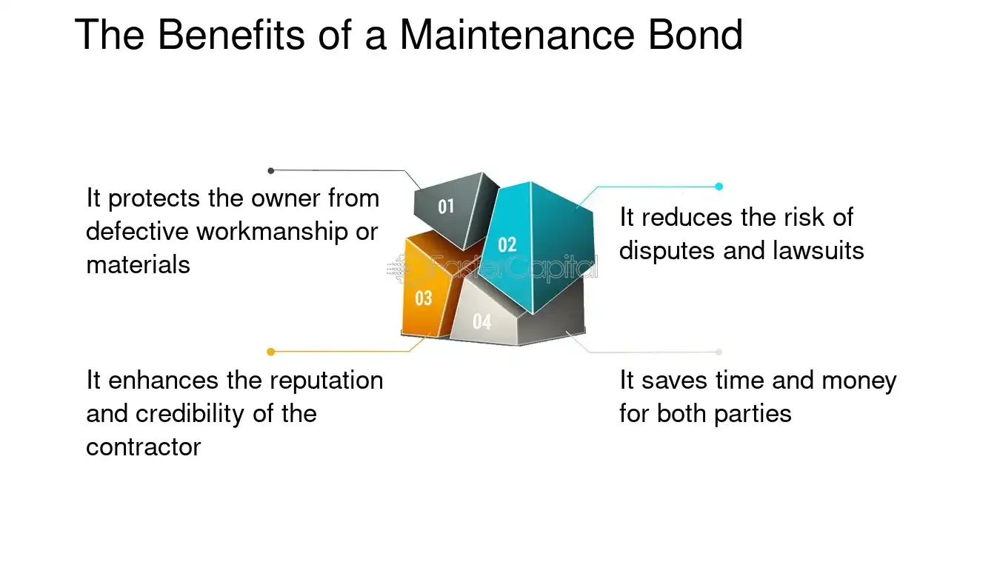

## Table of Contents

## What is a maintenance bond?

A maintenance bond is a type of surety bond that guarantees the upkeep and repair of a project after it's finished. It's often used in construction projects to make sure that the contractor will fix any problems that come up within a certain time after the project is done. This bond gives the project owner peace of mind, knowing that if something goes wrong, the contractor is responsible for making it right.

For example, if a new road is built and potholes appear a few months later, the maintenance bond would cover the cost of fixing them. The bond is usually in place for a set period, like one or two years, depending on the agreement. This way, the project owner is protected from having to pay for repairs out of their own pocket if the contractor doesn't fix the issues.

## How does a maintenance bond function?

A maintenance bond works like a promise. When a project, like building a road or a building, is finished, the contractor gets a maintenance bond. This bond says that if anything goes wrong with the project after it's done, the contractor will fix it. The bond is like insurance for the person who paid for the project. It makes sure they don't have to pay more money if something breaks or needs fixing soon after the project is complete.

The bond lasts for a certain time, usually one or two years. During this time, if there are any problems, the contractor has to fix them. If the contractor doesn't fix the problems, the person who paid for the project can use the bond to get the money to fix it themselves. This way, everyone feels safe knowing that the project will stay in good shape for a while after it's finished.

## What is the purpose of a maintenance bond?

The purpose of a maintenance bond is to make sure that a project stays in good shape after it's finished. When a contractor builds something, like a road or a building, they promise to fix any problems that show up soon after the project is done. This bond helps the person who paid for the project feel safe because they know that if something goes wrong, the contractor will take care of it.

The maintenance bond works like a safety net. It lasts for a set time, often one or two years, and during this time, the contractor is responsible for any repairs needed. If the contractor doesn't fix the issues, the person who paid for the project can use the bond to get the money to fix it themselves. This way, everyone is protected and the project stays in good condition for a while after it's completed.

## Who typically requires a maintenance bond?

Usually, the person or group that pays for a project asks for a maintenance bond. This could be a government, a business, or someone building their own home. They want to make sure that if something goes wrong with the project after it's finished, the contractor will fix it without them having to pay more money.

For example, if a city builds a new road, they might ask the construction company to get a maintenance bond. This way, if potholes appear a few months later, the city can use the bond to make the contractor fix them. It's a way to keep the project in good shape and protect the people who paid for it.

## How is a maintenance bond different from a performance bond?

A maintenance bond and a performance bond are both types of surety bonds, but they serve different purposes. A performance bond is used during the construction phase of a project. It makes sure that the contractor finishes the project on time and according to the agreed plans. If the contractor fails to do this, the person who paid for the project can use the performance bond to hire someone else to finish the job.

On the other hand, a maintenance bond comes into play after the project is finished. It guarantees that the contractor will fix any problems that come up within a certain time after the project is done. For example, if a new building has issues with the roof a few months later, the maintenance bond would cover the cost of fixing it. So, while a performance bond focuses on getting the project done right, a maintenance bond focuses on keeping it in good shape after it's finished.

## What are the key components of a maintenance bond?

A maintenance bond has a few important parts that make it work. The first part is the bond amount, which is the money that the bond covers. This amount is decided based on how big the project is and how long the bond will last. The second part is the duration of the bond, which is usually one or two years after the project is finished. This time period is when the contractor has to fix any problems that come up.

The third part is the obligation of the contractor. This means the contractor promises to fix any issues that happen during the bond's time. If they don't, the person who paid for the project can use the bond money to fix it themselves. The last part is the surety company, which is the company that gives the bond. They make sure the contractor follows through on their promise, and if not, the surety company pays the money to fix the problem.

## How long does a maintenance bond last?

A maintenance bond usually lasts for a certain amount of time after a project is finished. This time can be different depending on the project, but it's often one or two years. The time is set when the bond is made, and it's meant to make sure the project stays in good shape for a while after it's done.

During this time, if anything goes wrong with the project, the contractor has to fix it. If they don't, the person who paid for the project can use the bond to get the money to fix it themselves. This way, everyone knows the project will be taken care of even after it's finished.

## What are the costs associated with obtaining a maintenance bond?

The cost of getting a maintenance bond depends on a few things. The main thing is how much the bond is worth, which is based on how big the project is. The bigger the project, the more the bond costs. Another thing that affects the cost is how long the bond lasts. Usually, a bond that lasts longer costs more. Also, the contractor's credit history and how good they are at their job can change the cost. If the contractor has a good credit history and a good record, the bond might be cheaper.

The cost of the bond is usually a small part of the total project cost. It's often between 1% and 5% of the bond amount. For example, if the bond amount is $100,000, the cost might be between $1,000 and $5,000. This money is paid to the surety company, which is the company that gives the bond. The surety company makes sure the contractor fixes any problems that come up during the bond's time. If the contractor doesn't fix the problems, the surety company pays the money to fix them.

## What happens if the terms of a maintenance bond are not met?

If the terms of a maintenance bond are not met, it means the contractor did not fix the problems that came up during the bond's time. When this happens, the person who paid for the project can use the bond to get the money to fix the problems themselves. They can hire someone else to do the repairs and use the bond money to pay for it.

The surety company, which is the company that gave the bond, will then pay the money to fix the problems. After that, the surety company might try to get the money back from the contractor. This is because the contractor did not do what they promised in the bond. So, the bond makes sure the project stays in good shape, even if the contractor does not fix the problems.

## Can a maintenance bond be extended or renewed?

Yes, a maintenance bond can be extended or renewed if both the person who paid for the project and the contractor agree to it. Sometimes, the project owner might want the bond to last longer because they want to make sure the project stays in good shape for more time. If this happens, they can talk to the contractor and the surety company about extending the bond. The surety company might ask for more money to extend the bond, depending on how long they want it to last.

The process of renewing a maintenance bond is similar to getting a new one. The contractor and the project owner need to agree on the new terms, like how long the new bond will last and how much it will cost. If everything is agreed upon, the surety company will issue a new bond. This way, the project stays protected for more time, and everyone feels safe knowing that any future problems will be fixed.

## What are the legal implications of a maintenance bond?

A maintenance bond is a legal agreement that makes sure a project stays in good shape after it's finished. If the contractor doesn't fix problems that come up during the bond's time, the person who paid for the project can use the bond money to fix them. This means the contractor has to follow the rules of the bond, or they could face legal action from the surety company or the project owner.

The legal implications also involve the surety company. If the contractor doesn't fix the problems, the surety company has to pay the money to fix them. After that, the surety company can try to get the money back from the contractor. This can lead to legal action between the surety company and the contractor. So, a maintenance bond is a serious legal promise that everyone involved has to follow.

## How do you apply for a maintenance bond and what documentation is required?

To apply for a maintenance bond, you first need to find a surety company that offers these bonds. You can search online or ask other people in your industry for recommendations. Once you find a surety company, you'll need to fill out an application form. This form will ask for information about you, your business, and the project you're working on. You'll also need to provide some documents to support your application.

The documents you need to provide usually include a copy of the contract for the project, your business license, and financial statements that show your company's financial health. The surety company wants to make sure you can pay them back if they have to pay out on the bond. They'll look at your credit history and how well you've done on past projects. Once you submit all the required information and documents, the surety company will review your application. If everything looks good, they'll issue the maintenance bond, and you'll need to pay a premium for it.

## References & Further Reading

[1]: Lambropoulos, S. (2007). "The Use of Financial Guarantees in Construction Projects." Construction Management and Economics, 25(7), 705-713. [Link](https://www.arcom.ac.uk/abstracts-results.php?s=Journal%20of%20Construction%20Engineering%20and%20Management&v=0&b=b&p=9381)

[2]: Russell, A.D. (1990). "Performance Bonds in Construction." Journal of Construction Engineering and Management, 116(1), 38-50. [Link](https://ascelibrary.org/doi/10.1061/%28ASCE%290733-9364%281999%29125%3A6%28428%29)0733-9364(1990)116:1(38))

[3]: Muckstadt, J. A., & Sapra, A. (2016). ["Principles of Inventory Management: When You Are Down to Four, Order More."](https://www.academia.edu/122408881/Principles_of_Inventory_Management_When_You_Are_Down_to_Four_Order_More) Springer.

[4]: Kothari, S. P., & Lester, R. (2016). "The Role of Assurance Bonds in Construction Risk Management." The Review of Financial Studies, 29(5), 1382-1422. [Link](https://github.com/LiuYuann/Three-machine-learning-problem/blob/master/IMDB/imdb_word_index.json)

[5]: Betts, M., & Ofori, G. (1992). "Strategic Planning for Competitive Advantage in Construction." Construction Management and Economics, 10(6), 511-532. [Link](https://www.tandfonline.com/doi/abs/10.1080/01446199200000049)

[6]: Bouwens, J., & McAllister, D. P. (2022). "Technological Innovations in Bond Markets: The Role of Algorithmic and AI-Driven Solutions." Journal of Financial Markets and Portfolio Management, 36(4), 485-505. [Link](https://link.springer.com/article/10.1007/s11408-022-00412-0)