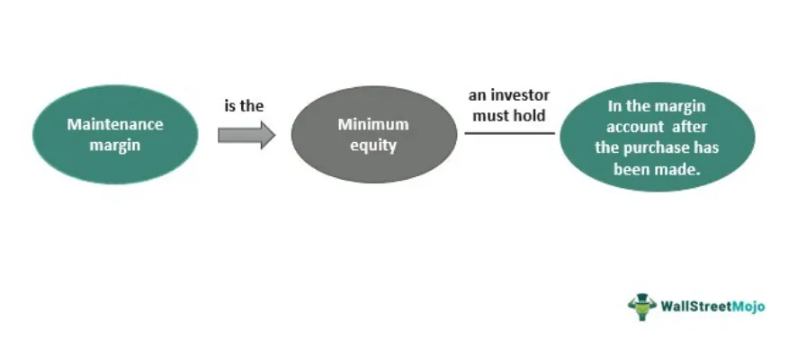

The world of trading and finance is vast and complex, incorporating various concepts and strategies to optimize returns. A critical element within this sphere is the 'maintenance margin,' particularly relevant in margin accounts and algorithmic trading. At its core, maintenance margin is the minimum amount of equity that must be maintained in a margin account subsequent to securities' purchase. This serves as a safeguard against market volatility and potential financial losses, ensuring that traders remain within the bounds of their broker's lending terms. 

Within algorithmic trading, understanding and effectively managing the maintenance margin is of paramount importance for traders utilizing borrowed capital to maximize leverage. Algorithmic trading involves using sophisticated algorithms to execute trades at speeds and frequencies unimaginable to human traders. When leveraging borrowed funds, prudent management of the maintenance margin becomes a cornerstone of an algorithmic trader's risk management toolkit. Failure to maintain the necessary equity levels can result in a margin call, which requires the trader either to deposit additional funds or face the liquidation of their positions.



As markets can be unpredictable, employing strategic approaches to maintain adequate margin levels is crucial for reducing financial risk and safeguarding investments. This article investigates into the mechanics and importance of maintenance margins, highlighting their role in dynamic and leveraged trading environments like algorithmic trading. Understanding the nuances of maintenance margin management is essential for traders seeking to protect their investments while optimizing returns in volatile markets.

## Table of Contents

## What is Maintenance Margin?

Maintenance margin is a crucial concept in margin trading, representing the minimum amount of equity a trader must maintain in their margin account after purchasing securities. This requirement acts as a financial safeguard against substantial market fluctuations and potential losses. Typically, the maintenance margin is expressed as a percentage of the total market value of the assets held within the account. 

For example, if a trader holds securities worth $10,000 and the maintenance margin is set at 25%, the trader needs to maintain a minimum of $2,500 in equity in their account. If the market value of the assets drops, causing the account equity to fall below the required maintenance margin, a margin call may be triggered. This margin call obligates the trader to either deposit additional funds or liquidate assets to restore the account balance to the required level.

Failing to meet a margin call can result in the forced sale of securities by the brokerage firm to recover the borrowed funds. Therefore, understanding and maintaining the required maintenance margin is essential for traders utilizing margin accounts to prevent forced liquidation and ensure continued operation in the financial markets.

In [algorithmic trading](/wiki/algorithmic-trading), this concept is particularly significant, as automated systems need to account for real-time market changes and dynamically manage margin levels to avoid interruptions due to margin calls. Proper maintenance margin management helps in securing trading positions even when market conditions are volatile.

## Maintenance Margin vs. Initial Margin

Initial margin and maintenance margin are foundational concepts in the operation of margin accounts used in leveraged trading. Each serves a distinct purpose, with specific requirements for traders and brokers.

Initial margin represents the amount required to open a new leveraged position. This upfront cash deposit or collateral ensures that the trader has enough equity to cover potential losses from the outset. The level of initial margin depends on the [volatility](/wiki/volatility-trading-strategies) of the asset being traded. More volatile assets typically require higher initial margins, reflecting their increased risk. For instance, if a trader wants to purchase a stock valued at $10,000 with a 50% initial margin requirement, they would need to provide $5,000 in cash or equivalent collateral to their account.

On the other hand, maintenance margin is the minimum equity that must be maintained in a margin account after a trade has been executed. Unlike the initial margin, which is a one-time requirement, the maintenance margin is an ongoing requirement. It acts as a protective layer to ensure that the account holds enough equity to cover potential losses from market fluctuations. If the equity in the account falls below this level, a margin call is triggered, obligating the trader to deposit additional funds or liquidate assets to restore the required equity balance.

Both margins are vital in protecting the interests of both the investor and the broker. Initial margin requirements ensure that the position is adequately backed from the beginning, while maintenance margin serves as a safety net against insufficient equity due to adverse market movements. For example, if the maintenance margin requirement is 25% and the value of the securities in the account drops significantly, resulting in equity falling below 25% of the account value, a margin call will be issued.

To effectively manage trading accounts and avoid margin calls, traders must comprehend these differences. The main aim is to strategize asset allocation and risk management to meet both initial and maintenance margins, ensuring sufficient funds are consistently available to support leveraged positions.

## The Role of Maintenance Margin in Risk Management

Maintenance margin represents a critical component of risk management in trading, functioning as a safeguard by maintaining minimum equity levels in margin accounts, which becomes especially crucial during volatile market conditions. This requirement acts as a deterrent against excessive leverage, compelling traders to maintain a buffer in their accounts to absorb potential market fluctuations without breaching required equity thresholds.

A key mechanism induced by maintenance margin is the margin call. When the equity in a trading account falls below the maintenance margin level, the broker issues a margin call, requiring the trader to add more funds or liquidate positions to restore the minimum equity. This practice enforces financial discipline among traders by necessitating regular monitoring and management of account balances and positions. For example, if a trader holds a position leveraged by $100,000 with an equity balance of $25,000, and the maintenance margin is 25%, the account must always have at least $25,000 in equity. Should the equity dip below this threshold, the trader must act promptly to meet the margin requirement.

The enforcement of maintenance margin requirements serves to protect both investors and brokerages. For investors, it minimizes the risk of significant financial losses that can arise from unmet margin calls, potentially leading to unsustainable debt levels or forced liquidation of holdings during unfavorable market conditions. For brokerages, it reduces the risk of default by ensuring that accounts remain adequately funded, which is essential for maintaining the brokerage's operational integrity and financial stability.

By stabilizing trading practices, maintenance margins contribute to the overall resiliency of the financial ecosystem. They promote a more disciplined approach to trading, encouraging participants to evaluate their strategies continuously and monitor market developments closely. This discipline benefits the market by reducing the likelihood of systemic shocks caused by unchecked leverage or sudden, large-scale asset liquidations.

In conclusion, maintenance margin serves as an indispensable element of risk management in trading by ensuring that accounts retain sufficient equity to withstand market volatility. This requirement not only enforces trader discipline but also provides a protective layer for investors and brokerages, thereby enhancing the stability of the financial system as a whole.

## Algorithmic Trading and Maintenance Margin

Algorithmic trading utilizes automated computational techniques to make buy and sell decisions in the financial markets. Incorporating maintenance margin considerations into algorithmic strategies is crucial for managing leverage and ensuring account stability. Algorithms can be tailored to monitor margin levels continuously, enabling dynamic adjustments in trading positions. This proactive approach minimizes the risk of margin calls, where traders must add funds or liquidate assets to meet minimum margin requirements.

Automated risk management protocols within algorithmic systems can adjust leverage levels automatically, considering market conditions and the account's equity. By doing so, they maintain a balance between risk and reward. For example, during periods of high market volatility, the system might reduce leverage to mitigate risk, while in stable conditions, it might increase leverage to capitalize on opportunities. This flexibility is essential for sustaining long-term trading performance.

Backtesting is an integral part of algorithmic trading strategies, allowing traders to understand how varying margin requirements influence returns and risk. Effective [backtesting](/wiki/backtesting) involves simulating a trading strategy on historical data, accounting for maintenance margin impacts. By refining these strategies, traders can optimize their settings for different market conditions, aiming to achieve higher consistency and profitability.

Here is a simple Python code snippet that demonstrates the basic framework for monitoring margin levels and adjusting positions within an algorithmic trading strategy:

```python
class TradingAlgorithm:
    def __init__(self, initial_cash, maintenance_margin_rate):
        self.cash = initial_cash
        self.maintenance_margin_rate = maintenance_margin_rate
        self.position = 0
        self.market_value = 0

    def update_market_value(self, new_market_value):
        self.market_value = new_market_value
        self.check_margin()

    def check_margin(self):
        required_margin = self.maintenance_margin_rate * self.market_value
        available_equity = self.cash + self.market_value

        if available_equity < required_margin:
            self.adjust_positions()

    def adjust_positions(self):
        # Logic to reduce positions to meet margin requirements
        print("Adjusting positions to maintain required margin.")
        # Example: Liquidating some positions to increase available cash
        self.cash += 1000  # Simplified example
        self.position -= 100  # Simplified example
```

By systematically integrating maintenance margin into the framework of algorithmic trading, traders can effectively manage risks and enhance their strategies' resilience against market fluctuations. Consequently, these practices contribute to a more stable and efficient trading approach, safeguarding both the trader's and broker's interests.

## Strategies to Manage Margin Requirements

In trading, effectively managing margin requirements is essential to mitigate risks and maintain control over financial resources. Diversification is a key strategy in this context, as it involves spreading investments across different asset classes, sectors, or geographical regions. By minimizing exposure to any single investment, diversification reduces the overall risk profile of a portfolio and stabilizes margin requirements, even amid adverse price movements.

Maintaining cash reserves in a trading account provides a vital buffer, enabling traders to address margin calls swiftly without having to sell off positions. These reserves act as readily available capital to shore up account equity during market fluctuations, thereby preventing forced asset liquidation. By having a cash cushion, traders can strategically navigate volatile market conditions while preserving their investment positions.

Stop-loss orders are another effective mechanism for managing margin requirements. These predefined orders automatically trigger the sale of securities when their prices reach a certain threshold, thereby limiting potential losses. This technique not only assists in maintaining margins by avoiding significant capital erosion but also imposes a level of discipline and risk management in trading practices.

Collectively, these strategies—diversification, maintaining cash reserves, and implementing stop-loss orders—empower traders to efficiently manage margin accounts. By optimizing these approaches, traders can safeguard their investments, reduce exposure to margin calls, and maintain robust positions within the dynamic financial markets.

## Conclusion

Maintenance margin is pivotal in trading, particularly in scenarios involving algorithmic and leveraged trading. It underpins effective risk management by ensuring that traders maintain proper account balances to avoid liquidation. This safeguard is critical, as it requires traders to uphold minimum equity levels, thus preventing potential disruptions from market volatility.

Successful margin management facilitates the maintenance of trading positions during periods of market fluctuations, thereby protecting investments and potentially enhancing returns. By adhering to preset maintenance margins, traders can navigate unpredictable markets with confidence, having a buffer against potential margin calls.

Implementing strategic approaches, such as establishing leverage limits and maintaining cash reserves, can provide traders with a significant advantage. These strategies allow for flexibility and preparedness in fast-moving markets. For example, setting appropriate leverage limits helps in mitigating risks associated with excessive borrowing, while maintaining cash reserves ensures traders can quickly meet margin requirements or seize new opportunities without being forced to liquidate existing positions.

Ultimately, disciplined adherence to maintenance margin requirements is not only a regulatory obligation but also a strategic choice that contributes to the sustained success and stability of trading ventures. This discipline, coupled with strategic planning, can distinguish successful traders in competitive trading environments.

## References & Further Reading

Hull, J. C. (2017). *Options, Futures, and Other Derivatives*. Pearson Education. This comprehensive textbook provides detailed information on derivatives, including derivatives pricing, risk management, and the uses of options and futures in financial markets. Hull's work is essential for understanding maintenance margins' implications in derivative trading.

Black, F., & Scholes, M. (1973). *The Pricing of Options and Corporate Liabilities*. Journal of Political Economy. The seminal paper introduces the Black-Scholes model, a foundational theory in financial economics used for options pricing. This model underlines the basics of option pricing, indirectly influencing margin requirements for derivatives trading.

Lopez de Prado, M. (2018). *Advances in Financial Machine Learning*. Wiley. This book explores the intersection of [machine learning](/wiki/machine-learning) with [quantitative trading](/wiki/quantitative-trading) strategies, focusing sharply on risk management and the use of algorithms in trading. It's crucial for understanding the role of algorithmic strategies in maintaining adequate margin levels.

Jansen, S. (2020). *Machine Learning for Algorithmic Trading - Second Edition*. Packt Publishing. An insightful guide on employing machine learning in trading algorithms, this book discusses various strategies, risk management, and the pivotal role of maintenance margins in ensuring that trading algorithms operate within safe boundaries.

Chan, E. P. (2009). *Quantitative Trading: How to Build Your Own Algorithmic Trading Business*. Wiley. This resource provides practical insights into setting up an algorithmic trading business, offering essential guidance on managing risk and maintaining margins essential for successful trading in volatile financial markets.

