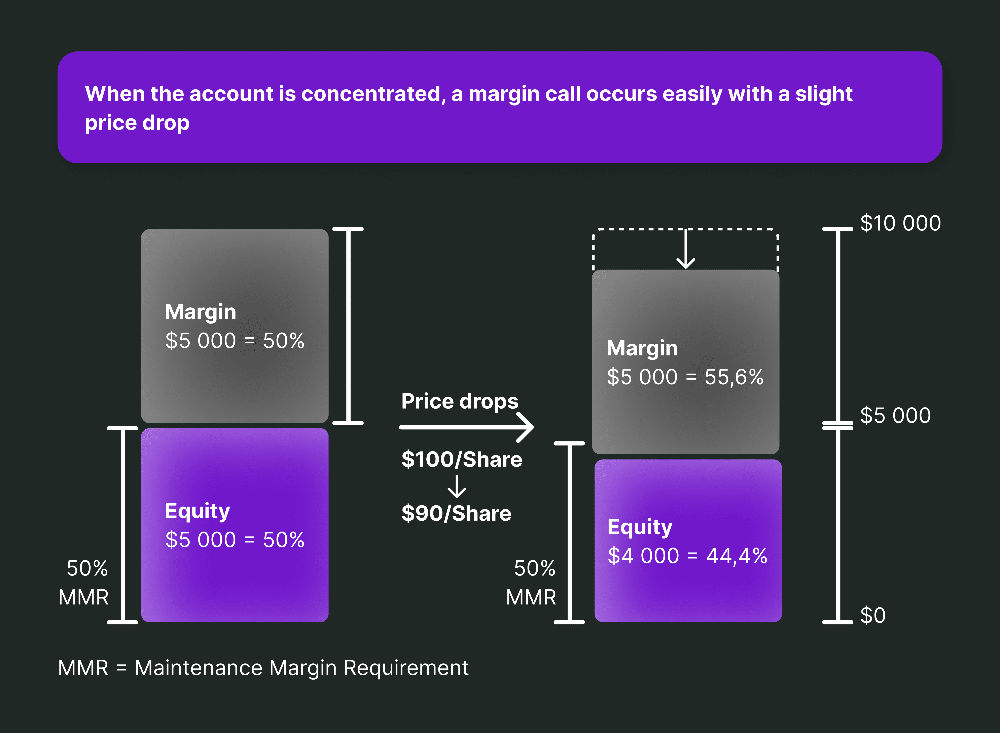

## Table of Contents

## What is a maintenance margin?

A maintenance margin is the minimum amount of money that must be kept in a margin account after a trade is made. When you buy stocks on margin, you're borrowing money from your broker to make the purchase. The maintenance margin is there to make sure you have enough money in your account to cover possible losses.

If the value of your stocks goes down and your account balance falls below the maintenance margin, you'll get a margin call. This means you need to add more money to your account or sell some of your stocks to bring your account back up to the required level. This helps protect both you and the broker from big losses.

## How does a maintenance margin differ from an initial margin?

The initial margin and the maintenance margin are two important terms in trading with borrowed money, also known as margin trading. The initial margin is the amount of money you need to put into your account to start trading on margin. It's like a down payment. For example, if you want to buy $10,000 worth of stocks, you might need to put in an initial margin of $5,000, and the broker will lend you the other $5,000.

The maintenance margin, on the other hand, is the minimum amount of money that must stay in your account after you've made your trade. It's there to make sure you can cover any losses if the value of your stocks goes down. If your account balance drops below this maintenance margin, you'll get a margin call, and you'll need to add more money or sell some stocks to meet the requirement. So, while the initial margin gets you started, the maintenance margin keeps you going safely.

## What happens if the maintenance margin requirement is not met?

If the maintenance margin requirement is not met, you will get a margin call from your broker. This means you need to take action to bring your account balance back up to the required level. You can do this by adding more money to your account or by selling some of your stocks. If you don't do anything, the broker might sell your stocks without asking you first to cover the shortfall.

Not meeting the maintenance margin can be risky. If the value of your stocks keeps going down and you can't add more money or sell enough stocks, you could lose a lot of money. It's important to keep an eye on your account and be ready to act if you get a margin call. This helps you avoid big losses and keeps your trading safe.

## Can you explain the concept of a margin call?

A margin call happens when the value of your stocks drops and the money in your account goes below the maintenance margin. The maintenance margin is the minimum amount of money you need to keep in your account after you buy stocks on margin. When you get a margin call, it means you need to add more money to your account or sell some of your stocks to bring your account balance back up to the required level.

If you don't do anything after getting a margin call, your broker might sell your stocks without asking you first. This is to make sure they get their money back. It's important to act quickly when you get a margin call because if the value of your stocks keeps going down, you could lose a lot of money. Keeping an eye on your account and being ready to add more money or sell stocks can help you avoid big losses and keep your trading safe.

## How is the maintenance margin calculated?

The maintenance margin is a set percentage of the total value of the stocks you bought on margin. This percentage can be different depending on your broker, but it's usually around 25% to 30%. So, if you bought $10,000 worth of stocks, the maintenance margin might be $2,500 to $3,000. This amount is the minimum you need to keep in your account after you make the trade.

The calculation is simple. You take the total value of your stocks and multiply it by the maintenance margin percentage set by your broker. If the value of your stocks goes down and the money in your account falls below this maintenance margin, you'll get a margin call. You'll need to add more money or sell some stocks to bring your account balance back up to the required level.

## What are the typical maintenance margin requirements for different types of securities?

Maintenance margin requirements can be different depending on the type of security you're trading. For stocks, the typical maintenance margin is usually around 25% to 30% of the total value of the stocks you bought on margin. This means if you bought $10,000 worth of stocks, you'd need to keep at least $2,500 to $3,000 in your account. This percentage can change based on your broker's rules and the specific stocks you're trading.

For other types of securities like options or futures, the maintenance margin requirements can be different. Options might have a maintenance margin requirement of around 75% to 100% of the option's value, because they can be riskier. Futures contracts often have their own specific margin requirements set by the exchange where they're traded, which can range from 3% to 12% of the contract's value. It's important to check with your broker to know the exact maintenance margin requirements for the securities you're trading.

## How do maintenance margins affect trading strategies?

Maintenance margins can change how you plan your trades. When you know you need to keep a certain amount of money in your account, you might be more careful about which stocks you buy and how much you spend. You might choose to buy fewer stocks or pick ones that are less likely to lose value quickly. This way, you can avoid getting a margin call and having to add more money or sell stocks at a bad time.

Also, knowing about maintenance margins can make you think more about your risk. If you're trading on margin, you're using borrowed money, which can be risky. You might decide to keep more money in your account than the minimum required, just to be safe. This extra money can help you handle any drops in stock value without getting a margin call. So, understanding maintenance margins helps you make smarter trading choices and manage your risks better.

## What are the risks associated with failing to maintain the required margin?

If you don't keep enough money in your account to meet the maintenance margin, you could face big problems. When your account balance drops below the required level, you'll get a margin call. This means you need to add more money or sell some of your stocks quickly to bring your account back up. If you don't do this, your broker might sell your stocks without asking you first. This can be bad because you might have to sell at a low price, losing more money than you expected.

Not meeting the maintenance margin can also lead to bigger losses. If the value of your stocks keeps going down and you can't add more money or sell enough stocks, you could end up owing money to your broker. This is because you borrowed money to buy the stocks, and now you might not have enough to pay back the loan. It's important to keep an eye on your account and be ready to act if you get a margin call to avoid these risks and keep your trading safe.

## How do regulatory bodies oversee maintenance margin requirements?

Regulatory bodies like the Financial Industry Regulatory Authority (FINRA) and the Securities and Exchange Commission (SEC) in the United States make rules about maintenance margins to keep trading safe. They set the lowest amount of money that brokers must ask their customers to keep in their accounts after buying stocks on margin. This helps make sure that people trading on margin have enough money to cover possible losses. If brokers don't follow these rules, they can get in trouble and might have to pay fines or face other punishments.

These rules can change depending on the type of security being traded. For example, the rules might be different for stocks, options, or futures. The regulatory bodies keep an eye on the market and can change the rules if they think it's needed to protect traders. By setting and watching these requirements, they help make sure that trading on margin is done in a way that's fair and safe for everyone involved.

## Can you compare maintenance margins in margin accounts versus portfolio margin accounts?

Maintenance margins in regular margin accounts are simpler and more straightforward. When you trade on a regular margin account, you need to keep a certain amount of money in your account after you buy stocks. This amount is usually around 25% to 30% of the total value of the stocks you bought. If the value of your stocks goes down and your account balance falls below this level, you get a margin call. You then need to add more money or sell some stocks to bring your account back up to the required level.

Portfolio margin accounts are more complex and can be riskier but might also allow you to use less money. Instead of a fixed percentage, the maintenance margin in a portfolio margin account is calculated based on the overall risk of your entire portfolio. This means if you have a mix of stocks, options, and other securities, the margin requirement can change depending on how risky they are together. While this can sometimes let you trade with less money in your account, it also means you need to keep a closer eye on your portfolio because the margin requirements can change quickly.

## What advanced strategies can traders use to manage their maintenance margins effectively?

Traders can use a few smart strategies to manage their maintenance margins well. One way is to keep more money in their account than the minimum required. This extra money acts like a safety net, helping them avoid margin calls if the value of their stocks goes down suddenly. Another strategy is to be careful about what they buy. Traders can pick stocks that are less likely to lose value quickly or choose a mix of stocks that balance out the risk in their portfolio. This way, they can keep their account balance above the maintenance margin without having to add more money or sell stocks at bad times.

Another important strategy is to use stop-loss orders. These are orders to sell a stock if it drops to a certain price, which can help limit losses and keep the account balance above the maintenance margin. Traders can also keep an eye on their account every day and be ready to add more money or sell stocks if they get close to a margin call. By staying alert and planning ahead, traders can manage their maintenance margins better and avoid the risks that come with trading on margin.

## How have maintenance margin requirements evolved over time, and what future changes might we anticipate?

Maintenance margin requirements have changed a lot over time to keep up with the market and protect traders. In the past, the rules were simpler, and the maintenance margin was usually a fixed percentage of the stock's value. But as trading got more complex with new types of securities like options and futures, the rules had to change. Now, different securities have different maintenance margin requirements, and some accounts, like portfolio margin accounts, use more detailed ways to figure out the margin based on the risk of the whole portfolio. These changes help make trading safer and more fair for everyone.

In the future, we might see even more changes to maintenance margin requirements. As technology keeps getting better, regulators might use new tools to watch the market more closely and change the rules faster if they need to. They might also make the rules different for different kinds of traders, like big investors versus small ones, to make sure everyone is treated fairly. With more people trading and new types of investments coming out all the time, the rules will probably keep changing to keep up with the market and protect traders from big losses.

## References & Further Reading

Hull, J. C. (2017). *Options, Futures, and Other Derivatives*. Pearson Education. This comprehensive textbook provides detailed information on derivatives, including derivatives pricing, risk management, and the uses of options and futures in financial markets. Hull's work is essential for understanding maintenance margins' implications in derivative trading.

Black, F., & Scholes, M. (1973). *The Pricing of Options and Corporate Liabilities*. Journal of Political Economy. The seminal paper introduces the Black-Scholes model, a foundational theory in financial economics used for options pricing. This model underlines the basics of option pricing, indirectly influencing margin requirements for derivatives trading.

Lopez de Prado, M. (2018). *Advances in Financial Machine Learning*. Wiley. This book explores the intersection of [machine learning](/wiki/machine-learning) with [quantitative trading](/wiki/quantitative-trading) strategies, focusing sharply on risk management and the use of algorithms in trading. It's crucial for understanding the role of algorithmic strategies in maintaining adequate margin levels.

Jansen, S. (2020). *Machine Learning for Algorithmic Trading - Second Edition*. Packt Publishing. An insightful guide on employing machine learning in trading algorithms, this book discusses various strategies, risk management, and the pivotal role of maintenance margins in ensuring that trading algorithms operate within safe boundaries.

Chan, E. P. (2009). *Quantitative Trading: How to Build Your Own Algorithmic Trading Business*. Wiley. This resource provides practical insights into setting up an [algorithmic trading](/wiki/algorithmic-trading) business, offering essential guidance on managing risk and maintaining margins essential for successful trading in volatile financial markets.

