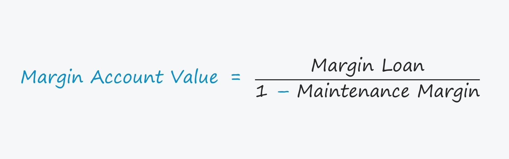

## Table of Contents

## What is maintenance margin in finance?

Maintenance margin is the minimum amount of money that must be kept in a margin account after a trade is made. When you buy stocks on margin, you are borrowing money from your broker to make the purchase. The maintenance margin is a safety net set by the broker to ensure that there is enough money in your account to cover potential losses. If the value of your investments drops and your account balance falls below the maintenance margin, you will receive a margin call, which means you need to deposit more money or sell some of your investments to bring your account back up to the required level.

The specific percentage for the maintenance margin can vary between brokers, but it is typically around 25% to 30% of the total value of the securities purchased on margin. This requirement is set by financial regulations, like those from the Federal Reserve in the United States, to protect both the investor and the broker from significant losses. Understanding and managing your maintenance margin is crucial because failing to meet a margin call can lead to forced selling of your assets at unfavorable prices, which can result in substantial financial losses.

## How does maintenance margin differ from initial margin?

Initial margin and maintenance margin are both important terms in trading with borrowed money, but they serve different purposes. Initial margin is the amount of money you need to put down to start a trade using margin. It's like a down payment. For example, if you want to buy $10,000 worth of stock on margin, and the initial margin requirement is 50%, you would need to put in $5,000 of your own money, and the broker would lend you the other $5,000.

Maintenance margin, on the other hand, is the minimum amount of money you need to keep in your account after you've made the trade. It's there to make sure you can cover any losses if the value of your investment goes down. If your account balance falls below this maintenance level, you'll get a margin call, and you'll need to add more money or sell some of your investments. While the initial margin gets you started, the maintenance margin helps keep your account stable over time.

## Why is maintenance margin important for investors?

Maintenance margin is important for investors because it helps keep their investments safe. When you buy stocks with borrowed money, there's a risk that the stock price might go down. The maintenance margin is like a safety net that makes sure you have enough money in your account to cover any losses. If your account balance drops too low, you get a margin call, which means you need to add more money or sell some stocks. This helps prevent big losses that could hurt you and the broker.

Understanding maintenance margin is also key to managing your investments well. If you know how much money you need to keep in your account, you can plan better and avoid surprises. If you don't keep enough money in your account and you get a margin call, you might have to sell your stocks quickly, maybe at a bad time when the price is low. This can lead to big losses. So, keeping an eye on your maintenance margin helps you stay in control of your investments and avoid risky situations.

## What happens if the maintenance margin requirement is not met?

If you don't meet the maintenance margin requirement, you will get a margin call from your broker. This means you need to put more money into your account or sell some of your stocks to bring your account balance back up to the required level. If you don't do this quickly, the broker might sell your stocks without asking you, to cover the shortfall. This can happen at a bad time when the stock prices are low, which might make you lose more money.

Not meeting the maintenance margin can lead to big problems. If your account keeps falling below the maintenance level, you could end up losing a lot of money. The broker's goal is to protect both you and themselves from big losses. So, it's important to keep an eye on your account and make sure you have enough money in it to meet the maintenance margin requirement.

## How is the maintenance margin level calculated?

The maintenance margin level is calculated based on the total value of the securities you own in your margin account. It's a percentage of that total value, usually set by your broker. For example, if your broker's maintenance margin requirement is 25%, and you have $10,000 worth of stocks in your account, you need to keep at least $2,500 in your account to meet the maintenance margin.

This calculation helps make sure you have enough money to cover possible losses if the value of your stocks goes down. If the value of your stocks drops and your account balance falls below the maintenance margin level, you'll get a margin call. You'll need to add more money or sell some stocks to bring your account back up to the required level. It's important to keep track of your account to avoid this situation.

## Can you provide an example of a maintenance margin call?

Imagine you bought $20,000 worth of stock using a margin account. Your broker's initial margin requirement was 50%, so you put in $10,000 of your own money, and the broker lent you the other $10,000. The maintenance margin requirement is 25%, which means you need to keep at least $5,000 in your account (25% of $20,000).

Now, let's say the stock price drops and the value of your stocks falls to $16,000. Your account balance is now $6,000 ($16,000 - $10,000 loan). The maintenance margin level is now $4,000 (25% of $16,000), so you're still okay. But if the stock price keeps falling and the value of your stocks drops to $12,000, your account balance becomes $2,000 ($12,000 - $10,000 loan). The maintenance margin level is now $3,000 (25% of $12,000), and since your account balance is below this level, you get a margin call. You need to add at least $1,000 to your account or sell some stocks to bring your balance back up to $3,000.

## What are the typical maintenance margin requirements for different types of securities?

Maintenance margin requirements can vary depending on the type of security and the broker you use. For stocks, the typical maintenance margin requirement is around 25% to 30% of the total value of the stocks in your account. This means if you have $10,000 worth of stocks, you need to keep at least $2,500 to $3,000 in your account to meet the maintenance margin. Some brokers might have higher or lower requirements, but this range is common for most stocks.

For other types of securities like options or futures, the maintenance margin requirements can be different. Options might have a maintenance margin requirement based on the risk of the option, which can be higher than for stocks. Futures contracts often have their own set of rules, and the maintenance margin can be a specific dollar amount per contract rather than a percentage. It's important to check with your broker to know the exact maintenance margin requirements for the securities you are trading.

## How do changes in market volatility affect maintenance margin requirements?

Changes in market [volatility](/wiki/volatility-trading-strategies) can make brokers change the maintenance margin requirements. When the market is very up and down, there's a bigger chance that the value of your stocks could drop a lot quickly. Brokers might raise the maintenance margin to make sure there's enough money in your account to cover these bigger possible losses. This helps protect both you and the broker from big losses if the market keeps moving a lot.

For example, if the stock market is going through a rough time with lots of ups and downs, your broker might decide to increase the maintenance margin from 25% to 30% or even higher. This means you need to keep more money in your account to keep trading on margin. If you don't have enough money to meet the new maintenance margin, you might get a margin call and have to add more money or sell some of your stocks. So, it's good to keep an eye on market conditions and be ready to add more money to your account if things get more volatile.

## What strategies can traders use to manage their maintenance margin effectively?

Traders can manage their maintenance margin effectively by keeping a close eye on their account balance and the value of their investments. If the value of your stocks goes down, you need to make sure you have enough money in your account to meet the maintenance margin requirement. One way to do this is by setting aside extra money in your account as a buffer. This way, if the stock price drops a lot, you won't get a margin call right away. Another strategy is to use stop-loss orders, which automatically sell your stocks if they reach a certain low price. This can help you avoid big losses and keep your account balance above the maintenance margin level.

Another helpful strategy is to diversify your investments. By spreading your money across different types of stocks or other securities, you reduce the risk that a big drop in one stock's value will cause a margin call. It's also a good idea to keep up with market news and understand how changes in the market might affect your investments. If you know that the market is getting more volatile, you might want to add more money to your account to prepare for possible margin calls. By being proactive and managing your account carefully, you can avoid the stress and potential losses that come with not meeting the maintenance margin requirement.

## How do regulatory bodies influence maintenance margin requirements?

Regulatory bodies like the Federal Reserve in the United States set rules that affect how much money you need to keep in your margin account. They do this to make sure that both you and your broker are safe from big losses. For example, the Federal Reserve might say that the minimum maintenance margin for stocks should be 25%. This means that no matter what, your broker can't let you keep less than 25% of the value of your stocks in your account. If the market gets really up and down, the Federal Reserve might change these rules to make them stricter, so everyone is even safer.

Brokers have to follow these rules, but they can also set their own maintenance margin requirements that are higher than what the regulators say. This is because brokers want to protect themselves too. If the market is very volatile, a broker might decide to raise the maintenance margin to 30% or more, even if the Federal Reserve's rule is still at 25%. By doing this, the broker makes sure there's enough money in your account to cover any big drops in stock prices. So, regulatory bodies set the basic rules, but brokers can make them stricter to keep things safe.

## What are the historical trends in maintenance margin requirements and their impacts on the market?

Over the years, maintenance margin requirements have changed a few times, mostly to make trading safer. One big change happened after the stock market crash in 1929. Before that, people could buy stocks with very little money down, sometimes as low as 10%. But after the crash, the Federal Reserve set a rule that you needed to put down at least 50% of the stock's value to start a trade. They also said you had to keep at least 25% of the stock's value in your account after the trade. These rules helped make trading safer by making sure people had enough money to cover losses if the stock price went down.

These changes had a big impact on the market. When the maintenance margin went up, it made it harder for people to buy stocks with borrowed money. This slowed down the market a bit because fewer people could trade. But it also made the market more stable because there were fewer big drops in stock prices. Over time, as the market got more up and down, brokers started setting their own higher maintenance margins to be even safer. This helped keep the market stable during times of big changes, like during economic crises or when there was a lot of uncertainty in the world.

## How do advanced trading algorithms incorporate maintenance margin considerations?

Advanced trading algorithms take maintenance margin into account to make smart trading choices. These algorithms look at the money in the trading account and the value of the stocks all the time. If the stock prices go down and the account balance gets close to the maintenance margin level, the algorithm might decide to sell some stocks or not buy new ones. This helps keep the account safe and avoids margin calls, which can be stressful and lead to big losses. The algorithm uses math and rules to figure out the best way to manage the account so it always has enough money to meet the maintenance margin.

These algorithms also think about how the market is doing and how much it might move up or down. If the market is very up and down, the algorithm might be more careful and keep more money in the account as a buffer. This way, if the stock prices drop a lot, the account will still have enough money to meet the maintenance margin. By doing all these things, advanced trading algorithms help traders manage their accounts better and trade safely, even when the market is tricky.

## References & Further Reading

[1]: Hull, J. C. (2017). ["Options, Futures, and Other Derivatives"](https://www.semanticscholar.org/paper/Options%2C-Futures%2C-and-Other-Derivatives-Hull/89bdee500c8623864fc9eb7a471546aa713acc44). Pearson Education.

[2]: Black, F., & Scholes, M. (1973). ["The Pricing of Options and Corporate Liabilities."](https://www.cs.princeton.edu/courses/archive/fall09/cos323/papers/black_scholes73.pdf) Journal of Political Economy, 81(3), 637–654.

[3]: Lopez de Prado, M. (2018). ["Advances in Financial Machine Learning"](https://www.amazon.com/Advances-Financial-Machine-Learning-Marcos/dp/1119482089). Wiley.

[4]: Jansen, S. (2020). ["Machine Learning for Algorithmic Trading - Second Edition"](https://github.com/stefan-jansen/machine-learning-for-trading). Packt Publishing.

[5]: Chan, E. P. (2009). ["Quantitative Trading: How to Build Your Own Algorithmic Trading Business"](https://github.com/ftvision/quant_trading_echan_book). Wiley.

[6]: Thorp, E. O. (1967). ["Beat the Market: A Scientific Stock Market System"](https://www.economics.uci.edu/files/kassouf/pdfs/beatthemarket.pdf). Random House.

[7]: Aronson, D. R. (2006). ["Evidence-Based Technical Analysis: Applying the Scientific Method and Statistical Inference to Trading Signals"](https://www.amazon.com/Evidence-Based-Technical-Analysis-Scientific-Statistical/dp/0470008741). Wiley.